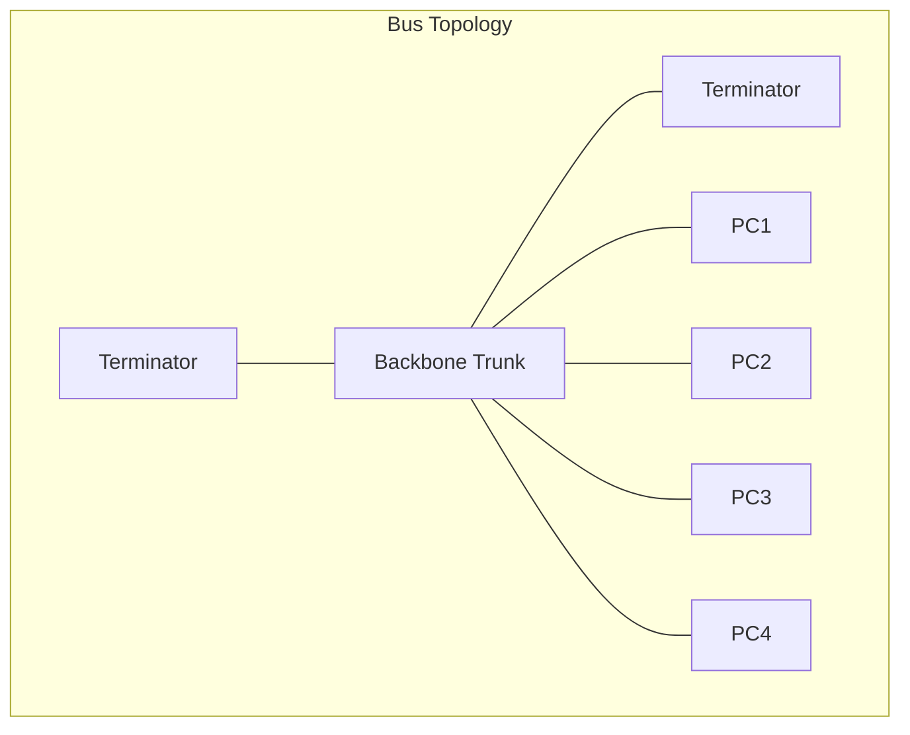
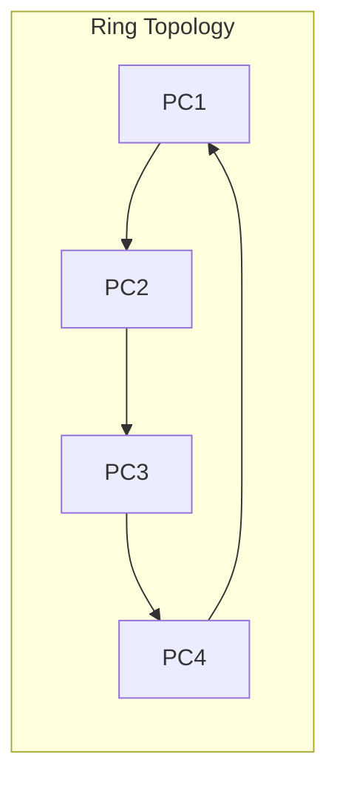
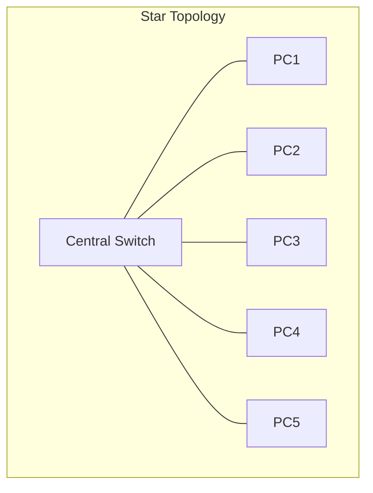
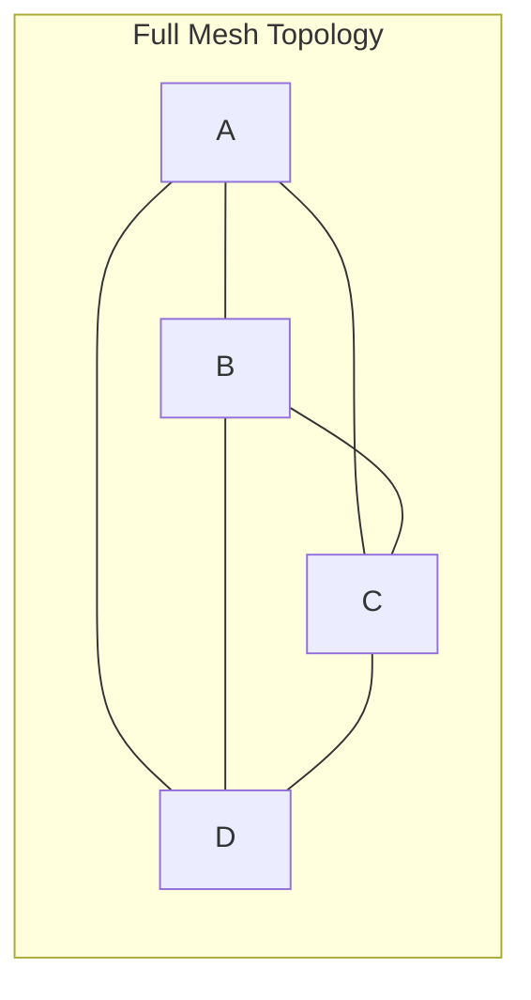
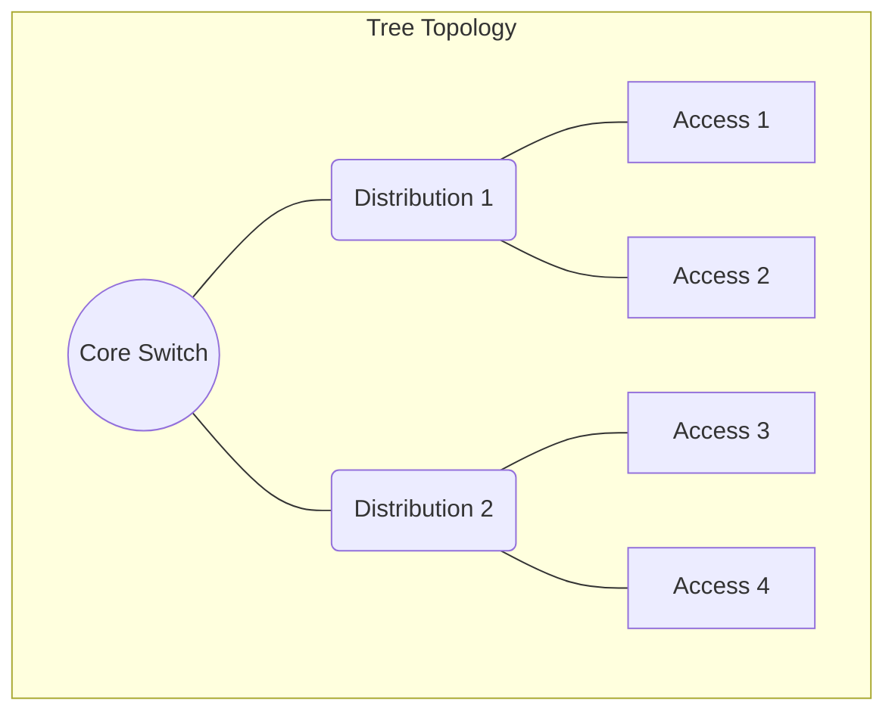
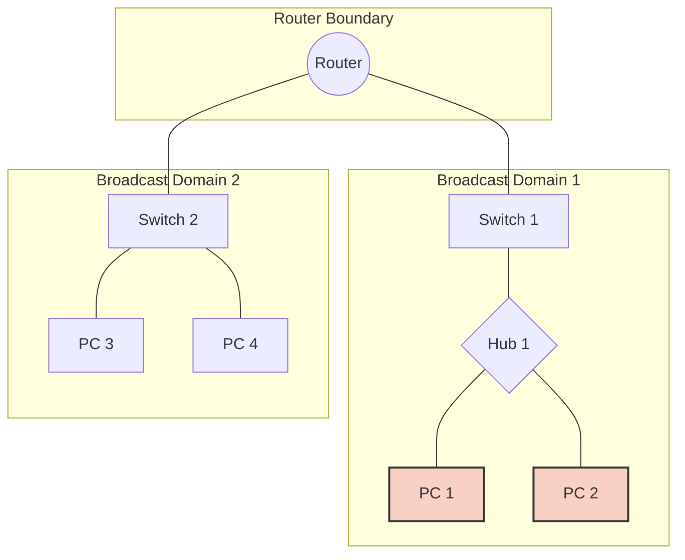

# Chapter 03: Network Types, Scales, and Topologies

Networks are not monolithic entities; they are highly structured, deeply organized systems engineered to overcome the constraints of geography, physics, and human demand. In this exhaustive chapter, we strip away the abstraction and delve into the absolute bedrock of network engineering: how networks are scaled according to their geographical boundary, and how they are physically and logically wired together to ensure data integrity, resilience, and speed.

---

## BEGINNER SECTION: Foundations of Network Structure

Before analyzing complex packets and protocols, we must first understand the roads on which the data travels. 

### 1. What is a Network Topology?
A **network topology** is the architectural map of a computer network. It defines how endpoints, routers, switches, and cables are interconnected. Think of it as a city's urban planning—it dictates where the roads go, how many intersections exist, and what routes traffic can take to avoid congestion.

However, in computer networking, we must aggressively divide the concept of "topology" into two distinct categories: **Physical Topology** and **Logical Topology**.

#### Physical Topology vs. Logical Topology Distinction

- **Physical Topology**: The actual, tangible arrangement of cables, hardware, and devices. This is what you see when you walk into a server room or look behind your office desk. If cables run from every computer to a single central switch in a closet, you are looking at a physical star topology.
- **Logical Topology**: The actual path that the data (electrical signals or light pulses) takes as it moves through the network from node to node, regardless of how the cables are physically laid out.

> **Real-World Analogy**: Consider a city transit system. The *Physical Topology* is the concrete roads and rails laid across the terrain. The *Logical Topology* is the bus route itself. A bus might travel in a massive circle (a logical ring), even if the roads it drives on intersect at a central downtown hub (a physical star).

**The Classic Example**: Early Ethernet (10BASE-T via a Hub). 
Physically, all computers plugged into a central hub, making it a **Physical Star**. However, inside that hub, every electrical signal received on one port was blindly duplicated and sent out to *all* other ports simultaneously. Because the data behaved as if it were traveling down a single shared wire, the network was functioning as a **Logical Bus**.

---

### 2. Network Scale Classification

Computer networks are categorized primarily by their geographical scale. The acronyms you constantly see (LAN, WAN, etc.) define the physical footprint, the administrative control, and the core technologies appropriate for that scale. 

#### 2.1 PAN (Personal Area Network)
A network designed strictly for the immediate proximity of a single person.
- **Range**: Approximately 10 meters (30 feet).
- **Everyday Analogy**: The invisible bubble around you while you walk down the street.
- **Real-World Use Cases**: Bluetooth earbuds streaming music from a smartphone, a smartwatch syncing health data to a phone, or a wireless mouse connected to a laptop via a USB dongle.
- **Core Technologies**: Bluetooth, ZigBee, IrDA (Infrared Data Association), and short-range USB cables.

#### 2.2 LAN (Local Area Network)
A network confined to a localized, relatively small geographical area under a single administrative domain (owned by one person or company).
- **Range**: A single room, a home, an entire building, or an office floor.
- **Everyday Analogy**: The intercom system inside a single apartment building.
- **Real-World Use Cases**: Your home Wi-Fi network, a college computer lab, an office floor with 50 workstations, or a competitive gaming internet café.
- **Core Technologies**: Ethernet (IEEE 802.3) via copper twisted-pair cables, and Wi-Fi (IEEE 802.11).
- **Performance Characteristics**: Extremely high speeds (100 Mbps, 1 Gbps, 10 Gbps), very low latency, privately owned infrastructure, and generally cheap to deploy.

#### 2.3 CAN (Campus Area Network)
A network spanning multiple interconnected buildings within a specific geographical boundary.
- **Range**: A few kilometers.
- **Everyday Analogy**: A gated community where multiple apartment blocks share the same private utility grid.
- **Real-World Use Cases**: A university connecting its library, dorms, and science buildings; a massive corporate headquarters campus (like Apple Park); or a large hospital complex.
- **Core Technologies**: Gigabit Ethernet, high-capacity fiber-optic backbones interconnecting the LANs of individual buildings. 

#### 2.4 MAN (Metropolitan Area Network)
A network spanning an entire city or large metropolitan area.
- **Range**: Up to 50 kilometers.
- **Everyday Analogy**: The municipal water supply system serving an entire city.
- **Real-World Use Cases**: City-wide public Wi-Fi grids, municipal smart-city surveillance networks, city-wide cable TV networks.
- **Core Technologies**: Metro Ethernet, SONET/SDH (Synchronous Optical Networking / Synchronous Digital Hierarchy), and large-scale fiber rings.

#### 2.5 WAN (Wide Area Network)
A massive telecommunications network that spans across provinces, countries, or the entire globe. WANs interconnect multiple LANs and MANs.
- **Range**: National, continental, or global.
- **Everyday Analogy**: The international highway and commercial airline system connecting distinct cities worldwide.
- **Real-World Use Cases**: The Internet itself, multinational banks connecting branches in New York and Tokyo, or global corporate logistics networks.
- **Core Technologies**: MPLS (Multiprotocol Label Switching), Leased Lines, Frame Relay, Submarine Fiber-Optic Cables, and Satellite Links.
- **Performance Characteristics**: High latency compared to LANs, expensive to operate, relies on third-party public telecommunications carriers (ISPs).

#### 2.6 SAN (Storage Area Network)
A highly specialized, high-speed network designed specifically to connect servers to data storage arrays, bypassing the standard LAN to ensure data transfers do not congest regular user traffic.
- **Range**: Typically confined within a data center.
- **Everyday Analogy**: A dedicated freight-only railway connecting a factory directly to a seaport, completely bypassing civilian highways.
- **Real-World Use Cases**: Enterprise data centers connecting blade servers to massive petabyte storage arrays.
- **Core Technologies**: Fibre Channel (FC), iSCSI.

---

## INTERMEDIATE SECTION: Complete Topology Deep Dive

How do we actually wire these networks together? Every topology represents a trade-off between cost, performance, fault tolerance, and scalability. 

### 1. Bus Topology

The bus topology was the bedrock of early Ethernet (10BASE-5 and 10BASE-2). 

```text
  Terminator                                Terminator
  (50-ohm)                                  (50-ohm)
      |                                          |
      +------------------------------------------+  <-- Single Backbone (Trunk/Bus)
          |         |         |         |
        [PC 1]    [PC 2]    [PC 3]    [PC 4]
```

#### How it works
- Features a **single continuous backbone cable** (often coaxial cable) running the length of the network.
- Devices tap into this backbone using "T-connectors" or "vampire taps".
- **Terminators** (50-ohm resistors) are strictly required at *both* ends of the backbone. Without terminators, electrical signals would reach the end of the wire and bounce back (signal reflection), colliding with new data and destroying all communication.
- **Data Flow**: When PC 1 wants to send data to PC 4, it places the electrical signal onto the wire. The signal travels in both directions, reaching PC 2, PC 3, and PC 4. All devices receive the frame, check the destination address, and discard it if it isn't meant for them. Only PC 4 processes the payload.

#### Technical Characteristics
- **CSMA/CD Required**: Because all devices share one wire, if PC 1 and PC 3 transmit at the exact same microsecond, a **collision** occurs. Early networks used Carrier Sense Multiple Access with Collision Detection (CSMA/CD) to manage these crashes.
- **Advantages**: Incredibly cheap to deploy. Requires the least amount of physical cable. Very simple to understand and build for small numbers of machines.
- **Disadvantages**: A single break in the backbone cable splits the network and ruins the termination, causing total network failure. Performance degrades severely as more devices are added (more collisions). Troubleshooting is a nightmare because a fault affects everyone equally.
- **Use Case**: Completely obsolete for modern LANs. Primarily of historical/academic importance (early thicknet/thinnet).



---

### 2. Ring Topology

Designed to eliminate the chaotic collisions found in bus topologies.

```text
       [PC 1] -------- [PC 2]
         |                |
         |                |
       [PC 4] -------- [PC 3]
```

#### How it works
- Each device connects strictly to exactly two neighbors, forming a closed continuous loop.
- Data travels in **ONE direction** (unidirectional) around the ring.
- **Token Passing**: To prevent collisions, the network uses a digital "Token" (a small control frame). A device can only transmit data if it possesses the free token. It attaches its data to the token, sends it around the ring, and once the data reaches the destination, the token is released back to the network.

#### Dual Ring Redundancy
- In high-end implementations like **FDDI** (Fiber Distributed Data Interface), a **Dual Ring** is used. Two rings flow in opposite directions. If a cable breaks between PC 1 and PC 2, the rings loop back on themselves at the break point, forming a single continuous C-shaped ring, keeping the network online.

#### Technical Characteristics
- **Advantages**: Highly predictable performance. Since only one device holds the token, there are zero collisions, even under 100% network load. Everyone gets a fair, guaranteed turn.
- **Disadvantages**: In a single ring setup, if one device's network card burns out, or one cable is severed, the token cannot pass, and the *entire network halts*. Adding or removing a device requires physically breaking the ring, disrupting service.
- **Use Case**: Token Ring (IBM/IEEE 802.5) is legacy. However, ring topologies are still extensively used in MAN/WAN fiber backbones (SONET/SDH rings) to provide millisecond failover.



---

### 3. Star Topology

The absolute standard for modern LANs.

```text
        [PC 1]      [PC 2]
            \        /
             \      /
              [Hub/Switch]
             /      \
            /        \
        [PC 3]      [PC 4]
```

#### How it works
- Every single endpoint device connects to a central aggregation device (a Hub or a Switch) via dedicated, independent point-to-point links.
- **Hub (Legacy)**: If the center is a hub, a packet sent from PC 1 is broadcast to PC 2, 3, and 4. (Physical star, Logical Bus).
- **Switch (Modern)**: If the center is a switch, it reads the MAC address of the destination. A packet from PC 1 is intelligently forwarded *only* to PC 4. No collisions occur.

#### Technical Characteristics
- **Advantages**: Extremely resilient at the edge. If PC 1's cable is cut, only PC 1 goes offline; the rest of the network is perfectly fine. Troubleshooting is trivial—you know exactly which cable port is dead.
- **Disadvantages**: The central device is a massive single point of failure. If the central switch loses power, the entire network drops. It also requires significantly more cabling than a bus topology, as a separate wire must run from the closet to every single desk.
- **Use Case**: 100% of modern Ethernet twisted-pair LANs, Home Wi-Fi networks (where the wireless router acts as the central star hub).



---

### 4. Mesh Topology

The undisputed king of fault tolerance. 

```text
        [PC 1] -------- [PC 2]
          |  \        /   |
          |    \    /     |
          |      X        |
          |    /    \     |
          |  /        \   |
        [PC 3] -------- [PC 4]
```

#### How it works
- **Full Mesh**: Every single device has a dedicated point-to-point link directly to *every other device* on the network.
- **Partial Mesh**: Critical nodes (like core routers) are fully meshed, but edge devices only connect to one or two nodes.

#### The Link Count Formula Derivation
To calculate how many cables you need for a Full Mesh network, consider this: 
- If you have $N$ devices, each device must connect to all other devices, which is $N - 1$ devices.
- So, total connections seems like $N \times (N - 1)$. 
- However, the cable connecting PC 1 to PC 2 is the exact same cable connecting PC 2 to PC 1. We must divide by 2 to prevent double counting.
- **Formula**: $\text{Links} = \frac{N(N-1)}{2}$
- **Ports required per device**: $N - 1$

**Worked Example**: 
You have 5 routers in a full mesh. 
Links = $\frac{5 \times (5-1)}{2} = \frac{5 \times 4}{2} = \frac{20}{2} = 10 \text{ cables}$.
If you have 100 computers? $\frac{100 \times 99}{2} = 4,950 \text{ cables}$. Each PC needs 99 network cards.

#### Technical Characteristics
- **Advantages**: Ultimate redundancy. If a cable breaks, data instantly routes over an alternative path. There is absolutely no single point of failure. Dedicated bandwidth between nodes ensures peak performance.
- **Disadvantages**: Quadratic cost scaling. As seen above, connecting 100 devices requires almost 5,000 cables. It is impossibly expensive and physically unmanageable for large LANs.
- **Use Case**: The core Internet backbone (BGP routers), ISP core networks, military field communications, and high-availability data centers.



---

### 5. Tree (Hierarchical) Topology

The standard blueprint for enterprise networks. 

```text
                [Core Switch]
                 /         \
                /           \
     [Dist Switch 1]      [Dist Switch 2]
       /        \            /        \
   [Acc 1]    [Acc 2]    [Acc 3]    [Acc 4]
    /  \       /  \       /  \       /  \
  PC   PC     PC  PC     PC  PC     PC  PC
```

#### How it works
- It blends star topologies into a hierarchical structure. 
- You have a **Root Node** (Core Switch) at the top. 
- Below it are **Branches** (Distribution Switches) that route traffic between departments.
- Below those are **Leaves** (Access Switches) which directly connect to end-user PCs.

#### Technical Characteristics
- **Advantages**: Supremely scalable. If you build a new office wing, you simply add an Access Switch and plug it into the Distribution layer. Centralized management aligns with corporate hierarchy.
- **Disadvantages**: Higher level failures are catastrophic. If a leaf dies, 20 PCs go offline. If the Core Switch dies, the entire company goes offline.
- **Use Case**: University networks, large enterprise networks, ISP access layers.



---

### 6. Hybrid Topology

A network design that combines two or more different standard topologies to leverage the advantages of both.

- **Star-Bus**: Several star LANs (individual office floors) connect their central switches to a main vertical bus cable running down the building's elevator shaft.
- **Star-Ring**: Star topology LANs connect to a wide-area ring network (like a token ring backbone between distinct bank branches).
- **Advantages**: Incredible flexibility. Network engineers can design specific segments to meet bespoke requirements (e.g., using a mesh for the server room, and a star for user desks).
- **Disadvantages**: Drastically increased complexity in network mapping, troubleshooting, and hardware configurations.

---

## ADVANCED SECTION: Professional Engineering & Threat Vectors

### 3.1 Topology Selection Trade-off Matrix

When architecting a network, engineers must balance budgets, uptime SLAs (Service Level Agreements), and security requirements. 

| Criterion | Bus | Ring | Star | Full Mesh | Tree | Hybrid |
|-----------|-----|------|------|-----------|------|--------|
| **Initial Cost** | Very Low | Medium | Medium | Very High | Medium | Varies |
| **Scalability** | Poor | Poor | Good | Poor | Good | Good |
| **Fault Tolerance** | Very Poor | Poor (single), Good (dual) | Medium (switch) | Excellent | Medium | Varies |
| **Ease of Troubleshooting** | Hard | Hard | Easy | Complex | Medium | Varies |
| **Performance Under Load** | Degrades badly | Fair | Good | Excellent | Good | Varies |
| **Security Isolation** | Poor | Poor | Medium (VLANs) | High | Medium | Varies |
| **Cable Required** | Least | Medium | More | Most | Medium | Varies |
| **Real-world Use** | Legacy only | Legacy/WAN rings | Universal | ISP backbone | Enterprise | Universal |

---

### 3.2 Collision Domains vs. Broadcast Domains

Understanding the exact boundaries of where data travels is a fundamental requirement for both network optimization and ethical hacking. 

#### Collision Domain
A network segment where if two devices transmit simultaneously, their signals collide, corrupting both payloads.
- **Hubs**: Because a hub blindly repeats electrical signals to all ports, every device plugged into a hub shares **ONE single Collision Domain**. 
- **Switches**: A switch buffers frames in memory and intelligently forwards them out of the exact required port. Therefore, **each port on a switch is its own separate Collision Domain**. Collisions are practically eliminated in a switched network running in full-duplex.
- **Routers**: Every interface on a router represents a separate Collision Domain.

#### Broadcast Domain
A logical network segment where if a device sends a Layer 2 broadcast frame (Destination MAC: `FF:FF:FF:FF:FF:FF`), it will reach every other device in that domain.
- **Hubs**: Passing everything, they keep everyone in **ONE Broadcast Domain**.
- **Switches**: By default, a switch will flood a broadcast frame out of all ports. Therefore, all devices plugged into a default switch share **ONE Broadcast Domain**.
  - *Exception*: We use **VLANs (Virtual LANs)** to chop a single physical switch into multiple isolated broadcast domains. 
- **Routers**: Routers are the definitive boundary for broadcasts. A router will **NEVER** forward a broadcast packet across its interfaces. Therefore, **each interface on a router creates a separate Broadcast Domain**.


*Note: In the diagram above, Hub 1 and its PCs are ONE collision domain. On Switch 2, PC 3 and PC 4 are SEPARATE collision domains. The router splits the network into TWO distinct Broadcast domains.*

---

### 3.3 Hardware Alignment with Network Scale

Hardware cannot simply be placed anywhere; it must scale with the geographic and logical demands of the network type.

- **PAN Hardware**: Bluetooth adapters, USB hubs, ZigBee controllers, RFID/NFC chips.
- **LAN Hardware**: Network Interface Cards (NICs), twisted-pair copper cabling (Cat5e/Cat6), Layer 2 Managed/Unmanaged Switches, and Wireless Access Points (WAPs).
- **CAN Hardware**: Layer 3 (Multilayer) Switches for inter-VLAN routing, perimeter Firewalls, and high-capacity Campus Routers.
- **MAN Hardware**: Metro Ethernet Switches, SONET/SDH add-drop multiplexers, dense wavelength division multiplexing (DWDM) optical aggregation devices.
- **WAN Hardware**: Heavy-duty Edge Routers (speaking BGP), MPLS provider edge switches, CSU/DSU modems for leased lines, and satellite transceiver links.

---

### 3.4 Security Implications of Topology Choice

From an offensive cyber security perspective, the topology dictates the attack surface and the feasibility of Man-in-the-Middle (MitM) attacks.

- **Bus Topology Sniffing**: The worst security imaginable. Because the backbone is a shared medium, any device can place its NIC in *promiscuous mode* and run a packet sniffer (like Wireshark) to capture all traffic on the network.
- **Ring Topology Tapping**: Harder to physically tap without breaking the ring, but an attacker who compromises a node can hijack the token or intercept the unidirectional traffic stream passing through their node.
- **Star Topology (with Hub)**: Identical to the bus. All traffic is broadcast out of all ports. An attacker plugged into the hub sees everything (passwords, cookies, emails in transit).
- **Star Topology (with Switch)**: Highly secure by default, because traffic is isolated to specific ports. 
  - *Hacker Workaround*: Attackers use **ARP Poisoning/Spoofing** to trick the victim into sending traffic to the attacker instead of the router. Alternatively, they use **MAC Flooding** to fill the switch's CAM table, forcing it to fail-open into a "Hub Mode," thereby enabling wide-net sniffing.
- **Mesh Topology Hijacking**: The abundance of paths makes passive physical interception extremely difficult. However, at a WAN level (BGP), the vast interconnectivity opens the door to **Route Hijacking** (where a malicious router advertises a shorter path and swallows a victim's traffic).
- **Segmentation Strategy**: Security engineers heavily rely on Tree/Hierarchical designs to implement **Network Segmentation** via VLANs, ensuring that if a hacker compromises an Access Layer PC, they are trapped in a small subnet and cannot traverse up into the server distribution layer without passing through a heavily monitored firewall.

---

### 3.5 Storage Area Networks (SAN) Deep Dive

Data centers cannot afford to have 10-gigabit database backups choking up the regular LAN where employees are trying to load web pages. 

- **The Purpose of SAN**: To provide dedicated, block-level access to consolidated storage arrays, making the remote disks appear to the server OS as locally attached hard drives. By keeping storage networks logically and physically separated from data networks, performance and reliability skyrocket.
- **Fibre Channel (FC)**: A specialized, high-speed networking technology explicitly designed for SANs. Operating at speeds of 8, 16, 32, and up to 128 Gbps, it requires proprietary switches, Host Bus Adapters (HBAs), and fiber-optic cables. It is extremely expensive but offers zero packet loss and absolute minimum latency.
- **iSCSI (Internet Small Computer Systems Interface)**: A cheaper alternative to FC. It takes standard SCSI storage commands and encapsulates them inside standard TCP/IP packets. This allows organizations to build SANs using their existing Ethernet LAN infrastructure and standard network switches, vastly reducing costs at the slight expense of CPU overhead.

---

## 4. Exam Tips & Common Traps

- **Trap**: Confusing Physical Star with Logical Bus. 
  *Tip*: Just because cables go to a central box doesn't mean it acts like a star logically. If that central box is a *Hub*, it is logically functioning as a Bus. 
- **Trap**: Calculating Full Mesh cables incorrectly. 
  *Tip*: Always remember to divide by two! The formula is $\frac{N(N-1)}{2}$, not $N(N-1)$.
- **Trap**: Misunderstanding Collision Domains on Switches. 
  *Tip*: A 24-port switch has **24 collision domains** (one per port), but only **1 broadcast domain** (unless VLANs are configured).
- **Trap**: Assuming Routers forward broadcasts.
  *Tip*: Routers *never* forward Layer 2 broadcasts (`FF:FF:FF:FF:FF:FF`). They are the ultimate border wall for broadcast domains.

---

## 5. Key Terms Glossary

- **CSMA/CD**: Carrier Sense Multiple Access with Collision Detection. A protocol used in Bus topologies to listen for clear lines and detect frame collisions.
- **Token Passing**: A deterministic channel access method used in Ring topologies where a device must possess a digital "token" to transmit data.
- **VLAN**: Virtual LAN. A logical subdivision of a switch that creates separate broadcast domains, improving security and performance.
- **ARP Poisoning**: A cyber attack on a switched network where the attacker broadcasts spoofed ARP replies to associate their MAC address with the IP address of the default gateway, enabling MitM interception.
- **Promiscuous Mode**: A configuration applied to a Network Interface Card (NIC) forcing it to read all frames passing across the wire, regardless of whether the destination MAC address matches its own. 
- **FDDI**: Fiber Distributed Data Interface. A high-speed fiber standard utilizing a dual-ring topology for maximum redundancy.
- **BGP Hijacking**: An advanced cyber attack on WAN Mesh topologies where a malicious autonomous system falsely advertises a highly optimal route to reroute global internet traffic through an attacker-controlled checkpoint. 
- **CAM Table**: Content Addressable Memory table. The memory index used by a switch to map physical switch ports to the MAC addresses of connected devices.

---

### 3.6 IPv4 Subnetting and Logical Addressing Geometry
While physical topologies define the hardware paths, logical addressing defines how devices find each other globally. An IPv4 address is 32 bits, divided into 4 octets.

**Binary & Octet Conversion Math**:
Each octet represents a decimal value between 0 and 255.
Decimal = b7(128) + b6(64) + b5(32) + b4(16) + b3(8) + b2(4) + b1(2) + b0(1)

**Classful IPv4 Addressing Architecture**:
Before CIDR, IP addresses were divided into strict classes:
- **Class A**: 1 - 126 range. 8 bits NetID, 24 bits HostID. Max hosts: 16,777,214.
- **Class B**: 128 - 191 range. 16 bits NetID, 16 bits HostID. Max hosts: 65,534.
- **Class C**: 192 - 223 range. 24 bits NetID, 8 bits HostID. Max hosts: 254.
- **Class D (224-239)**: Multicast.
- **Class E (240-255)**: Experimental.
(Note: 127.0.0.0/8 is reserved for loopback testing).

**Subnetting & Bit Borrowing Mathematics**:
Subnetting divides a large network into smaller, manageable subnets by **borrowing bits** from the Host ID portion and adding them to the Network ID portion.
1. **Number of Subnets Created**: 2^k (where k is the number of borrowed bits).
2. **Usable Hosts per Subnet**: 2^(n-k) - 2 (subtract 2 for Network ID and Broadcast ID).

### 3.7 The OSI 7-Layer Model: Hacker Attack Mapping
Topologies operate primarily at Layers 1, 2, and 3. However, hackers map their attacks across all 7 layers of the OSI model:

| Layer # | Layer Name | Core Protocols & Services | Primary Hacker Attacks | Standard Security Tools |
|---|---|---|---|---|
| **7** | **Application** | HTTP, HTTPS, FTP, SSH, DNS, SMTP | Web application attacks (SQLi, XSS, Command Injection, SSRF) | Burp Suite, OWASP ZAP, SQLmap |
| **6** | **Presentation** | SSL/TLS, AES, JPEG, MIME, Compression | SSL/TLS Stripping (HTTPS to HTTP downgrade), Certificate Spoofing | sslstrip, Ettercap, Mitmproxy |
| **5** | **Session** | NetBIOS, RPC, Sockets, Session IDs | Session Hijacking, Session Fixation, Token Theft | Cookiecadger, Wireshark |
| **4** | **Transport** | TCP (3-way handshake), UDP | SYN Flood (DoS/DDoS), UDP Flooding, TCP Port Scanning | Nmap, Hping3, Masscan |
| **3** | **Network** | IP (IPv4/IPv6), ICMP, BGP, IPsec | IP Address Spoofing, ICMP Redirect, BGP Route Hijacking | Scapy, Hping3, Wireshark |
| **2** | **Data Link** | Ethernet, Wi-Fi (802.11), ARP, PPP | ARP Poisoning/Spoofing, MAC Table Flooding, Deauth Attacks | Arpspoof, Bettercap, Aircrack-ng |
| **1** | **Physical** | Ethernet Cable (Cat6), Fiber, Radio Waves | Cable Tapping, RF Jamming, Hardware Keyloggers | Wi-Fi Pineapple, Rubber Ducky |

### 3.8 Media, Cabling & Hardware Standards
A physical topology is useless without the proper transmission media.
- **Copper Twisted Pair (Cat5/Cat6)**: Max distance 100 meters. Susceptible to EMI (Electromagnetic Interference). Speeds from 1 Gbps to 10 Gbps. Uses RJ45 connectors.
- **Fiber Optic**: Max distance 10km to 100+ km. Immune to EMI. Speeds up to 100+ Gbps. Uses SFP/SFP+ transceivers. Total Internal Reflection (TIR) drives light pulses.
- **Coaxial**: Used in legacy Bus topologies and modern cable internet.
- **Power over Ethernet (PoE)**: Transmits electrical power alongside data (IEEE 802.3af/at/bt) to supply IP cameras, VoIP phones, and wireless APs without needing dedicated electrical outlets.

## 6. Real-World Case Studies & Historical Evolution
- **ARPANET**: In 1969, the US Department of Defense established ARPANET (Advanced Research Projects Agency Network) as a 4-node packet-switched network. It utilized early mesh and decentralized concepts so that if a node was destroyed, traffic would dynamically re-route.
- **Submarine Fiber Optic Cables**: Over 99% of international WAN traffic travels via submarine fiber-optic cables resting on the ocean floor, linking coastal landing stations to national terrestrial fiber backbones.


## 7. Performance Metrics, Framing, & Advanced Switching Logic

### 7.1 Performance Metrics Definition Matrix
Evaluating a topology requires looking at concrete performance metrics:
- **Latency**: Time taken for a data packet to travel from source to destination (Propagation Delay + Transmission Delay). Critical for real-time exploit execution & C2 telemetry.
- **Bandwidth**: Maximum theoretical data capacity of a channel per unit time (bps). Limits maximum throughput of data exfiltration or DDoS volumes.
- **Throughput**: Actual measured rate of successful data delivery over a channel. The real-world network efficiency indicator (what you see on speedtest).
- **Jitter**: Variance in packet arrival delay across consecutive packets. Degradation of real-time VoIP streams and C2 heartbeats.

### 7.2 Ethernet Framing (IEEE 802.3)
At Layer 2, topologies use Ethernet Frames to pass data. The structure is heavily standardized:
[Preamble (7B)] [SFD (1B)] [Dest MAC (6B)] [Src MAC (6B)] [Type/Length (2B)] [Payload Data (46-1500B)] [FCS (4B)]
- **Preamble / SFD**: Used for clock synchronization at the physical layer.
- **MAC Addresses**: The 48-bit physical address. 
- **FCS (Frame Check Sequence)**: Uses CRC (Cyclic Redundancy Check) to detect if collisions or line noise corrupted the frame during transit.

### 7.3 Switching Logic & CAM Table Mechanics
Modern star topologies are built around the intelligent logic of the Switch:
1. **Learning**: The switch inspects the incoming frame's Source MAC address and maps it to the ingress port in its Content Addressable Memory (CAM) table.
2. **Flooding**: If the Destination MAC is unknown (or it is a broadcast FF:FF:FF:FF:FF:FF), the switch floods the frame out all active ports except the ingress port.
3. **Forwarding**: If the Destination MAC is present in the CAM table, the switch forwards the frame directly out the specific mapped egress port, establishing a micro-segmented unicast forwarding path.

`mermaid
flowchart TD
    FrameIn["Incoming Ethernet Frame"] --> CheckSrc["Inspect Source MAC -> Update CAM Table"]
    CheckSrc --> CheckDst{"Is Destination MAC in CAM Table?"}
    CheckDst -- "Yes (Known)" --> Forward["Micro-Segmented Unicast Forwarding"]
    CheckDst -- "No (Unknown / Broadcast)" --> Flood["Flood Out All Ports Except Ingress Port"]
`

### 7.4 Spanning Tree Protocol (STP & 802.1Q VLANs)
When enterprise networks implement redundant links in a Tree topology, they risk creating Layer 2 loops.
- **Spanning Tree Protocol (STP - IEEE 802.1D)**: Prevents Layer 2 switching loops in redundant topologies by blocking redundant link ports and ensuring a loop-free logical topology over a meshed physical topology.
- **VLANs (Virtual LANs)**: Logically segment a single physical switch into multiple isolated broadcast domains.
- **IEEE 802.1Q Tagging**: Appends a 4-byte VLAN tag into the Ethernet header for trunk links connecting switches, allowing multiple VLANs to share a single physical uplink without leaking traffic.

### 7.5 Addressing & Transport Identifiers Deep Dive
- **IP Address**: Unique logical identifier assigned to every network interface card (IPv4 32-bit or IPv6 128-bit) to route data packets across global networks.
- **Port Number**: 16-bit numerical identifier ( to 65535) identifying a specific application process or service running on a host. 

`mermaid
flowchart LR
    Host["Host IP: 192.168.1.50"] --> Port80["Port 80: HTTP Web Server"]
    Host --> Port22["Port 22: SSH Daemon"]
    Host --> Port53["Port 53: DNS Resolver"]
`

### 7.6 ARP Resolution & Link Resolution
Address Resolution Protocol (ARP) maps a known 32-bit IPv4 address to its unknown 48-bit physical MAC address. This is the glue between Layer 2 (Topology/MAC) and Layer 3 (Routing/IP).
- **ARP Request**: Broadcast (FF:FF:FF:FF:FF:FF) asking "Who has IP X.X.X.X? Tell Y.Y.Y.Y".
- **ARP Reply**: Unicast response from target node declaring "I have IP X.X.X.X, my MAC is AA:BB:CC:DD:EE:FF".

#### ARP Spoofing / Poisoning Attack Mechanics
An attacker transmits unsolicited, forged ARP replies to a target node and default gateway, binding the attacker's MAC address to the victim's IP address.

`mermaid
sequenceDiagram
    autonumber
    actor Attacker
    actor Victim
    actor Gateway
    Attacker->>Victim: Unsolicited ARP Reply ("Gateway IP 192.168.1.1 is at Attacker MAC")
    Attacker->>Gateway: Unsolicited ARP Reply ("Victim IP 192.168.1.50 is at Attacker MAC")
    Note over Attacker,Gateway: Attacker establishes Man-in-the-Middle (MitM) position
`


## 8. Network Device Architecture & Security Boundaries

A topology is only as effective as the hardware enforcing its rules. In an enterprise network architecture, packets flow across multiple inline security and routing devices:

`mermaid
flowchart LR
    Internet["Internet"] <--> Firewall["Firewall / IDS / IPS"]
    Firewall <--> Router["Router"]
    Router <--> Switch["Managed Switch"]
    Switch <--> HostA["Host A (192.168.0.10)"]
    Switch <--> HostB["Host B (192.168.0.20)"]
    Switch <--> Server["Internal Server"]
`

### 8.1 Comprehensive Device Breakdown

#### 1. Router
- **Layer**: Layer 3 (Network Layer).
- **Core Function**: Interconnects distinct logical networks and routes IP packets using routing tables based on destination IP addresses.
- **Analogy**: A traffic police officer directing vehicle flows across major road intersections.
- **Security Risks**: Route Hijacking, Firmware Exploitation, and Default Credentials (dmin/admin).

#### 2. Switch
- **Layer**: Layer 2 (Data Link Layer).
- **Core Function**: Forwards Ethernet frames between devices within the *same* local network segment using a Content Addressable Memory (CAM) table.
- **Mechanism**: Dynamically maps physical switch ports to device MAC addresses.
- **Security Risks**: CAM Table Overflow / MAC Flooding, VLAN Hopping (crafting double-tagged 802.1Q frames to jump across isolated Virtual LANs).

#### 3. Hub
- **Layer**: Layer 1 (Physical Layer).
- **Core Function**: Legacy network device that blindly repeats incoming signals to all connected physical ports.
- **Analogy**: A neighborhood gossip who hears a private secret and broadcasts it to everyone in the neighborhood.
- **Security Risk**: Zero traffic isolation; any node on a hub can run a sniffer in promiscuous mode and capture all network traffic.

#### 4. Firewall
- **Layer**: Layer 3 to Layer 7.
- **Core Function**: Inspects and filters network traffic based on predefined security access control lists (ACLs).
- **Firewall Types**:
  - **Stateless**: Filters packets based on individual headers without tracking connection state.
  - **Stateful**: Maintains a connection state table to verify valid bidirectional flows.
  - **NGFW**: Integrates deep packet inspection (DPI), application awareness, and inline threat detection.
  - **WAF (Web Application Firewall)**: Operates at Layer 7 to block HTTP/S attacks (e.g., SQLi, XSS).

#### 5. IDS & IPS
- **IDS (Intrusion Detection System)**: Passive sensor monitoring traffic for signature matches or anomalies and raising security alerts.
- **IPS (Intrusion Prevention System)**: Active inline device capable of dropping malicious packets and severing TCP connections.

#### 6. Proxy Server
- **Core Function**: Intermediary server making network requests on behalf of client devices.
- **Types**: Forward Proxy (hides client identity), Reverse Proxy (protects backend servers & balances load), Transparent Proxy (intercepts traffic silently without client configuration).

### 8.2 Architectural Paradigms
- **Client-Server Architecture**: Dedicated server fulfills client requests (e.g., web/database servers). Highly centralized, easy to secure and back up, but creates a single point of failure.
- **Peer-to-Peer (P2P) Architecture**: Every node acts as both client and server (e.g., BitTorrent). Highly decentralized, virtually impossible to take down centrally, but difficult to secure and manage.

---

## 9. Expanded Glossary & Terminology

- **Attenuation**: The gradual loss of signal strength as data travels over a physical transmission medium. 
- **CSMA/CD**: Carrier Sense Multiple Access with Collision Detection. Used in Bus topologies to detect frame collisions.
- **Token Passing**: A deterministic channel access method used in Ring topologies where a device must possess a digital token to transmit data.
- **VLAN (Virtual LAN)**: A logical subdivision of a switch that creates separate broadcast domains, improving security and performance.
- **ARP Poisoning**: A cyber attack on a switched network where the attacker broadcasts spoofed ARP replies to associate their MAC address with the IP address of the default gateway, enabling MitM interception.
- **Promiscuous Mode**: A configuration applied to a Network Interface Card (NIC) forcing it to read all frames passing across the wire.
- **FDDI**: Fiber Distributed Data Interface. A high-speed fiber standard utilizing a dual-ring topology for maximum redundancy.
- **BGP Hijacking**: An advanced cyber attack on WAN Mesh topologies where a malicious autonomous system falsely advertises a highly optimal route.
- **CAM Table**: Content Addressable Memory table. The memory index used by a switch to map physical switch ports to MAC addresses.
- **Subnetting**: The practice of dividing a large network into smaller manageable networks by borrowing bits from the host portion of an IP address.
- **Subnet Mask**: A 32-bit number that masks an IP address and divides the IP address into network address and host address.
- **CIDR**: Classless Inter-Domain Routing. A method of assigning IP addresses that improves the efficiency of address distribution and replaces the previous system based on Class A, B, and C networks.
- **Default Gateway**: The node in a computer network using the internet protocol suite that serves as the forwarding host to other networks when no other route specification matches the destination IP address of a packet.

---

## 10. Final Exam Tips & Common Traps

- **Trap**: Confusing Physical Star with Logical Bus. 
  *Tip*: Just because cables go to a central box doesn't mean it acts like a star logically. If that central box is a *Hub*, it is logically functioning as a Bus. 
- **Trap**: Calculating Full Mesh cables incorrectly. 
  *Tip*: Always remember to divide by two! The formula is N(N-1)/2, not N(N-1).
- **Trap**: Misunderstanding Collision Domains on Switches. 
  *Tip*: A 24-port switch has **24 collision domains** (one per port), but only **1 broadcast domain** (unless VLANs are configured).
- **Trap**: Assuming Routers forward broadcasts.
  *Tip*: Routers *never* forward Layer 2 broadcasts (FF:FF:FF:FF:FF:FF). They are the ultimate border wall for broadcast domains.
- **Trap**: Mixing up Hubs and Switches.
  *Tip*: Hubs operate at Layer 1 (Physical) and flood all ports. Switches operate at Layer 2 (Data Link) and forward based on MAC addresses using the CAM table.
- **Trap**: Using 127.0.0.1 as a normal IP.
  *Tip*: Any address starting with 127 is strictly reserved for loopback (localhost) testing of the TCP/IP stack.


## 11. Core Goals & Real-World Applications

A network topology is only designed to satisfy specific overarching business and technical goals.
### 11.1 The 5 Primary Goals of Computer Networks
1. **Seamless Communication**: Facilitates real-time email, messaging, VoIP, and video conferencing. Without low-latency topologies, real-time communication degrades.
2. **Resource Sharing**: Shared utilization of expensive hardware (servers, storage arrays) and software applications. A SAN topology exists explicitly for this purpose.
3. **Centralized Data Management**: Central databases allow unified data storage, automated backup, and instant remote accessibility.
4. **Cost Efficiency**: Eliminates redundant infrastructure by hosting central application servers accessible to all network nodes.
5. **High Reliability & Fault Tolerance**: Multiple redundant paths (like in a Mesh or Dual Ring) and backup nodes ensure high service availability.

### 11.2 Sector-Wise Applications of Topologies
- **Business & Commerce**: Star-Tree topologies running E-commerce portals, inventory tracking, and secure financial transactions.
- **Education & E-Learning**: Remote learning platforms and collaborative research repositories relying on CANs and MANs.
- **Healthcare**: Telemedicine and remote diagnostic imaging utilizing high-speed optical LANs to transmit massive MRI files without latency.
- **E-Governance**: Digital identity frameworks (like Aadhaar or SSN databases) spread across highly secure WAN Mesh architectures.

## 12. Detailed Cable & Transmission Medium Matrix

Understanding the physical layer is critical for network engineers.

| Cable Type | Sub-Category | Max Distance | Speed Range | Susceptibility to EMI | Connectors | Primary Use Case |
|---|---|---|---|---|---|---|
| **Twisted Pair** | UTP (Unshielded) | 100 meters | 10 Mbps – 10 Gbps | High | RJ45 | Standard office desks, Home Wi-Fi routers |
| **Twisted Pair** | STP (Shielded) | 100 meters | 10 Mbps – 10 Gbps | Low (Foil wrapped) | RJ45 | Industrial environments, machinery floors |
| **Fiber Optic** | Single-Mode | Up to 100+ km | 1 Gbps – 400+ Gbps | Immune | LC, SC, ST | WAN links, inter-city backbone, submarine cables |
| **Fiber Optic** | Multi-Mode | Up to 2 km | 1 Gbps – 100 Gbps | Immune | LC, SC, ST | Inside Data Centers, SANs, intra-building links |
| **Coaxial** | Thicknet (RG-8) | 500 meters | 10 Mbps | Moderate | Vampire Tap | Legacy 10BASE5 Bus Topologies |
| **Coaxial** | Thinnet (RG-58) | 185 meters | 10 Mbps | Moderate | BNC | Legacy 10BASE2 Bus Topologies |
| **Coaxial** | RG-6 | Varies | Up to 1+ Gbps | Moderate | F-Type | Modern Cable Internet (DOCSIS), Broadband MANs |


## 13. Summary
This concludes Chapter 03. You should now have a rigorous understanding of Physical vs Logical topologies, the hardware that drives them (Hubs vs Switches vs Routers), the geographical constraints of LANs and WANs, and the deep underlying security vulnerabilities associated with each architectural decision. The foundations established here will be heavily utilized when we transition into advanced subnetting, dynamic routing protocols (OSPF/BGP), and penetration testing methodologies in the upcoming chapters.

