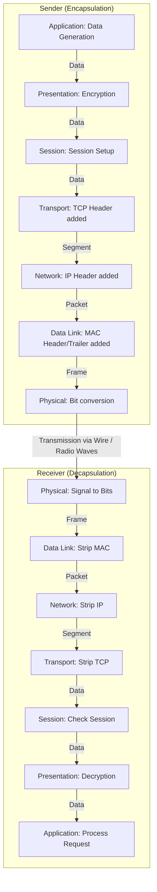
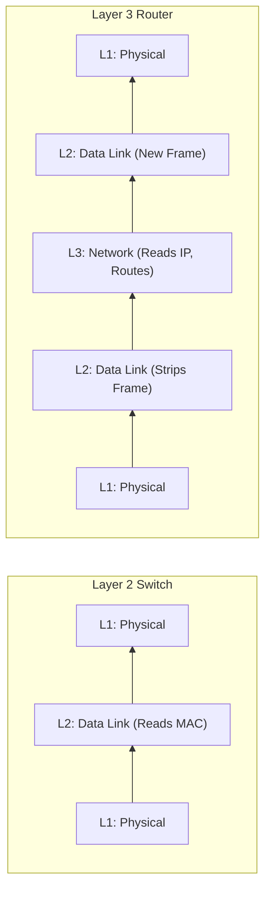
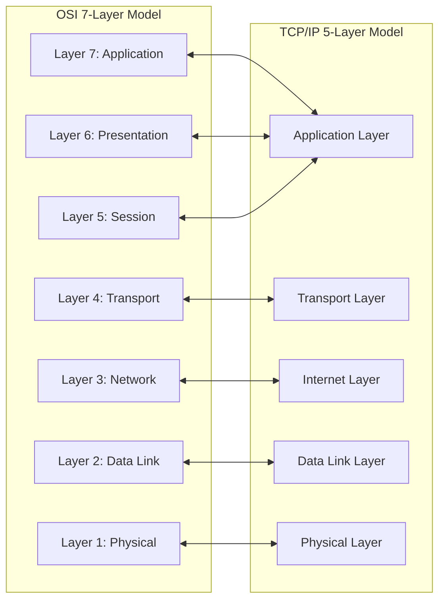

# Chapter 04: OSI Model — Complete Deep Dive

Computer networking is a massive, globally interconnected system of heterogeneous hardware, diverse software protocols, and complex physical mediums. To standardize how systems communicate across this vast digital landscape, the networking industry utilizes architectural reference frameworks. The most fundamental and universally taught framework is the Open Systems Interconnection (OSI) Model.

This exhaustive chapter will break down the OSI model from its most basic conceptual analogies to advanced cybersecurity attack vectors, protocol overhead calculations, and precise layer-by-layer device mapping.

---

## BEGINNER SECTION: Fundamentals of Network Layering

Before diving into bits, frames, and packets, we must understand *why* networking is divided into layers and how abstraction solves the problem of global communication.

### 1. Why We Need a Layered Model

Imagine trying to build an application that sends a message to another computer. Without a layered model, the application developer would have to write code that not only generates the message but also explicitly commands the electrical voltages on the copper wire, handles lost signals, routes the data across intermediate geographic cities, and determines MAC addresses. This is computationally and administratively impossible.

A layered model solves this through **Abstraction**. Abstraction means dividing the massive problem of network communication into smaller, distinct, modular tasks. Each layer is only responsible for its specific task. It provides services to the layer immediately above it and consumes services from the layer immediately below it. 

The developer only writes the Application layer code; the operating system and network hardware handle the rest transparently.

#### The Pizza Delivery Analogy
To demystify this abstraction, consider a real-world analogy: ordering and delivering a pizza. 

*   **Layer 7 (Application): The Chef.** The process begins when the customer requests a pizza, and the chef actually creates the food. This is the user data.
*   **Layer 6 (Presentation): Packaging.** The pizza must be placed in a standardized cardboard box to keep it hot and prevent it from falling apart. This is formatting and compressing the data.
*   **Layer 5 (Session): Order Manager.** The restaurant manager takes the customer's phone call, confirms the address, opens the order ticket, and keeps the ticket open until the pizza is delivered. This is session establishment.
*   **Layer 4 (Transport): Delivery Driver.** The driver ensures the pizza reaches the exact house securely and in one piece. If a pizza is dropped, the driver requests a new one (error recovery and retransmission).
*   **Layer 3 (Network): GPS / Route Planning.** The driver uses a GPS to map the fastest route across different neighborhoods and city streets to reach the destination. This is logical IP routing.
*   **Layer 2 (Data Link): Traffic Rules.** The driver obeys stop signs, yields at intersections, and navigates specific lanes on the road. This is local physical MAC addressing and node-to-node access control.
*   **Layer 1 (Physical): Physical Road.** The actual asphalt, dirt, and concrete that the car's tires drive on. This represents the raw bits traversing a copper cable or fiber optic strand.

### 2. History of the OSI Model

The **OSI (Open Systems Interconnection) model** was created by the International Organization for Standardization (ISO) in **1984**. In the early days of computing, IBM mainframes could only talk to IBM mainframes, and DEC systems could only talk to DEC systems. The OSI model was introduced as a vendor-neutral, theoretical reference framework to standardize network communications globally, ensuring interoperability between completely different hardware and software environments.

### 3. Layer Mnemonics

The OSI model consists of 7 layers. Memorizing them in exact order is critical for both academic exams and professional troubleshooting. 

**Top-Down (Layer 7 to Layer 1):**
*   **A**ll (Application)
*   **P**eople (Presentation)
*   **S**eem (Session)
*   **T**o (Transport)
*   **N**eed (Network)
*   **D**ata (Data Link)
*   **P**rocessing (Physical)

**Bottom-Up (Layer 1 to Layer 7):**
*   **P**lease (Physical)
*   **D**o (Data Link)
*   **N**ot (Network)
*   **T**hrow (Transport)
*   **S**ausage (Session)
*   **P**izza (Presentation)
*   **A**way (Application)

#### Directional Mnemonic Table

| Layer Number | Layer Name | Top-Down Mnemonic | Bottom-Up Mnemonic |
|---|---|---|---|
| 7 | Application | All | Away |
| 6 | Presentation | People | Pizza |
| 5 | Session | Seem | Sausage |
| 4 | Transport | To | Throw |
| 3 | Network | Need | Not |
| 2 | Data Link | Data | Do |
| 1 | Physical | Processing | Please |

### 4. OSI vs. TCP/IP: Why Two Models Exist?

A common point of confusion is why we study the OSI model when the actual internet runs on the TCP/IP model. 

*   **The OSI Model** is a **theoretical reference framework**. It is highly granular (7 layers) and logically separated. It is universally used for teaching, designing network architectures, and troubleshooting network failures step-by-step.
*   **The TCP/IP Model** is a **practical implementation**. Created by DARPA/DoD in the 1970s, it is what the internet actually runs on today. It condenses the 7 OSI layers into 4 or 5 practical operational layers. 

### 5. Protocol Data Units (PDU)

As data travels down the layers from a sender, each layer wraps the original data in its own specific header (and sometimes a trailer). This encapsulated block of data is given a specific name at each layer, known as a **Protocol Data Unit (PDU)**. 

Using the correct terminology is vital. A network engineer will never say "My bits didn't route correctly"; they will say "My packets are dropping."

*   **L7 / L6 / L5 PDU:** Data (or Message)
*   **L4 PDU:** Segment (for TCP) / Datagram (for UDP)
*   **L3 PDU:** Packet
*   **L2 PDU:** Frame
*   **L1 PDU:** Bits

---

## INTERMEDIATE SECTION: Layer-by-Layer Deep Dive

Now we examine the strict operational duties, protocols, and addressing mechanisms of each individual layer in depth, starting from the application layer down to the physical wire.

### Layer 7 — Application Layer

The Application Layer is the topmost layer of the OSI model. It serves as the interface between the user's application and the network's services. 

*   **Misconception Alert:** The Application Layer is **NOT** the application itself. Google Chrome, Microsoft Word, and Discord are not part of the OSI model. Rather, the Application Layer contains the *protocols* that these software applications use to access the network (e.g., HTTP for Chrome).
*   **Primary Functions:**
    *   Network Virtual Terminal: Allows remote log-in.
    *   File Transfer, Access, and Management (FTAM).
    *   Mail Services (email forwarding and storage).
    *   Directory Services (distributed database sources and access).
*   **Addressing Used:** Hostnames, URLs (Uniform Resource Locators), Resource Identifiers.
*   **PDU:** Data
*   **Core Protocols & Ports:** 
    *   HTTP (Port 80) / HTTPS (Port 443)
    *   FTP (Port 20, 21)
    *   SMTP (Port 25, 587)
    *   POP3 (Port 110)
    *   IMAP (Port 143)
    *   DNS (Port 53)
    *   DHCP (Port 67, 68)
    *   SNMP (Port 161)
    *   Telnet (Port 23)
    *   SSH (Port 22)
    *   NTP (Port 123)
*   **Real-world Context:** When you type `google.com` into your browser, the browser invokes the Application Layer to formulate an HTTP GET request to fetch the HTML content.

### Layer 6 — Presentation Layer

The Presentation Layer acts as the "translator" for the network. It ensures that the data sent from the application layer of one system can be read by the application layer of another system, regardless of differing internal representations.

*   **Primary Functions:**
    1.  **Data Translation:** Converts data from host-specific formats into a standard, network-independent format. For example, translating between ASCII (used in PCs) and EBCDIC (used in IBM mainframes).
    2.  **Encryption and Decryption:** Protects data during transit. SSL/TLS operates conceptually at this layer, taking plaintext HTTP data and transforming it into ciphertext for secure HTTPS transmission.
    3.  **Compression and Decompression:** Reduces the number of bits required to represent the data, heavily improving network throughput. 
*   **Formats Handled:** JPEG, MPEG, GIF, PNG (images); MP3, WAV (audio); MIME types.
*   **Character Encoding:** 
    *   ASCII (7-bit, 128 characters)
    *   Unicode / UTF-8 (Variable width, supports 1M+ global characters)
    *   EBCDIC (8-bit, legacy IBM)
*   **Why it's essential:** Without this layer, a sender might encode the letter "A" as `01000001` (ASCII), but the receiver might interpret those same bytes as an entirely different character under EBCDIC.
*   **PDU:** Data

### Layer 5 — Session Layer

The Session Layer establishes, maintains, synchronizes, and terminates sessions (dialogues) between communicating applications on different hosts. 

*   **Session Definition:** A logical connection established at the application level, riding on top of the physical and transport connections.
*   **Primary Functions:**
    1.  **Session Establishment and Authentication:** Verifies credentials and permits two endpoints to begin conversing.
    2.  **Session Synchronization (Checkpointing):** Inserts synchronization points into the data stream. If a system is downloading a 500MB file and the network drops at 400MB, the session layer checkpointing ensures the download resumes from 400MB rather than starting over from 0MB.
    3.  **Dialog Control:** Determines which device can transmit, when it can transmit, and for how long. Manages half-duplex (one-at-a-time) and full-duplex (simultaneous) communications.
*   **Core Protocols:** NetBIOS, RPC (Remote Procedure Call), PPTP, SQL sessions, NFS.
*   **PDU:** Data
*   *Note:* In the TCP/IP implementation, Layers 5, 6, and 7 are functionally merged into a single Application layer.

### Layer 4 — Transport Layer

The Transport Layer is responsible for the **end-to-end (process-to-process) delivery** of the entire message. While lower layers handle getting data from one computer to another, the Transport Layer ensures the data gets from a specific application process on the sender to a specific application process on the receiver.

*   **Primary Functions:**
    1.  **Segmentation and Reassembly:** Breaks large Application Data down into manageable segments. It adds sequence numbers to each segment so they can be accurately reordered and reassembled at the destination, even if they arrive out of order.
    2.  **Flow Control:** Prevents a fast sender from overwhelming a slow receiver by negotiating window sizes and data transmission rates.
    3.  **Error Control:** Ensures complete, correct delivery. If a segment is corrupted or lost in transit, the Transport Layer (specifically TCP) requests retransmission.
    4.  **Service-Point (Port) Addressing:** Uses 16-bit port numbers to identify precisely which application should receive the data (e.g., routing traffic to Port 80 for the web server vs. Port 22 for the SSH daemon).
*   **Connection Paradigms:**
    *   **TCP (Transmission Control Protocol):** Connection-oriented. Uses a strict 3-way handshake to establish a reliable session before data transfer. Guarantees delivery via acknowledgments (ACKs).
    *   **UDP (User Datagram Protocol):** Connectionless. "Best-effort" delivery. Fire-and-forget protocol with no handshakes or ACKs. Extremely fast but unreliable (used for VoIP, live video, gaming).
*   **Addressing Used:** Port Numbers (16-bit, supporting up to 65,535 ports).
*   **PDU:** Segment (for TCP) / Datagram (for UDP).
*   **Devices:** Gateways, Layer 4 Load Balancers.

### Layer 3 — Network Layer

The Network Layer is responsible for the **host-to-host delivery** of packets across multiple distinct networks. If two devices are on the exact same local network, the Network Layer is technically optional. It is strictly required when data must leave one network and travel to another.

*   **Primary Functions:**
    1.  **Logical Addressing:** Assigns unique IP addresses to endpoints, identifying networks globally regardless of underlying physical hardware.
    2.  **Routing:** The control plane process of finding the optimal, shortest, or most secure path from source to destination across a massive web of interconnected networks.
    3.  **Forwarding:** The data plane process of receiving a packet on an input port and rapidly pushing it out the correct output port.
    4.  **Fragmentation:** Splitting packets into smaller fragments if they are too large to traverse the Maximum Transmission Unit (MTU) of the next physical link.
*   **Core Protocols:** IPv4, IPv6, ICMP (ping), IGMP, ARP (operates at boundary of L2/L3), OSPF, BGP, RIP, IPsec.
*   **Addressing Used:** IP Addresses (32-bit for IPv4, e.g., `192.168.1.1` / 128-bit for IPv6).
*   **PDU:** Packet
*   **Devices:** Routers, Layer 3 (Multilayer) Switches, Firewalls.

### Layer 2 — Data Link Layer

The Data Link Layer is responsible for **node-to-node (hop-to-hop) delivery** within the *same* physical network. It concerns itself strictly with getting data from one device to the immediate next device on the path. 

*   **Sublayers:**
    *   **LLC (Logical Link Control):** Upper sublayer interacting with the Network layer. Handles flow control, multiplexing, and error control.
    *   **MAC (Media Access Control):** Lower sublayer interacting with the Physical layer. Handles framing, physical addressing, and access control (CSMA/CD or Token passing).
*   **Primary Functions:**
    1.  **Framing:** Encapsulates Network Layer packets into Frames. It adds a Header (containing MAC addresses) and a Trailer (containing an error-detection sequence).
    2.  **Physical Addressing:** Uses physical MAC addresses burned into the Network Interface Card (NIC) by the manufacturer to identify local devices.
    3.  **Error Detection:** The trailer contains a CRC (Cyclic Redundancy Check) value. The receiver recalculates the CRC of the incoming frame; if it doesn't match the trailer, the frame is corrupted and discarded.
    4.  **Access Control:** When multiple devices share the same physical cable or wireless frequency, this layer determines which device has the right to transmit at any given time to prevent collisions.
*   **Core Protocols:** Ethernet (802.3), Wi-Fi (802.11), PPP, HDLC, Frame Relay.
*   **Addressing Used:** MAC Addresses (48-bit hexadecimal, e.g., `00:1A:2B:3C:4D:5E`).
*   **PDU:** Frame
*   **Devices:** Switches, Bridges, Network Interface Cards (NICs), Access Points.

### Layer 1 — Physical Layer

The lowest layer of the OSI model. The Physical Layer is responsible for the raw bit transmission of $1$s and $0$s over a physical communication medium. It is completely blind to the "meaning" of the bits, headers, or data it is transmitting.

*   **Primary Defines:**
    *   **Electrical/Optical Specifications:** Voltage levels, light pulse intensity, signal timing, and synchronization.
    *   **Mechanical Specifications:** Connector types, pinouts, cable designs (e.g., RJ45 Ethernet, BNC Coaxial, SC/LC Fiber Optic).
    *   **Data Rates:** The transmission rate (bandwidth) in bits per second.
    *   **Modulation and Encoding:** Techniques used to convert binary data into physical signals.
*   **Bit Encoding Schemes:** 
    *   **NRZ (Non-Return to Zero):** High voltage = 1, Low voltage = 0.
    *   **Manchester Encoding:** Signal transitions in the middle of the bit period denote 1s and 0s (used in legacy 10Base-T Ethernet).
    *   **4B/5B, 8B/10B:** Advanced encoding to ensure clock synchronization.
*   **Signal Characteristics:** Frequency, Amplitude, Phase shifts (especially in wireless RF).
*   **PDU:** Bits
*   **Devices:** Ethernet Cables, Fiber strands, Hubs, Repeaters, Modems, Transceivers.

---

### Layer-by-Layer Complete Summary Table

| Layer # | Layer Name | PDU | Addressing | Key Protocols | Devices | Key Functions |
|---|---|---|---|---|---|---|
| 7 | Application | Data | URI, URL | HTTP, DNS, SMTP, FTP | Firewalls (WAF), Proxies | End-user network interface. |
| 6 | Presentation | Data | N/A | SSL/TLS, ASCII, JPEG | Gateway (Translator) | Translation, Encryption, Compression. |
| 5 | Session | Data | Session ID | NetBIOS, RPC, SOCKS | Gateway | Dialog control, Checkpoints, Auth. |
| 4 | Transport | Segment | Port Number | TCP, UDP | L4 Load Balancer, Gateway | End-to-end delivery, Segmentation, Reliability. |
| 3 | Network | Packet | IP Address | IPv4, IPv6, ICMP, OSPF | Router, L3 Switch, Firewall | Routing, Logical addressing, Fragmentation. |
| 2 | Data Link | Frame | MAC Address | Ethernet, Wi-Fi, ARP | Switch, Bridge, NIC, AP | Node-to-node delivery, Framing, CRC detection. |
| 1 | Physical | Bits | Physical Pins | NRZ, 100Base-T | Hub, Repeater, Cables, Modem | Raw bitstream transmission via voltage/light/RF. |

---

## INTERMEDIATE SECTION: Encapsulation & Decapsulation

Data does not magically jump from one application to another. It must pass down the OSI stack on the sender's side (Encapsulation), traverse the physical network, and pass back up the OSI stack on the receiver's side (Decapsulation).

### 1. Step-by-Step Encapsulation Process at the SENDER (Top to Bottom)
1.  **Application (L7):** The user clicks a link. The browser generates an HTTP GET request. (Data)
2.  **Presentation (L6):** The HTTP request is encrypted via TLS into HTTPS. (Still called Data)
3.  **Session (L5):** A session ID is appended to track the conversation. (Still called Data)
4.  **Transport (L4):** The Data is passed down and a **TCP Header** (containing Source Port and Destination Port 443) is prepended. The payload is now a **Segment**.
5.  **Network (L3):** The Segment is passed down and an **IP Header** (containing Source IP and Destination IP) is prepended. The payload is now a **Packet**.
6.  **Data Link (L2):** The Packet is passed down and an **Ethernet Header** (containing Source MAC and Destination MAC) is prepended, and a **CRC Trailer** is appended. The payload is now a **Frame**.
7.  **Physical (L1):** The NIC translates the Frame into a binary stream of bits and modulates them into electrical signals over the copper wire.

### 2. Step-by-Step Decapsulation Process at the RECEIVER (Bottom to Top)
1.  **Physical (L1):** The receiver's NIC detects voltage changes and translates them back into a bitstream.
2.  **Data Link (L2):** The bits are grouped into a Frame. The NIC calculates the CRC. If it matches the trailer, it checks the Destination MAC. If it matches its own MAC, it strips off the Header and Trailer, and passes the payload up.
3.  **Network (L3):** The IP protocol checks the Destination IP. If it matches, it strips off the IP header and passes the payload up.
4.  **Transport (L4):** The TCP protocol checks the Destination Port (443). It acknowledges receipt (ACK), strips the TCP header, and passes the payload to the specific application listening on Port 443.
5.  **Session/Presentation/Application (L5-L7):** The data is decrypted, formatted, and finally delivered to the web server application process as the original HTTP GET request.

### Mermaid Diagram: Complete Encapsulation Pipeline

### What Happens at an Intermediate Device?

Network traffic rarely flows directly from Sender to Receiver. It passes through intermediate devices. 

*   **What happens at a Switch?** A Layer 2 Switch only decapsulates up to Layer 2. It receives signals (L1), builds a Frame (L2), reads the Destination MAC address, checks its MAC table, forwards it out the correct port, and drops it back down to L1 for transmission. It never looks at the IP address.
*   **What happens at a Router?** A Layer 3 Router decapsulates up to Layer 3. It receives signals (L1), builds the Frame (L2), strips the Frame, looks at the IP Packet (L3), reads the Destination IP, checks its routing table, decrements the TTL, encapsulates the packet into a *brand new* Frame for the next hop, and transmits it via L1.

### Mermaid Diagram: Router vs Switch Execution

### Real-Life Walkthrough: What happens when you open google.com
1.  **Application (DNS):** The browser needs Google's IP address. It forms a DNS query.
2.  **Transport (UDP):** The DNS query is sent via UDP Port 53 to a DNS Resolver.
3.  **Network/Data Link/Physical:** Packets traverse the network. The DNS resolver replies with Google's IP address (e.g., `142.250.190.46`).
4.  **Transport (TCP):** The browser initiates a TCP 3-way handshake (SYN, SYN-ACK, ACK) to Google's IP on Port 443.
5.  **Presentation (TLS):** A TLS handshake secures the channel.
6.  **Application (HTTP):** An encrypted HTTP GET request is transmitted over the established secure channel.
7.  **Network (IP):** The IP packets jump from your home router, through your ISP, across fiber optic submarine cables, into Google's datacenter.
8.  **Server Response:** Google's server generates the HTML/CSS/JS response, encapsulates it, and sends it back.
9.  **Application:** The browser decapsulates the data, parses the HTML, and renders the webpage on your screen.

### Real-Life Analogy: The Zomato Food Order Pipeline
A brilliant way to visualize the 7 layers is through the lifecycle of a Zomato food delivery order:
1.  **Application Layer:** You use the Zomato app UI to order a Biryani.
2.  **Presentation Layer:** The order is formatted securely (JSON, encrypted with HTTPS) so no one intercepts your payment details.
3.  **Session Layer:** A continuous tracker session is kept open in the app to track your order status live.
4.  **Transport Layer:** The Zomato app assigns a specific internal order ID (Port) so the restaurant kitchen knows exactly which user this order belongs to amidst hundreds of others.
5.  **Network Layer:** The Zomato routing algorithm calculates the shortest path from the restaurant to your specific GPS coordinates (IP Address) via city streets.
6.  **Data Link Layer:** The delivery rider navigates the local neighborhood, making turn-by-turn decisions based on immediate street signs (MAC addresses).
7.  **Physical Layer:** The rider's motorcycle tires physically travel on the asphalt road from the restaurant to your home.

---

## ADVANCED SECTION

This section delves into comparative models, security implications, mathematically calculated overhead, and hardware mapping.

### 1. OSI vs TCP/IP Detailed Comparison Matrix

The OSI model is a 7-layer reference framework, whereas the TCP/IP suite is a 4 or 5-layer implementation protocol suite. 

| Feature | OSI Model | TCP/IP Model |
|---|---|---|
| **Layers** | 7 | 4 or 5 (depending on documentation version) |
| **Developed by** | ISO (International Organization for Standardization), 1984 | DARPA / DoD (Department of Defense), 1970s |
| **Purpose** | Theoretical reference and teaching framework | Practical, operational internet implementation |
| **Session & Presentation** | Separate distinct layers (Layers 5 & 6) | Completely merged into the Application layer |
| **Approach** | Generic, strictly protocol-independent | Specific to the TCP/IP protocol suite |
| **Real-world use** | Teaching, architectural planning, troubleshooting | Actual internet operations, software engineering |
| **Layer Names (top→bottom)** | Application, Presentation, Session, Transport, Network, Data Link, Physical | Application, Transport, Internet, Network Access |

#### TCP/IP 5-Layer Model Mapping
When mapped as a 5-layer model, the integration looks like this:
*   **TCP/IP Application Layer** = OSI Layer 5, 6, and 7 combined.
*   **TCP/IP Transport Layer** = OSI Layer 4.
*   **TCP/IP Internet Layer** = OSI Layer 3.
*   **TCP/IP Data Link Layer** = OSI Layer 2.
*   **TCP/IP Physical Layer** = OSI Layer 1.

### Mermaid Diagram: OSI vs TCP/IP Model Side-by-Side

### 2. OSI Layer Attack Vector Matrix

Understanding the OSI model is paramount for Cybersecurity engineers, Penetration Testers, and Security Operations Center (SOC) analysts. Hackers target vulnerabilities at specific layers. Defense mechanisms must also be applied at specific layers.

| Layer | Layer Name | Common Attack Types & Vulnerabilities | Attacker Tools Used |
|---|---|---|---|
| **L7** | **Application** | SQL Injection (SQLi), Cross-Site Scripting (XSS), Command Injection, CSRF, SSRF, HTTP Flood DoS | Burp Suite, OWASP ZAP, SQLmap, Nikto |
| **L6** | **Presentation** | SSL Stripping (HTTPS Downgrade), Certificate Spoofing, Malicious Encoding/MIME attacks | SSLstrip, Bettercap, Mitmproxy |
| **L5** | **Session** | Session Hijacking, Session Fixation, Cookie Theft, RPC Exploits | Wireshark, Cookie Cadger, Firesheep |
| **L4** | **Transport** | SYN Flooding (DDoS), UDP Flooding, Port Scanning, XMAS scans, Sequence Prediction | Hping3, Nmap, Masscan, Metasploit |
| **L3** | **Network** | IP Spoofing, Route Hijacking, BGP Poisoning, ICMP Ping Floods, Smurf Attacks | Scapy, Nmap, hping3 |
| **L2** | **Data Link** | ARP Poisoning, MAC Flooding (CAM Table overflow), VLAN Hopping, STP Manipulation | Ettercap, Yersinia, Aircrack-ng, Macof |
| **L1** | **Physical** | Cable Tapping, RF Jamming, Signal Interception, Destruction of hardware | Hardware Taps, HackRF, RTL-SDR, WiFi Pineapple |

### 3. Which Device Operates at Which Layer?

A device "operates" at the highest layer of encapsulation it is capable of processing.

*   **Layer 1 Devices:** Hubs, Repeaters, Cables, Connectors, Modems, Transceivers. (They process only electricity/light).
*   **Layer 2 Devices:** Switches, Bridges, Network Interface Cards (NICs), Wireless Access Points (APs). (They process MAC addresses).
*   **Layer 3 Devices:** Routers, Layer 3 Switches, Standard Firewalls. (They process IP addresses and routing).
*   **Layer 4 Devices:** Network Load Balancers (L4), Stateful Firewalls. (They process Ports and TCP states).
*   **Layer 7 Devices:** Proxies, Web Application Firewalls (WAF), Application Load Balancers (L7), Next-Gen Firewalls (NGFW). (They inspect HTTP payloads and URLs).

### 4. Protocol Data Unit (PDU) Encapsulation Overhead Calculation

Every time a layer encapsulates data, it adds its own header. These headers take up byte space on the network, creating overhead. This means your effective data throughput is always less than your physical link bandwidth.

Let's calculate the overhead for a standard Ethernet frame carrying a TCP/IPv4 segment:

1.  **Maximum Transmission Unit (MTU) of Ethernet:** 1500 bytes (this is the max size of the L3 packet it can carry).
2.  **IPv4 Header (Layer 3):** Standard size is **20 bytes**.
3.  **TCP Header (Layer 4):** Standard size is **20 bytes**.
4.  **Payload Remaining for Application Data (Layer 7):**
    $$1500 \text{ bytes (MTU)} - 20 \text{ bytes (IPv4)} - 20 \text{ bytes (TCP)} = 1460 \text{ bytes}$$

Therefore, for every 1500 bytes transmitted on the network layer, only 1460 bytes are actual application data. If the Application layer is using HTTPS, TLS encryption adds further header and padding overhead.

---

## REQUIRED ELEMENTS & FINAL REVIEW

### Exam Tips & Common Traps
*   **TRAP:** "A Switch operates at Layer 3." 
    *   **TRUTH:** Standard Switches operate at Layer 2 (Data Link) and use MAC addresses. Only specifically designated "Layer 3 Switches" can route IP packets.
*   **TRAP:** "IP operates at Layer 4, and TCP operates at Layer 3."
    *   **TRUTH:** IP is Layer 3 (Network), TCP/UDP is Layer 4 (Transport). 
*   **TRAP:** "The Application Layer is Microsoft Word."
    *   **TRUTH:** The Application Layer provides the network protocol (like HTTP or SMTP) for the application; it is not the user's software itself.
*   **EXAM TIP:** If asked where **Encryption** happens conceptually, the answer is always **Layer 6 (Presentation)**. 
*   **EXAM TIP:** If asked which layer is responsible for **Flow Control and Error Recovery**, the primary answer is **Layer 4 (Transport)**, though Data Link (L2) handles localized error detection via CRC.

### Key Terms Glossary
*   **Protocol:** A standard set of rules governing how data is transmitted and understood between devices.
*   **Encapsulation:** The process of wrapping data with protocol information at each layer of the OSI model as it moves down the stack.
*   **Decapsulation:** The process of stripping protocol information at each layer of the OSI model as data moves up the stack.
*   **PDU (Protocol Data Unit):** A generic term for data at each level of the OSI model (Data, Segment, Packet, Frame, Bits).
*   **MAC Address (Media Access Control):** A 48-bit physical address assigned to a network interface controller (NIC), unique globally, operating at Layer 2.
*   **IP Address (Internet Protocol):** A logical numerical label (32-bit for IPv4, 128-bit for IPv6) assigned to a device connected to a computer network, operating at Layer 3.
*   **Port Number:** A 16-bit logical identifier that directs incoming data to specific processes or services within an operating system, operating at Layer 4.
*   **CRC (Cyclic Redundancy Check):** An error-detecting code added to the trailer of a Layer 2 Frame to detect accidental changes to raw data.
