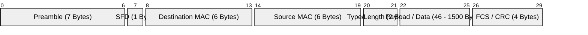
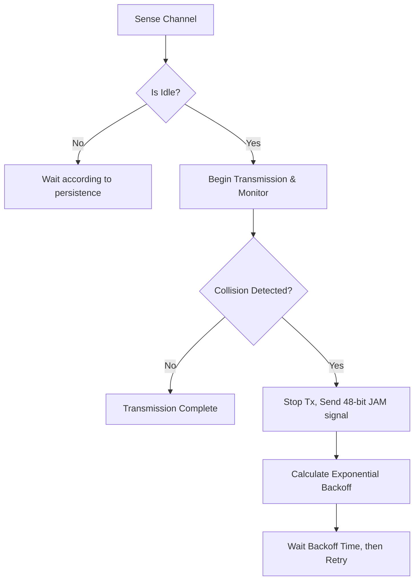
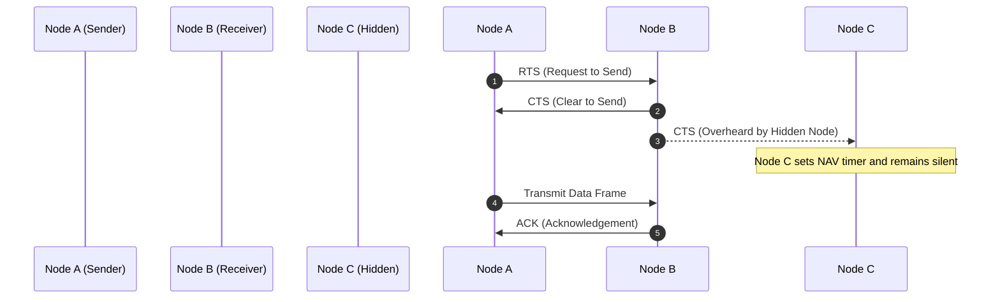

# Chapter 05: Data Link Layer and Error Control

## BEGINNER SECTION: Foundations of the Data Link Layer

### What is the Data Link Layer?
The Data Link Layer is Layer 2 of the OSI (Open Systems Interconnection) model. Its primary responsibility is to transfer data between two directly connected devices over a physical medium (node-to-node or hop-to-hop delivery). It abstracts the underlying Physical Layer's raw bitstream transmission and provides a reliable communication link to the higher Network Layer.

**Analogy:** 
Think of the Network Layer (Layer 3) as the GPS navigation system plotting a route from New York to Los Angeles across many cities and highways. The Data Link Layer (Layer 2) is the set of local traffic rules, traffic lights, and lane demarcations within one specific city block. It doesn't care about the final destination across the country; it only cares about safely getting your car to the next immediate intersection without colliding with other vehicles.

### What is a Frame?
When the Network Layer creates a data packet, it passes it down to the Data Link Layer. The Data Link Layer wraps this packet in an "envelope" called a **frame**. The frame includes a header (with local physical addresses) and a trailer (with error-checking codes) so the data can safely transit the local physical medium. Framing is the process of breaking a continuous bitstream into discrete, manageable blocks.

### MAC Addresses (Physical Addressing)
While IP addresses are logical and can change depending on network location, Media Access Control (MAC) addresses are physical and permanent.

- **Size and Format:** A MAC address is a 48-bit hardware address burned into the Network Interface Card (NIC) at the time of manufacture. It is typically formatted as 6 pairs of hexadecimal digits separated by colons or hyphens (e.g., `AA:BB:CC:DD:EE:FF` or `AA-BB-CC-DD-EE-FF`).
- **Structure:**
  - **First 3 octets (24 bits) - OUI:** The Organizationally Unique Identifier identifies the manufacturer of the NIC (e.g., Intel, Cisco, Apple). The IEEE assigns these OUIs to vendors.
  - **Last 3 octets (24 bits) - Device Specific:** This is a unique serial number assigned by the manufacturer to the specific NIC.
- **Special Addresses:**
  - **Broadcast MAC:** `FF:FF:FF:FF:FF:FF`. When a frame is sent to this address, every device on the local network segment receives and processes it.
  - **Multicast MAC:** For IPv4 multicast, the MAC address always begins with `01:00:5E`. It is intended for a specific subscribed group of devices.
- **Can a MAC be changed?** Technically, the physical burned-in address cannot be altered. However, the operating system can be instructed to "spoof" or present a different MAC address to the network. This is known as MAC spoofing, heavily used in both privacy enhancement and network attacks.

### Ethernet Frame Format (IEEE 802.3)
The Ethernet frame is the standard envelope used in wired LANs.



- **Preamble (7 bytes):** A pattern of alternating 1s and 0s (10101010...) used to synchronize the receiver's clock with the sender's clock.
- **SFD (Start Frame Delimiter, 1 byte):** The sequence `10101011` that signals the end of the preamble and the immediate start of the frame data.
- **Destination MAC (6 bytes):** The physical address of the receiving device on the local segment.
- **Source MAC (6 bytes):** The physical address of the sending device.
- **Type/Length (2 bytes):** 
  - If the value is > 1500 (e.g., `0x0800` for IPv4, `0x0806` for ARP, `0x86DD` for IPv6), it indicates the EtherType (the protocol of the payload).
  - If the value is <= 1500, it indicates the length of the payload.
- **Data/Payload (46-1500 bytes):** The actual encapsulated Network Layer packet. If the packet is smaller than 46 bytes, padding is added to reach the minimum size.
- **FCS/CRC (4 bytes):** The Frame Check Sequence, which uses a Cyclic Redundancy Check to allow the receiver to detect any bit corruption that occurred during transit.
- **Frame Size Limits:** 
  - Minimum frame size: **64 bytes** (excluding the 8-byte Preamble and SFD).
  - Maximum standard frame size: **1518 bytes** (1522 bytes if an 802.1Q VLAN tag is included).

---

## INTERMEDIATE SECTION: LLC vs MAC Architecture

The IEEE 802 LAN/MAN standards split the Data Link Layer into two distinct sublayers to handle different responsibilities.

### LLC Sublayer (Logical Link Control - IEEE 802.2)
The upper half of the Data Link Layer interfaces directly with the Network Layer.
- **Multiplexing via SAPs:** It provides Service Access Points (SAPs) to allow multiple upper-layer protocols (like IPv4, IPv6, IPX) to share the same physical link.
- **Addressing:** Uses DSAP (Destination SAP) and SSAP (Source SAP) fields to identify these upper-layer protocols.
- **Control:** Provides flow control and error control between nodes.
- **Types of Service:**
  1. **Type 1 (Unacknowledged connectionless):** Best-effort delivery without guarantees (used in standard Ethernet).
  2. **Type 2 (Connection-oriented):** Establishes a session, guarantees delivery, handles sequencing.
  3. **Type 3 (Acknowledged connectionless):** No session setup, but frames are individually acknowledged (useful in noisy environments like factory automation).

### MAC Sublayer (Media Access Control)
The lower half of the Data Link Layer interfaces with the Physical Layer.
- **Shared Medium Access:** Defines the rules for how devices gain access to a shared physical medium without constantly talking over one another.
- **Physical Addressing:** Handles the application and interpretation of MAC addresses.
- **Protocols:** Implements CSMA/CD for wired Ethernet and CSMA/CA for Wi-Fi.

---

## INTERMEDIATE SECTION: Error Detection

### Why Errors Occur
Data travels as electrical signals, light pulses, or radio waves. These signals are susceptible to:
- **Noise:** Thermal noise, electromagnetic interference (EMI) from motors or cables.
- **Attenuation:** Signal strength weakening over distance.
- **Distortion:** Signal changing shape as it travels through different media.
These factors cause bits to flip (a 0 becomes a 1, or a 1 becomes a 0).
- **Single-bit error:** Only one bit in a data unit is changed.
- **Burst error:** Multiple contiguous bits in a data unit are changed (common in wireless networks and serial transmission).

### 1. Simple Parity Check (1D Parity)
The simplest error detection method. You append one extra "parity bit" to your data block.
- **Even Parity:** The parity bit is set so the total number of 1s in the frame (including the parity bit) is an even number.
- **Odd Parity:** The parity bit is set so the total number of 1s is odd.

**Capabilities:**
- Can detect any *odd* number of bit errors (1, 3, 5...).
- Cannot detect an *even* number of bit errors (2, 4, 6...) because the parity bit remains mathematically valid when two errors cancel each other out.

**Worked Example (Even Parity):**
- Original Data: `1010001` (Number of 1s = 3)
- Goal: Make total 1s even.
- Parity Bit to add: `1`
- Transmitted Data: `10100011` (Total 1s = 4, which is even)
- If one bit flips during transit to `11100011`, the receiver counts five 1s. Five is odd. The receiver knows an error occurred.

### 2. Two-Dimensional (2D) Parity
Data is arranged in a 2D matrix (rows and columns). A parity bit is calculated for each row and each column.

**Capabilities:**
- Detects all 1-bit, 2-bit, and 3-bit errors, and most burst errors.
- **Can CORRECT single-bit errors:** By intersecting the row and column that report bad parity, the exact flipped bit can be located and flipped back.

**Worked Example (Even Parity):**
Data blocks: `1100111`, `1011101`, `0111001`, `0101001`

```text
Data:         Row Parity:
1 1 0 0 1 1 1 | 1
1 0 1 1 1 0 1 | 1
0 1 1 1 0 0 1 | 0
0 1 0 1 0 0 1 | 1
-----------------
Col Parity:
0 1 0 1 0 1 0 | 1 (Corner bit)
```
If the bit at Row 2, Col 3 flips from `1` to `0`, both Row 2's parity and Col 3's parity will be incorrect at the receiver. The receiver finds the intersection (R2, C3) and flips the `0` back to a `1`.

### 3. Checksum (16-bit Internet Checksum)
Used extensively in Network and Transport layer headers (IP, TCP, UDP).

**Algorithm:**
1. Break the data into 16-bit (2-byte) words.
2. Sum all the 16-bit words using binary arithmetic.
3. If there is a carry-out from the most significant bit, wrap it around and add it to the least significant bit (End-Around Carry).
4. Take the one's complement (flip all bits) of the final sum. This is the checksum.
5. Append checksum to data.
6. **Receiver:** Sums all 16-bit words *including* the checksum. If the data is pristine, the sum will be all 1s (`0xFFFF`).

**Limitations:** Checksums do not detect swapped 16-bit words or inserted zeros.

**Worked Numerical Example (8-bit simplified):**
Data: `10101001` and `00111001`
- Sum: `10101001 + 00111001 = 11100010` (No carry)
- One's complement (Checksum): flip `11100010` -> `00011101`
- Sent Data: `10101001`, `00111001`, `00011101`
- Receiver Sum: `10101001 + 00111001 + 00011101 = 11111111` (All 1s = Valid).

### 4. Cyclic Redundancy Check (CRC)
The most robust error detection mechanism, used in Ethernet and Wi-Fi. It uses polynomial division with modulo-2 arithmetic (XOR operations, no carries).

- Sender and receiver agree on a **Generator Polynomial** $G(x)$.
- Example $G(x) = x^3 + x + 1$ translates to binary `1011`.
- $r$ is the degree of the polynomial (highest exponent, here $r=3$).

**Sender Process & Worked Example:**
- Data $M(x)$: `1101011011`
- Generator $G(x)$: `10011` (degree $r=4$)
- Step 1: Append $r=4$ zeros to the data. Dividend = `11010110110000`
- Step 2: Divide Dividend by Generator using XOR modulo-2 division.

```text
              1100001010
        __________________
  10011 | 11010110110000
          10011
          -----
           10011
           10011
           -----
            000010110
                10011
                -----
                 010100
                  10011
                  -----
                   01110
```
*(Note: A full long division involves XORing bit by bit).* Let's assume the remainder is `1110`.
- Step 3: Replace appended zeros with the remainder. Transmitted codeword = `11010110111110`.
- **Receiver:** Divides the received codeword by `10011`. If remainder is `0000`, the frame is accepted.

**Capabilities:**
Detects all single-bit errors, all burst errors of length <= the degree of the polynomial, and a vast majority of larger burst errors. Standard polynomials include CRC-8, CRC-16, and CRC-32 (used in Ethernet).

---

## INTERMEDIATE SECTION: Error Correction

While Error Detection requires the receiver to ask for a retransmission, Forward Error Correction (FEC) allows the receiver to correct the error immediately without asking for retransmission.

### Hamming Code
A self-correcting code designed by Richard Hamming.

**1. Redundancy Requirement Formula:**
To protect $m$ bits of data with $r$ parity bits, the formula is:
$$2^r \ge m + r + 1$$
- For 4 data bits: $2^3 = 8 \not\ge 4+3+1$. So $r=3$ parity bits are needed.
- For 8 data bits: $2^4 = 16 \ge 8+4+1$. So $r=4$ parity bits are needed.

**2. Parity Bit Placement:**
Parity bits are placed at positions that are powers of 2 (1, 2, 4, 8, 16...). Data bits fill the remaining spaces (3, 5, 6, 7, 9...).

**3. Parity Coverage (Even Parity):**
- **P1 (Bit 1):** Covers positions where the 1st bit of the binary index is 1 (pos 1, 3, 5, 7, 9...).
- **P2 (Bit 2):** Covers positions where the 2nd bit of the binary index is 1 (pos 2, 3, 6, 7, 10...).
- **P4 (Bit 4):** Covers positions where the 3rd bit of the binary index is 1 (pos 4, 5, 6, 7, 12...).

**Full Worked Example (4-bit data `1011`):**
- Calculate positions: P1 P2 D1(3) P4 D2(5) D3(6) D4(7) -> _ _ 1 _ 0 1 1
- Calculate P1 (covers 1,3,5,7): Values at 3,5,7 are `1,0,1`. Total 1s = 2 (even). P1 = 0.
- Calculate P2 (covers 2,3,6,7): Values at 3,6,7 are `1,1,1`. Total 1s = 3 (odd). P2 = 1.
- Calculate P4 (covers 4,5,6,7): Values at 5,6,7 are `0,1,1`. Total 1s = 2 (even). P4 = 0.
- Final codeword: `0 1 1 0 0 1 1`

**Error Correction Phase:**
Suppose the receiver gets `0 1 1 0 1 1 1` (error in position 5).
- Receiver checks P1 (1,3,5,7 -> 0,1,1,1). Total 1s = 3 (Fail, bit 1).
- Receiver checks P2 (2,3,6,7 -> 1,1,1,1). Total 1s = 4 (Pass, bit 0).
- Receiver checks P4 (4,5,6,7 -> 0,1,1,1). Total 1s = 3 (Fail, bit 1).
- Binary error location: `101` = Decimal 5. The receiver flips bit 5 to correct the error.

### Hamming Distance Concept
- **Definition:** The number of bit positions in which two valid codewords differ.
- **Minimum Hamming Distance ($d_{min}$):** The smallest Hamming distance between any two valid codewords in the entire coding scheme.
- **Rule for Detection:** To guarantee detection of $d$ errors, you need $d_{min} \ge d + 1$.
- **Rule for Correction:** To guarantee correction of $d$ errors, you need $d_{min} \ge 2d + 1$.
- Standard Hamming code has $d_{min} = 3$. Therefore, it can detect 2-bit errors ($3 \ge 2+1$) and correct 1-bit errors ($3 \ge 2(1)+1$).

---

## INTERMEDIATE SECTION: Media Access Control (MAC)

When multiple devices share a single communication medium (a wire, radio frequency), there must be rules to govern who talks when, otherwise data packets collide and are destroyed.

### Random Access Protocols (Contention-Based)

#### 1. Pure ALOHA
The earliest and simplest protocol.
- **Rule:** Transmit your frame whenever you have data. If a collision occurs, wait a random amount of time and try again.
- **Vulnerability:** Extremely high collision rate because it lacks carrier sensing. 
- **Vulnerable Period:** $2 \times T_{frame}$. Any frame sent in this window will collide.
- **Throughput Formula:** $S = G \cdot e^{-2G}$ (where $G$ is offered load).
- **Maximum Efficiency:** Occurs at $G=0.5$, yielding $S_{max} = 18.4\%$. Very inefficient.

#### 2. Slotted ALOHA
An improvement over Pure ALOHA.
- **Rule:** Time is divided into equal, synchronized slots. You can only begin transmitting at the absolute start of a slot.
- **Vulnerable Period:** Cut in half to $1 \times T_{frame}$.
- **Throughput Formula:** $S = G \cdot e^{-G}$.
- **Maximum Efficiency:** Occurs at $G=1$, yielding $S_{max} = 36.8\%$. Doubles Pure ALOHA's efficiency.

#### 3. CSMA (Carrier Sense Multiple Access)
Adds the "Listen before you talk" rule.
- If the channel is idle, transmit.
- If the channel is busy, behave according to a persistence strategy:
  - **1-persistent:** Wait aggressively until idle, then transmit with 100% probability. High risk of collision if multiple stations are waiting.
  - **Non-persistent:** If busy, wait a random time and check again. Reduces collisions but wastes bandwidth.
  - **p-persistent:** If idle, transmit with probability $p$. If you don't transmit (probability $1-p$), wait one slot and try again. Balances aggression and waste.
- **Collisions still occur:** Due to propagation delay, two stations might sense an idle channel simultaneously, transmit, and collide.

#### 4. CSMA/CD (Collision Detection) - Wired Ethernet
Standard CSMA doesn't stop sending if a collision happens. CSMA/CD fixes this.



- **Truncated Binary Exponential Backoff:** After a collision, wait a random time. The window of random time doubles after every collision to adapt to heavy traffic.
  - Wait time: Random multiplier from $0$ to $2^{\min(k,10)} - 1$ slot times (where $k$ is the number of collisions).
  - Gives up after 16 collisions.
- **Deriving Minimum Frame Length:**
  To detect a collision, a station must still be actively transmitting its frame when the collision signal bounces back to it. 
  - Time to reach end of wire: $T_p$ (Propagation Delay).
  - Time for collision signal to return: $T_p$.
  - Total Round Trip Time: $2 \times T_p$.
  - Therefore, Transmission Time ($T_t$) must be $\ge 2 \times T_p$.
  - Since $T_t = \frac{L}{B}$ (Length / Bandwidth) and $T_p = \frac{d}{v}$ (distance / velocity):
  - $\frac{L_{min}}{B} \ge 2 \cdot T_p \implies \mathbf{L_{min} = 2 \cdot T_p \cdot B}$
  - This is why Ethernet requires a minimum 64-byte frame (to cover a 2.5km cable run at 10Mbps).

#### 5. CSMA/CA (Collision Avoidance) - Wireless (802.11)
Wi-Fi cannot use CSMA/CD because wireless radios are half-duplex; they cannot transmit and listen for collisions simultaneously. They also suffer from the **Hidden Node Problem** (Node A and Node C cannot hear each other, but both can reach Node B. They transmit simultaneously, colliding at B).

**Collision Avoidance Mechanisms:**
- **IFS (Interframe Space):** Priority wait times (SIFS for ACKs, DIFS for data).
- **RTS/CTS (Request to Send / Clear to Send):**


- **NAV (Network Allocation Vector):** A virtual timer maintained by all listening nodes. If they hear an RTS or CTS, they update their NAV and stay silent until the transaction finishes.
- **Explicit ACK:** Since the sender cannot detect collisions, the receiver must send an ACK frame to confirm successful receipt.

### Controlled Access Protocols
- **Polling:** A Primary controller asks each Secondary device, "Do you have data?" round-robin style. No collisions, but high overhead and single point of failure.
- **Token Passing:** A small "token" frame circulates in a logical ring. A device can only transmit if it holds the token. Once done, it passes the token. Guarantees fair access but requires complex token recovery (Active Monitors) if the token is lost.

---

## ADVANCED SECTION: Sliding Window Protocols (ARQ)

Automatic Repeat reQuest (ARQ) protocols handle flow and error control at the Data Link (and Transport) layer, ensuring the sender does not overwhelm the receiver and lost frames are retransmitted.

### 1. Stop-and-Wait ARQ
- **Mechanism:** Sender transmits Frame 0, starts a timer, and waits. It does absolutely nothing else until it receives ACK 0. Then it sends Frame 1.
- **Sequence Numbers:** Needs only 1 bit (`0` and `1`). This alternating bit prevents duplicate frame acceptance if an ACK is delayed.
- **Efficiency ($\eta$):** $\eta = \frac{T_t}{T_t + 2T_p} = \frac{1}{1 + 2a}$ (where $a = \frac{T_p}{T_t}$).
- **Problem:** Terribly inefficient on long, high-bandwidth links (like satellite connections where $T_p$ is huge). The pipe remains mostly empty.

### 2. Go-Back-N (GBN) ARQ
- **Mechanism:** Allows a "sliding window" of up to $N$ unacknowledged frames in flight to keep the pipe full. 
- **Receiver Behavior:** The receiver is rigid. It ONLY accepts frames in strict sequence. If Frame 2 is lost, but Frame 3 arrives, the receiver discards Frame 3.
- **Error Handling:** When the sender's timer for Frame 2 expires, it "Goes Back N" frames and retransmits Frame 2, 3, 4, 5... (all unacknowledged frames).
- **Window Size Limit:** For $m$-bit sequence numbers, max window size $W_{GBN} \le 2^m - 1$. If $W = 2^m$, the receiver cannot distinguish between a completely new window of frames and a retransmission of the old window.
- **Efficiency:** $\eta = \frac{N}{1 + 2a}$ (provided $N \ge 1+2a$, otherwise it performs poorly).

### 3. Selective Repeat (SR) ARQ
- **Mechanism:** Similar to GBN, but the receiver is smart and has a buffer for out-of-order frames.
- **Error Handling:** If Frame 2 is lost, the receiver buffers Frame 3, 4, 5. It sends a NAK for Frame 2. The sender ONLY retransmits the specific lost Frame 2.
- **Window Size Limit:** For $m$-bit sequence numbers, max window size $W_{SR} \le 2^{m-1}$ (half of the sequence space). This ensures the old window and new window sequences never overlap in the receiver's buffer.
- **Efficiency:** Highest efficiency, especially on lossy networks.

### ARQ Protocol Comparison Table

| Protocol Feature | Stop-and-Wait ARQ | Go-Back-N (GBN) ARQ | Selective Repeat (SR) ARQ |
|---|---|---|---|
| **Sender Window Size ($W_s$)** | $1$ | $N = 2^m - 1$ | $W_s = 2^{m-1}$ |
| **Receiver Window Size ($W_r$)** | $1$ | $1$ | $W_r = 2^{m-1}$ |
| **Out-of-Order Frames** | Discarded | Discarded | Buffered by receiver |
| **Retransmission Scope** | Only 1 lost frame | Entire window of $N$ frames | Only the specific lost frame |
| **ACK Type** | Individual | Cumulative | Selective / Individual (SACK) |
| **Channel Efficiency ($\eta$)** | $\frac{1}{1 + 2a}$ | $\frac{N}{1 + 2a}$ | $\frac{W_s}{1 + 2a}$ |

---

## Security Perspective: Layer 2 Attack Vectors

The Data Link layer is vulnerable to specific local-network attacks because it inherently trusts devices on the same physical segment.

- **ARP Spoofing/Poisoning:** ARP maps IPs to MAC addresses via broadcast. An attacker sends unsolicited, fake ARP replies to a victim and the gateway, claiming "I am the Gateway" to the victim, and "I am the Victim" to the gateway. This establishes a Man-in-the-Middle (MitM) position, allowing the attacker to intercept, read, or drop all traffic.
- **MAC Flooding (CAM Table Overflow):** A switch uses a Content Addressable Memory (CAM) table to map MAC addresses to physical ports. An attacker floods the switch with thousands of randomly generated MAC addresses. Once the CAM memory is full, the switch "fails open" into legacy Hub Mode. It begins broadcasting all incoming frames to every port, allowing the attacker to sniff all network traffic.
- **MAC Spoofing:** Changing the MAC address in software to impersonate a trusted device, bypass MAC filtering on routers, or hide identity during an attack.
- **Defenses:** 
  - **Dynamic ARP Inspection (DAI):** Switch feature that drops malicious ARP packets.
  - **Port Security:** Restricting a switch port to only allow a specific number of MAC addresses (mitigates MAC flooding).
  - **802.1X Authentication:** Requires devices to authenticate against a RADIUS server before the switch port will forward their data frames.

---

## Exam Tips & Common Traps
- **TRAP:** Thinking a MAC address determines geographical routing. It does not. MACs are local physical addresses; IP addresses handle geographical routing.
- **EXAM TIP:** Memorize the CSMA/CD Minimum Frame length formula: $L_{min} = 2 \cdot T_p \cdot B$. You will almost certainly be asked to calculate the minimum frame size given a distance and bandwidth.
- **TRAP:** Confusing the window size limits of GBN and SR. 
  - GBN max window is $2^m - 1$.
  - SR max window is $2^{m-1}$.
- **EXAM TIP:** If asked which ARQ protocol is best for a highly reliable (low error) link, GBN is preferred over SR because it is simpler to implement (no receiver buffering) and performs identically when no errors occur.
- **TRAP:** Believing Checksum or Parity can correct errors. Only Forward Error Correction (like Hamming Code) or 2D Parity can correct errors. Checksum/1D Parity can only *detect* them.

## Key Terms Glossary
- **Attenuation:** The progressive loss of signal strength over distance.
- **Backoff Algorithm:** The mathematical process (binary exponential backoff) used to space out retransmissions after a collision.
- **Collision Domain:** A network segment where data packets can collide with one another (hubs create one large domain, switches separate domains per port).
- **FEC (Forward Error Correction):** Adding redundant data so the receiver can mathematically reconstruct corrupted bits.
- **Frame:** The Protocol Data Unit (PDU) at the Data Link Layer.
- **Hamming Distance:** The number of bit differences between two valid binary codewords.
- **OUI:** Organizationally Unique Identifier; the first 24 bits of a MAC address identifying the vendor.
- **Piggybacking:** Temporarily delaying an outgoing ACK to attach it to an outgoing data frame, saving bandwidth.
- **Throughput:** The actual successful data transfer rate (efficiency $\times$ bandwidth).
- **Vulnerable Time:** The critical time window in CSMA/ALOHA during which a collision can occur.
