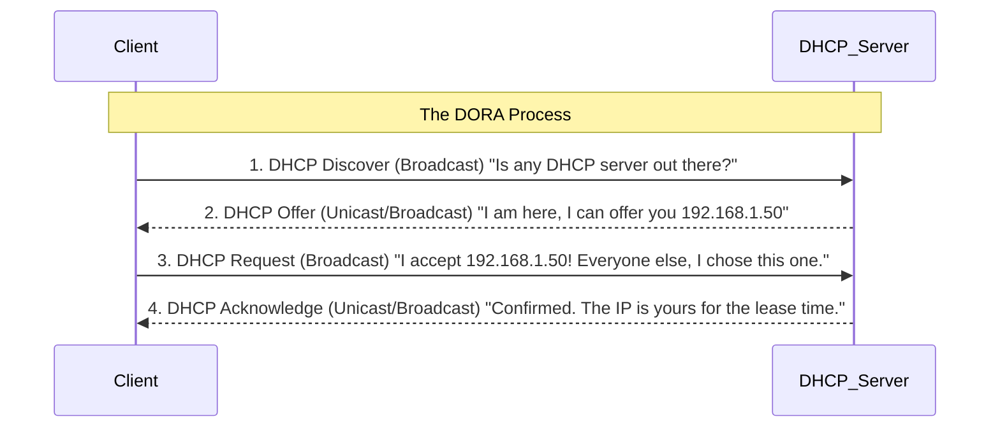
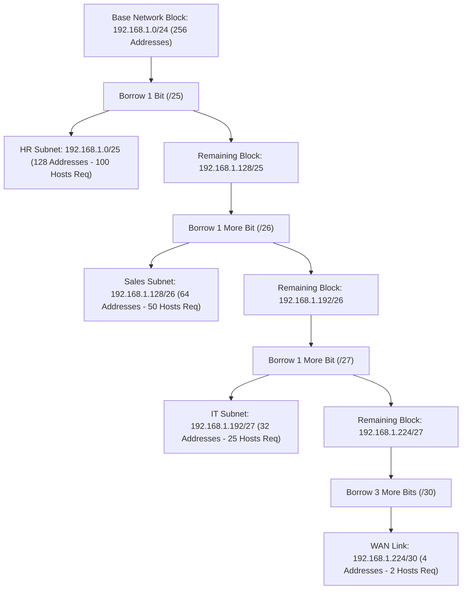
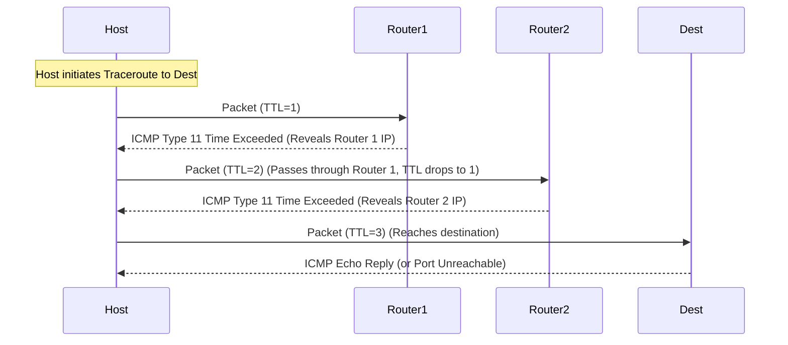
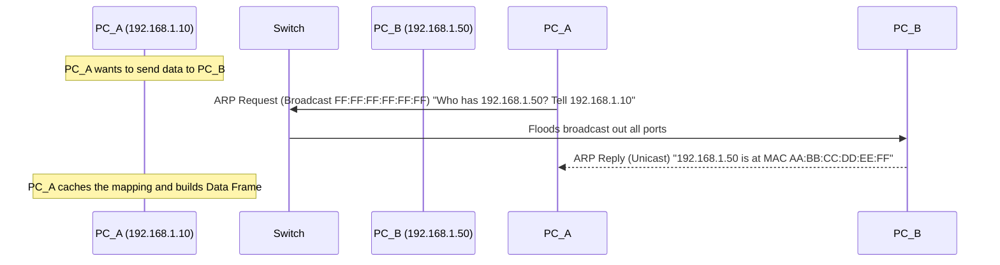

# Chapter 06: Network Layer, IP Addressing, and Subnetting

## Introduction

Welcome to Chapter 06, arguably the most important, mathematical, and fundamental chapter in your networking journey. The concepts covered here form the absolute bedrock of the Internet. We will start from the absolute basics, assuming zero prior knowledge, and systematically build up to advanced protocol mechanics, binary mathematics, and subnetting strategies used by global internet service providers.

This chapter is exhaustive. It is designed to be a definitive reference guide. Read it carefully, work through the mathematical examples by hand, and visualize the packet flows. 

---

## BEGINNER SECTION: Fundamentals of the Network Layer

### What is the Network Layer?

The Network Layer is Layer 3 of the OSI (Open Systems Interconnection) model. While the Data Link Layer (Layer 2) is responsible for delivering frames between nodes on the *same* local network segment using physical MAC addresses, the Network Layer is responsible for host-to-host delivery of packets across *disparate, heterogeneous* networks. 

It provides two primary functions:
1. **Routing**: Determining the optimal path a packet should take from the source network to the destination network across a web of interconnected routers.
2. **Logical Addressing**: Providing a globally unique, structured identification system (IP addressing) that allows any device on the planet to be addressed and located.

Without the Network Layer, the internet as we know it would not exist. We would just have isolated islands of local networks unable to communicate with each other.

### The Hop-by-Hop Forwarding Analogy
To truly understand how the Network Layer operates, consider a road trip analogy. Imagine you are embarking on a cross-country road trip from a small town in California to a specific building in New York City.

When you start your journey, you do not have a complete turn-by-turn map of the entire country. Instead, you drive to your local highway intersection. There, a sign (representing a router) points you toward "Interstate 80 East." You take that road. Hundreds of miles later, you reach another major interchange, where another sign points you toward "New York." 

At each major intersection (router), you simply ask the local signpost (the router's Forwarding Table), "Which way to New York?" The router looks at the destination on your packet, checks its table, and forwards you to the next router (the "next hop") that is closer to the destination. 

This is known as **hop-by-hop forwarding**. 
- You (the packet) do not need to know the entire route.
- The router does not need to know the entire route. 
- The router only needs to know which immediate neighbor is the best next step toward the final destination.

### What is an IP Address?

An IP (Internet Protocol) address is a unique, logical address that identifies a device on a network. It is the fundamental identifier that allows routers to determine where a packet should be sent.

#### The Postal Address Analogy
To distinguish an IP address from a MAC address, we use the postal address analogy:
- **MAC Address (Data Link Layer)**: This is your biological name. It is burned into your hardware when it is manufactured. It is fixed and never changes, no matter where you travel in the world. However, your name alone does not help the post office deliver a letter to you if they don't know where you live.
- **IP Address (Network Layer)**: This is your postal mailing address (e.g., 123 Main St, Springfield, IL). It is logical and topological. If you move to a new city, your name (MAC address) stays the same, but your postal address (IP address) changes based on your new location.

An IP address provides the hierarchical, location-based information necessary for global routing.

### IPv4 Architecture

Internet Protocol version 4 (IPv4) is the dominant addressing scheme of the internet. 

- **Structure**: An IPv4 address is exactly 32 bits long.
- **Notation**: Because humans are terrible at reading strings of 32 ones and zeros, we divide these 32 bits into four groups of 8 bits. Each 8-bit group is called an **octet**. We then convert each octet into a decimal number and separate them with dots. This is called **dotted-decimal notation**.
- **Value Range**: Since an octet is 8 bits, the minimum value is `00000000` (decimal 0) and the maximum value is `11111111` (decimal 255). This is because $2^8 = 256$ possible values. Therefore, each decimal number in an IPv4 address must fall exactly within the range of 0 to 255.

**Example IPv4 Address:** `192.168.1.100`
- Octet 1: 192
- Octet 2: 168
- Octet 3: 1
- Octet 4: 100

### Binary to Decimal and Decimal to Binary Conversion

To master networking and subnetting, you must be able to convert IP addresses between decimal and binary formats seamlessly. This requires understanding base-2 (binary) mathematics.

#### The Powers of 2 Table
An 8-bit octet has bit positions valued by powers of 2. Memorize this table. Read from right to left, starting at $2^0$.

| Bit Position | 7 | 6 | 5 | 4 | 3 | 2 | 1 | 0 |
|---|---|---|---|---|---|---|---|---|
| **Power of 2** | $2^7$ | $2^6$ | $2^5$ | $2^4$ | $2^3$ | $2^2$ | $2^1$ | $2^0$ |
| **Decimal Value** | **128** | **64** | **32** | **16** | **8** | **4** | **2** | **1** |

#### Converting Binary to Decimal
**Rule**: Wherever you see a `1`, add the corresponding decimal value. Where you see a `0`, add 0.

**Example: Convert `11000000` to decimal.**
1. Map the bits to the values:
   - `1` -> 128
   - `1` -> 64
   - `0` -> 32
   - `0` -> 16
   - `0` -> 8
   - `0` -> 4
   - `0` -> 2
   - `0` -> 1
2. Add the values where the bit is 1: $128 + 64 = 192$.
3. The decimal value is **192**.

**Example: Convert `10101010` to decimal.**
- $128 + 32 + 8 + 2 = 170$.
- The decimal value is **170**.

#### Converting Decimal to Binary
**Rule**: Start from the left (128). Ask: "Is the target number greater than or equal to this value?" If yes, write a `1` and subtract the value from the target. If no, write a `0`. Move to the next value.

**Example: Convert 168 to binary.**
- Target: 168
- Is $168 \ge 128$? Yes. Write **1**. Remainder: $168 - 128 = 40$.
- Is $40 \ge 64$? No. Write **0**.
- Is $40 \ge 32$? Yes. Write **1**. Remainder: $40 - 32 = 8$.
- Is $8 \ge 16$? No. Write **0**.
- Is $8 \ge 8$? Yes. Write **1**. Remainder: $8 - 8 = 0$.
- Since the remainder is 0, the remaining bits are all 0.
- Result: **10101000**

**Practice Examples for the Reader:**
1. Decimal 255 -> Binary `11111111` ($128+64+32+16+8+4+2+1$)
2. Decimal 10 -> Binary `00001010` ($8+2$)
3. Binary `11111110` -> Decimal 254 ($128+64+32+16+8+4+2$)
4. Decimal 192 -> Binary `11000000` ($128+64$)
5. Decimal 172 -> Binary `10101100` ($128+32+8+4$)

### Why Do We Need Two Types of Addresses?
A common beginner question is: "If we have MAC addresses, why do we need IP addresses?"

- **MAC Addresses (Layer 2)**: Are designed for local delivery within a single broadcast domain (e.g., within your home WiFi network, or inside one office floor). Switches use MAC addresses to forward frames. However, MAC addresses have no geographical hierarchy. If routers had to track the location of every MAC address globally, the routing tables would be trillions of rows long and the internet would instantly crash.
- **IP Addresses (Layer 3)**: Are hierarchical. The first portion of the IP identifies the network, and the second portion identifies the host on that network. This allows routers to summarize routes. A router only needs to know how to reach network `192.168.1.0`; it does not need to memorize every single host on that network.
- **Working Together**: The IP address gets the packet to the correct destination network anywhere in the world. Once the packet arrives at the local router of that destination network, the router uses ARP (Address Resolution Protocol) to resolve the IP address into the physical MAC address, delivering the final frame to the device's NIC (Network Interface Card). Both are mandatory for end-to-end communication.

### Public IP vs. Private IP Addresses

Not all IP addresses can be routed on the global internet.
- **Public IP Addresses**: These are globally unique. No two devices on the internet can have the same public IP address simultaneously. They are governed and assigned by IANA (Internet Assigned Numbers Authority) and RIRs (Regional Internet Registries). If a packet has a public destination IP, core internet routers know how to forward it.
- **Private IP Addresses**: To conserve the limited supply of IPv4 addresses, certain ranges were intentionally reserved for private, internal networks (like your home, school, or corporate office) as defined in **RFC 1918**. 
  - Private IPs are explicitly **NOT routable on the public internet**. If a core internet router receives a packet destined for a private IP, it instantly drops it.
  - Because they are strictly internal, millions of homes around the world can reuse the exact same private IP (e.g., `192.168.1.5`) without any conflict.

#### RFC 1918 Private Address Ranges

| Class | Private Address Range | Subnet Mask | CIDR Prefix | Total Private Addresses |
|---|---|---|---|---|
| **Class A** | `10.0.0.0` to `10.255.255.255` | `255.0.0.0` | `/8` | $16,777,216$ |
| **Class B** | `172.16.0.0` to `172.31.255.255` | `255.240.0.0` | `/12` | $1,048,576$ |
| **Class C** | `192.168.0.0` to `192.168.255.255` | `255.255.0.0` | `/16` | $65,536$ |

#### Special Addresses: APIPA and Loopback
- **APIPA (Automatic Private IP Addressing) / Link-Local**: `169.254.0.0/16`. If a device is configured to get an IP address automatically but fails to contact a DHCP server, the operating system will automatically self-assign an address from the `169.254.x.x` range. This allows local devices on the same wire to communicate, but they will not have internet access. Seeing a `169.254.x.x` address is usually a diagnostic symptom of a broken DHCP environment.
- **Loopback Address**: `127.0.0.1` (and the entire `127.0.0.0/8` block). This is the local host testing address. When a device sends a packet to `127.0.0.1`, the packet never leaves the physical network interface. Instead, the OS TCP/IP stack catches it and loops it right back to the application layer. 
  - You can run `ping 127.0.0.1` in your terminal. If it replies, your device's internal networking software stack is functioning properly. 

### DHCP (Dynamic Host Configuration Protocol)

Assigning IP addresses manually (Static IP) to thousands of corporate laptops and phones is impossible. **DHCP** automates this.

When a device connects to a network, DHCP dynamically assigns it:
1. An IP Address
2. A Subnet Mask
3. A Default Gateway (the local router)
4. A DNS Server (to resolve domain names)

#### The Hotel Room Analogy
Imagine arriving at a massive hotel.
1. You ask the front desk for a room.
2. They hand you a room key (your **IP Address**).
3. They give you a map of the floor so you know how far you can walk locally (your **Subnet Mask**).
4. They tell you the location of the lobby exit door if you want to leave the hotel (your **Default Gateway**).
5. They give you a phone book to look up local restaurants (your **DNS Server**).

#### The DORA Process
DHCP operates over UDP using ports 67 (server) and 68 (client). It uses a 4-step process known as **DORA**.



- **Lease Time**: DHCP does not give you an IP address forever; it leases it to you for a specific duration (e.g., 24 hours). At the 50% mark (12 hours), your device will attempt to renew the lease. If you leave the network, the lease eventually expires, and the server reclaims the IP to give to someone else.
- **DHCP Relay Agent**: DHCP Discover packets are broadcasts. Routers block broadcasts by default. If a company has 10 VLANs, they do not want 10 separate DHCP servers. They configure the router interfaces as **DHCP Relay Agents** (also called `ip helper-address`), which intercept the broadcast and forward it as a unicast packet directly to a centralized DHCP server on another subnet.

---

## INTERMEDIATE SECTION: Subnetting, Math, and Architecture

### Classful IP Addressing (The Historical Context)

In the early days of the internet, before CIDR was invented in 1993, IP addresses were assigned in rigid blocks called **Classes**. The class was strictly determined by the first few bits of the first octet.

#### Class A
- **First Bit Rule**: Must start with `0`.
- **First Octet Range**: 1 to 126 (0 is reserved, 127 is loopback).
- **Structure**: 8 bits for Network, 24 bits for Host (`N.H.H.H`).
- **Default Subnet Mask**: `255.0.0.0` or `/8`.
- **Number of Networks**: $2^7 - 2 = 126$.
- **Hosts per Network**: $2^{24} - 2 = 16,777,214$.
- **Use Case**: Massive entities like governments or major ISPs. 
- **Flaw**: Giving one entity 16.7 million IP addresses is obscenely wasteful. Most were never used.

#### Class B
- **First Bit Rule**: Must start with `10`.
- **First Octet Range**: 128 to 191.
- **Structure**: 16 bits for Network, 16 bits for Host (`N.N.H.H`).
- **Default Subnet Mask**: `255.255.0.0` or `/16`.
- **Number of Networks**: $2^{14} = 16,384$.
- **Hosts per Network**: $2^{16} - 2 = 65,534$.
- **Use Case**: Large universities and multinational corporations.

#### Class C
- **First Bit Rule**: Must start with `110`.
- **First Octet Range**: 192 to 223.
- **Structure**: 24 bits for Network, 8 bits for Host (`N.N.N.H`).
- **Default Subnet Mask**: `255.255.255.0` or `/24`.
- **Number of Networks**: $2^{21} = 2,097,152$.
- **Hosts per Network**: $2^8 - 2 = 254$.
- **Use Case**: Small businesses and home networks.

#### Class D and E
- **Class D (Multicast)**: Starts with `1110` (224-239). Used for sending packets to a group of subscribed listeners (e.g., streaming video to multiple endpoints, OSPF routing updates). Not used for individual host addressing.
- **Class E (Experimental)**: Starts with `1111` (240-255). Reserved for military and research.

**Why Classful Failed**: It was wildly inefficient. If a company needed 400 IPs, a Class C (254 IPs) was too small. So IANA would assign them a Class B (65,534 IPs), instantly wasting over 65,000 addresses. IPv4 address space rapidly approached exhaustion. 

### Subnet Masks and the Bitwise AND Operation

A **subnet mask** is a 32-bit number used by a computer to determine which part of an IP address is the Network ID and which part is the Host ID.
- In a subnet mask, contiguous `1`s represent the **Network Portion**.
- Contiguous `0`s represent the **Host Portion**.

Computers determine the Network Address by performing a **Bitwise AND operation** between the IP address and the Subnet Mask.
- `1 AND 1 = 1`
- `1 AND 0 = 0`
- `0 AND 1 = 0`
- `0 AND 0 = 0`

**Example:** IP `192.168.1.100`, Mask `255.255.255.0`

| Element | Octet 1 | Octet 2 | Octet 3 | Octet 4 |
|---|---|---|---|---|
| **IP (Dec)** | 192 | 168 | 1 | 100 |
| **IP (Bin)** | `11000000` | `10101000` | `00000001` | `01100100` |
| **Mask (Bin)** | `11111111` | `11111111` | `11111111` | `00000000` |
| **AND Result** | `11000000` | `10101000` | `00000001` | `00000000` |
| **Network Dec** | **192** | **168** | **1** | **0** |

- **Network Address**: `192.168.1.0` (All host bits are set to `0`. This defines the subnet itself).
- **Broadcast Address**: `192.168.1.255` (All host bits are set to `1`. Sending to this hits every host on the subnet).
- **Usable Host Range**: `192.168.1.1` through `192.168.1.254`.

**The Golden Formula**: The number of usable hosts on any subnet is **$2^n - 2$**, where $n$ is the number of host bits (zeros in the mask). We subtract 2 to account for the Network Address and the Broadcast Address.

### CIDR (Classless Inter-Domain Routing) and Subnetting

Introduced in 1993 (RFC 1519), CIDR abolished the rigid boundaries of Class A, B, and C. It allows for masks of arbitrary lengths.
- **CIDR Notation**: A slash followed by the number of network bits (e.g., `/26` means 26 ones, leaving $32 - 26 = 6$ zeros for hosts).

#### Subnetting Mechanics
Subnetting is the act of taking a large network and slicing it into smaller, more secure, and manageable sub-networks.
You do this by **borrowing bits** from the host portion and converting them into network bits.
- **Every bit borrowed DOUBLES the number of subnets.**
- **Every bit borrowed HALVES the number of hosts per subnet.**

### Step-by-Step Subnetting: Worked Examples

#### Example 1: Subnetting a Class C into 4 Equal Subnets
**Scenario**: You have `192.168.1.0/24`. You want 4 equal-sized subnets for HR, IT, Sales, and Guest.
1. **Determine bits to borrow**: You need 4 subnets. Use $2^k = 4$, where $k$ is borrowed bits. $k = 2$.
2. **Calculate new mask**: Original was `/24`. Add 2 borrowed bits. New mask is `/26`.
3. **Calculate Subnet Mask Decimal**: 26 network bits -> `11111111.11111111.11111111.11000000`. The last octet is $128+64 = 192$. Subnet mask is `255.255.255.192`.
4. **Calculate hosts per subnet**: $32 - 26 = 6$ host bits. Usable hosts = $2^6 - 2 = 64 - 2 = 62$ hosts.
5. **Calculate Block Size (Jump Value)**: $256 - 192 = 64$. Subnets increment by 64.

**Results Table:**
| Subnet # | Subnet ID | Usable Host Range | Broadcast Address |
|---|---|---|---|
| Subnet 1 | `192.168.1.0/26` | `.1` to `.62` | `.63` |
| Subnet 2 | `192.168.1.64/26` | `.65` to `.126` | `.127` |
| Subnet 3 | `192.168.1.128/26` | `.129` to `.190` | `.191` |
| Subnet 4 | `192.168.1.192/26` | `.193` to `.254` | `.255` |

#### Example 2: Host-Driven Subnetting from a Class A
**Scenario**: You are given the massive `10.0.0.0/8` private space. Your boss tells you: "I need a single subnet right now that can hold exactly 500 employee devices. Do not waste space."
1. **Determine host bits needed**: You need 500 hosts. Use $2^n - 2 \ge 500$.
   - $2^8 = 256$ (too small)
   - $2^9 = 512$ (perfect). You need $n=9$ host bits.
2. **Calculate Prefix Length**: $32 \text{ total} - 9 \text{ host} = /23$ mask.
3. **Calculate Subnet Mask Decimal**: `/23` means 23 ones. `11111111.11111111.11111110.00000000`. Third octet is $255 - 1 = 254$. Mask is `255.255.254.0`.
4. **Calculate Block Size**: $256 - 254 = 2$. The networks increment by 2 in the third octet.
5. **Determine Subnet**:
   - Subnet ID: `10.0.0.0/23`
   - First Host: `10.0.0.1`
   - Last Host: `10.0.1.254`
   - Broadcast: `10.0.1.255`

#### Example 3: Finding Subnet Details for a Specific IP
**Scenario**: A company has `172.16.0.0/16`, needs subnets for: 100 hosts, 50 hosts, 25 hosts, 10 hosts.
Wait, let's look at another example.
**Scenario**: A host has IP `172.16.45.14 /20`. What is the network address and broadcast address?
1. **Find the interesting octet**: `/20` falls in the third octet ($16 < 20 \le 24$).
2. **Calculate subnet mask in interesting octet**: `/20` means 4 bits in the third octet. `11110000` -> 240. (Mask is `255.255.240.0`).
3. **Calculate Block Size**: $256 - 240 = 16$.
4. **Find the Subnet Multiples**: Multiples of 16 are 0, 16, 32, 48, 64...
5. **Locate the IP**: The IP's third octet is 45. The multiple immediately below 45 is 32.
6. **Result**:
   - Network Address: `172.16.32.0`
   - Broadcast Address (one less than next multiple 48): `172.16.47.255`
   - Usable Range: `172.16.32.1` to `172.16.47.254`.

### VLSM (Variable Length Subnet Masking)

Fixed-length subnetting (like Example 1 above) is highly inefficient if departments have different sizes. For example, if you assign a `/26` (62 hosts) to a Point-to-Point WAN link that connects two routers, you only need 2 IPs, meaning you just permanently wasted 60 IP addresses.

**VLSM solves this by allowing subnets of different sizes to be carved from the same parent address block.**

**The Golden Rule of VLSM:** Always sort your requirements from LARGEST host requirement to SMALLEST. Allocate the largest first.

**VLSM Worked Example:**
- **Parent Block**: `192.168.1.0/24`
- **Requirements**:
  - HR: 100 hosts
  - Sales: 50 hosts
  - IT: 25 hosts
  - WAN Link: 2 hosts



**Step 1: HR (100 hosts)**
- Need $2^n - 2 \ge 100 \implies n=7$ host bits.
- Prefix: $32 - 7 = /25$.
- Subnet 1 (HR): **`192.168.1.0/25`**
- Range: `.1` to `.126`. Broadcast: `.127`.
- Next available block starts at `.128`.

**Step 2: Sales (50 hosts)**
- Need $2^n - 2 \ge 50 \implies n=6$ host bits.
- Prefix: $32 - 6 = /26$.
- Allocate from the `.128` start point.
- Subnet 2 (Sales): **`192.168.1.128/26`**
- Range: `.129` to `.190`. Broadcast: `.191`.
- Next available block starts at `.192`.

**Step 3: IT (25 hosts)**
- Need $2^n - 2 \ge 25 \implies n=5$ host bits.
- Prefix: $32 - 5 = /27$.
- Allocate from the `.192` start point.
- Subnet 3 (IT): **`192.168.1.192/27`**
- Range: `.193` to `.222`. Broadcast: `.223`.
- Next available block starts at `.224`.

**Step 4: WAN Link (2 hosts)**
- Need $2^n - 2 \ge 2 \implies n=2$ host bits.
- Prefix: $32 - 2 = /30$. (Note: `/30` is the standard for point-to-point links).
- Allocate from `.224`.
- Subnet 4 (WAN): **`192.168.1.224/30`**
- Range: `.225` to `.226`. Broadcast: `.227`.

### Route Summarization / Supernetting

Route summarization is the exact mathematical inverse of subnetting. It involves taking multiple contiguous smaller subnets and combining them into a single, larger routing table entry. 
- **Why?** Core internet routers process millions of routes. Summarization drastically shrinks the size of the routing table (FIB), reducing memory consumption and CPU processing delay during routing decisions.

**Algorithm:**
1. List the networks in binary.
2. Find the boundary where the bits stop matching.
3. The matching bits become the new prefix length.

**Example:**
- `192.168.0.0/24` -> `192.168. 00000000 .0`
- `192.168.1.0/24` -> `192.168. 00000001 .0`
- `192.168.2.0/24` -> `192.168. 00000010 .0`
- `192.168.3.0/24` -> `192.168. 00000011 .0`
*Observation*: The first 22 bits match perfectly across all 4 networks. The 23rd and 24th bits vary.
**Result**: The summarized route is **`192.168.0.0/22`**.

#### Direct Broadcast Address (DBA)
A DBA allows a sender on one network to broadcast a message to all hosts on a *different* subnet. It is constructed by taking the target network's address and setting all host bits to `1`.
For example, a host on `10.0.0.0/8` wanting to hit all machines in `192.168.1.0/24` sends a packet to `192.168.1.255`. Note: Modern routers drop DBAs by default to prevent Smurf amplifier DDoS attacks.

---

## ADVANCED SECTION: Protocol Mechanics and Security

### The IPv4 Header Architecture

Every packet sent across the network is encapsulated in an IP Header. The header provides the critical metadata for routing, QoS, and fragmentation. It is minimally 20 bytes, maximum 60 bytes.

```text
 0                   16                  31 bits
+-------+-------+---+-------------------+
|Version|  IHL  |TOS|    Total Length   | (Bytes 0-3)
+-------+-------+---+-------------------+
|     Identification|Flg|Fragment Offset| (Bytes 4-7)
+-------+-------+---+-------------------+
|  TTL  |Protocol   |  Header Checksum  | (Bytes 8-11)
+-------+-------+---+-------------------+
|           Source IP Address           | (Bytes 12-15)
+---------------------------------------+
|        Destination IP Address         | (Bytes 16-19)
+---------------------------------------+
|        Options (0 - 40 Bytes)         | (Bytes 20-59)
+---------------------------------------+
```

#### Detailed Field Breakdown
- **Version (4 bits)**: Always `0100` (decimal 4) for IPv4.
- **IHL (Internet Header Length) (4 bits)**: Specifies the length of the header in 32-bit (4-byte) words. The minimum value is 5 ($5 \times 4 = 20$ bytes). The maximum value is 15 ($15 \times 4 = 60$ bytes).
- **TOS/DSCP (8 bits)**: Type of Service / Differentiated Services Code Point. Used by QoS (Quality of Service) to prioritize traffic (e.g., VoIP gets priority over email downloads).
- **Total Length (16 bits)**: The total size of the entire IP packet (header + payload) in bytes. Maximum size is $2^{16} - 1 = 65,535$ bytes.
- **Identification (16 bits)**: A unique ID assigned by the sender. If the packet is fragmented, all fragments will share this exact same ID so the receiver knows they belong together.
- **Flags (3 bits)**:
  - Bit 0: Reserved (must be 0).
  - Bit 1: **DF (Don't Fragment)**. If set to 1, routers are forbidden from fragmenting the packet. If the packet is too big for the link, the router drops it and sends an ICMP error.
  - Bit 2: **MF (More Fragments)**. If set to 1, it means "I am a fragment, and more are coming." If set to 0, it means "I am the final fragment."
- **Fragment Offset (13 bits)**: Indicates where in the original payload this specific fragment's data belongs. **Critically, this is measured in units of 8 bytes.**
- **TTL (Time to Live) (8 bits)**: A safety mechanism to prevent routing loops. Set by the sender (often to 64, 128, or 255). Every router that processes the packet decrements the TTL by 1. If it hits 0, the router discards the packet and sends an ICMP Time Exceeded message.
- **Protocol (8 bits)**: Identifies the Layer 4 payload encapsulated inside. Important values: `1` (ICMP), `6` (TCP), `17` (UDP), `89` (OSPF).
- **Header Checksum (16 bits)**: Error-checking for the header *only*. The router recalculates this at every hop because the TTL field changes.
- **Source & Destination IP (32 bits each)**: The logical endpoints.

### IP Fragmentation Mechanics

Fragmentation occurs when an IP packet traverses a link where the MTU (Maximum Transmission Unit) is smaller than the packet size. The standard Ethernet MTU is 1500 bytes. If a router attempts to push a 4000-byte packet onto a 1500-byte Ethernet link, it must split the payload into fragments.

**Rules of Fragmentation:**
1. Each fragment gets its own 20-byte IP header copied from the original packet.
2. The payload in all fragments (except the last) must be a multiple of 8 bytes (because the offset is measured in 8-byte blocks).
3. The Identification field remains identical across all fragments.
4. Reassembly is only performed by the final destination host, never by intermediate routers.

#### Worked Fragmentation Example
- **Original Packet**: 4000 Total Bytes (20 bytes header + 3980 bytes payload data).
- **Outbound Link MTU**: 1500 bytes.
- **Max Data per Fragment**: $1500 \text{ MTU} - 20 \text{ Header} = 1480 \text{ bytes data}$. (Notice that 1480 is perfectly divisible by 8. $1480 / 8 = 185$).

**Fragment 1:**
- Header: 20 bytes. Data: 1480 bytes. Total: 1500 bytes.
- Data Carried: Bytes 0 through 1479.
- **MF Flag**: `1` (more to come)
- **Offset**: $0 / 8 = 0$

**Fragment 2:**
- Header: 20 bytes. Data: 1480 bytes. Total: 1500 bytes.
- Data Carried: Bytes 1480 through 2959.
- **MF Flag**: `1` (more to come)
- **Offset**: $1480 / 8 = 185$

**Fragment 3 (Final):**
- Remaining Data: $3980 - 1480 - 1480 = 1020$ bytes.
- Header: 20 bytes. Data: 1020 bytes. Total: 1040 bytes.
- Data Carried: Bytes 2960 through 3979.
- **MF Flag**: `0` (I am the last fragment)
- **Offset**: $2960 / 8 = 370$

### IPv6: The 128-Bit Revolution

IPv4 was architected in the 1970s and 80s. Its 4.3 billion addresses were exhausted globally around 2011. **IPv6** was designed to permanently solve this.
- **Space**: IPv6 is 128 bits long. This yields $2^{128}$ or 340 undecillion addresses ($\sim 3.4 \times 10^{38}$). There are enough IPv6 addresses to assign one to every atom on the surface of the Earth.
- **Format**: Eight groups of 4 hexadecimal digits, separated by colons. 
  Example: `2001:0db8:85a3:0000:0000:8a2e:0370:7334`

#### IPv6 Shorthand Rules
Writing out 32 hex digits is tedious, so IPv6 allows compression:
- **Rule 1 (Omit Leading Zeros)**: In any 4-digit block, leading zeros can be dropped. `0db8` becomes `db8`. `0000` becomes `0`.
- **Rule 2 (Double Colon Compression)**: ONE consecutive sequence of all-zero blocks can be replaced by a double colon `::`. You can only use `::` once per address, otherwise it creates ambiguity.
  - Applying both rules to the example above yields: **`2001:db8:85a3::8a2e:370:7334`**

#### IPv6 Address Types
- **Unicast**: Point-to-point communication.
- **Multicast**: Point-to-group communication.
- **Anycast**: Point-to-nearest communication. Multiple servers worldwide share the same Anycast IP. BGP routing ensures the client's packet is delivered to the geographically closest server (heavily used by CDNs and DNS Root servers).
- *Note: IPv6 completely eliminates Broadcast addresses.*

#### Special IPv6 Addresses
- `::1` (Loopback, equivalent to `127.0.0.1`)
- `fe80::/10` (Link-Local, equivalent to APIPA. Self-assigned and used for neighbor discovery).
- `::/0` (Default route, equivalent to `0.0.0.0/0`).

#### IPv6 Header Architecture
The IPv6 header is vastly simplified compared to IPv4.
- **Fixed Size**: It is always exactly 40 bytes. (No variable IHL).
- **No Fragmentation Fields**: Core routers do not fragment IPv6 packets. If a packet is too big, it is dropped. Fragmentation must be handled by the source host using Path MTU Discovery (PMTUD).
- **No Header Checksum**: Eliminated to speed up hardware processing; error checking is delegated to Layer 2 and Layer 4.
- **Extension Headers**: Options (like IPsec, routing, fragmentation) are handled by daisy-chaining optional "Extension Headers" between the main IPv6 header and the TCP/UDP payload.

#### IPv4 vs IPv6 Comparison Table

| Feature | IPv4 | IPv6 |
|---|---|---|
| **Address Length** | 32 bits | 128 bits |
| **Address Space** | ~4.3 billion | ~340 undecillion |
| **Notation** | Dotted Decimal | Hexadecimal with Colons |
| **Header Size** | Variable (20-60 bytes) | Fixed (40 bytes) |
| **IPsec Security** | Optional / Bolted-on | Native integration support |
| **Broadcast Support**| Yes | No (Uses Multicast) |
| **Configuration** | DHCPv4 required | SLAAC (Stateless Address Autoconfiguration) native |

### NAT (Network Address Translation)

Since private IP addresses are non-routable on the internet, NAT is deployed at the network edge (on a router or firewall) to translate outbound private IPs into public, routable IPs, and translate inbound traffic back.

- **Static NAT (1:1)**: Maps one specific internal private IP to one specific external public IP permanently. **Use Case**: Hosting a web server internally that needs to be accessed by the outside world.
- **Dynamic NAT**: Maps internal private IPs to a pool of available public IPs on a first-come, first-served basis. If the pool is exhausted, new internal hosts cannot connect.

#### PAT (Port Address Translation) / NAT Overload
This is the most common form of NAT (it is what your home router uses). It maps *thousands* of internal private IPs to a *single* public IP address by multiplexing Layer 4 Port numbers.

**How it works:**
1. Internal Host A (`192.168.1.10`) sends a web request from source port `3456`.
2. Internal Host B (`192.168.1.20`) sends a web request from source port `4567`.
3. The router intercepts both, changes their source IP to its singular Public IP (`203.0.113.1`), but retains or assigns unique source ports in its translation table.
4. When the web server replies to `203.0.113.1:3456`, the router checks its state table, translates it back, and delivers it to Host A.

**NAT Traversal & Security Impacts:**
- **Challenges**: Protocols that embed IP addresses in their application payload (like SIP VoIP, FTP, or peer-to-peer gaming) break when passing through NAT because the router only modifies the header, not the payload. This requires complex ALG (Application Layer Gateways) or STUN/TURN servers to traverse.
- **Security**: NAT acts as a de facto stateful firewall. Because there is no static mapping, an external attacker cannot initiate a direct inbound connection to an internal host; the router will simply drop the unrecognized packet since it has no state table entry for it.

### ICMP (Internet Control Message Protocol)

ICMP (Protocol Number 1) sits alongside IP at the Network Layer. It is **not** used for data transfer. It is purely an out-of-band diagnostic, error-reporting, and management protocol.

#### Core ICMP Message Types
| Type | Name | Purpose |
|---|---|---|
| **0** | Echo Reply | Response generated to an Echo Request (Ping reply). |
| **3** | Destination Unreachable | Router cannot deliver packet. Includes Codes (Code 0: Net, Code 1: Host, Code 3: Port, Code 4: Fragmentation Needed but DF Set). |
| **5** | Redirect | Router informs host that a better gateway exists on the local subnet. |
| **8** | Echo Request | The packet generated by the `ping` command. |
| **11** | Time Exceeded | Sent by a router when a packet's TTL drops to 0. |
| **12** | Parameter Problem | Header is malformed. |

#### How Traceroute Works
Traceroute is an ingenious diagnostic tool that exploits the TTL field and ICMP Type 11 messages to map the path to a destination.



**Security Attacks via ICMP**:
- **Ping of Death / ICMP Flood**: Sending massive volumes of echo requests to exhaust target bandwidth.
- **Smurf Attack**: An attacker spoofs the victim's IP and sends an ICMP Echo Request to a network's Direct Broadcast Address (e.g., `192.168.1.255`). All 254 hosts on that network simultaneously reply to the victim, causing massive amplification DDoS.

### ARP (Address Resolution Protocol)

The bridge between Layer 3 (IP) and Layer 2 (MAC). Before a packet can be physically transmitted over Ethernet, the sender must encapsulate it in a frame. The sender knows the target IP, but needs the target MAC.

**ARP Process Flow:**


- **ARP Cache**: To prevent spamming the network, devices store IP-to-MAC mappings in local memory (the ARP Cache). Entries typically age out dynamically after 20 minutes of inactivity.
- **Gratuitous ARP**: A device spontaneously broadcasts its own IP-to-MAC mapping without being asked. Used to detect IP conflicts (if someone replies, someone else has your IP) and to update switch MAC tables instantly during High Availability failover events.
- **Proxy ARP**: A router answers an ARP request on behalf of a target host that resides on a different subnet, essentially tricking the sender into forwarding the frame to the router.
- **ARP Spoofing (Poisoning)**: A classic Layer 2 Man-in-the-Middle attack. An attacker floods the network with forged ARP replies, mapping their own MAC address to the IP address of the Default Gateway. Victims unknowingly send all internet-bound traffic directly to the attacker.

---

## Exam Tips & Common Traps

1. **Trap**: Thinking the Network Layer guarantees delivery.
   **Fact**: IPv4 is a connectionless, best-effort protocol. It provides zero guarantees. Reliability and acknowledgments are handled by TCP at Layer 4.
2. **Trap**: Calculating usable hosts as $2^n$ instead of $2^n - 2$.
   **Fact**: Always subtract 2 for the Network ID and Broadcast ID when finding *usable* hosts. (Note: This rule does not apply to calculating the number of *subnets*, which is just $2^k$).
3. **Trap**: Confusing Fragment Offset units.
   **Fact**: The Fragment Offset field in the IPv4 header is measured in units of **8 bytes**, not single bytes. If the offset is 100, the data starts at byte 800.
4. **Trap**: Believing a switch uses ARP.
   **Fact**: Switches (Layer 2) use MAC Address Tables (CAM tables) to forward frames. Hosts and Routers (Layer 3) use ARP to map IPs to MACs.
5. **Tip**: To quickly check if an IP is valid on a specific subnet, run the math to find the subnet boundaries. The IP cannot be the exact Network Address (first) or Broadcast Address (last).

## Key Terms Glossary

- **APIPA**: Automatic Private IP Addressing. `169.254.x.x` assigned when DHCP fails.
- **ASIC**: Application-Specific Integrated Circuit. Hardware chips in Layer 3 switches designed to route IP packets at wire speed.
- **BGP**: Border Gateway Protocol. The routing protocol of the global internet (EGP).
- **CIDR**: Classless Inter-Domain Routing. Represented as `/xx`, defining network bits.
- **DBA**: Direct Broadcast Address. Targets all hosts on a remote subnet.
- **DUAL**: Diffusing Update Algorithm. The convergence engine for EIGRP.
- **FIB**: Forwarding Information Base. The hardware table used by routers for fast packet switching.
- **IANA**: Internet Assigned Numbers Authority. Global overseer of IP address allocation.
- **MTU**: Maximum Transmission Unit. The largest payload a link can accept without fragmentation (default 1500 bytes).
- **OSPF**: Open Shortest Path First. An interior gateway link-state routing protocol based on Dijkstra's algorithm.
- **RIB**: Routing Information Base. The software routing table built by control plane protocols.
- **RTT**: Round Trip Time. The latency measured by ICMP echo requests.
- **VLSM**: Variable Length Subnet Masking. Allocating variable-sized subnets from a common parent block to prevent IP waste.
