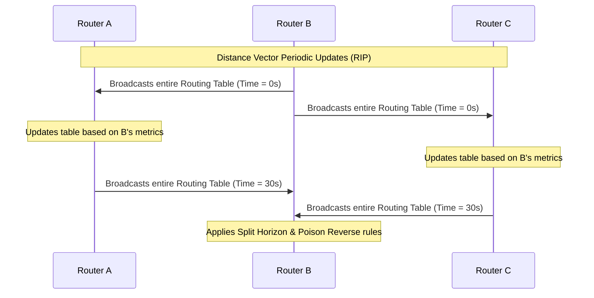
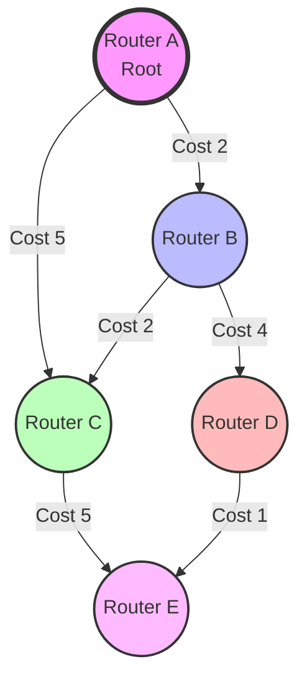
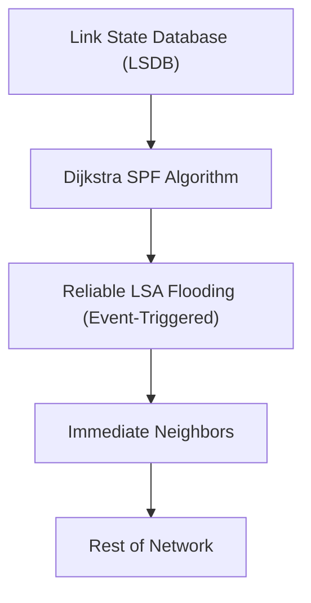
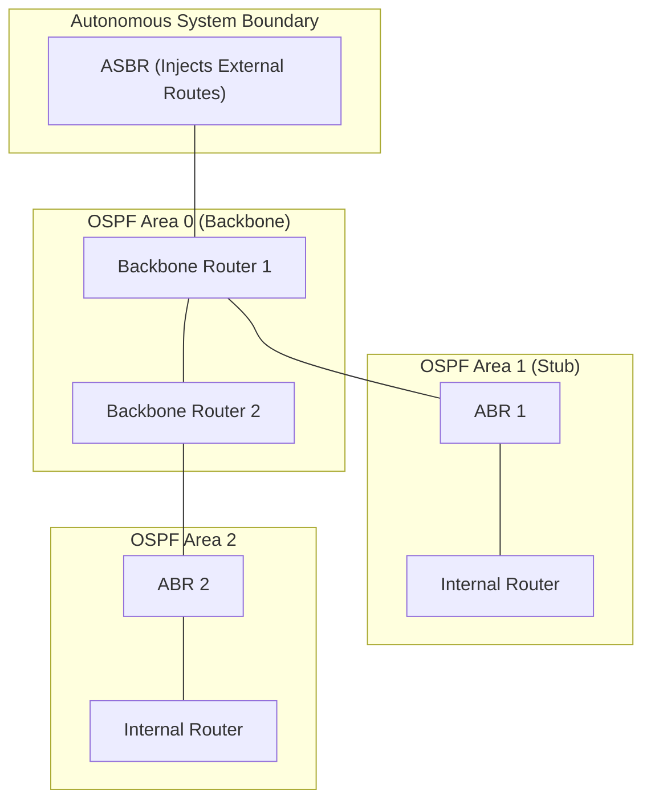
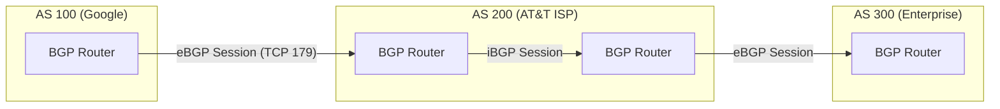
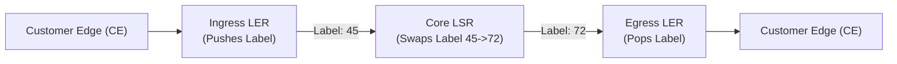

# Chapter 07: Routing Algorithms and Protocols

Welcome to the definitive and exhaustive guide to Routing Algorithms and Protocols. This chapter explores how data is intelligently guided across the intricate web of global networks, spanning from the simplest local gateways to the colossal backbone of the internet.

## BEGINNER SECTION: The Fundamentals of Routing

### What is Routing?
Routing is the fundamental process of selecting the most optimal, reliable, and efficient path for network traffic (packets) to travel across multiple interconnected networks. Without routing, packets would be confined to their local subnets, and the concept of a global Internet would be mathematically and physically impossible. 

When a host wants to send data to another host on a completely different network, the data must traverse a series of intermediary devices called **routers**. Routing is the intelligence that dictates the path these packets take, avoiding congestion, dead links, and loops.

### The Router's Job
A router is a specialized Layer 3 (Network Layer) networking device designed to interconnect disparate networks. Its primary job involves a sequence of highly optimized steps:
1. **Receive the Packet**: The router ingresses a frame on one of its interfaces, strips the Layer 2 (Data Link) header, and extracts the Layer 3 IP packet.
2. **Examine the Destination IP**: The router inspects the destination IP address in the IP header (e.g., IPv4 or IPv6).
3. **Look Up the Routing Table**: The router consults its internal Routing Table (or Forwarding Information Base) to find the best match for the destination network.
4. **Determine the Next Hop**: Based on the longest prefix match, the router identifies the exact egress (exit) interface and the IP address of the next router in the path.
5. **Forward the Packet**: The router encapsulates the IP packet into a new Layer 2 frame suitable for the outbound link and transmits it.

### The Routing Table
The routing table is the cognitive map of the router. It is a data structure that explicitly dictates: *"For destination network X, forward the packet to next-hop IP Y, via physical interface Z."*

A typical routing table entry contains:
- **Destination Network**: The target IP subnet (e.g., 192.168.2.0/24).
- **Subnet Mask / CIDR**: Defines the exact boundary of the network.
- **Next Hop**: The IP address of the adjacent router that leads to the destination.
- **Egress Interface**: The physical port on the router (e.g., GigabitEthernet0/1).
- **Metric**: The calculated cost to reach the destination (used to break ties).
- **Administrative Distance**: The trustworthiness of the route source.

### Analogy: GPS Navigation
To understand routing intuitively, consider the analogy of a GPS navigation system (like Google Maps) driving a car across a country:
- **The Global Map**: This represents the **Routing Table**, which knows about all the possible highways, streets, and intersections.
- **The Navigation Algorithm**: This is the **Routing Algorithm** (like Dijkstra's or Bellman-Ford). It calculates the fastest, shortest, or cheapest route avoiding traffic jams or road closures.
- **Turn-by-Turn Directions**: This is the **Forwarding** process. At every intersection (router), a specific decision is made (go left, go right) based on the immediate next step, not the entire journey.
- **Traffic Updates**: This represents **Dynamic Routing Protocol updates**, where routers inform each other about closed roads (failed links) or new highways (new routes).

### Static Routing vs. Dynamic Routing

Routing can be configured manually or learned automatically. The choice depends heavily on the size, scale, and requirements of the network.

#### Static Routing
Static routing involves a network administrator manually typing specific routes into the router's configuration.
- **Mechanism**: The administrator explicitly defines the destination network, mask, and next-hop IP.
- **Pros**:
  - Extremely simple to configure for tiny networks.
  - 100% predictable traffic flow.
  - Zero overhead: no CPU cycles or bandwidth are wasted on routing protocol chatter.
  - Highly secure, as no spoofed routing updates can be accepted.
- **Cons**:
  - Does not adapt to failures. If a link goes down, the route remains in the table, and traffic is blackholed.
  - Impossible to scale. Configuring static routes on 500 routers manually is an administrative nightmare.

#### Dynamic Routing
Dynamic routing utilizes mathematical algorithms and specialized protocols (like OSPF or EIGRP) allowing routers to automatically communicate and share network topologies.
- **Mechanism**: Routers dynamically discover neighbors, exchange routing tables or link states, and independently calculate the best paths.
- **Pros**:
  - Highly resilient: automatically detects link failures and reroutes traffic in milliseconds or seconds.
  - Highly scalable: adding a new subnet to a massive enterprise network requires minimal configuration; the protocol handles the propagation.
- **Cons**:
  - Complex to configure, design, and troubleshoot.
  - Consumes router CPU, memory, and link bandwidth to maintain the protocol adjacencies and exchange routing data.

#### When to use Static vs Dynamic Routing?
- **Use Static Routing** when you have a stub network (a network with only one way out), for small environments with 1-3 routers, or when absolute predictability and security are mandated.
- **Use Dynamic Routing** for large enterprise networks, ISP backbones, or environments with redundant links where automatic failover is critical.

### The Default Route (0.0.0.0/0)
A default route is the ultimate "catch-all" mechanism. In IPv4, it is denoted as `0.0.0.0/0` (and `::/0` in IPv6). 
- **Purpose**: A router cannot possibly know every single destination on the Internet (there are nearly a million global BGP routes). Instead of dropping packets destined for unknown networks, a router uses a default route.
- **Logic**: "If I look in my routing table and I do NOT have a specific match for this destination IP, I will forward the packet to the Default Route."
- **Usage**: In a typical home or small business network, the default route points to the ISP's gateway.

---

## INTERMEDIATE SECTION: Deep Dive into Routing Mechanics

### Control Plane vs Data Plane (Forwarding Plane)

Modern high-performance routing architectures strictly decouple the cognitive processes of a router from the physical movement of packets. This is known as the separation of the Control Plane and Data Plane.

#### 1. The Control Plane (The Brain)
- **Function**: Determines *WHERE* to forward packets. It is responsible for learning the network topology and constructing the routing table.
- **Execution**: Runs in software on the router's main CPU. Because it involves complex graph calculations (like Dijkstra's algorithm) and running routing protocols (OSPF, BGP, RIP, EIGRP), it is generally the "slower path."
- **Output**: Generates the complete **Routing Information Base (RIB)**. The RIB contains every route learned from every source, including alternate backup paths and routes that might not currently be active.

#### 2. The Data Plane / Forwarding Plane (The Muscles)
- **Function**: Actually *MOVES* the packets from an ingress interface to an egress interface.
- **Execution**: Runs in specialized hardware, specifically Application-Specific Integrated Circuits (ASICs) or specialized Network Processing Units (NPUs). This must happen at wire speed (millions or billions of packets per second).
- **Output**: Relies on the **Forwarding Information Base (FIB)**. The FIB is a highly optimized, stripped-down subset of the RIB. It is structured for rapid hardware lookups (often using Content-Addressable Memory or CAM/TCAM). The Data Plane does not "think"; it merely matches the packet IP against the FIB and forwards it blindly and instantaneously.

#### Software-Defined Networking (SDN) Introduction
SDN takes this separation to the extreme. In traditional networking, every router has its own Control Plane and Data Plane tightly coupled in the same chassis. SDN completely removes the Control Plane from the individual hardware routers and centralizes it in an external, highly intelligent **SDN Controller**. The routers become "dumb" forwarding switches (Data Plane only) that receive their FIBs directly from the central controller via protocols like OpenFlow.

### Distance Vector Routing (DVR)

Distance Vector Routing is one of the earliest and most fundamental categories of routing algorithms. It is based on the **Bellman-Ford algorithm**. 

#### The Concept
Each router maintains a vector (a one-dimensional array or table) of known distances (metrics/costs) to all other known networks. 
- **Routing by Rumor**: Routers do not know the full map of the network. They only know what their immediate, directly connected neighbors tell them. If Router B tells Router A, "I can reach Network Z in 3 hops," Router A implicitly trusts Router B and records, "I can reach Network Z via Router B in 4 hops."

#### How Distance Vector Works
1. **Initialization**: When booted, a router only knows about its directly connected networks (distance = 0).
2. **Periodic Updates**: On a strict timer (e.g., every 30 seconds for RIP), every router transmits its *entire routing table* out of all active interfaces to its direct neighbors.
3. **Table Update**: When a neighbor receives this table, it adds the cost of the link over which the update arrived to the advertised metrics. If the new route is better (lower cost) or previously unknown, the router updates its own table.
4. **Convergence**: This cycle repeats until all routers in the domain have consistent, stable tables.

#### The Bellman-Ford Update Equation
The mathematical foundation of DVR is defined by the Bellman-Ford equation:
`D(x,y) = min over all neighbors v of [ c(x,v) + D(v,y) ]`

Where:
- `D(x,y)` = The total calculated distance from router `x` to destination `y`.
- `c(x,v)` = The cost of the direct physical link from router `x` to neighbor `v`.
- `D(v,y)` = The neighbor `v`'s currently known distance to destination `y`.

*The router `x` calculates this for every neighbor `v` and chooses the neighbor that yields the minimum total distance.*

#### Bellman-Ford Worked Example
Imagine a simple network: Router X connects to Router Y (cost 2) and Router Z (cost 5). 
Router Y connects to Destination D (cost 8).
Router Z connects to Destination D (cost 3).

Router X wants to find the best path to D:
Path 1 via Y: `c(X,Y) + D(Y,D) = 2 + 8 = 10`
Path 2 via Z: `c(X,Z) + D(Z,D) = 5 + 3 = 8`
Result: `min(10, 8) = 8`. Router X installs the route to D via Router Z with a total metric of 8.

#### DVR Problems: Count-to-Infinity
The fatal flaw of primitive distance vector routing is the **Count-to-Infinity** problem, leading to massive routing loops.

**Walkthrough of the Problem:**
1. Consider topology: `A --- B --- C`. 
2. A knows route to C via B (cost 2). B knows route to C directly (cost 1).
3. The link between B and C suddenly fails.
4. B updates its table: "C is unreachable."
5. However, before B can tell A about the failure, A sends its periodic update to B.
6. A's update says: "Hey B, I know a path to C with a cost of 2!"
7. B thinks: "Wow, A has a backup path to C! Since I am connected to A (cost 1), I can reach C via A with a cost of 2 + 1 = 3." B installs this fake route.
8. B tells A: "I can reach C with cost 3." A updates its cost to C to 3 + 1 = 4.
9. They continuously bounce updates back and forth, counting up (5, 6, 7...) until the metric reaches "infinity" (e.g., 16 hops in RIP). The packet loops endlessly between A and B until its TTL expires.

#### Solutions to Count-to-Infinity
To mitigate this, modern DVR protocols implement several safeguards:
- **Split Horizon**: A router will *never* advertise a route back out the same interface it originally learned it from. (A won't tell B about C, because A learned about C from B).
- **Poison Reverse**: An extension of Split Horizon. Instead of staying silent, the router explicitly advertises the route back out the incoming interface, but with an infinite metric (unreachable). This immediately kills any chance of the neighbor trying to use the route.
- **Hold-down Timers**: When a route goes down, the router refuses to accept any new, higher-cost routes to that destination for a set period (e.g., 180 seconds). This allows time for the network to realize the route is truly dead, preventing loops.
- **Triggered Updates**: Instead of waiting for the 30-second periodic timer, a router immediately sends out an emergency update the millisecond a link state changes.

#### DVR Characteristics Summary
- **Convergence Time**: Very slow (relies on periodic timers).
- **Bandwidth Consumption**: High. Entire routing tables are broadcasted periodically, even if the network topology hasn't changed for weeks.
- **Scalability**: Works well only for small to medium networks (maximum 15 hops for RIP).

---

### Link State Routing (LSR)

Link State Routing solves the limitations of Distance Vector by providing every router with a perfect, God's-eye view of the entire network topology. It uses **Dijkstra's Shortest Path First (SPF) algorithm**.

#### The Concept
- **Routing by Map**: Instead of sharing routing tables, routers share **Link State Advertisements (LSAs)**. An LSA simply says, "I am Router X. I am connected to Router Y (cost 10) and Router Z (cost 20)."
- By collecting LSAs from *every* router in the network, each router independently builds a complete mathematical graph of the network, known as the **Link State Database (LSDB)**.

#### How Link State Works (Step-by-Step)
1. **Neighbor Discovery**: Routers send small "Hello" packets out of their interfaces to discover directly connected neighbors and establish adjacencies.
2. **LSA Creation**: Each router constructs an LSA detailing its physical interfaces, IP addresses, and link costs (based on bandwidth).
3. **Reliable Flooding**: The router floods its LSA to all neighbors. Crucially, neighbors copy the LSA and flood it to *their* neighbors. This ensures every single router in the entire area receives a copy of every LSA.
4. **LSDB Construction**: Every router compiles the received LSAs into an identical, synchronized Link State Database (LSDB) representing the full topology.
5. **SPF Calculation**: Every router runs Dijkstra's algorithm against its own LSDB. The router places *itself* at the root of a mathematical tree and calculates the shortest path to every other node, ensuring absolute loop-free paths.
6. **Routing Table Generation**: The resulting Shortest Path Tree is used to generate the optimal routes, which are then injected into the Routing Table (RIB).

#### Dijkstra's Algorithm Walkthrough (Worked Example)
Let's trace Dijkstra's algorithm on a 5-node graph:
Nodes: `A, B, C, D, E`
Links and Costs: `(A-B: 2), (A-C: 5), (B-C: 2), (B-D: 4), (C-E: 5), (D-E: 1)`

*Goal: Find shortest path from Root A to all other nodes.*

- **Initialization**: 
  - Visited Set: `[]`
  - Unvisited Set: `[A, B, C, D, E]`
  - Distances from A: `A=0, B=inf, C=inf, D=inf, E=inf`
- **Step 1**: Current node = A (smallest distance 0).
  - Neighbors of A are B and C.
  - Path to B via A = 0 + 2 = 2. (2 < inf). Update B = 2.
  - Path to C via A = 0 + 5 = 5. (5 < inf). Update C = 5.
  - Mark A as visited. Visited: `[A]`
- **Step 2**: Current node = B (smallest unvisited distance, 2).
  - Neighbors of B are C and D.
  - Path to C via B = 2 + 2 = 4. (4 < 5). Update C = 4! (Found a better path).
  - Path to D via B = 2 + 4 = 6. (6 < inf). Update D = 6.
  - Mark B as visited. Visited: `[A, B]`
- **Step 3**: Current node = C (smallest unvisited distance, 4).
  - Neighbor of C is E.
  - Path to E via C = 4 + 5 = 9. Update E = 9.
  - Mark C as visited. Visited: `[A, B, C]`
- **Step 4**: Current node = D (smallest unvisited distance, 6).
  - Neighbor of D is E.
  - Path to E via D = 6 + 1 = 7. (7 < 9). Update E = 7!
  - Mark D as visited. Visited: `[A, B, C, D]`
- **Step 5**: Current node = E (distance 7). No unvisited neighbors. Mark E visited.

**Final Shortest Path Tree from A**:
- A -> B (Cost 2)
- A -> B -> C (Cost 4)
- A -> B -> D (Cost 6)
- A -> B -> D -> E (Cost 7)

#### Advantages of Link State over DVR
- **Extremely Fast Convergence**: Uses event-triggered updates. The moment a link fails, an LSA is immediately flooded, and the SPF algorithm instantly recalculates.
- **Loop-Free Guarantee**: Because every router has the full topology map, the count-to-infinity problem is mathematically impossible.
- **Bandwidth Efficiency**: Unlike DVR, LSR protocols do not periodically broadcast full routing tables. Once the network is stable, they only send tiny "Hello" keepalives. Full LSAs are only sent when a topology change occurs.

#### Disadvantages of Link State
- **High Memory Requirements**: The router must store the entire LSDB, which can be massive in large networks.
- **High CPU Utilization**: Dijkstra's algorithm is computationally heavy. Every time a link flaps (goes up and down), the router CPU spikes as it recalculates the entire tree.
- **Flooding Storms**: In highly unstable networks, constant LSA flooding can saturate link bandwidth.

---

### DVR vs LSR Comparison Table

| Feature | Distance Vector Routing (DVR) | Link State Routing (LSR) |
|---|---|---|
| **Algorithm** | Bellman-Ford | Dijkstra SPF |
| **Knowledge** | Neighbors only | Full topology |
| **Updates** | Periodic, full table | Event-triggered, incremental |
| **Convergence** | Slow | Fast |
| **Bandwidth** | Higher (full tables periodic) | Lower (only changes) |
| **Memory** | Lower | Higher (LSDB) |
| **CPU** | Lower | Higher (SPF calculation) |
| **Loop Prevention** | Split horizon, poison reverse | SPF ensures loop-free |
| **Scalability** | Small/medium networks | Large networks |
| **Example Protocols**| RIP, EIGRP | OSPF, IS-IS |

---

## ADVANCED SECTION: Major Routing Protocols & Security

### Major Routing Protocols Detailed

#### 1. RIP (Routing Information Protocol)
RIP is the oldest, most rudimentary distance vector protocol.
- **Versions**: RIPv1 (legacy, classful, no subnet mask support) and RIPv2 (classless, supports VLSM - Variable Length Subnet Masking).
- **Metric**: Pure Hop Count. The path with the fewest routers is chosen, regardless of bandwidth (a 10 Mbps link is treated the same as a 10 Gbps link).
- **Limitations**: Maximum hop count is 15. A hop count of 16 is considered "infinity" (unreachable). This severely limits the maximum diameter of the network.
- **Timers**:
  - Update Timer: 30 seconds (sends full table).
  - Invalid Timer: 180 seconds without an update implies a route is dead.
  - Flush Timer: 240 seconds implies the route is completely removed from the table.
- **Transport**: Operates over UDP Port 520.

#### 2. EIGRP (Enhanced Interior Gateway Routing Protocol)
Originally Cisco-proprietary, EIGRP is a highly advanced "Hybrid" protocol that merges the best of distance vector and link state.
- **Mechanism**: It operates primarily as an advanced distance vector protocol, but it forms neighbor adjacencies and only sends incremental updates like a link state protocol.
- **The Brain (DUAL)**: Uses the Diffusing Update Algorithm (DUAL) which mathematically guarantees loop-free paths at every instant without needing a full topology map.
- **Composite Metric**: EIGRP uses an advanced formula instead of hop count.
  - `Metric = 256 * [ (K1 * Bandwidth) + (K3 * Delay) / (Reliability or Load) ]`
  - By default, only K1 (Bandwidth) and K3 (Delay) are used.
- **Tables Maintained**: EIGRP maintains three distinct tables:
  1. Neighbor Table: Tracks adjacent routers.
  2. Topology Table: Stores all paths learned from neighbors.
  3. Routing Table: Stores the absolute best paths.
- **Instant Convergence**: EIGRP calculates a **Successor** (the best primary path) and a **Feasible Successor** (a pre-calculated, guaranteed loop-free backup path). If the Successor fails, the Feasible Successor is injected into the routing table instantly, resulting in zero-reconvergence time.
- **Transport**: Operates natively on IP Protocol number 88.

#### 3. OSPF (Open Shortest Path First)
OSPF is the undisputed king of enterprise internal routing. It is an open-standard Link State protocol (RFC 2328 for OSPFv2, RFC 5340 for OSPFv3/IPv6).
- **Metric**: Uses "Cost", which is inversely proportional to bandwidth. 
  - Formula: `Cost = Reference Bandwidth / Interface Bandwidth`
  - Default Reference Bandwidth is 100 Mbps. Therefore, FastEthernet (100 Mbps) has a cost of 1. Ethernet (10 Mbps) has a cost of 10. A legacy T1 line (1.544 Mbps) has a cost of 64.
- **Hierarchical Area Design**: To solve the memory and CPU problems of LSR, OSPF divides massive networks into "Areas".
  - **Area 0 (Backbone Area)**: The core. All other areas MUST physically connect to Area 0.
  - **ABR (Area Border Router)**: A router that sits between Area 0 and another area, summarizing routes to reduce LSDB size.
  - **ASBR (Autonomous System Boundary Router)**: Connects OSPF to an entirely different routing domain (like BGP or EIGRP).
  - **Benefit**: SPF calculations are contained entirely within a local Area. A link flapping in Area 1 does not cause routers in Area 2 to run the CPU-intensive Dijkstra algorithm.

- **Broadcast Network Optimization**: In a LAN with dozens of routers (e.g., connected via a switch), a full mesh of adjacencies would cause an LSA flooding nightmare. OSPF solves this by electing a **Designated Router (DR)** and a **Backup Designated Router (BDR)**. All other routers (DROthers) only form adjacencies with the DR and BDR, dramatically reducing network traffic.
- **OSPF State Machine**: Forming an adjacency follows strict states: `Down -> Init -> 2-Way -> Exstart -> Exchange -> Loading -> Full`.
- **LSA Types**: Type 1 (Router), Type 2 (Network), Type 3 (Summary), Type 4 (ASBR Summary), Type 5 (External).
- **Transport**: Native IP Protocol number 89.

#### 4. BGP (Border Gateway Protocol)
If OSPF is the king of the enterprise, BGP is the emperor of the Internet. It is a **Path Vector** protocol designed specifically to route traffic *between* different organizations, ISPs, and nations.
- **Autonomous Systems (AS)**: The internet is not a mesh of single routers; it is a web of Autonomous Systems (AS). An AS is a massive network under a single administrative control (e.g., AT&T, Google, AWS). Each AS is assigned an AS Number (ASN).
  - AS numbers are 16-bit (1-65535, with private range 64512-65535) or 32-bit.
- **eBGP vs iBGP**:
  - **eBGP (External BGP)**: Runs between different Autonomous Systems.
  - **iBGP (Internal BGP)**: Runs between routers inside the *same* Autonomous System to distribute externally learned routes. Requires a full mesh or route reflectors to prevent routing loops.
- **Path Attributes**: BGP does not use a simple metric like cost or hop count. It uses an incredibly complex set of policies and attributes to select the best path, enforcing business and economic rules over raw speed.
  - **Weight** (Cisco proprietary): Highest weight wins. Local to the router.
  - **Local Preference**: Highest wins. Tells the entire AS how to exit to the internet.
  - **AS-PATH**: A list of ASNs the route has traversed. Shorter is better. Also serves as BGP's primary loop-prevention mechanism (if a router sees its own ASN in the AS-PATH, it drops the route).
  - **MED (Multi-Exit Discriminator)**: Lowest wins. Tells an external neighbor how to enter your AS.
  - **Origin**: IGP > EGP > Incomplete.
- **Transport**: BGP requires absolute reliability, so it operates over TCP Port 179.
- **Convergence**: BGP is intentionally extremely slow to converge, prioritizing global internet stability over rapid failover.

### Administrative Distance (AD)
When a router learns about the exact same destination network from two different sources (e.g., it learns a route via OSPF, and also via EIGRP), it uses **Administrative Distance (AD)** to decide. AD evaluates the absolute trustworthiness of a protocol. Lower AD values indicate higher preference.

| Route Source | Administrative Distance |
|---|---|
| Directly Connected | 0 |
| Static Route | 1 |
| eBGP | 20 |
| EIGRP | 90 |
| OSPF | 110 |
| IS-IS | 115 |
| RIP | 120 |
| iBGP | 200 |
| Unknown/Unreachable | 255 |

---

### Routing Protocol Comparison Table

| Feature | RIP | EIGRP | OSPF | BGP |
|---|---|---|---|---|
| **Type** | Distance Vector | Hybrid (Adv. Distance Vector) | Link State | Path Vector |
| **Metric** | Hop Count (Max 15) | Bandwidth & Delay | Cost (BW Based) | Path Attributes (AS-Path, etc.) |
| **Algorithm** | Bellman-Ford | DUAL | Dijkstra SPF | BGP Best Path |
| **Convergence** | Very Slow | Extremely Fast | Fast | Very Slow |
| **Transport Protocol**| UDP 520 | IP 88 | IP 89 | TCP 179 |

---

### MPLS (Multiprotocol Label Switching)
As internet traffic exploded, traditional IP routing table lookups became a massive CPU bottleneck. MPLS was invented as a "Layer 2.5" architecture to solve this.

#### How MPLS Works
MPLS accelerates packet forwarding by appending short 32-bit labels to packets, bypassing complex Layer 3 IP routing table lookups.
- **Label Structure**: 20-bit label + 3-bit EXP (experimental/QoS) + 1-bit Bottom of Stack (BoS) + 8-bit TTL.
- **Ingress LER (Label Edge Router)**: Receives the IP packet, looks up the destination in its routing table, pushes a label onto the packet, and sends it into the MPLS core.
- **Core LSR (Label Switched Router)**: Forwards the packet solely based on the incoming label. It swaps the label for an outgoing label and forwards it instantly without analyzing the IP header.
- **Egress LER**: Pops (removes) the label entirely, delivering the original IP packet to the destination.

#### Advantages of MPLS
- **Speed**: Faster than IP lookup as label lookup is a much simpler operation.
- **Traffic Engineering**: ISPs can force traffic down specific arbitrary paths for load balancing and performance tuning.
- **VPN Services**: Label stacking enables multi-tenant Layer 3 VPN services, tunneling private networks across the same physical internet backbone securely.

### Segment Routing (SR)
Segment Routing is the modern, highly scalable evolution of MPLS and source routing.
- **Mechanism**: Instead of relying on complex signaling protocols across the core, SR encodes the entire path as a stack of labels (segments) directly at the source node.
- **SR-MPLS**: Uses traditional MPLS labels for the segments.
- **SRv6**: Eliminates MPLS entirely. It uses IPv6 Extension Headers (Segment Routing Header - SRH), embedding IPv6 addresses directly as the Segment IDs.
- **Benefits**: Radically simplifies the core network by removing stateful RSVP signaling. The source node controls the path directly, empowering greater traffic engineering.

---

### Security Attacks on Routing

Because routing protocols traditionally prioritize availability and failover over security, they are highly vulnerable to exploitation.

#### 1. BGP Hijacking
- **Mechanism**: An attacker or misconfigured Autonomous System (AS) advertises a false, highly specific BGP prefix (IP space) that belongs to someone else. Since routers prefer specific routes, global traffic destined for those IPs is redirected to the attacker.
- **Historical Example**: In 2008, Pakistan Telecom accidentally blackholed YouTube globally by advertising a specific `/24` route to YouTube's subnets.
- **Defense**: RPKI (Resource Public Key Infrastructure) allows cryptographically validating route origins. Network administrators also enforce strict BGP route filtering.

#### 2. OSPF Poisoning (Rogue LSA Injection)
- **Mechanism**: An attacker compromises an internal server and runs routing software (e.g., Quagga/FRR) to form an adjacency. They inject false LSAs into the OSPF domain, advertising fake shortest paths to critical subnets. Traffic is redirected through the attacker-controlled router, enabling Man-in-the-Middle or DoS attacks.
- **Defense**: Enforce OSPF authentication (MD5 or SHA-HMAC) across all interfaces to ensure untrusted rogue devices cannot form adjacencies.

#### 3. RIP Attacks
- **Mechanism**: RIPv1 has no authentication. An attacker can use simple packet injection to flood fake UDP port 520 packets filled with spoofed routes, advertising a "1 hop" metric to all essential internal networks.
- **Defense**: Deprecate RIP entirely or upgrade to RIPv2 with strong authentication.

#### 4. Route Injection & Path Attribute Manipulation
- **Mechanism**: Modifying BGP path attributes (such as shortening the AS-PATH or modifying Local Preference values) allows attackers to influence the inbound and outbound routing paths maliciously without strictly hijacking the prefix.

---

## Exam Tips & Common Traps
> [!IMPORTANT]
> - **Trap**: Believing distance vector protocols lack loop prevention entirely. **Correction**: While inherently vulnerable to the count-to-infinity loop, DVR employs Split Horizon and Poison Reverse to mitigate it.
> - **Trap**: Thinking OSPF uses TCP or UDP for transport. **Correction**: OSPF uses native IP (Protocol 89) and handles its own packet acknowledgment.
> - **Exam Tip**: When asked to compare OSPF and RIP, remember that RIP uses pure Hop Count (bandwidth is ignored), while OSPF uses Cost (inversely proportional to bandwidth).
> - **Exam Tip**: If an exam scenario shows a router receiving routes for the same subnet from OSPF and EIGRP, it will *always* choose EIGRP. EIGRP's Administrative Distance (90) beats OSPF's (110).

## Key Terms Glossary
- **RIB (Routing Information Base)**: The master routing table built by the control plane containing all candidate routes.
- **FIB (Forwarding Information Base)**: The hardware-optimized table used by the data plane to physically switch packets.
- **Convergence**: The time it takes for all routers in a network to synchronize their tables after a topology change.
- **Autonomous System (AS)**: A collection of connected IP routing networks under the control of a single administrative entity.
- **Administrative Distance (AD)**: A metric measuring the absolute trustworthiness of a routing protocol source.
- **Count-to-Infinity**: A severe routing loop phenomenon in distance vector routing where metrics falsely increment indefinitely.
- **LSA (Link State Advertisement)**: The fundamental packet in OSPF detailing neighbors and link costs, used to populate the LSDB.
- **Split Horizon**: A crucial loop prevention mechanism dictating that a router should not advertise a route back out the interface it learned it from.
