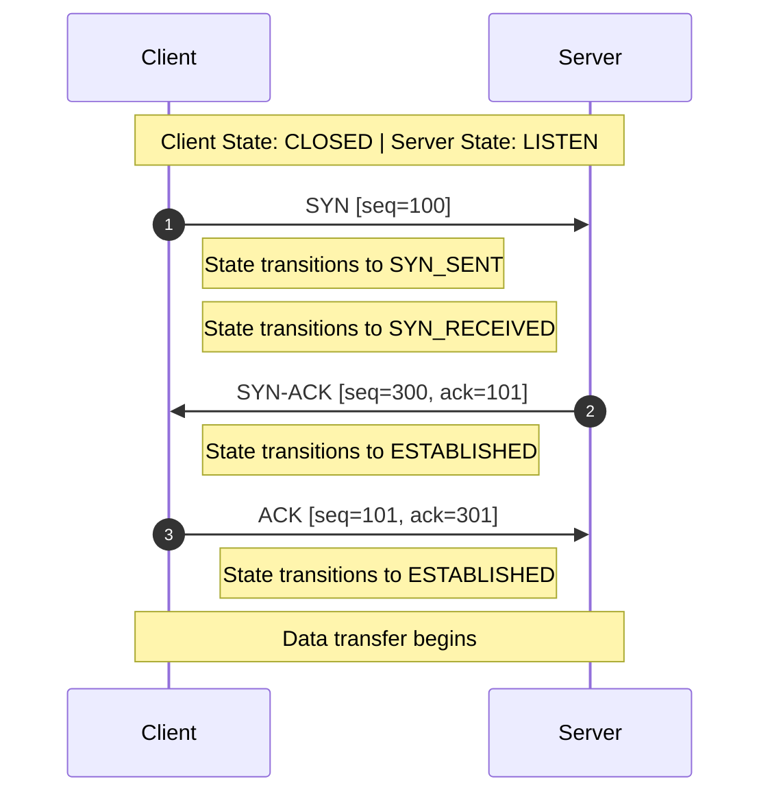
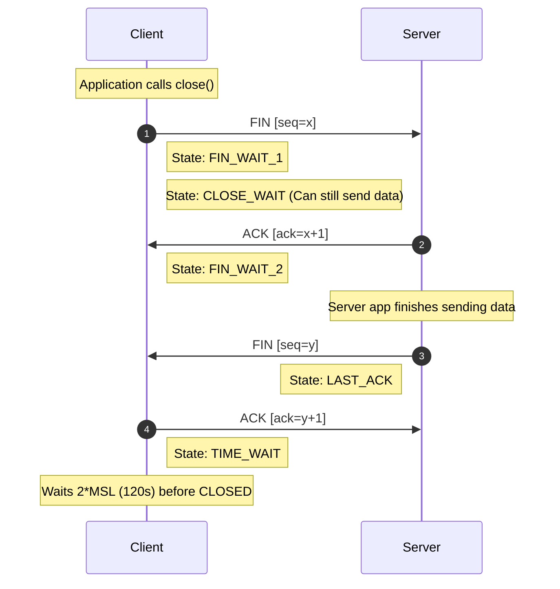
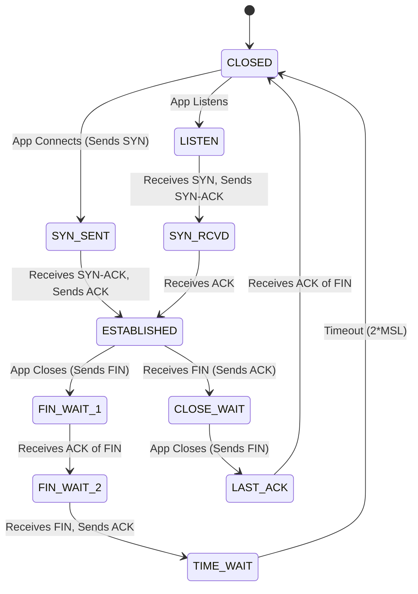
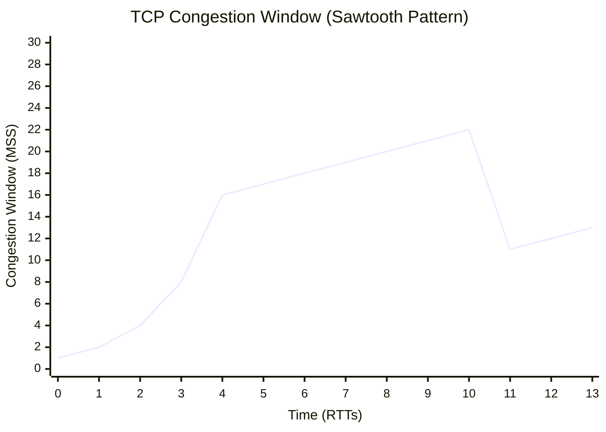

# Chapter 08: Transport Layer - TCP and UDP

## BEGINNER SECTION: Foundations of the Transport Layer

### 1. What the Transport Layer Does
The Transport Layer (Layer 4 of the OSI model) is fundamentally responsible for process-to-process delivery. While the Network Layer (Layer 3, IP) ensures that data is routed from one host to another across global networks, the Transport Layer takes that data and ensures it reaches the *right application* running on the destination device.

**Real-World Analogy: The Apartment Building**
- **Network Layer**: Delivering a letter to the correct building address (the IP address). The postal service gets the letter to the lobby of a massive apartment complex.
- **Transport Layer**: Delivering the letter to the specific apartment number (the Port number) inside that building. Without the apartment number, the mailroom would not know which resident (application) should receive the letter.

### 2. Port Numbers and Addressing Space
To differentiate between the dozens of applications running simultaneously on a computer (e.g., a web browser, an email client, a background update service), the Transport Layer uses 16-bit identifiers called **Port Numbers**. 
Because they are 16-bit values, the total available range is $0$ to $65535$ ($2^{16} - 1$).

#### Port Number Classifications
| Range | Classification | Description |
|---|---|---|
| **0 - 1023** | Well-known ports | Reserved for standard system services and core protocols. Managed strictly by IANA. |
| **1024 - 49151** | Registered ports | Registered by vendors for specific proprietary applications or alternate services. |
| **49152 - 65535** | Ephemeral (Dynamic) ports | Temporary ports assigned automatically by the client OS when initiating outbound connections. |

#### Essential Well-Known Port Reference Table
| Port Number | Protocol | Application / Service |
|---|---|---|
| 20 | TCP | FTP (File Transfer Protocol) - Data transfer |
| 21 | TCP | FTP (File Transfer Protocol) - Command control |
| 22 | TCP | SSH (Secure Shell) |
| 23 | TCP | Telnet |
| 25 | TCP | SMTP (Simple Mail Transfer Protocol) |
| 53 | TCP/UDP | DNS (Domain Name System) |
| 67 / 68 | UDP | DHCP (Dynamic Host Configuration Protocol) Server / Client |
| 80 | TCP | HTTP (Hypertext Transfer Protocol) |
| 110 | TCP | POP3 (Post Office Protocol version 3) |
| 143 | TCP | IMAP (Internet Message Access Protocol) |
| 443 | TCP | HTTPS (HTTP Secure) |
| 445 | TCP | SMB (Server Message Block) |
| 3389 | TCP | RDP (Remote Desktop Protocol) |

*Registered Ports Examples:* 3306 (MySQL), 5432 (PostgreSQL), 8080 (HTTP Alternate), 8443 (HTTPS Alternate).

### 3. The Concept of Sockets
A **Socket** is the combination of an IP address and a port number. It uniquely identifies a specific process running on a specific device anywhere in the world.
- **Format**: `IP_Address:Port_Number`
- **Example**: `192.168.1.5:8080` represents a service running on port 8080 on the machine with IP `192.168.1.5`.

When two devices communicate, they form a connection. A TCP connection is uniquely identified across the network by a **4-tuple**:
`(Source IP, Source Port, Destination IP, Destination Port)`

This 4-tuple allows a server listening on a single port (like Port 443) to maintain millions of concurrent, unique connections from different clients.

### 4. TCP vs. UDP in Everyday Language
The Transport Layer offers two primary protocols, which operate with entirely different philosophies.

**TCP (Transmission Control Protocol): The Phone Call**
- **Analogy**: Making a phone call. You dial the number, wait for the other person to pick up ("Hello?"), establish the connection, and then converse. You confirm they hear you ("Are you still there?"), and you speak sequentially. It is reliable, ordered, and guaranteed.

**UDP (User Datagram Protocol): The Postcard**
- **Analogy**: Sending a postcard. You write the destination address, drop it in the mailbox, and walk away. You have no idea if it arrived, if it arrived in the right order relative to other postcards, or if the postman dropped it in a puddle. It is fire-and-forget.

---

## INTERMEDIATE SECTION: Protocol Mechanics and Architecture

### 1. Multiplexing and Demultiplexing
Because a single computer only has one physical network connection (one IP address) but runs many networked applications simultaneously, it must combine and separate traffic.

- **Multiplexing (At Sender)**: Gathering data from multiple applications (e.g., a browser on port 443, an email client on port 143, a game on port 27015), encapsulating each chunk with the respective source port, and passing it down to the Network Layer to be sent over the single IP connection.
- **Demultiplexing (At Receiver)**: Receiving raw IP packets, examining the Transport Layer destination port, and delivering the payload strictly to the application bound to that port.
  - **TCP Demultiplexing**: Uses the full 4-tuple `(Src IP, Src Port, Dst IP, Dst Port)`. Every individual connection gets its own dedicated socket space.
  - **UDP Demultiplexing**: Uses only a 2-tuple `(Dst IP, Dst Port)`. All incoming UDP packets directed to port 53 will go to the same DNS process, regardless of who sent them.

### 2. UDP (User Datagram Protocol) Deep Dive
**Design Philosophy**: Minimal, fast, and no-frills.

#### Characteristics
- **Connectionless**: No handshake required. Data is transmitted immediately.
- **Unreliable**: No guarantees of delivery, no ordering mechanisms, and no duplicate prevention.
- **Stateless**: No flow control or congestion control. If the network is congested, UDP keeps transmitting at the application's native speed.

#### UDP Header Structure (8 Bytes)
UDP's extreme speed comes from its incredibly small overhead—a fixed 8-byte header.

```text
 0                   16                  31 bits
+-------------------+-------------------+
|    Source Port    | Destination Port  | 
+-------------------+-------------------+
|      Length       |     Checksum      | 
+-------------------+-------------------+
|               Payload Data            |
+---------------------------------------+
```
- **Source Port (2 bytes)**: The sender's port. (Optional, can be set to 0 if no reply is expected).
- **Destination Port (2 bytes)**: The receiver's application port.
- **Length (2 bytes)**: Total length of the UDP segment (Header + Data). Minimum value is 8.
- **Checksum (2 bytes)**: Error detection over the header and data. Optional in IPv4, but mandatory in IPv6.

#### When to Use UDP
UDP is preferred when speed and low latency are prioritized over guaranteed delivery.
- **Real-Time Applications (VoIP, Video Conferencing)**: A dropped video frame is acceptable; a delayed frame causes severe stuttering.
- **Online Gaming**: Character position updates are time-sensitive. Old, retransmitted data is useless.
- **DNS Queries**: Small, single-packet requests. If lost, the client simply retries after a short timeout.
- **DHCP**: Operates via broadcast on a new network before an IP is even assigned.
- **Multicasting/Broadcasting**: TCP requires a point-to-point connection (unicast only). UDP supports sending to multiple recipients simultaneously.
- **IoT Sensors**: Simple temperature probes sending telemetry need low overhead.
*(Note: Modern protocols like QUIC (HTTP/3) are built on top of UDP, implementing their own reliability mechanisms in user-space to bypass TCP's rigid OS-level handshakes).*

### 3. TCP (Transmission Control Protocol) Deep Dive
**Design Philosophy**: Reliability above all else.

#### Characteristics
- **Connection-Oriented**: A strict 3-way handshake must complete before data transfer begins.
- **Reliable**: Guarantees ordered, complete, and error-free delivery using sequence numbers and acknowledgments.
- **Stateful**: Maintains continuous track of network congestion, buffer limits, and data receipt.

#### TCP Header Structure (20-60 Bytes)
TCP's reliability requires a significantly more complex header, with a minimum size of 20 bytes.

```text
 0                   16                  31 bits
+-------------------+-------------------+
|    Source Port    | Destination Port  | (4 Bytes)
+-------------------+-------------------+
|           Sequence Number             | (4 Bytes)
+---------------------------------------+
|        Acknowledgment Number          | (4 Bytes)
+-------+-------+---+-------------------+
|Offset |Reservd|Flg|    Window Size    | (4 Bytes)
+-------+-------+---+-------------------+
|     Checksum      |  Urgent Pointer   | (4 Bytes)
+-------------------+-------------------+
|        Options (0 - 40 Bytes)         |
+---------------------------------------+
```

- **Source / Destination Port (16 bits each)**: Application identifiers.
- **Sequence Number (32 bits)**: The byte-stream number of the *first* byte in this segment's data. 
  - **ISN (Initial Sequence Number)**: Chosen randomly during the handshake to prevent session hijacking and sequence prediction attacks.
- **Acknowledgment Number (32 bits)**: The next byte the receiver EXPECTS to receive (Cumulative ACK). 
  - *Example*: If the sender transmitted bytes 0-999, the receiver sends an ACK number of 1000.
- **Header Length / Data Offset (4 bits)**: Indicates the size of the TCP header in 32-bit (4-byte) words. Minimum is 5 ($5 \times 4 = 20$ bytes), maximum is 15 ($15 \times 4 = 60$ bytes).
- **Reserved (6 bits)**: Set to zero for future use.
- **Control Flags (6 bits)**: Core binary switches defining the segment's purpose:
  - **URG**: Urgent pointer field is valid.
  - **ACK**: Acknowledgment field is valid.
  - **PSH**: Push data immediately to the application layer (bypass buffers).
  - **RST**: Reset the connection abruptly due to an error.
  - **SYN**: Synchronize sequence numbers (Handshake).
  - **FIN**: Gracefully terminate the connection.
- **Window Size (16 bits)**: Receive window (rwnd)—advertises how many more bytes the receiver's buffer can accept. Critical for flow control.
- **Checksum (16 bits)**: Mandatory error detection covering the TCP header, payload, and a pseudo-header (Source/Dest IP and Protocol from Layer 3).
- **Urgent Pointer (16 bits)**: Offset indicating where urgent data ends.
- **Options (0-40 bytes)**: Used for MSS (Maximum Segment Size) negotiation, SACK (Selective ACKs), Window Scaling, and Timestamps.

### 4. The TCP Connection Lifecycle

#### 4.1 The 3-Way Handshake (Connection Establishment)
The handshake ensures both sides are ready to communicate, synchronizes their random ISNs, and negotiates parameters like MSS.



**Why 3 Steps?** Both parties must propose their own ISN and verify that the other side received it. A 2-way handshake would leave the server unsure if the client actually received the server's ISN.

#### 4.2 The 4-Way Teardown (Connection Termination)
TCP allows a "half-close," meaning one side can finish sending data but continue receiving data until the other side also closes.



**The TIME_WAIT State**:
After sending the final ACK, the client enters `TIME_WAIT` for 2*MSL (Maximum Segment Lifetime), usually 120 seconds. This is critical because:
1. If the final ACK is lost, the server will retransmit its FIN. The client must be around to ACK it again.
2. It prevents delayed, wandering packets from this connection from accidentally injecting themselves into a brand-new connection that happens to reuse the same 4-tuple.

#### 4.3 Full TCP State Machine


---

## ADVANCED SECTION: Flow Control, Congestion, and Security

### 1. TCP Flow Control
**The Problem**: A high-speed sender can easily overwhelm a slow receiver, causing the receiver's OS buffer to fill up. Once full, the receiver drops incoming packets, forcing wasteful retransmissions.
**The Solution**: Sliding Window Flow Control.

In every ACK sent, the receiver advertises its **Receive Window (rwnd)** in the 16-bit Window Size header field. 
`rwnd = Total Buffer Size - Unread Data`
The sender is strictly forbidden from having more than `rwnd` unacknowledged bytes in transit.

#### Zero Window and Deadlock
If the receiver's application is frozen and doesn't read data, the buffer fills up, and `rwnd` hits 0. The sender stops transmitting entirely.
To prevent a deadlock (where the receiver later sends a window update packet that gets lost in transit), the sender periodically sends **Zero Window Probes** (1-byte segments). The receiver ACKs the probe with its current window size.

#### Silly Window Syndrome
Occurs when data is sent in highly inefficient, tiny increments (e.g., 1 byte of payload attached to 40 bytes of TCP/IP header).
- **Sender-Side Solution (Nagle's Algorithm)**: The sender buffers small data chunks until it has accumulated a full MSS (Maximum Segment Size) OR until all previously sent data has been ACKed.
- **Receiver-Side Solution (Clark's Solution)**: The receiver artificially advertises a Zero Window until its buffer has freed up enough space to accept either a full MSS or half of its total buffer capacity.

### 2. TCP Congestion Control
While flow control protects the *receiver*, congestion control protects the *entire network infrastructure* (routers and links).
TCP infers network congestion dynamically based on packet loss (either via timeout or duplicate ACKs). The sender maintains a **Congestion Window (cwnd)**.
The actual transmission rate is determined by: `Send Limit = min(cwnd, rwnd)`.

The engine operates around a threshold called **ssthresh** (Slow Start Threshold).

#### Phase 1: Slow Start
- **Start**: `cwnd = 1 MSS` (Highly conservative).
- **Growth**: For every ACK received, `cwnd` increases by 1 MSS.
- **Effect**: Since a window of size $N$ generates $N$ ACKs, `cwnd` essentially **doubles** every Round Trip Time (RTT). It is an exponential growth phase ($1, 2, 4, 8, 16...$).
- **End**: Continues until `cwnd >= ssthresh` or a packet loss occurs.

#### Phase 2: Congestion Avoidance (AIMD)
- **Trigger**: When `cwnd >= ssthresh`.
- **Growth**: For every ACK received, `cwnd = cwnd + (MSS * MSS / cwnd)`.
- **Effect**: Additive Increase. `cwnd` grows linearly by exactly 1 MSS per RTT. 
- **End**: Continues until network congestion causes packet loss.

#### Phase 3: Fast Retransmit and Fast Recovery
If congestion occurs, routers drop packets. TCP reacts differently based on the severity of the loss:

1. **Timeout (Severe Congestion)**: No ACKs received at all.
   - Response: `ssthresh = cwnd / 2`, `cwnd = 1 MSS`, revert to Slow Start.
2. **3 Duplicate ACKs (Mild Congestion)**: One packet dropped, but subsequent packets arrived out of order. Receiver keeps ACKing the missing packet.
   - **Fast Retransmit**: Sender immediately retransmits the missing packet without waiting for a timeout.
   - **Fast Recovery (TCP Reno)**: `ssthresh = cwnd / 2`, `cwnd = ssthresh + 3 MSS`. Avoids returning to Slow Start, maintaining higher throughput.

#### TCP Congestion Control Sawtooth Diagram (AIMD)

*(Notice the exponential curve up to ssthresh=16, the linear climb to 22, the drop to 11 via multiplicative decrease, and the immediate linear resumption).*

#### Modern TCP Variants
- **TCP Tahoe**: Slow Start, Congestion Avoidance, Fast Retransmit (drops to 1 MSS on *any* loss).
- **TCP Reno**: Introduced Fast Recovery.
- **TCP NewReno**: Improved Fast Recovery to handle multiple packet losses in a single window.
- **TCP CUBIC**: Default in Linux. Uses a cubic mathematical function for `cwnd` growth, optimizing recovery in high-bandwidth, high-latency (BDP) networks.

### 3. Traffic Shaping Algorithms
Traffic shaping manages bursty applications to prevent them from causing sudden network congestion.

#### 1. Leaky Bucket Algorithm
- **Analogy**: A bucket with a hole at the bottom. You can dump a bucket of water into it rapidly (bursty input), but water leaks out at a constant, unchangeable rate.
- **Mechanism**: Smooths out traffic. Packets enter the queue at any rate. They are transmitted onto the wire at a strict, constant rate. If the bucket overflows, excess packets are dropped.
- **Use Case**: Strict Constant Bit Rate (CBR) traffic.

#### 2. Token Bucket Algorithm
- **Analogy**: A bucket that accumulates authorization tokens at a constant rate $r$.
- **Mechanism**: To transmit a packet, the sender must remove a token from the bucket. The bucket holds a maximum of $B$ tokens. 
- **Advantage**: Allows **controlled bursts**. If the network was idle and the bucket filled up with $B$ tokens, the application can instantly burst $B$ packets at maximum wire speed. Once the bucket empties, transmission slows back to the token regeneration rate $r$.

```mermaid
flowchart LR
    subgraph Leaky Bucket (Constant Output)
    BurstyIn1[Bursty Input] --> LB[Bucket (Drops Overflow)]
    LB -->|Strictly Constant Rate| Out1[Output]
    end

    subgraph Token Bucket (Burst Allowed)
    Tokens[Tokens generated at rate 'r'] --> TB[Bucket Max 'B']
    BurstyIn2[Bursty Input] --> TB
    TB -->|Variable Rate up to B Burst| Out2[Output]
    end
```

### 4. Security: TCP SYN Flooding Attack and Defense
**The Attack Vector**:
1. An attacker sends a massive flood of `SYN` packets to a server (e.g., Port 443).
2. The attacker uses spoofed (faked) source IP addresses.
3. The server receives the SYNs, replies with `SYN-ACK`, and transitions to the `SYN_RECEIVED` state. 
4. Crucially, the server allocates RAM and resources to hold this "half-open" connection in its backlog queue, waiting for the final `ACK`.
5. Because the source IPs were spoofed, the real owners of those IPs drop the unsolicited `SYN-ACK`s. The final `ACK` never arrives.
6. The server's backlog queue fills completely, causing it to drop legitimate connection attempts. (Denial of Service).

**The Defense: SYN Cookies**:
To mitigate this, servers use SYN Cookies. 
- When the server receives a `SYN`, it does **NOT** allocate any memory or add the connection to the backlog queue.
- Instead, it mathematically encodes the connection state (client IP, ports, MSS) into its Initial Sequence Number (the SYN Cookie) using a secret hash:
  `Cookie = hash(src_ip, src_port, dst_ip, dst_port, server_secret, timestamp)`
- The server sends the `SYN-ACK` with this cookie as the ISN and forgets about it.
- When a legitimate client replies with the final `ACK`, the acknowledgment number is `Cookie + 1`. 
- The server recalculates the hash. If it matches, the server *now* allocates memory and establishes the connection. Spoofed attackers never send the ACK, so no memory is ever wasted.

### 5. TCP Timers
TCP relies on multiple timers to manage state.

#### 1. Retransmission Timer (RTT Calculation)
Determines how long to wait for an ACK before retransmitting. Because network latency fluctuates, the timer adapts dynamically using the Jacobson/Karels Algorithm:
$$EstimatedRTT = (1 - \alpha) \cdot EstimatedRTT + \alpha \cdot SampleRTT \quad (\alpha = 0.125)$$
$$DevRTT = (1 - \beta) \cdot DevRTT + \beta \cdot |SampleRTT - EstimatedRTT| \quad (\beta = 0.25)$$
$$TimeoutInterval = EstimatedRTT + 4 \cdot DevRTT$$

*Worked Example:*
If previous `EstimatedRTT = 100ms`, `DevRTT = 10ms`, and a new packet yields a `SampleRTT = 120ms`:
1. New $EstimatedRTT = (0.875 \cdot 100) + (0.125 \cdot 120) = 87.5 + 15 = 102.5ms$
2. New $DevRTT = (0.75 \cdot 10) + (0.25 \cdot |120 - 102.5|) = 7.5 + 4.375 = 11.875ms$
3. New $TimeoutInterval = 102.5 + 4 \cdot (11.875) = 150ms$.

#### 2. Persistence Timer
Used during Zero Window scenarios to periodically send 1-byte probes, preventing deadlocks if window-update ACKs are dropped.
#### 3. Keepalive Timer
Detects dead or disconnected peers during long idle periods by sending empty probe packets.
#### 4. TIME_WAIT Timer
Set during connection teardown to $2 \cdot MSL$ (typically 120 seconds) to ensure the network is cleared of stray packets.

### 6. Comprehensive TCP vs UDP Comparison

| Feature / Metric | TCP (Transmission Control Protocol) | UDP (User Datagram Protocol) |
|---|---|---|
| **Connection Paradigm** | Connection-oriented (3-way handshake required). | Connectionless (fire-and-forget). |
| **Reliability** | Absolute guarantee with retransmissions. | Best-effort; no guarantees. |
| **Ordering** | Guaranteed via Sequence Numbers. | Not guaranteed; packets arrive as they traverse the network. |
| **Header Overhead** | Large (20 - 60 bytes). | Minimal (8 bytes). |
| **Flow Control** | Dynamic (Receiver advertises `rwnd`). | None. Application must throttle itself if needed. |
| **Congestion Control** | Complex state engine (Slow Start, AIMD). | None. |
| **Error Handling** | Checksum + automatic retransmission of corrupted frames. | Checksum only. Corrupted packets are silently dropped. |
| **Addressing Modes** | Unicast (point-to-point) only. | Unicast, Multicast, and Broadcast. |
| **Primary Use Cases** | HTTP/S, FTP, SSH, SMTP, Database queries. | DNS, VoIP, Streaming, Online Gaming, DHCP. |

---

## EXAM TIPS & COMMON TRAPS

- **Trap: Sequence Numbers in Handshakes**: The `SYN` and `FIN` flags consume exactly ONE sequence number, even though they carry zero payload data. This is why the subsequent `ACK` increments the number by 1.
- **Trap: UDP Checksums**: UDP checksums are technically optional in IPv4 (set to all zeros if unused), but they are strictly mandatory in IPv6 because the IPv6 header lacks its own checksum.
- **Exam Tip - Flow vs Congestion**: Remember the distinction. *Flow Control* protects the end-host (receiver buffer). *Congestion Control* protects the intermediate routers and switches.
- **Exam Tip - TCP Header Length**: The Data Offset (Header Length) field is measured in 32-bit (4-byte) words. If the value is 5, the header is $5 \times 4 = 20$ bytes. If the value is 15, it is 60 bytes.
- **Trap: 3 Duplicate ACKs vs Timeout**: 3 Duplicate ACKs triggers *Fast Retransmit* and halves `ssthresh` (Fast Recovery). A timeout is much worse and drops `cwnd` entirely to 1 MSS (Slow Start).

## KEY TERMS GLOSSARY

- **Socket**: The logical endpoint of a network connection, composed of an IP address and a port number.
- **Ephemeral Port**: A temporary, randomized source port assigned by a client operating system for outbound connections.
- **Maximum Segment Size (MSS)**: The maximum amount of payload data TCP will place into a single segment (excluding headers). Negotiated during the 3-way handshake.
- **Cumulative Acknowledgment**: TCP's method of ACKing where an `ACK` number of 5000 means "I have received all bytes up to 4999 in perfect order."
- **Nagle's Algorithm**: A TCP sender optimization that delays transmission of small packets to batch them together, increasing efficiency.
- **SYN Cookie**: A cryptographic mitigation technique against SYN Flood DDoS attacks, encoding connection state into the Initial Sequence Number to avoid memory allocation.
