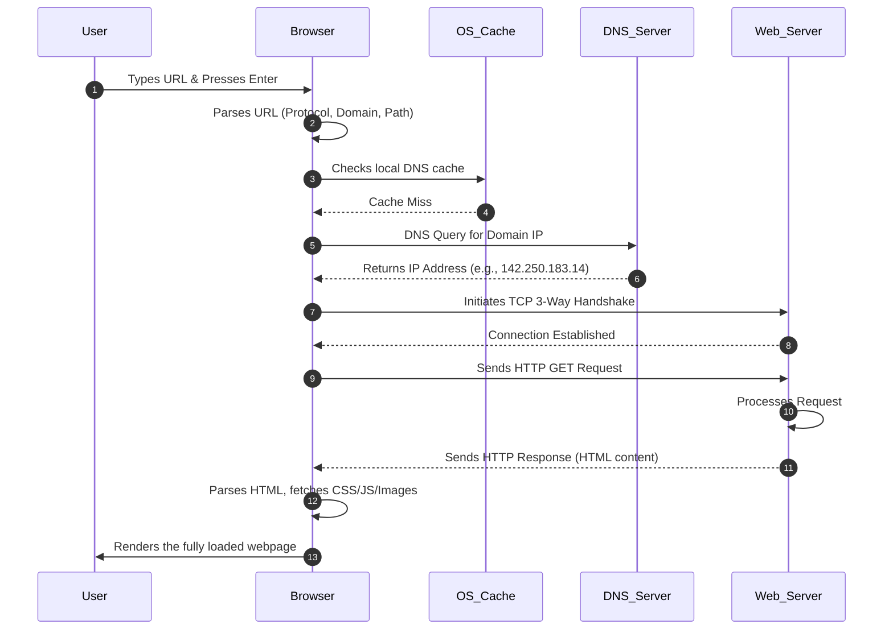
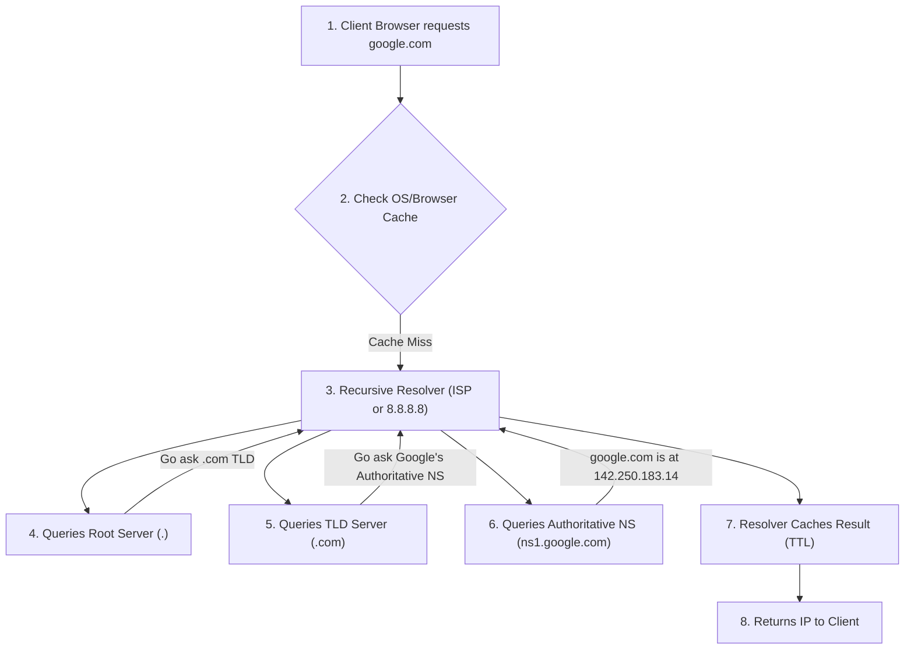
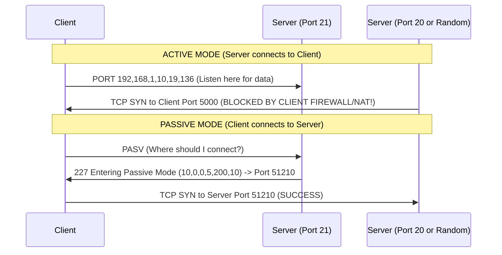

# Chapter 09: Application Layer Protocols

## BEGINNER SECTION: Foundations of the Application Layer

### What is the Application Layer?
The Application Layer is the seventh and topmost layer of the Open Systems Interconnection (OSI) model. It is the layer closest to the end user. However, a common misconception is that the Application Layer is the application itself (like Google Chrome, WhatsApp, or Microsoft Outlook). **This is incorrect.** 

The Application Layer is **NOT** the application itself. Instead, it provides the network services, protocols, and interfaces that software applications use to communicate over a network. Think of the application as the customer in a restaurant, and the Application Layer as the waiter. The customer doesn't go into the kitchen to cook the food; they give their request to the waiter (the protocol like HTTP or SMTP), who takes it to the kitchen (the lower network layers) and brings the response back.

### Architectural Models: Client-Server vs. Peer-to-Peer

Applications generally communicate using one of two primary architectural models:

1. **Client-Server Model**: 
   - A centralized architecture where distinct roles are defined. 
   - **Client**: The device requesting information or services (e.g., your web browser). It initiates the connection.
   - **Server**: A powerful, always-on machine that listens for incoming requests, processes them, and returns a response (e.g., a web server hosting Amazon.com).
   - *Analogy*: A traditional retail store. The store (server) has goods. Customers (clients) walk in to request and buy those goods.
2. **Peer-to-Peer (P2P) Model**:
   - A decentralized architecture where every participating node (device) acts simultaneously as both a client and a server.
   - Nodes request data from other nodes while simultaneously providing data to others.
   - *Examples*: BitTorrent file sharing, Skype's original architecture, and blockchain networks like Bitcoin.
   - *Analogy*: A potluck dinner. Everyone brings a dish to share (acting as a server) and eats from the dishes others brought (acting as a client).

### The Anatomy of a URL

To access resources on the Application Layer, we use a Uniform Resource Locator (URL). A URL is a structured string that tells the network exactly how and where to retrieve a resource.

```text
protocol://domain:port/path?query#fragment

https://www.example.com:443/products/laptops?sort=price#reviews
```

- **Protocol (`https`)**: The Application Layer protocol used to communicate (e.g., HTTP, HTTPS, FTP).
- **Domain (`www.example.com`)**: The human-readable address of the server, which DNS will resolve to an IP address.
- **Port (`443`)**: The logical doorway on the server. Often omitted if using the default port (80 for HTTP, 443 for HTTPS).
- **Path (`/products/laptops`)**: The specific directory or file being requested on the server's file system.
- **Query (`?sort=price`)**: Additional parameters passed to the server for processing (e.g., filtering search results).
- **Fragment (`#reviews`)**: An internal bookmark directing the browser to a specific section of the returned document.

### What Happens When You Type a URL and Press Enter?

This is one of the most fundamental concepts in networking. Here is the simplified, step-by-step walkthrough of the magic that happens in milliseconds:



1. **Browser Parses URL**: The browser extracts the protocol, domain, path, and any queries.
2. **DNS Resolution**: The browser needs an IP address, not a name. It queries the Domain Name System (DNS) to resolve the domain (e.g., google.com) into a machine-routable IP address.
3. **TCP Connection Established**: Before sending the HTTP request, the browser establishes a reliable transport connection with the server using the TCP 3-way handshake (SYN, SYN-ACK, ACK). If HTTPS is used, a TLS handshake follows to establish encryption.
4. **HTTP Request Sent**: The browser sends a formatted HTTP GET request to the server, asking for the webpage.
5. **Server Processes Request**: The server receives the request, routes it to the backend application, fetches data from a database if necessary, and generates an HTML response.
6. **Server Sends HTTP Response**: The server transmits the HTTP response back to the client, complete with a status code (like 200 OK) and the payload (HTML).
7. **Browser Parses HTML**: The browser reads the HTML line-by-line. Upon finding links to CSS stylesheets, JavaScript files, and images, it sends additional HTTP requests to fetch those assets.
8. **Browser Renders Page**: The browser constructs the Document Object Model (DOM) and renders the visual webpage for the user.

---

## INTERMEDIATE SECTION: Protocol Deep Dives

### HTTP/HTTPS: The Backbone of the Web

**HTTP (HyperText Transfer Protocol)** is the universal application protocol for transmitting hypermedia documents across the web. It operates on a **Request-Response model** and is inherently stateless (each request is completely independent of the previous one).

#### Evolution of HTTP
- **HTTP/1.0**: A new TCP connection had to be opened and closed for *every single* HTTP request (e.g., one connection for the HTML, another for the CSS, another for the image). Extremely slow and inefficient.
- **HTTP/1.1**: Introduced **persistent connections** (`Connection: keep-alive`), allowing multiple sequential requests to use the same TCP connection. Added pipelining and the mandatory `Host` header, enabling virtual hosting (multiple domains hosted on one server/IP).
- **HTTP/2**: A massive leap forward. Introduced **multiplexing** (sending multiple requests and responses in parallel over a single TCP connection simultaneously). Replaced plaintext headers with binary framing, introduced header compression (HPACK), and allowed server push.
- **HTTP/3 (QUIC)**: Replaces TCP entirely. Built on top of **UDP**. It eliminates TCP's head-of-line blocking issue (where one lost packet stalls the entire stream) and offers lightning-fast connection setup (0-RTT), with built-in TLS 1.3 encryption natively.

#### HTTP Methods Summary Table

HTTP methods (verbs) indicate the desired action to be performed on the identified resource.

| Method | Action / Purpose | Safe? | Idempotent? | Request Body? |
|---|---|---|---|---|
| **GET** | Retrieves a resource from the server. | Yes | Yes | No |
| **POST** | Submits data to the server to create a new resource or trigger an action. | No | No | Yes |
| **PUT** | Updates or completely replaces an existing resource with a new payload. | No | Yes | Yes |
| **PATCH** | Applies partial modifications to a resource. | No | No* | Yes |
| **DELETE**| Removes the specified resource. | No | Yes | Optional |
| **HEAD** | Same as GET, but the server returns ONLY headers (no body). Used to check file size or existence. | Yes | Yes | No |
| **OPTIONS**| Returns the HTTP methods supported by the server for a specific URL (used in CORS preflight). | Yes | Yes | No |
| **CONNECT**| Establishes a tunnel to the server (used primarily for HTTPS traffic through an HTTP proxy). | No | No | No |
| **TRACE** | Echoes the received request back to the client. Used for debugging (often disabled due to XST attacks). | Yes | Yes | No |

*Note: Safe means the operation does not modify server state. Idempotent means repeating the identical request $N$ times will have the same exact effect on the server state as making it once.*

#### HTTP Status Codes Grouped Table

Status codes concisely inform the client about the result of their request.

| Code Group | Meaning | Critical Codes to Memorize |
|---|---|---|
| **1xx** | **Informational**: Request received, continuing process. | **100 Continue**: Server received headers, send the body.<br>**101 Switching Protocols**: Upgrading to WebSockets or HTTP/2. |
| **2xx** | **Success**: The action was successfully received and accepted. | **200 OK**: Complete success.<br>**201 Created**: Resource successfully created (after POST/PUT).<br>**204 No Content**: Success, but no body to return (often DELETE).<br>**206 Partial Content**: Used for range requests (video streaming). |
| **3xx** | **Redirection**: Further action is needed to complete the request. | **301 Moved Permanently**: Update your bookmarks; resource moved.<br>**302 Found**: Temporary redirect.<br>**304 Not Modified**: Your cached version is still valid (use it!).<br>**307 Temporary Redirect**: Like 302, but forces client to preserve the original method.<br>**308 Permanent Redirect**: Like 301, but preserves the original method. |
| **4xx** | **Client Error**: The request contains bad syntax or cannot be fulfilled. | **400 Bad Request**: Malformed syntax.<br>**401 Unauthorized**: Authentication required (who are you?).<br>**403 Forbidden**: Authenticated, but lacking permission (you cant go here).<br>**404 Not Found**: Resource doesn't exist.<br>**405 Method Not Allowed**: E.g., sending a POST to a read-only GET endpoint.<br>**408 Request Timeout**: Client took too long to send data.<br>**409 Conflict**: State conflict (e.g., creating a user that already exists).<br>**410 Gone**: Resource permanently deleted (stronger than 404).<br>**422 Unprocessable Entity**: Semantic validation errors.<br>**429 Too Many Requests**: Rate limiting kicked in. |
| **5xx** | **Server Error**: The server failed to fulfill a valid request. | **500 Internal Server Error**: Generic unhandled server exception.<br>**502 Bad Gateway**: Upstream server/proxy returned an invalid response.<br>**503 Service Unavailable**: Server temporarily overloaded or down for maintenance.<br>**504 Gateway Timeout**: Upstream server took too long to respond. |

#### HTTP Headers Quick Reference
- **Request Headers**: 
  - `Host`: Specifies the domain being requested (crucial for virtual hosting).
  - `User-Agent`: Identifies the client software (browser, OS).
  - `Accept`: What media types the client can process (e.g., `text/html`, `application/json`).
  - `Accept-Encoding`: Supported compression algorithms (e.g., `gzip`, `br`).
  - `Authorization`: Credentials for authenticating the client.
- **Response Headers**:
  - `Content-Type`: The MIME type of the returned body.
  - `Content-Length`: Size of the body in bytes.
  - `Set-Cookie`: Instructs the browser to store a cookie.
  - `Location`: Used with 3xx redirects to specify the new URL.
- **CORS Headers**:
  - Cross-Origin Resource Sharing (CORS) prevents malicious scripts on one domain from accessing data on another domain. Controlled by `Access-Control-Allow-Origin` and `Access-Control-Allow-Methods`.

#### Cookies and State Management
Because HTTP is stateless, servers use **Cookies** to remember users across multiple requests.
- **The Flow**: 
  1. Client logs in.
  2. Server verifies credentials and responds with `Set-Cookie: session_id=abc123; Secure; HttpOnly; SameSite=Strict`.
  3. Browser stores this cookie.
  4. On every subsequent request to that domain, the browser automatically attaches `Cookie: session_id=abc123`.
- **Cookie Types**:
  - *Session Cookie*: No expiry date set; deleted when the browser closes.
  - *Persistent Cookie*: Has an explicit `Expires` or `Max-Age` attribute; saved to the hard drive.
  - *Third-Party Cookie*: A cookie set by a domain other than the one currently in the URL bar (used heavily for cross-site tracking and analytics).
- **Security Attributes**:
  - `Secure`: Cookie is only sent over encrypted HTTPS connections.
  - `HttpOnly`: Cookie cannot be accessed via JavaScript (`document.cookie`). Defends against Cross-Site Scripting (XSS) stealing session tokens.
  - `SameSite`: Controls whether the cookie is sent with cross-site requests. Defends against Cross-Site Request Forgery (CSRF).

#### HTTPS = HTTP + TLS
HTTPS operates on Port 443. It wraps standard HTTP traffic inside a cryptographic tunnel using Transport Layer Security (TLS).
- **Provides the CIA Triad**: 
  - **Confidentiality**: Traffic is encrypted; intermediate routers cannot read the contents.
  - **Integrity**: MACs (Message Authentication Codes) ensure data is not tampered with in transit.
  - **Authentication**: Digital certificates prove the server is who it claims to be.
- **Certificate Chain of Trust**: Your browser trusts Root Certificate Authorities (CAs). The Root CA signs an Intermediate CA, which in turn signs the Server Certificate (e.g., google.com). 

| Protocol | Security Implications, Attacks & Defenses |
|---|---|
| **HTTP/HTTPS** | **Attacks**: SQL Injection, XSS, CSRF, HTTP Request Smuggling, SSL Stripping.<br>**Defenses**: Use WAFs, enforce HTTPS via HSTS (HTTP Strict Transport Security), validate all inputs, set secure cookie flags (`HttpOnly`, `Secure`). |

---

### DNS (Domain Name System)

If the Internet is a global phone network, DNS is its **phone book**. Humans are great at remembering names (`amazon.com`), but computers route traffic using numbers (`205.251.242.103`). DNS bridges this gap.
Because the internet is massive, DNS cannot be housed on a single server. It is a **highly distributed and hierarchical** database.

#### The DNS Hierarchy

1. **Root DNS Servers (`.`)**: The apex of the hierarchy. There are 13 logical root server clusters (named A through M) globally, backed by thousands of physical servers using Anycast routing. They don't know the IP of google.com, but they know who manages the `.com` domains.
2. **TLD (Top-Level Domain) Servers**: These manage specific domain extensions.
   - Generic TLDs (gTLDs): `.com`, `.org`, `.net`, `.edu`, `.gov`.
   - Country Code TLDs (ccTLDs): `.in`, `.uk`, `.jp`.
3. **Authoritative DNS Servers**: The final stop. This server holds the definitive, actual DNS records for a specific organization's domain (e.g., Google's authoritative name server holds the exact mapping of google.com to 142.250.183.14).
4. **Local/Recursive Resolver**: The workhorse that performs queries on behalf of the user. Usually provided by your ISP (Comcast, AT&T) or a public provider (Google's 8.8.8.8, Cloudflare's 1.1.1.1).

#### The 8-Step DNS Resolution Process

When a record is not cached, resolving a domain takes a specific path:



#### DNS Record Types Reference Table

| Record Type | Name | Purpose | Example |
|---|---|---|---|
| **A** | Address | Maps a domain name to a 32-bit IPv4 address. | `example.com -> 93.184.216.34` |
| **AAAA** | Quad-A | Maps a domain name to a 128-bit IPv6 address. | `example.com -> 2606:2800:220:1...` |
| **CNAME** | Canonical Name | Maps an alias to a true domain name (cannot map directly to an IP). | `www.example.com -> example.com` |
| **MX** | Mail Exchange | Specifies the mail servers responsible for accepting emails for the domain. Includes a priority value. | `example.com -> mail.example.com (Priority 10)` |
| **NS** | Name Server | Specifies the authoritative DNS servers for a domain. | `example.com -> ns1.example.com` |
| **TXT** | Text | Arbitrary text data. Crucial for email security verification (SPF, DKIM, DMARC) and domain ownership proofs. | `v=spf1 include:_spf.google.com ~all` |
| **SOA** | Start of Authority | Core zone information: primary name server, admin email, serial number, refresh/retry/expire timers. | `ns1.example.com admin.example.com 2026072801...` |
| **PTR** | Pointer | Used for Reverse DNS lookups (mapping an IP back to a domain). Critical for anti-spam. | `34.216.184.93.in-addr.arpa -> example.com` |
| **SRV** | Service Locator | Specifies the hostname and port number for specific services (e.g., SIP, XMPP, Active Directory). | `_sip._tcp.example.com` |
| **CAA** | Cert Authority Authorization | Specifies which Certificate Authorities are allowed to issue TLS certificates for the domain. | `example.com -> letsencrypt.org` |

#### Caching and TTL
Every DNS record has a **TTL (Time to Live)** value in seconds.
- **Short TTL (e.g., 60 seconds)**: Changes propagate across the internet quickly, but generates higher load on authoritative servers.
- **Long TTL (e.g., 86400 seconds / 24 hours)**: Less server load and faster client resolution, but if you change your server's IP, users will be directed to the old IP for up to 24 hours.
- **Negative Caching**: Resolvers also cache `NXDOMAIN` (domain does not exist) responses to prevent continuous querying for dead links.

| Protocol | Security Implications, Attacks & Defenses |
|---|---|
| **DNS** | **Attacks**: DNS Cache Poisoning (injecting false IP mappings into a resolver's cache), DNS Amplification (using spoofed IPs to bounce massive DNS responses at a victim), Zone Transfer (AXFR) leaks.<br>**Defenses**: Deploy DNSSEC (digitally signs records to guarantee authenticity), restrict zone transfers, use DoH (DNS over HTTPS) or DoT (DNS over TLS) to encrypt client queries and prevent eavesdropping. |

---

### FTP (File Transfer Protocol)

FTP is a classic protocol for uploading and downloading files. Uniquely, it utilizes **TWO** distinct TCP connections:
1. **Control Connection (Port 21)**: Stays open for the duration of the session. Used to send commands (`USER`, `PASS`, `LIST`, `RETR`, `STOR`) and receive status replies.
2. **Data Connection (Port 20)**: Ephemeral connection opened and closed for *each* file transfer or directory listing.

#### Active vs. Passive Mode

FTP's dual-port design creates massive headaches for modern firewalls and NAT.



- **Active Mode**: The client tells the server, "Connect back to me on port X for data." The server initiates the data connection from its Port 20 to the client's port. **Problem**: Client-side firewalls and NAT drop the incoming connection from the server.
- **Passive Mode (PASV)**: The client asks the server, "Open a port and tell me where to connect." The server opens a random high port and tells the client. The client initiates the data connection. **Firewall friendly**, because the client initiates both connections outbound.

| Protocol | Security Implications, Attacks & Defenses |
|---|---|
| **FTP** | **Attacks**: Plaintext credential sniffing, FTP Bounce Attacks, anonymous login abuse.<br>**Defenses**: NEVER use standard FTP over untrusted networks. Use **SFTP** (SSH File Transfer Protocol, entirely different, runs over Port 22 SSH) or **FTPS** (FTP Secure, adds TLS encryption over Port 990 or explicit Port 21). |

---

### Email Protocols (SMTP, POP3, IMAP)

Email relies on an orchestrated dance between three primary protocols. 

#### The Email Architecture Flow


#### SMTP (Simple Mail Transfer Protocol)
- **Purpose**: *Sending* and *Routing* emails. It is purely a push protocol.
- **Ports**: 
  - `25`: Server-to-Server routing (plaintext).
  - `587`: Client-to-Server submission (with STARTTLS encryption).
  - `465`: SMTPS (Implicit SSL, legacy but still used).
- **Core Commands**: `EHLO` (hello), `MAIL FROM` (envelope sender), `RCPT TO` (envelope recipient), `DATA` (message payload), `QUIT`.
- **Authentication**: `AUTH LOGIN`, `AUTH PLAIN`, `CRAM-MD5`.

#### POP3 (Post Office Protocol version 3)
- **Purpose**: *Downloading* emails from server to client.
- **Ports**: `110` (plaintext), `995` (POP3S over TLS).
- **Model**: "Download-and-Delete." The client downloads the email to the local hard drive and typically deletes it from the server.
- **Limitations**: Designed for a single device. If you read an email on your phone, it is gone from the server and won't appear on your laptop. Excellent for offline access.

#### IMAP (Internet Message Access Protocol)
- **Purpose**: *Synchronizing* emails between client and server.
- **Ports**: `143` (plaintext), `993` (IMAPS over TLS).
- **Model**: Server-centric. Emails live on the server. Folders, read/unread status, and flags are synchronized across all devices.
- **Advantages**: Modern standard. Allows partial fetches (downloading headers first, then attachments on demand). Requires constant internet connection for full access.

#### Email Protocol Comparison Table

| Feature | SMTP | POP3 | IMAP |
|---|---|---|---|
| **Direction** | Push (Sending) | Pull (Receiving) | Pull / Sync (Receiving) |
| **Primary Ports** | 25, 587, 465 | 110, 995 | 143, 993 |
| **Storage Model** | Transits to next hop | Downloaded to local device, deleted from server | Retained on server, mirrored to client |
| **Multi-Device Support** | N/A | Poor (Emails split/isolated across devices) | Excellent (State syncs globally) |
| **Offline Viewing** | N/A | Native (All data is local) | Limited (Only cached emails are visible) |

| Protocol | Security Implications, Attacks & Defenses |
|---|---|
| **Email** | **Attacks**: Email spoofing, Phishing, Open Relay Abuse, Credential Sniffing (if Port 110/143 used).<br>**Defenses**: Enforce TLS (Ports 993/995/587). Implement robust DNS anti-spam frameworks: **SPF** (Sender Policy Framework - dictates which IPs can send mail for a domain), **DKIM** (DomainKeys Identified Mail - digitally signs emails), and **DMARC** (instructs receivers what to do if SPF/DKIM fail). |

---

### Other Important Protocols

#### Telnet vs. SSH
- **Telnet (Port 23)**: Provides remote terminal access to a server or router CLI. **Fatal Flaw**: All keystrokes, data, and passwords are sent in absolute plaintext. Completely insecure. Only used today by network engineers to test port connectivity (e.g., `telnet google.com 80`).
- **SSH (Secure Shell, Port 22)**: The cryptographically secure replacement for Telnet. Provides an encrypted tunnel for remote CLI execution.
  - *Authentication*: Supports interactive passwords or, preferably, Asymmetric Key Pairs (Private key on client, Public key stored in server's `~/.ssh/authorized_keys`).
  - *Tunneling/Port Forwarding*: SSH can encapsulate other protocols. 
    - **Local Forwarding**: Forward a local port to a remote service through the SSH server.
    - **Remote Forwarding**: Expose a local service on your laptop to the public internet via the SSH server.
    - **Dynamic (SOCKS)**: Turn the SSH connection into a proxy routing arbitrary traffic.

#### SNMP (Simple Network Management Protocol)
- **Purpose**: Monitoring and managing network hardware (switches, routers, servers, printers).
- **Architecture**: 
  - *Manager (NMS)*: The central monitoring server.
  - *Agent*: The software running on the hardware device.
  - *MIB (Management Information Base)*: The hierarchical database of all measurable metrics (CPU load, interface status) on the device.
- **Operations**:
  - `GET`: Manager requests a value from Agent.
  - `SET`: Manager modifies a value on the Agent.
  - `TRAP`: Agent sends an unsolicited alert to the Manager (e.g., "Interface went down!").
- **Ports**: UDP `161` (Agent listens for GET/SET), UDP `162` (Manager listens for TRAPs).

| Protocol | Security Implications, Attacks & Defenses |
|---|---|
| **SNMP** | **Attacks**: SNMPv1 and v2c use plaintext "Community Strings" (passwords). Default strings are often left as `public` (read-only) and `private` (read-write), leading to full network compromise.<br>**Defenses**: Always change default community strings. Upgrade to **SNMPv3**, which natively supports strong encryption and robust user authentication. |

#### NTP (Network Time Protocol)
- **Purpose**: Synchronizes clocks across all network devices (Port 123 UDP).
- **Criticality**: If device clocks are skewed, TLS certificates will fail validation, Kerberos authentication will break, and security logs (SIEM) will be useless for incident response.
- **Architecture**: Uses hierarchical "Stratum" levels. Stratum 0 = atomic clocks/GPS. Stratum 1 = servers directly connected to Stratum 0. Stratum 2 = servers syncing from Stratum 1. Accuracy on LANs is often sub-millisecond.

#### DHCP (Dynamic Host Configuration Protocol)
*Note: Deep dive in Chapter 06, but Security merits mention here.*
| Protocol | Security Implications, Attacks & Defenses |
|---|---|
| **DHCP** | **Attacks**: DHCP Starvation (attacker floods server with spoofed MACs to exhaust the IP pool). Rogue DHCP Server (attacker spins up an unauthorized server, handing out fake gateways to MitM traffic).<br>**Defenses**: Implement **DHCP Snooping** on Layer 2 switches to only trust DHCP replies from authorized switch ports. |

#### VoIP and Real-Time Protocols
- **SIP (Session Initiation Protocol)**: The signaling protocol. Establishes, modifies, and terminates the voice/video call (the "ringing" and "hanging up").
- **RTP (Real-time Transport Protocol)**: Runs over UDP. Carries the actual digitized voice/video payload. Prioritizes speed over reliability (a dropped voice frame is better than a delayed one).
- **RTCP (RTP Control Protocol)**: Runs alongside RTP to provide out-of-band statistics and control information (QoS metrics, packet loss, jitter).
- **Metrics**: Call quality is measured by MOS (Mean Opinion Score), Jitter (variation in packet delay), and Packet Loss.

#### RPC (Remote Procedure Call)
- **Purpose**: Allows a program to execute a subroutine (function) on another computer in a different address space, coded as if it were a normal local procedure call. The programmer doesn't have to explicitly code the network interactions.
- **Modern Variants**: XML-RPC, JSON-RPC, gRPC (Google's high-performance RPC using HTTP/2 and Protobuf), Thrift (Facebook).

---

## ADVANCED SECTION: Diagnostics & Legacy

### Network Diagnostic CLI Tools

Mastering the command line is essential for network engineering and cybersecurity.

- **`ping <host>`**: 
  - *Mechanism*: Sends ICMP Echo Request packets and waits for ICMP Echo Replies.
  - *Measures*: Reachability, Round Trip Time (RTT), Packet Loss, and TTL (Time to Live).
  - *Usage*: `ping -t` (Windows continuous), `ping -c 4` (Linux count), `ping -l 1500` (Windows payload size).
- **`traceroute <host>` (Linux) / `tracert <host>` (Windows)**:
  - *Mechanism*: Maps the exact router hops from source to destination. Sends packets with an intentionally incrementing TTL (1, 2, 3...). When a router decrements the TTL to 0, it drops the packet and sends an "ICMP Time Exceeded" message back, revealing its IP address.
  - *Output*: Hop count, IP/Hostname of router, and RTT for three probes. Asterisks (`*`) indicate a router dropped the probe or rate-limited ICMP responses.
- **`nslookup <domain>` / `dig <domain>`**:
  - *Mechanism*: Queries DNS servers manually to troubleshoot resolution.
  - *Usage*: `nslookup -type=MX google.com` finds mail servers. `dig @8.8.8.8 example.com +trace` forces a query through Google's DNS and traces the full hierarchical resolution path from the Root servers down.
- **`netstat`**:
  - *Mechanism*: Displays active TCP connections, listening ports, and routing tables.
  - *Usage*: `netstat -an` (all connections, numeric IPs). `netstat -rn` (routing table). `netstat -tnlp` (Linux: show listening TCP ports and the Process ID/Name).
- **`ipconfig` (Windows) / `ifconfig` (Legacy Linux) / `ip` (Modern Linux)**:
  - *Mechanism*: View local interface configuration (IP, Subnet Mask, Gateway, MAC).
  - *Usage*: `ipconfig /all` (shows DHCP/DNS details). `ipconfig /release` & `/renew` (refreshes DHCP lease). `ipconfig /flushdns` (clears local OS DNS cache to fix stale records).
- **`arp -a`**:
  - *Mechanism*: Displays the local ARP cache (the mapping of Layer 3 IP addresses to Layer 2 MAC addresses on the local subnet).
- **`nmap <host>`**:
  - *Mechanism*: Comprehensive network scanner (covered heavily in Chapter 12). Discovers open ports, running services, and OS fingerprints.
- **Browser Developer Tools (Network Tab)**:
  - *Mechanism*: Inspects every HTTP request generated by the browser. 
  - *Features*: View Request/Response headers, status codes, payloads. The **Waterfall view** shows resource load timings (TTFB, content download). Allows network throttling to simulate slow 3G connections for testing.

### Historical / Legacy Protocols

Understanding deprecated protocols highlights the evolutionary path of modern networks.

- **ARPANET Protocols**: 
  - **NCP (Network Control Program)**: The predecessor to TCP/IP used on the early ARPANET.
  - **IMP (Interface Message Processor)**: The first generation of packet routers.
- **X.25**: An early packet-switched WAN protocol from the 1970s. Provided reliable virtual circuits over unreliable telephone lines (heavily used for ATMs/credit card terminals). Predecessor to Frame Relay.
- **Gopher**: A pre-WWW internet browsing protocol. Text-based, hierarchical menus rather than interconnected hyperlinked documents. Rendered obsolete by HTTP and HTML.
- **NNTP (Network News Transfer Protocol)**: The protocol used to transport Usenet newsgroup articles. 
- **IRC (Internet Relay Chat)**: An early, highly popular text-based chat protocol (Port 6667) built around channels (chat rooms). Still used in open-source and hacker communities.

---

## CHAPTER REFERENCE 

### Port Numbers Quick Reference Table

| Protocol | Port Number | Protocol | Port Number |
|---|---|---|---|
| **FTP (Data/Control)** | 20 / 21 | **DHCP** | 67 / 68 |
| **SSH / SFTP** | 22 | **HTTP** | 80 |
| **Telnet** | 23 | **POP3 / POP3S** | 110 / 995 |
| **SMTP** | 25 | **NTP** | 123 |
| **DNS** | 53 | **IMAP / IMAPS** | 143 / 993 |
| **SNMP (Agent/Manager)**| 161 / 162 | **HTTPS** | 443 |
| **SMTP (Submission)** | 587 | **RDP** | 3389 |

### Exam Tips & Common Traps

- **Trap**: Stating that "Google Chrome is an Application Layer protocol."
  - *Correction*: Chrome is an application. HTTP/HTTPS are the Application Layer protocols it relies on.
- **Trap**: Confusing Active vs. Passive FTP.
  - *Tip*: Think of it from the *Client's* perspective. In **Passive** mode, the client is passive in negotiating the port, but initiates BOTH outbound connections (good for firewalls). In **Active** mode, the server actively connects inbound to the client (bad for firewalls).
- **Trap**: Mixing up POP3 and IMAP.
  - *Tip*: **POP3** = Pull & Purge (downloads and deletes, single device). **IMAP** = I Mirror All Phones (synchronizes across devices).
- **Tip**: Remember the DNS Hierarchy order: Root (`.`) $\rightarrow$ TLD (`.com`) $\rightarrow$ Authoritative (`google.com`).
- **Tip**: For troubleshooting, `ping` uses ICMP, not TCP or UDP. If a host doesn't respond to `ping`, it might just be blocking ICMP traffic via a firewall; the web server (TCP 80) might still be up!

### Key Terms Glossary

- **Idempotent**: A property of HTTP methods where making multiple identical requests has the same effect on the server as making a single request (e.g., PUT, DELETE).
- **Multiplexing**: The ability of HTTP/2 to send multiple concurrent requests and responses over a single TCP connection.
- **Anycast**: A network routing methodology where multiple physical servers share the same IP address, and traffic is routed to the topologically closest server (used heavily by Root DNS and CDNs).
- **TTL (Time to Live)**: In DNS, the duration a record is allowed to remain in cache. In IP routing, the maximum number of router hops a packet can take before being discarded.
- **FQDN (Fully Qualified Domain Name)**: The complete domain name specifying its exact location in the DNS hierarchy (e.g., `www.example.com.`).
