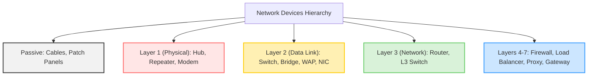
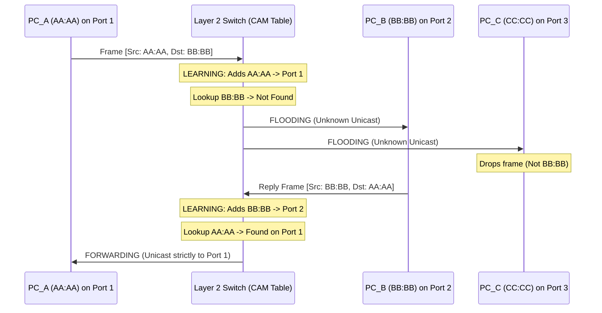
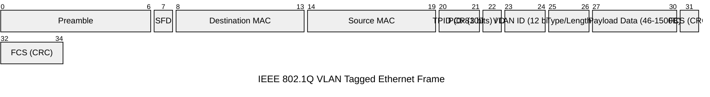
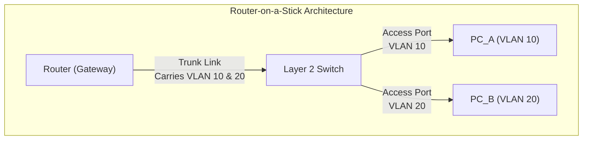
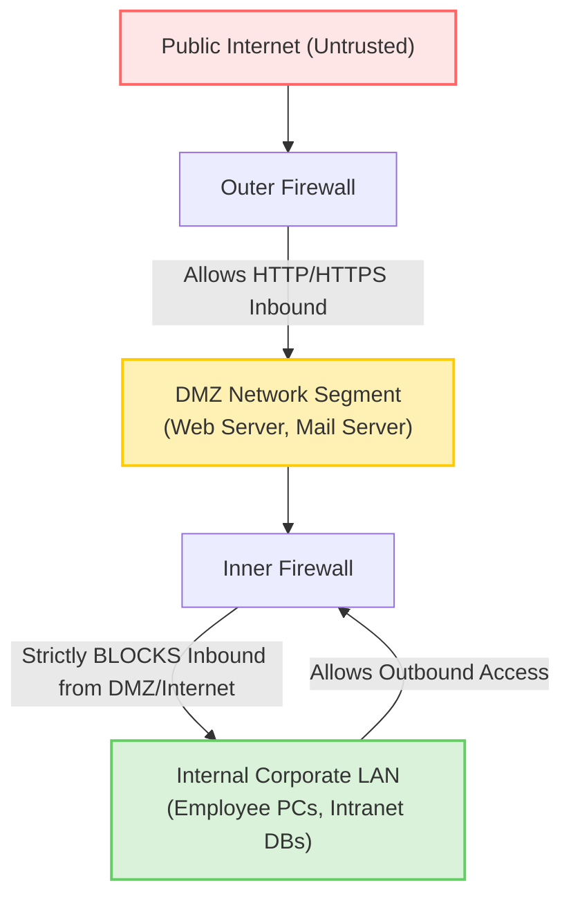

# Chapter 10: Network Devices and Switching Infrastructure

Welcome to Chapter 10. In this exhaustive reference, we will dissect the critical physical and logical hardware components that make up the backbone of modern networks. We transition from theoretical OSI models into the actual silicon and software that process, route, filter, and balance data globally. This chapter is divided into Beginner, Intermediate, and Advanced sections to systematically build your understanding.

---

## BEGINNER SECTION: The Hardware Foundation

Before packets can traverse the internet, they must navigate a maze of localized hardware. To understand networking, you must understand the hierarchy of devices, categorized intuitively by their "intelligence" — or their operating layer within the OSI model. 

### 1. Network Devices Hierarchy: From Dumbest to Smartest

The progression of network hardware reflects the progression of the OSI Model. Devices at lower layers only understand basic signals, whereas higher-layer devices can interpret complex application payloads.

1. **Passive Devices (No Intelligence)**
   - **Examples**: Cables, Connectors, Patch Panels
   - **Function**: Provide the physical medium for electrons or photons to travel. They do not process data.
2. **Layer 1 Devices (Physical Layer)**
   - **Examples**: Repeater, Hub, Modem
   - **Function**: Operate purely on bitstreams (1s and 0s). They regenerate or duplicate electrical/light signals without looking at addresses.
3. **Layer 2 Devices (Data Link Layer)**
   - **Examples**: Bridge, Switch, Wireless Access Point (WAP), Network Interface Card (NIC)
   - **Function**: Understand MAC (Media Access Control) addresses. They filter and forward frames to specific physical destinations, creating localized intelligence.
4. **Layer 3 Devices (Network Layer)**
   - **Examples**: Router, Layer 3 Switch
   - **Function**: Understand IP addresses and logical networks. They make complex mathematical routing decisions to forward packets between entirely different networks across the globe.
5. **Layer 4-7 Devices (Transport to Application Layers)**
   - **Examples**: Firewall, Load Balancer, Proxy Server, Gateway
   - **Function**: Deeply inspect payloads, ports, connection states, and application behaviors. They enforce security, balance load, and translate complex protocols.



### 2. Device Explanations in Plain English

Let us demystify every core piece of networking hardware.

#### Cable & Patch Panel
- **Nature**: Passive.
- **Function**: Cables (Copper UTP, Fiber Optic, Coaxial) simply carry signals. A Patch Panel is a static, passive device used in server rooms to terminate long cable runs from the building walls into neat, manageable ports. Short "patch cables" then connect the patch panel to a switch.
- **Analogy**: Patch panels are like the electrical breaker box in your house—a centralized location to organize all the wiring hidden behind the walls.

#### Repeater
- **Nature**: Layer 1 (Physical).
- **Function**: A signal amplifier. When data travels over long distances (e.g., beyond 100 meters for Cat6 Ethernet), the electrical signal degrades due to attenuation. A repeater takes the weakened signal, cleans it up, boosts it, and sends it further down the line. It doesn't read the data; it just amplifies the energy.
- **Analogy**: A megaphone. It takes whatever sound goes in and makes it louder, without caring if the sound is a symphony or static.

#### Hub (Multiport Repeater)
- **Nature**: Layer 1 (Physical).
- **Function**: A hub is essentially a multi-port repeater. When it receives a signal on one port, it blindly **BROADCASTS** that exact same signal to **ALL** other connected ports. 
- **The Problem**: Because it copies traffic everywhere, a hub creates ONE massive **Collision Domain**. If two devices talk at the same time, their electrical signals collide, corrupting the data. Everyone connected to a hub hears everyone else's traffic. Hubs are obsolete in modern networks due to this extreme inefficiency.
- **Analogy**: A crowded room where everyone is shouting at the same time. If person A wants to talk to person B, they have to shout to the entire room, and everyone else has to listen and decide if the message is for them.

#### Bridge
- **Nature**: Layer 2 (Data Link).
- **Function**: A bridge connects two network segments together. Unlike a hub, a bridge is intelligent: it learns MAC addresses. It monitors traffic passing through and builds a table of which MAC address is on which side. It then uses this table to selectively forward frames. If it knows a device is on the left side, it will not cross the traffic over to the right side, thus reducing unnecessary noise.
- **Analogy**: A traffic cop standing on a bridge connecting two towns, checking license plates. If the cop sees you belong in Town A, they tell you to stay; if you need to go to Town B, they let you cross.

#### Switch (Multiport Bridge)
- **Nature**: Layer 2 (Data Link).
- **Function**: The undisputed backbone of modern Local Area Networks (LANs). A switch is a bridge with many ports. By learning MAC addresses, the switch forwards data *only* to the specific port where the destination device resides. 
- **The Benefit**: Each port on a switch is its own separate **Collision Domain**. Devices can talk simultaneously without their electrical signals colliding. This micro-segmentation vastly improves network speed and security compared to a hub.
- **Analogy**: A high-tech telephone switchboard. When Alice calls Bob, the switchboard physically connects Alice's line directly to Bob's line, ensuring no one else can hear the conversation.

#### Router
- **Nature**: Layer 3 (Network).
- **Function**: A router connects entirely **DIFFERENT** networks together. While a switch connects devices within the same network (like a building), a router connects that building to the Internet, or to a remote branch office. Routers read IP addresses (logical addresses) and use complex routing tables to determine the best path to a distant destination. Importantly, routers break **Broadcast Domains**—they do not forward noisy Layer 2 broadcast traffic (like ARP requests) across the internet.
- **Analogy**: A postal sorting facility. It looks at the ZIP code (IP address) to decide which truck to put the package on to send it across the country.

#### Gateway
- **Nature**: Can operate anywhere from Layer 3 to Layer 7.
- **Function**: A gateway translates between completely incompatible network environments, protocols, or architectures. While a router connects two IP networks, a gateway can connect a TCP/IP network to a legacy IBM SNA network, or bridge a Wi-Fi network to a cellular network. 
- **Analogy**: A UN translator who listens to a diplomat speaking French and instantly translates it into Japanese for another diplomat.

#### Modem (MODulate-DEModulate)
- **Nature**: Layer 1 / Layer 2 boundary.
- **Function**: Computers speak in digital bits (1s and 0s). Phone lines and coaxial cable lines carry analog waves. A modem converts digital bits into analog signals to transmit them over long-distance provider lines (Modulation), and converts incoming analog signals back into digital bits for the router/computer (Demodulation). Modems connect your LAN to the ISP's WAN.
- **Analogy**: A Morse code operator turning written English text (digital) into audible beeps (analog) over a radio wire.

#### Wireless Access Point (WAP)
- **Nature**: Layer 2 (Data Link).
- **Function**: Provides Wi-Fi connectivity. It acts as a bridge between the wireless airwaves (IEEE 802.11) and the wired Ethernet network (IEEE 802.3). It converts wireless frames into wired frames and sends them to a switch. 
- **Analogy**: A radio dispatcher taking calls from police cruisers (wireless) and typing them into the central station's computer system (wired).

#### Firewall
- **Nature**: Layer 3, 4, or 7 depending on type.
- **Function**: A security device that sits at the perimeter of a network. It controls incoming and outgoing traffic based on a defined set of security rules. It blocks unauthorized access, malicious payloads, and hackers while permitting legitimate traffic.
- **Analogy**: The bouncer at a nightclub, checking IDs against a VIP list and ensuring nobody brings in weapons.

#### Load Balancer
- **Nature**: Layer 4 or Layer 7.
- **Function**: Distributes incoming client connections efficiently across multiple backend servers. This ensures no single server becomes overwhelmed, providing High Availability (HA) and maximum performance.
- **Analogy**: A bank teller manager directing the long line of customers to the next available teller.

#### Proxy Server
- **Nature**: Layer 7 (Application).
- **Function**: An intermediary that acts on behalf of clients. When a user requests a webpage, the request goes to the proxy, which then fetches the webpage and returns it to the user. Proxies are used to cache frequently accessed content to save bandwidth, filter malicious websites, and hide the internal IP addresses of client machines.
- **Analogy**: An administrative assistant. You tell the assistant you want a file; the assistant goes to the archives, gets the file, and brings it back to you. The archivist never knows *you* asked for it, only that the assistant did.

### 3. Device Comparison Table: Hub vs Switch vs Router vs Firewall

| Feature | Hub | Switch | Router | Firewall |
| :--- | :--- | :--- | :--- | :--- |
| **OSI Layer** | Layer 1 (Physical) | Layer 2 (Data Link) | Layer 3 (Network) | Layer 3-7 (Security) |
| **Addressing Used** | None | MAC Addresses (48-bit) | IP Addresses (32-bit / 128-bit) | IP, Port, Application payload |
| **Forwarding Decision** | Floods to all ports | CAM Table lookup (Unicast) | Routing Table lookup | Security Policy / ACLs |
| **Collision Domains** | 1 for the entire device | 1 per port (Isolated) | 1 per port | 1 per port |
| **Broadcast Domains** | 1 for the entire device | 1 for the entire device | Breaks broadcast domains | Breaks broadcast domains |
| **Security/Intelligence**| Dumb, massive security risk | Learns MACs, micro-segments | Path selection, IP routing | Deep packet inspection |
| **Modern Use Case** | Obsolete / E-Waste | Internal LAN connectivity | Internet/WAN connectivity | Perimeter defense |

---

## INTERMEDIATE SECTION: Switching Logic and Infrastructure

Having established what devices exist, we now zoom in on the undisputed workhorse of the modern local network: the Switch. We will dissect how it learns, how it is managed, and how it prevents catastrophic network failures.

### 1. Switch Internals: The CAM Table Mechanism

A switch seems like magic, sending traffic exactly where it needs to go instantly. This is powered by its **CAM (Content Addressable Memory) Table**, also interchangeably called the **MAC Address Table**. 

The CAM table is a high-speed hardware memory that maps a physical MAC address to the physical switch port it is connected to. 

#### The Four Core Operations of a Switch

1. **LEARNING**: 
   When an Ethernet frame arrives on a port, the switch immediately looks at the **Source MAC Address** in the frame header. It records this MAC address and the port it arrived on into the CAM table. If the switch sees traffic originating from a device, it definitively knows where that device is.
2. **FLOODING**: 
   Next, the switch looks at the **Destination MAC Address**. If this destination MAC is *not* found in the CAM table (an "Unknown Unicast"), or if the destination is the Broadcast address (`FF:FF:FF:FF:FF:FF`), the switch has no choice but to **flood** the frame out of **ALL** active ports except the port it received it on.
3. **FORWARDING**: 
   If the switch looks at the **Destination MAC Address** and finds a matching entry in its CAM table, it performs micro-segmented unicast **forwarding**. It sends the frame *only* out of the specific port mapped in the table, ignoring all other ports.
4. **FILTERING**: 
   If the switch determines that both the Source MAC and Destination MAC reside on the *same* port (for example, if a hub is connected to that port and devices are talking locally), the switch will drop (filter) the frame because it knows the frame doesn't need to cross the switch to reach its destination.

#### CAM Table Aging and First Boot
- **First Boot**: When a switch is first powered on, its CAM table is completely empty. For the first few moments, it acts almost like a hub, flooding frames everywhere until it slowly "learns" the MAC addresses of all devices as they transmit data.
- **Aging**: To prevent the CAM table from filling up with obsolete data (e.g., if a laptop is disconnected), entries have an aging timer. By default, an entry expires and is deleted if no traffic is seen from that MAC address for **300 seconds (5 minutes)**. If a device moves to a new port, the switch immediately updates the table based on the new Source MAC data.

#### Step-by-Step CAM Example Walkthrough
Imagine a 4-port switch. PC_A (MAC `AA:AA`) is on Port 1. PC_B (MAC `BB:BB`) is on Port 2.

1. PC_A sends a frame to PC_B.
2. Switch receives frame on Port 1.
3. **LEARNING**: Switch reads Source MAC `AA:AA` and writes `AA:AA -> Port 1` in CAM table.
4. Switch reads Destination MAC `BB:BB`. 
5. Switch checks CAM table for `BB:BB`. It is empty.
6. **FLOODING**: Switch floods the frame to Port 2, Port 3, and Port 4.
7. PC_B receives the frame. (Ports 3 and 4 drop it because the MAC doesn't match theirs).
8. PC_B sends a reply back to PC_A.
9. Switch receives reply on Port 2.
10. **LEARNING**: Switch reads Source MAC `BB:BB` and writes `BB:BB -> Port 2` in CAM table.
11. Switch reads Destination MAC `AA:AA`.
12. Switch checks CAM table. It finds `AA:AA -> Port 1`.
13. **FORWARDING**: Switch directly forwards the frame only out of Port 1. No flooding occurs.



### 2. Managed vs Unmanaged Switches

When purchasing a switch, you face a stark division in capabilities and cost.

#### Unmanaged Switch
- **Nature**: Plug-and-play, zero configuration. 
- **Characteristics**: It has a fixed logic board. You cannot assign an IP address to it, you cannot log into it, and you cannot customize how it forwards traffic. It has zero monitoring capability.
- **Cost & Use Case**: Very cheap. Used for home networks, small offices, or lab desks where traffic is implicitly trusted and segmentation isn't required.

#### Managed Switch
- **Nature**: Highly configurable enterprise appliance.
- **Characteristics**: Possesses an operating system (like Cisco IOS). It can be configured via CLI (Command Line Interface using SSH or Telnet), Web GUI, or SNMP. 
- **Advanced Features Supported**:
  - **VLANs (Virtual LANs)** for logical segmentation.
  - **STP (Spanning Tree Protocol)** for loop prevention.
  - **QoS (Quality of Service)** for prioritizing VoIP or video traffic.
  - **Port Security** to lock down ports to specific MAC addresses.
  - **Port Mirroring (SPAN)** to send copies of traffic to an Intrusion Detection System.
- **Cost & Use Case**: Expensive. Mandatory for enterprise networks, data centers, and any environment requiring security, compliance, monitoring, and advanced routing.

### 3. Layer 2 vs Layer 3 Switches

While traditionally switches operate at Layer 2 and routers at Layer 3, network evolution created the **Layer 3 Switch** (often called a Multilayer Switch).

- **Layer 2 Switch**:
  - Forwards frames based purely on 48-bit MAC addresses.
  - Cannot route packets between different subnets. 
  - All ports remain in the same broadcast domain unless physically separated into VLANs (which then require an external router to communicate between).

- **Layer 3 Switch**:
  - Has routing capability built directly into its hardware via specialized ASICs (Application-Specific Integrated Circuits).
  - Can forward traffic based on IP addresses just like a router.
  - Replaces traditional routers for **Inter-VLAN routing** within a campus network.
  - **Why use it over a router?**: Speed. A router processes packets largely in software via its CPU, which introduces latency. A Layer 3 switch routes packets in hardware (silicon), operating at wire-speed (millions of packets per second). 

**Design Rule of Thumb**: Use a Layer 3 switch for high-speed, internal Inter-VLAN routing inside your corporate campus. Use a dedicated Router at the perimeter for WAN connectivity, NAT, VPN termination, and complex exterior routing protocols (BGP).

### 4. Access Ports vs Trunk Ports

In enterprise networks utilizing VLANs, switch ports are configured into one of two operational modes.

#### Access Port
- **Function**: Connects the switch to **end devices** (PCs, printers, IP phones, servers).
- **VLAN Membership**: Belongs to **EXACTLY ONE** VLAN. 
- **Traffic Type**: Sends and receives standard, **UNTAGGED** Ethernet frames. The end device has absolutely no concept that it is part of a VLAN; it just sends normal traffic. The switch silently assigns the incoming traffic to the port's configured VLAN internally.

#### Trunk Port
- **Function**: Connects a switch to another switch, or a switch to a router (in a "router-on-a-stick" topology).
- **VLAN Membership**: Carries traffic for **MULTIPLE** VLANs simultaneously over a single physical cable.
- **Traffic Type**: Frames leaving a trunk port are structurally modified. The switch injects an **802.1Q VLAN Tag** into the Ethernet header so the receiving switch knows which VLAN the frame belongs to.
- **Native VLAN**: A trunk port requires one VLAN to remain untagged for backward compatibility and control traffic. This is called the Native VLAN (Default is VLAN 1). 
  - *Security Warning*: For security, the Native VLAN should always be changed from 1 to an unused, dedicated "dummy" VLAN to prevent VLAN hopping attacks.

### 5. Spanning Tree Protocol (STP - IEEE 802.1D)

Redundancy in networks is critical. If a cable is cut, the network should survive. Therefore, network engineers connect switches in redundant loops. However, Layer 2 Ethernet headers do *not* have a TTL (Time To Live) field like IP packets do. 

#### The Problem: Layer 2 Loops
If redundant links exist between switches without a control mechanism, catastrophic failures occur instantly:
1. **Broadcast Storms**: A single broadcast frame (like an ARP request) is flooded out all ports by Switch A, received by Switch B, flooded back to Switch A, and loops infinitely. The network is overwhelmed with broadcast noise within milliseconds, consuming 100% bandwidth.
2. **MAC Table Instability**: A switch receives the exact same MAC address from port 1, then a millisecond later from port 2 due to the loop. The CAM table thrashes back and forth, unable to forward traffic correctly.
3. **Multiple Frame Delivery**: Unicast frames loop endlessly, causing the target machine to receive hundreds of copies of the exact same data.

#### The Solution: STP
Developed by Radia Perlman, the Spanning Tree Protocol (STP) completely solves this by logically **BLOCKING** redundant physical links, ensuring only a single, loop-free path (a tree) exists at any given time. If a primary link fails, STP detects the loss and dynamically unblocks the redundant link to restore connectivity.

#### The STP Convergence Process
When switches are powered on, they exchange BPDU (Bridge Protocol Data Unit) frames to map the network and execute this algorithm:

1. **ELECT A ROOT BRIDGE**: 
   The switches elect a "king" of the network called the Root Bridge. The switch with the lowest **Bridge ID (BID)** wins.
   - Bridge ID = Bridge Priority (2 bytes, default is 32768) + Base MAC Address (6 bytes).
   - If priority ties (which is common by default), the switch with the lowest MAC address wins.
2. **ELECT ROOT PORTS**: 
   On every non-root switch, the protocol identifies exactly one port that has the lowest total path cost to reach the Root Bridge. This becomes the Root Port (always forwarding).
   - *Cost reference*: 10 Gbps = 2, 1 Gbps = 4, 100 Mbps = 19, 10 Mbps = 100.
3. **ELECT DESIGNATED PORTS**: 
   On every individual network cable segment (link between two switches), the port that has the lowest path cost to the root bridge becomes the Designated Port (forwarding). 
4. **BLOCK ALL OTHER PORTS**: 
   Any port that is neither a Root Port nor a Designated Port is placed into a **Blocking state**. Data cannot flow through it, breaking the physical loop.

#### Original 802.1D Port States
- **Blocking**: Drops all data frames. Only listens to STP BPDUs.
- **Listening**: Prepares to transition. No data forwarding, but sends/receives BPDUs (lasts 15 seconds).
- **Learning**: Still no data forwarding, but begins learning MAC addresses to populate the CAM table (lasts 15 seconds).
- **Forwarding**: Normal operation. Forwards data and populates CAM table.
- **Disabled**: Port is administratively shut down.

*Note: Classic STP takes 30-50 seconds to converge and unblock a port during an outage—far too slow for modern VOIP or video traffic.*

#### STP Evolutions
- **RSTP (Rapid Spanning Tree - 802.1w)**: Optimized protocol. Reduces states to Discarding, Learning, Forwarding. Recalculates failovers in 1-2 seconds.
- **PVST+ (Per-VLAN Spanning Tree Plus)**: Cisco proprietary. Runs a completely separate instance of STP for *each* VLAN. Allows for load balancing (e.g., VLAN 10 blocks on Port A, but VLAN 20 blocks on Port B).
- **MSTP (Multiple Spanning Tree - 802.1s)**: Open standard. Groups multiple VLANs into a single instance to save CPU overhead on switches while maintaining load balancing capabilities.

```mermaid
flowchart TD
    subgraph STP Root Election
    SwitchA["Switch A (Root Bridge)\nPriority: 32768\nMAC: 00:00:AA:AA"] 
    SwitchB["Switch B\nPriority: 32768\nMAC: 00:00:BB:BB"]
    SwitchC["Switch C\nPriority: 32768\nMAC: 00:00:CC:CC"]
    end
    
    SwitchA -- "1 Gbps Link (Cost 4)\nDesignated Port" -->|Root Port| SwitchB
    SwitchA -- "1 Gbps Link (Cost 4)\nDesignated Port" -->|Root Port| SwitchC
    SwitchB -- "100 Mbps Link (Cost 19)\nDesignated Port" -->|BLOCKED PORT| SwitchC
    
    style SwitchA fill:#d9f2d9,stroke:#66cc66,stroke-width:3px
    style SwitchB fill:#f2f2f2,stroke:#333,stroke-width:2px
    style SwitchC fill:#ffe6e6,stroke:#ff6666,stroke-width:2px
```

---

## ADVANCED SECTION: Advanced Architecture & Security

For enterprise architects, simply connecting devices is not enough. Networks must be segmented for security, scaled for massive global traffic, and protected against sophisticated Layer 7 attacks.

### 1. VLANs (Virtual LANs - IEEE 802.1Q)

A VLAN logically segments one physical switch into multiple independent, isolated broadcast domains. 

- **Without VLANs**: All 48 ports on a switch share one broadcast domain. If an infected PC sends out a malicious ARP broadcast, all 47 other devices receive it and must process it. 
- **With VLANs**: You can assign Ports 1-10 to VLAN 10 (HR), Ports 11-20 to VLAN 20 (Engineering), etc. A broadcast sent in VLAN 10 will *never* reach devices in VLAN 20, even though they share the exact same physical switch hardware.

**Core Benefits:**
- **Security**: Complete isolation of sensitive departments.
- **Performance**: Smaller broadcast domains mean less background noise and CPU interruption for end devices.
- **Flexibility**: Devices are grouped logically by function, not physically by location. The "Sales VLAN" can span across switches on 10 different floors.
- **Cost Efficiency**: Instead of buying three physical switches for three departments, you buy one large switch and carve it into three logical switches.

#### 802.1Q Frame Tagging Structure
When a frame traverses a Trunk link between switches, it is tagged. A 4-byte header is inserted directly after the Source MAC address.


- **TPID (Tag Protocol Identifier - 2 bytes)**: Set to `0x8100` to alert the receiving switch that this is an 802.1Q tagged frame.
- **PCP (Priority Code Point - 3 bits)**: Used for Layer 2 QoS priority (0-7).
- **DEI (Drop Eligible Indicator - 1 bit)**: Indicates if the frame can be dropped during network congestion.
- **VID (VLAN ID - 12 bits)**: The actual VLAN number. 12 bits allows for $2^{12} = 4096$ possible VLANs. VLANs 0 and 4095 are reserved, leaving usable VLANs 1-4094.

#### Inter-VLAN Routing Options
Since VLANs isolate traffic, how do two devices in different VLANs communicate if required? They must pass through a Layer 3 routing engine.

1. **Router on a Stick**: 
   A single physical cable connects the switch to a router. The router interface is divided into multiple logical "subinterfaces" (e.g., `Eth0.10`, `Eth0.20`), one for each VLAN. The switch port is configured as a Trunk. Traffic travels up the trunk, is routed by the router between subinterfaces, and travels back down.
2. **Layer 3 Switch with SVIs (Switched Virtual Interfaces)**: 
   The routing is performed internally by the switch itself using virtual interface IPs. No external router is needed. This is the modern, high-speed enterprise standard.
3. **Separate Physical Router Interfaces**: 
   A physical cable from the switch to a dedicated router port for every single VLAN. Highly inefficient, expensive, and not scalable.



#### VLAN Security Attacks and Defenses Table

| Attack Vector | Hacker Methodology | Security Defense |
| :--- | :--- | :--- |
| **Switch Spoofing (VLAN Hopping)** | Attacker connects a laptop and generates DTP (Dynamic Trunking Protocol) frames to pretend to be a switch. If successful, the port becomes a Trunk, giving the attacker access to all VLANs. | Hardcode access ports using `switchport mode access`. Globally disable DTP using `switchport nonegotiate`. |
| **Double Tagging (VLAN Hopping)** | Attacker embeds a second, hidden 802.1Q tag inside the frame. The switch strips the outer Native VLAN tag, exposing the inner tag to the next switch, which blindly routes the frame to a secured VLAN. | Change the Native VLAN away from default VLAN 1. Assign it to an unused "blackhole" VLAN ID (e.g., VLAN 999). |

### 2. Load Balancers

As applications scale from hundreds to millions of users, a single server cannot process the traffic. Load balancers distribute incoming requests across server clusters (farms) to ensure High Availability, Scalability, and maximum Performance.

#### Layer 4 vs Layer 7 Load Balancing Comparison

| Feature | Layer 4 Load Balancing | Layer 7 Load Balancing |
| :--- | :--- | :--- |
| **Operating Layer** | Transport Layer (TCP/UDP) | Application Layer (HTTP/HTTPS, SMTP) |
| **Decision Basis** | IP Addresses and Port Numbers | URL Paths, HTTP Headers, Cookies, Payloads |
| **Speed / Overhead**| Extremely fast, low CPU overhead | Slower, requires deep packet inspection |
| **Smart Routing** | Cannot read content (blind routing) | Can route `/api` to App servers, `/images` to CDN servers |
| **SSL Termination** | Passes encrypted traffic to backend | Decrypts SSL, inspects content, re-encrypts to backend |

#### Core Load Balancing Algorithms
1. **Round Robin**: Distributes requests sequentially (Server 1, then 2, then 3, then 1...). Simple, but assumes all servers have equal hardware and all requests take the same time.
2. **Weighted Round Robin**: Administrators assign weight values (Server 1 has 16 cores, gets 3x weight; Server 2 has 4 cores, gets 1x weight).
3. **Least Connections**: Sends the next request to the server with the fewest active TCP connections. Ideal for prolonged, unequal sessions (like database queries).
4. **Weighted Least Connections**: Combines hardware weight with connection counts.
5. **IP Hash**: Mathematical hash of the client's Source IP determines the server. Guarantees the same client always hits the same backend server (useful for session persistence without cookies).
6. **Least Response Time**: Sends traffic to the server responding the fastest. Highly adaptive to real-time server degradation.
7. **Random**: Simple random selection.
8. **Health Checks**: The load balancer continuously pings/requests a heartbeat from backends. If a server fails, it is dynamically removed from the rotation pool until it recovers.

#### Session Persistence (Sticky Sessions)
- **The Problem**: A user logs into an e-commerce site, and their cart session state is stored in RAM on Server A. If they click a link and the load balancer sends their next request to Server B, their cart empties because Server B doesn't have the session data.
- **Solution 1 (Sticky Sessions)**: The load balancer injects a tracking cookie. When the client returns, the LB reads the cookie and ensures they are routed back to Server A.
- **Solution 2 (Stateless Backends)**: Modern architecture mandates backends store session data in a centralized, shared, high-speed memory cache (like Redis or Memcached). Any backend server can access the data, allowing the LB to route anywhere freely.

#### SSL Termination
- **Definition**: Load balancer decrypts SSL/TLS traffic and sends plaintext to backend servers.
- **Benefit**: Reduces CPU overhead on the backend servers.
- **Risk**: Traffic between the LB and backend is unencrypted and must be heavily secured.

#### Load Balancer Types
- **Hardware**: Dedicated appliances like F5 BIG-IP or Citrix ADC. Very high performance.
- **Software**: Runs on standard servers like NGINX, HAProxy, or Apache.
- **Cloud**: Managed services like AWS ALB/NLB, Azure Load Balancer, GCP Cloud Load Balancing.

#### Load Balancer Security Vectors
- **Session Persistence Bypass**: Attacker manipulates cookies or forces a different server assignment to probe server-specific vulnerabilities.
- **SSL Termination Exploitation**: If the load balancer decrypts HTTPS, the traffic between the LB and the backend server is transmitted in plaintext HTTP. If an attacker breaches the internal network, they can sniff highly sensitive data.
- **HTTP Request Smuggling**: Exploit CL-TE/TE-CL discrepancy between LB and backend. An attacker crafts an ambiguous HTTP request with both `Content-Length` (CL) and `Transfer-Encoding` (TE) headers. If the LB parses TE but the backend parses CL (or vice versa), the attacker can desync the connection. The backend may treat the tail end of the attacker's request as the beginning of the *next* legitimate user's request.

### 3. Firewalls and Network Defense

Firewalls enforce the perimeter boundary between trusted internal networks and the untrusted internet.

#### Firewall Generations & Types Comparison Table

| Firewall Generation | Mechanism of Action | Strengths | Weaknesses |
| :--- | :--- | :--- | :--- |
| **1. Packet Filtering (Stateless)** | Uses basic Access Control Lists (ACLs) checking Source/Dest IP, Protocol, and Port. Evaluates every single packet in isolation. | Very fast line-rate processing. Low CPU overhead. | No context. Cannot distinguish a legitimate return packet from an attacker spoofing a return port. Easily bypassed. |
| **2. Stateful Inspection** | Maintains a dynamic "State Table" of active TCP/UDP connections. If an internal user initiates port 80 outbound, the firewall automatically permits the return traffic inbound because it belongs to an established state. | Blocks unsolicited inbound traffic dynamically. Much more secure than stateless. | Still blind to application payload. If port 443 is allowed, an attacker can tunnel malware over 443. |
| **3. Next-Generation (NGFW)** | Performs Deep Packet Inspection (DPI). Identifies applications regardless of port (e.g., can block Facebook even on port 443). Integrates IDS/IPS, Active Directory user identity, SSL inspection, and Threat Intel feeds. (e.g., Palo Alto, Fortinet) | Granular control. Can decrypt and inspect SSL/TLS traffic. Extremely secure. | Highly CPU intensive. Complex to deploy and manage. Expensive. |
| **4. Web Application Firewall (WAF)** | Specialized reverse proxy deployed specifically in front of web servers. Operates purely at Layer 7 HTTP/HTTPS. (e.g., AWS WAF, Cloudflare WAF, ModSecurity) | Protects against OWASP Top 10 web vulnerabilities (SQLi, XSS, CSRF, Path Traversal, RFI, LFI). | Only protects web traffic. Does not protect network infrastructure. |

#### Host-Based vs Network-Based Firewalls
- **Host-Based**: Runs on an individual device (e.g., Windows Defender Firewall, iptables/nftables in Linux). Secures just that one machine.
- **Network-Based**: A dedicated hardware device or virtual appliance that protects an entire network segment or perimeter.

#### DMZ (Demilitarized Zone) Architecture
A DMZ is a highly isolated subnet designed to host public-facing services (Web Servers, Email Servers, External DNS) while protecting the internal corporate network.

- **Design Philosophy**: Public servers are the most likely to be hacked. If a web server is placed on the internal LAN and compromised, the hacker immediately has lateral access to domain controllers and user PCs.
- **The Architecture**:
  1. **Outside (Untrusted)**: The public internet.
  2. **DMZ (Semi-Trusted)**: Exposed servers.
  3. **Inside (Trusted)**: Internal user LAN and databases.
- **Deployment Models**: Either a single firewall with 3 interfaces (outside, DMZ, inside), or two firewalls (an outer one between internet and DMZ, and an inner one between DMZ and internal). If a DMZ server is compromised, the attacker still cannot reach the internal network (stopped by the inner firewall).



---

## Exam Tips & Common Traps
- **Trap**: Confusing a Hub with a Switch. **Exam Tip**: Remember, Hub = Layer 1 (1 collision domain, floods always). Switch = Layer 2 (multiple collision domains, uses CAM table).
- **Trap**: Thinking a Router connects devices on a LAN. **Exam Tip**: Switches connect devices *within* a LAN. Routers connect *different* LANs together over a WAN.
- **Trap**: Forgetting the CAM table behavior on unknown destinations. **Exam Tip**: If a switch doesn't know the destination MAC, it does **not** drop the frame—it floods it to all ports except the origin port.
- **Trap**: Inter-VLAN routing requirement. **Exam Tip**: Two devices in different VLANs on the *same physical switch* cannot ping each other without a Layer 3 routing engine (router or L3 switch).
- **Trap**: Layer 4 vs Layer 7 Load Balancing. **Exam Tip**: If the question mentions inspecting HTTP headers or routing by URL, it must be Layer 7.

## Key Terms Glossary
- **Broadcast Domain**: A logical division of a network where all nodes can reach each other by broadcast at the data link layer. Bounded by a router.
- **Collision Domain**: A network segment where data packets can collide with one another when being sent on a shared medium. Bounded by a switch port.
- **CAM Table**: Content Addressable Memory. The fast hardware memory in a switch that maps MAC addresses to switch ports.
- **802.1Q**: The IEEE standard for VLAN tagging over trunk links.
- **BPDU**: Bridge Protocol Data Unit. The control frames exchanged by switches to elect a Root Bridge and run the Spanning Tree Protocol.
- **DPI**: Deep Packet Inspection. The ability of NGFWs to look past IP headers into the actual application payload data.
- **SSL Termination**: The process where a load balancer or proxy decrypts incoming SSL/TLS traffic before passing it to internal backend servers.
