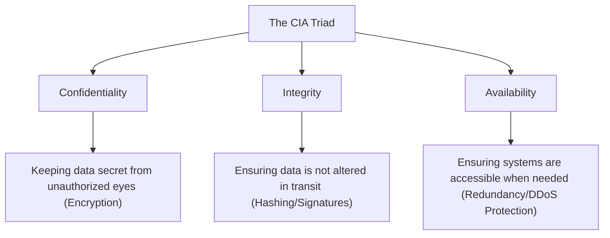
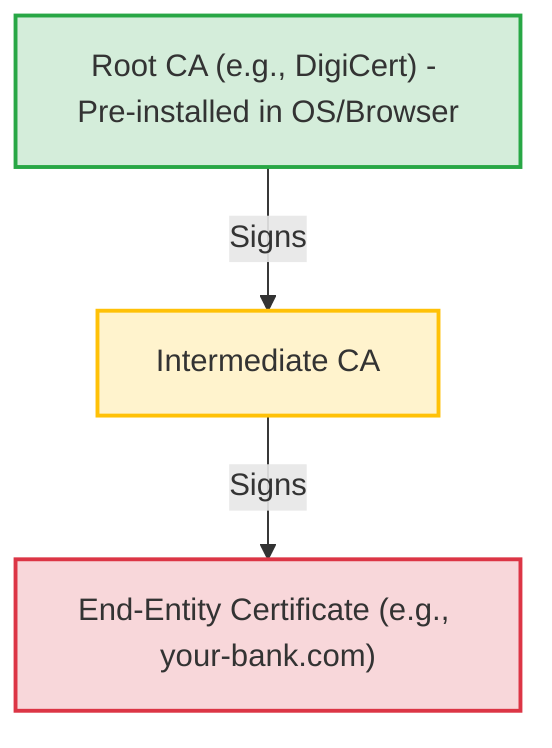
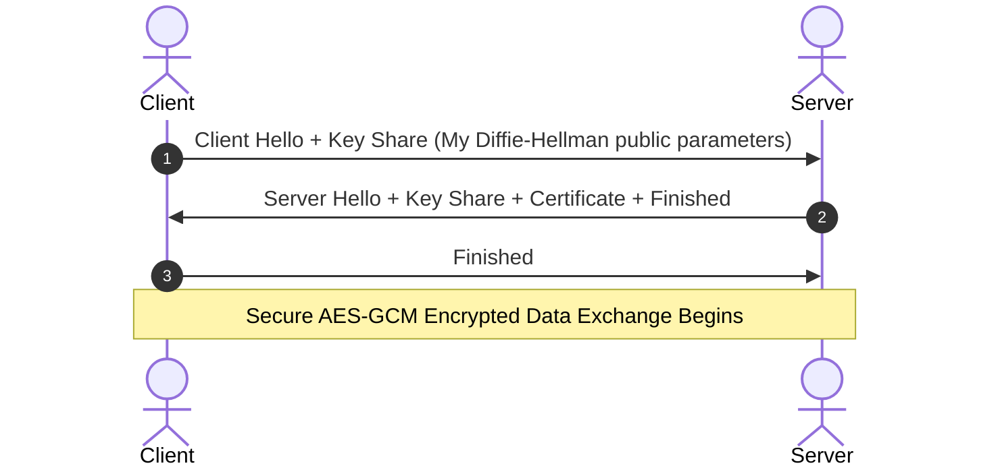
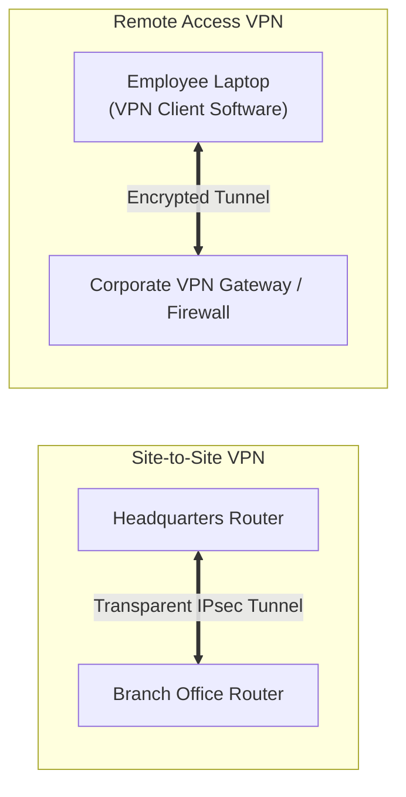
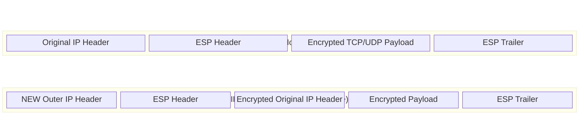
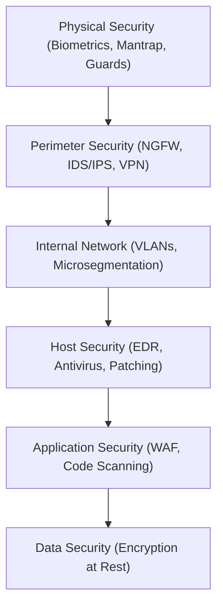

# Chapter 11: Network Security, VPNs, and Cryptography

## BEGINNER SECTION: The Foundations of Network Security

### Why Network Security Matters
Network security is fundamentally about protecting data as it traverses untrusted environments. Whenever you send an email, access a bank account, or stream a video, your data is broken into packets that cross dozens of routers and switches controlled by unknown third parties, Internet Service Providers (ISPs), and potentially malicious actors. Because the internet was originally designed for connectivity rather than security, early protocols (like HTTP, Telnet, and FTP) transmitted data in pure, readable plaintext. 

Today, network security matters because every packet that crosses an untrusted network is vulnerable to interception (sniffing), modification (tampering), or disruption (denial of service). Without robust security frameworks, the modern digital economy would collapse under the weight of rampant fraud and data theft.

### The CIA Triad: The Core of Security Architecture
Every security protocol, firewall rule, and encryption algorithm in existence maps back to three core principles known as the CIA Triad.

1. **Confidentiality**: This ensures that only authorized parties can read the data. If a packet is intercepted by a malicious attacker on a public Wi-Fi network, confidentiality ensures all they see is scrambled gibberish. The primary mechanism for confidentiality is **encryption**.
2. **Integrity**: This ensures that the data has not been altered, tampered with, or corrupted in transit. If an attacker tries to change a bank transfer amount from $100 to $10,000, integrity checks will fail, and the packet will be rejected. The primary mechanisms for integrity are **hashing, digital signatures, and MACs (Message Authentication Codes)**.
3. **Availability**: This ensures that network resources and services are accessible to authorized users when needed. A network is useless if it is securely locked down but completely offline. Availability is maintained through **hardware redundancy, failover clusters, load balancing, and DDoS mitigation**.

### Additional Critical Concepts
Beyond the CIA triad, three supplementary concepts form the backbone of identity and access management:
- **Authentication**: Proving you are who you say you are (e.g., passwords, biometrics, multi-factor authentication).
- **Authorization**: Determining what you are allowed to do once you are authenticated (e.g., standard user vs. administrator privileges).
- **Non-repudiation**: Ensuring that a sender cannot mathematically or legally deny having sent a message. Digital signatures provide non-repudiation because they prove the message was signed by a specific private key.

### What is Encryption?
Encryption is the mathematical process of scrambling plaintext data into unreadable ciphertext so that only the intended recipient, who possesses the correct decryption key, can read it.

#### The Caesar Cipher Analogy
The earliest and simplest form of encryption is the Caesar Cipher, famously used by Julius Caesar. It operates by shifting letters by a fixed number. If the shift key is 3:
- 'A' becomes 'D'
- 'B' becomes 'E'
- 'C' becomes 'F'
The plaintext word "CAB" becomes the ciphertext "FDE". To decrypt it, the recipient simply shifts the letters back by 3.

#### Why Simple Ciphers Fail
Simple substitution ciphers like the Caesar cipher are completely broken today due to:
1. **Short Key Space**: A Caesar cipher only has 25 possible keys (shifts). A modern computer can test all of them in a fraction of a millisecond.
2. **Frequency Analysis**: In the English language, the letter 'E' is the most common. If an attacker analyzes the ciphertext and notices the letter 'X' appears most frequently, they can reliably deduce that 'X' equals 'E', instantly breaking the cipher structure.

#### Modern Encryption
Modern encryption algorithms do not just shift letters; they utilize highly complex mathematical transformations, permutations, and substitutions operating at the binary bit level. They use massive keys (e.g., 256 bits, which means 2^256 possible combinations). It is mathematically infeasible to brute-force a modern 256-bit key; it would take the world's most powerful supercomputers millions of years to guess the key.

### What is a VPN?
A VPN (Virtual Private Network) is a secure, encrypted tunnel established through an untrusted network (like the public internet). 

**Real-World Analogy**: 
Imagine a busy public highway (the internet) where anyone standing on the overpass (a hacker/ISP) can see the cars (packets), who is driving them (source IP), and where they are going (destination IP). A VPN is like building a solid concrete, opaque tube directly down the middle of the highway. Your car drives inside this tube. People on the overpass know the tube exists, and they know traffic is flowing through it, but they have absolutely no idea what kind of cars are inside, who is driving them, or what is in their trunks. 

### HTTPS: The Padlock Icon
When you visit a website, the padlock icon in your browser's address bar indicates that the site is using HTTPS (Hypertext Transfer Protocol Secure). HTTPS is simply standard HTTP traffic that has been wrapped in a secure cryptographic tunnel called TLS (Transport Layer Security). This ensures that everything you send to the website—passwords, credit card numbers, search queries—is strictly confidential and verified for integrity.

---

## INTERMEDIATE SECTION: Cryptography Fundamentals and Protocols

Cryptography is divided into several specialized mathematical disciplines. Understanding how these disciplines work together is critical for securing networks.

### 1. Symmetric Encryption
Symmetric encryption uses the **exact same key** to both encrypt and decrypt the data. 

- **Pros**: It is incredibly fast and highly efficient. Modern CPUs have dedicated hardware instructions (like AES-NI) that can process symmetric encryption at wire speed, making it perfect for encrypting massive bulk data payloads (like streaming a 4K movie or transferring a 100GB file).
- **Cons**: The Key Distribution Problem. If both parties need the exact same key to communicate, how do they securely share that key across an unsecure internet in the first place? If an attacker intercepts the key during the initial exchange, the entire encryption system is compromised.

#### Symmetric Algorithms:
- **DES (Data Encryption Standard)**: An ancient standard with a 56-bit key. It is completely broken and can be brute-forced by modern hardware in hours. Never use DES.
- **3DES (Triple DES)**: Applies the DES algorithm three times sequentially, resulting in a 112-bit effective security strength. It is incredibly slow, CPU-intensive, and is currently being phased out globally.
- **AES (Advanced Encryption Standard)**: The current global gold standard. Supports 128-bit, 192-bit, and 256-bit keys. 
  - **AES-128**: Highly secure, unbreakable by current technology, and used in most commercial web applications.
  - **AES-256**: Maximum security, heavily utilized by military, government, and top-secret intelligence agencies.
- **RC4**: A stream cipher widely used in the early days of SSL and WEP wireless security. It is mathematically broken and strictly deprecated.
- **ChaCha20**: A modern, highly secure stream cipher. It is exceptionally fast in software (even on low-power IoT or mobile devices without hardware acceleration). It is heavily utilized in TLS 1.3 and WireGuard VPNs.

#### Modes of Operation
A block cipher like AES encrypts data in fixed-size blocks (e.g., 128 bits at a time). How these blocks are chained together is called the "Mode of Operation":
- **ECB (Electronic Codebook)**: The simplest and most insecure mode. Identical plaintext blocks produce identical ciphertext blocks. If you encrypt a bitmap image using ECB, you can still see the outline of the original image in the encrypted data. Never use ECB.
- **CBC (Cipher Block Chaining)**: Each plaintext block is XORed with the previous ciphertext block before encryption, utilizing an Initialization Vector (IV) for the first block. Much more secure, but vulnerable to padding oracle attacks if not implemented perfectly.
- **CTR (Counter Mode)**: Turns a block cipher into a stream cipher by encrypting an incrementing counter. 
- **GCM (Galois/Counter Mode)**: The industry standard. AES-GCM provides **AEAD (Authenticated Encryption with Associated Data)**. This means it provides both confidentiality (encryption) AND integrity (authentication) simultaneously in one highly efficient pass.

### 2. Asymmetric (Public-Key) Encryption
Asymmetric encryption solves the key distribution problem by utilizing **two mathematically linked keys**:
1. **Public Key**: Shared freely with the entire world. Anyone can have it.
2. **Private Key**: Kept absolutely secret. Never shared with anyone.

**The Golden Rules of Asymmetric Encryption**:
- If you encrypt data with a person's Public Key, **only** their Private Key can decrypt it (ensuring Confidentiality).
- If you mathematically sign data with your Private Key, **anyone** with your Public Key can verify the signature (ensuring Integrity and Non-repudiation, because only you possess the Private Key).

#### Asymmetric Algorithms:
- **RSA (Rivest-Shamir-Adleman)**: Based on the extreme mathematical difficulty of factoring the product of two incredibly large prime numbers. Typically uses 1024, 2048, or 4096-bit keys. 2048-bit is the minimum safe standard today. RSA is primarily used for key exchanges and digital signatures.
- **ECC (Elliptic Curve Cryptography)**: Based on the algebraic structure of elliptic curves over finite fields. ECC is a massive leap forward because it provides the exact same level of security as RSA but with drastically smaller key sizes. A 256-bit ECC key offers the same cryptographic strength as a massive 3072-bit RSA key. Because the keys are smaller, it requires less CPU compute and memory, making it the undisputed champion for mobile devices and IoT.
- **Diffie-Hellman Key Exchange (DH/ECDH)**: A mathematical method allowing two parties to agree on a shared secret over an insecure channel **without ever transmitting the secret itself**. It is based on the discrete logarithm problem. DH is purely for key agreement, not for general data encryption. **ECDH** is the modern Elliptic Curve variant of Diffie-Hellman.

**Disadvantage**: Asymmetric cryptography is mathematically heavy. It is roughly 1,000 to 10,000 times slower than symmetric encryption (AES). 

### 3. Hybrid Encryption: The Best of Both Worlds
Because asymmetric encryption is too slow for bulk data, and symmetric encryption suffers from the key distribution problem, modern protocols like TLS use **Hybrid Encryption**.

**The Process**:
1. The client and server use Asymmetric Encryption (like RSA or ECDH) to securely negotiate and exchange a temporary, shared Symmetric Key across the unsecure internet.
2. Once both sides have the shared Symmetric Key, they discard the heavy asymmetric math.
3. They use the fast Symmetric Key (e.g., AES-GCM) to encrypt all the actual data (video streams, web pages, file downloads).

### 4. Hashing (Data Integrity)
Hashing is **not** encryption. Encryption is a two-way street (encrypt and decrypt). Hashing is a **one-way mathematical function**. 

You feed a variable amount of data (a single word, or a 10-Terabyte database) into a hashing algorithm, and it outputs a fixed-size string of characters called a "digest" or "hash".

**Core Properties of a Secure Hash**:
- **One-Way**: You cannot mathematically reverse a hash to figure out the original input.
- **Deterministic**: The exact same input will always produce the exact same output hash.
- **Avalanche Effect**: Changing even a single bit in the input (e.g., changing 'a' to 'A') will completely and unpredictably change the entire output hash.

**Hashing Algorithms**:
- **MD5 (128-bit)**: Cryptographically broken. Attackers can easily generate hash "collisions" (finding two different files that produce the exact same hash). Never use for security.
- **SHA-1 (160-bit)**: Broken and deprecated globally.
- **SHA-2 Family (SHA-256, SHA-512)**: The current global standard. Used everywhere from TLS certificates to Bitcoin.
- **SHA-3 (Keccak)**: A newer standard with a completely different internal architecture (sponge construction), highly resistant to attacks that might threaten SHA-2.
- **bcrypt / scrypt / Argon2**: Specialized hashing algorithms used exclusively for **password storage**. They are intentionally designed to be computationally slow and require heavy memory to resist brute-force dictionary attacks by GPU clusters.

**HMAC (Hash-based Message Authentication Code)**: Combines a standard cryptographic hash (like SHA-256) with a secret cryptographic key. It is used to verify both the data integrity and the authenticity of a message simultaneously.

### 5. Digital Certificates and PKI (Public Key Infrastructure)
How do you know the public key you just downloaded actually belongs to `google.com` and not an attacker sitting in a coffee shop running a Man-in-the-Middle attack? You use Digital Certificates.

A **Digital Certificate** is an electronic document that proves the identity of a server or organization. It acts like a digital passport. It contains:
- The owner's Public Key.
- Identity information (Domain Name, Organization Name).
- Validity period (Start Date, Expiry Date).
- The identity of the issuer (the Certificate Authority).
- **The Digital Signature of the Certificate Authority**.

A **Certificate Authority (CA)** is a trusted third-party organization (like DigiCert, Let's Encrypt, or GlobalSign) whose job is to verify identities and digitally sign certificates. 
- **Root CA**: The ultimate anchor of trust. Their certificates are "self-signed" and are pre-installed into the trusted root stores of Windows, macOS, iOS, and all major web browsers.
- **Intermediate CA**: Root CAs are highly valuable targets, so they are kept offline. Root CAs sign Intermediate CAs, which are then used to sign the day-to-day end-entity certificates for web servers.

**Certificate Validation Process**: When a browser connects to a server, it checks:
1. Does the certificate chain up to a trusted Root CA?
2. Is the current date within the validity period (not expired)?
3. Does the Subject Alternative Name (SAN) match the domain name in the URL?
4. Has the certificate been revoked? (Checked via CRL - Certificate Revocation List, or OCSP - Online Certificate Status Protocol).

*(Note: Self-signed certificates are generated locally by a user. They lack CA signatures, so browsers will throw severe security warnings. They should only be used in internal, isolated development environments).*

### SSL/TLS Deep Dive
SSL (Secure Sockets Layer) is the older, deprecated predecessor. SSLv2 and SSLv3 are hopelessly broken (e.g., POODLE attack). Today, we exclusively use **TLS (Transport Layer Security)**, specifically TLS 1.2 and TLS 1.3.

#### Simplified TLS 1.2 Handshake (2-RTT):
1. **Client Hello**: Client sends supported TLS versions, supported cipher suites, and a Random Client Number.
2. **Server Hello**: Server replies with the chosen cipher suite, a Random Server Number, and its Digital Certificate.
3. **Verification**: The client verifies the Server's certificate against its local trusted CA store.
4. **Key Exchange**: The client generates a "Pre-Master Secret", encrypts it with the Server's Public Key (found in the cert), and sends it to the server.
5. **Master Secret Derivation**: Both sides use the Pre-Master Secret, Client Random, and Server Random to mathematically derive the exact same Master Secret.
6. **Session Keys**: The Master Secret is used to generate the symmetric session keys.
7. **Change Cipher Spec**: Both sides send a message saying "I am switching to the encrypted channel now."
8. **Finished**: The first encrypted messages are sent, verifying the handshake wasn't tampered with.
9. **Data Exchange**: High-speed symmetric encryption (AES) begins.

#### TLS 1.3 Improvements
TLS 1.3 represents a massive overhaul of the protocol for modern security and speed.

**Key Features of TLS 1.3**:
- **Fewer Round Trips (1-RTT)**: As seen in the diagram, TLS 1.3 combines the Hello and the Key Exchange into a single round trip, vastly speeding up connection times.
- **0-RTT Resumption**: If a client has recently communicated with a server, it can send encrypted data immediately on the very first packet. *(Security Note: This introduces a minor risk of Replay Attacks, which servers must mitigate).*
- **Removed Weak Crypto**: Stripped out legacy, vulnerable algorithms. No more RC4, MD5, SHA-1, DES, or static RSA key exchange. The cipher suite list was radically simplified, drastically reducing the potential attack surface.
- **Mandatory Forward Secrecy**: Enforced through the exclusive use of Ephemeral keys.

#### Perfect Forward Secrecy (PFS)
In older implementations (like static RSA key exchange), if an intelligence agency recorded years of your encrypted traffic, and later managed to steal the server's private RSA key, they could retroactively decrypt all historical traffic. 

**Forward Secrecy** solves this. When using algorithms like ECDHE (Ephemeral Elliptic Curve Diffie-Hellman), **new, temporary, disposable keys are generated for every single session**. Once the session is over, the keys are permanently deleted from RAM. Even if the server's main private key is compromised years later, the attacker cannot decrypt past traffic because the ephemeral session keys no longer exist. 

---

## ADVANCED SECTION: Network Security Architecture and Tunnels

### VPN Technologies

#### 1. VPN Deployment Types

- **Site-to-Site VPN**: Connects two entire geographic networks together (e.g., New York HQ to London Branch). The VPN gateways (firewalls or routers) handle the encryption transparently. The end-users on the PCs do not need any VPN software; the traffic is automatically grabbed, encrypted, sent across the internet, decrypted, and routed to the destination LAN.
- **Remote Access VPN (Client-to-Site)**: Designed for individual teleworkers connecting to the corporate environment from unsecure public Wi-Fi or home networks. Requires dedicated VPN client software on the endpoint. It creates a virtual Network Interface Card (NIC) with a corporate IP address.
  - **Full Tunneling**: ALL internet traffic from the laptop is forced through the corporate VPN gateway. Highly secure, but places a massive bandwidth load on the corporate firewall.
  - **Split Tunneling**: Only traffic destined for corporate subnets is routed through the VPN. General internet traffic (like streaming Spotify or watching YouTube) goes directly out the user's local ISP. Reduces corporate bandwidth load, but increases security risk if the endpoint is compromised.

#### 2. IPsec (Internet Protocol Security)
IPsec is a complex suite of protocols operating at Layer 3 (Network Layer) to secure IP communications.

**Modes of Operation**:

- **Transport Mode**: Only the inner payload (the TCP/UDP data) is encrypted. The original IP header remains completely intact and visible. Primarily used for end-to-end host communication where routing isn't altered.
- **Tunnel Mode**: The *entire* original IP packet is encrypted and encapsulated inside a brand new outer IP header. The new outer IP header contains the public IP addresses of the VPN gateways. This completely hides the internal subnets from the public internet. Used almost exclusively in Site-to-Site VPNs.

**Core IPsec Protocols**:
- **AH (Authentication Header - Protocol 51)**: Provides strong integrity and data origin authentication for the entire packet (including the IP header). **It provides NO encryption (Confidentiality).** Furthermore, because it cryptographically signs the IP header, it breaks entirely when passing through NAT (Network Address Translation), because NAT fundamentally alters the source IP header. AH is rarely used in modern deployments.
- **ESP (Encapsulating Security Payload - Protocol 50)**: The workhorse of IPsec. Provides full confidentiality (encryption via AES), integrity, and authentication. Because ESP only authenticates the payload (not the outer IP header), it is NAT-compatible (utilizing a technology called NAT-Traversal, which wraps the ESP packet in UDP port 4500 to survive NAT translation).

**IKE / IKEv2 (Internet Key Exchange)**:
IPsec relies on IKE (UDP port 500) to negotiate the complex parameters before the tunnel can be built.
- **Phase 1**: Establishes the IKE SA (Security Association). This is a secure, encrypted management channel used to protect the subsequent negotiations.
- **Phase 2**: Uses the secure Phase 1 channel to negotiate the actual IPsec SAs (the algorithms and keys that will encrypt the real user data).
- **IKEv2**: A massive modernization. It requires fewer messages, is highly resilient to network drops, and supports MOBIKE (IKEv2 Mobility and Multihoming), allowing a user's VPN connection to seamlessly stay alive while switching from Wi-Fi to a 5G Cellular network.

**Security Associations (SAs)**: An SA is a one-way, specific cryptographic agreement. Therefore, a standard bidirectional IPsec ESP connection requires a minimum of two SAs (one for outbound traffic, one for inbound). 

#### 3. VPN Protocol Comparison

| VPN Protocol | Security & Encryption | Pros | Cons |
|---|---|---|---|
| **IPsec** | Strong (AES/ESP) | Native to most OS/Firewalls; enterprise standard for Site-to-Site. | Notoriously complex to configure and troubleshoot; NAT traversal issues. |
| **OpenVPN** | Strong (SSL/TLS based) | Open-source; highly configurable; easily bypasses firewalls using TCP port 443. | Very large, heavy codebase (~70,000 lines); not natively integrated into OS kernels. |
| **WireGuard** | Very Strong (ChaCha20, Curve25519) | Modern, ultra-lean codebase (~4,000 lines); lightning fast; built into Linux kernel. | Lacks dynamic IP allocation out-of-the-box in basic setups; purely UDP based. |
| **L2TP/IPsec** | Strong (IPsec ESP) | Natively supported on almost all mobile OS platforms. | Double encapsulation causes heavy overhead; easy for ISPs to block. |
| **SSTP** | Strong (SSL/TLS) | Microsoft proprietary; excellent firewall evasion (TCP 443). | Strictly tied to Windows ecosystems. |
| **PPTP** | **Critically Broken** | Fast (because it lacks real security). | MS-CHAPv2 auth is trivially cracked. **Never use.** |

---

### Wireless Security Frameworks
Wireless networks broadcast data radially through the air using RF waves. Anyone within physical proximity can capture those radio frames using a wireless adapter in monitor mode.

#### Wireless Standards Evolution
| Standard | Encryption / Integrity | Authentication Model | Security Status / Vulnerabilities |
|---|---|---|---|
| **WEP** (1997) | RC4 / CRC-32 | Pre-Shared Key (PSK) | **Completely Broken.** Can be cracked in literally minutes due to tiny 24-bit Initialization Vectors (IVs). **Never Use.** |
| **WPA** (2003) | RC4 / TKIP | PSK / Enterprise | A stopgap measure. TKIP is vulnerable to cryptographic attacks. **Avoid.** |
| **WPA2** (2004) | AES-CCMP | PSK / 802.1X Enterprise | Strong, but WPA2-Personal (PSK) is vulnerable to offline dictionary brute-force attacks if an attacker captures the 4-way EAPOL handshake. Also vulnerable to the 2017 KRACK (Key Reinstallation Attack), though largely patched. |
| **WPA3** (2018) | AES-GCM (192-bit mode available) | SAE / 802.1X Enterprise | **Current Standard.** Employs Forward Secrecy. Replaces weak PSK with SAE. |

**WPA3 Deep Dive**:
- **SAE (Simultaneous Authentication of Equals)**: Replaces the WPA2 PSK handshake with the "Dragonfly" handshake. SAE guarantees forward secrecy and is mathematically immune to offline dictionary attacks. Even if your Wi-Fi password is weak, an attacker cannot capture the handshake and crack it later on a GPU rig; they are forced to interact live with the AP for every single guess, triggering lockouts.
- **OWE (Opportunistic Wireless Encryption)**: Historically, public "Open" Wi-Fi (airports, cafes) transmitted data in pure plaintext. OWE allows open networks with no passwords to seamlessly and transparently encrypt connections individually for each client, preventing passive eavesdropping.
- **Enterprise 192-bit Mode**: Mandates CNSA (Commercial National Security Algorithm) suite cryptography for extreme security environments.

**Enterprise Wi-Fi (802.1X / EAP)**
In WPA2/WPA3 Personal, everyone shares the same password. In an enterprise, this is a disaster (if an employee leaves, you have to change the Wi-Fi password for 5,000 people). 
802.1X solves this by requiring unique credentials for every device/user.
- **Supplicant**: The client laptop/phone.
- **Authenticator**: The Wireless Access Point or Switch.
- **Authentication Server**: The central RADIUS/TACACS+ server verifying credentials against Active Directory.
*EAP Methods*:
- **PEAP**: Uses a server-side certificate to create a TLS tunnel, inside of which the user sends standard username/password.
- **EAP-TLS**: The gold standard. Requires both a server certificate AND a client certificate installed on the endpoint device. Extremely difficult to spoof or phish.

---

### Network Segmentation and Architecture

#### Defense in Depth
Security is not a hard crunchy shell with a soft chewy center. If an attacker breaches the perimeter firewall, they should not have free reign over the internal network. Defense in Depth is a layered approach.

#### Network Segmentation
Segmentation involves logically dividing the network into distinct security zones and strictly controlling the traffic that flows between them using firewalls and Access Control Lists (ACLs). 
- **Internet**: Untrusted external space.
- **DMZ (Demilitarized Zone)**: A buffer network housing public-facing servers (Web Servers, Email Relays). If a web server in the DMZ is compromised, the firewall blocks the attacker from pivoting from the DMZ into the Corporate LAN.
- **Corporate LAN**: Where employee workstations reside.
- **Management Network**: A strictly isolated out-of-band network used purely by IT administrators to manage routers and servers via SSH.

#### Zero Trust Architecture (ZTA)
Traditional networking operated on "Implicit Trust" (if an IP address was internal, it was trusted). Zero Trust operates on the mantra **"Never Trust, Always Verify."**
- Trust is never granted based on physical or network location.
- Every single request (to an API, a server, a database) is dynamically authenticated and authorized.
- Requires robust identity management, continuous device health checking (e.g., does this laptop have its EDR agent running and patched?), and extreme least-privilege access.
- Implemented via **Microsegmentation**: Firewall policies pushed directly to the virtual network interfaces of individual VMs or containers, creating security zones of a single host.

#### Air-Gapped Networks
An air-gapped network is physically, electrically, and electromagnetically isolated from the internet and all other unsecure networks. Used in nuclear power plants, military command-and-control, and top-secret intelligence facilities. Data can only cross the air-gap via highly controlled physical media (e.g., scanning a USB drive on a standalone kiosk before physically walking it into the secure room). 

---

### Cloud Network Security

When migrating to the cloud (AWS, Azure, GCP), physical firewalls are replaced by virtualized, software-defined network controls.

#### Security Groups vs. Network Access Control Lists (NACLs)

| Feature | Security Groups (SG) | Network Access Control Lists (NACLs) |
|---|---|---|
| **Attachment Scope** | Applied directly to individual Instances / Elastic Network Interfaces (ENIs). | Applied to the entire Subnet boundary. |
| **Statefulness** | **Stateful**: If you allow incoming port 443, the return traffic is automatically allowed back out, regardless of outbound rules. | **Stateless**: You must explicitly create two rules (one inbound allowing port 443, and one outbound allowing the ephemeral return ports). |
| **Rule Types** | Supports ALLOW rules only. Everything else is implicitly denied. | Supports both explicit ALLOW and DENY rules. |
| **Evaluation Logic** | All rules are evaluated simultaneously before making a decision. | Rules are evaluated strictly in numerical order (lowest to highest). The first match determines the action. |
| **Primary Use** | Primary micro-firewall protecting the actual host OS running the application. | A secondary, broad defense layer to block known malicious IP subnets before they even reach the SG. |

---

## Exam Tips & Common Traps
- **TRAP**: Confusing Symmetric and Asymmetric key counts. *Symmetric* uses ONE shared key. *Asymmetric* uses TWO mathematically linked keys (Public/Private).
- **TIP**: If asked about the fastest encryption for bulk data, the answer is always a Symmetric algorithm (AES, ChaCha20).
- **TRAP**: Believing AH provides encryption. It does NOT. Authentication Header (AH) provides integrity and authentication only. For confidentiality in IPsec, you must select ESP.
- **TIP**: Know the difference between Transport and Tunnel mode. Transport = Host-to-Host (Payload only). Tunnel = Site-to-Site (Entire IP packet encapsulated in a new IP header).
- **TRAP**: WPA2 vs WPA3 attacks. WPA2 is vulnerable to offline dictionary attacks via the 4-way handshake capture. WPA3 replaces this with SAE, completely mitigating offline dictionary attacks.
- **TIP**: Statefulness in the Cloud. Security Groups are Stateful. NACLs are Stateless. Memorize this distinction for any cloud architecture exam.

---

## Key Terms Glossary
- **AEAD (Authenticated Encryption with Associated Data)**: A form of encryption which simultaneously provides confidentiality, integrity, and authenticity. AES-GCM is a prime example.
- **BGP Hijacking**: The malicious or accidental rerouting of internet traffic by falsely advertising BGP prefixes (e.g., the 2008 Pakistan YouTube incident).
- **Forward Secrecy (PFS)**: A property of secure communication protocols where compromise of long-term keys does not compromise past session keys.
- **Split Tunneling**: A VPN configuration where corporate traffic goes through the encrypted tunnel, while general internet traffic bypasses the tunnel.
- **Telemetry / gNMI**: Modern, gRPC-based network management interfaces that replace legacy SNMP polling with highly efficient streaming telemetry.
- **Avalanche Effect**: A cryptographic property where a minor change in the input (plaintext or hash input) causes a massive, unpredictable change in the output.
