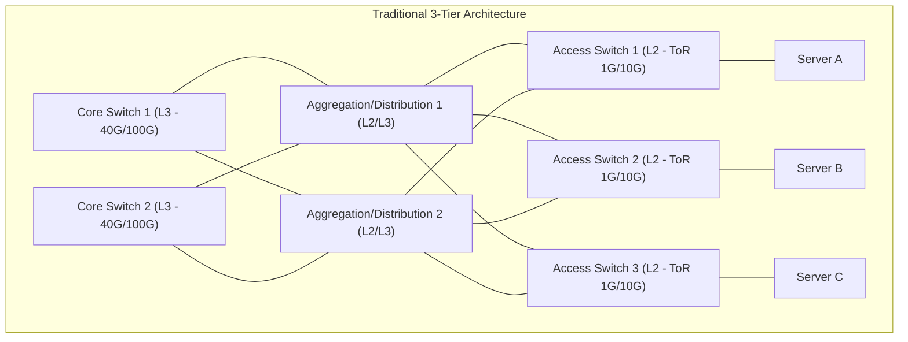
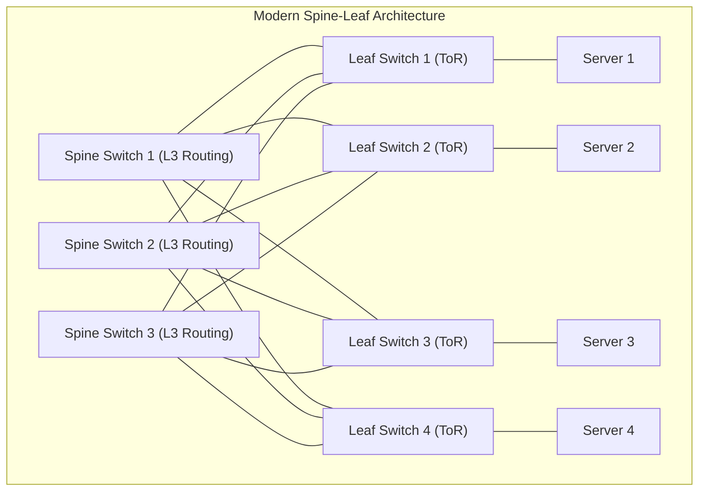
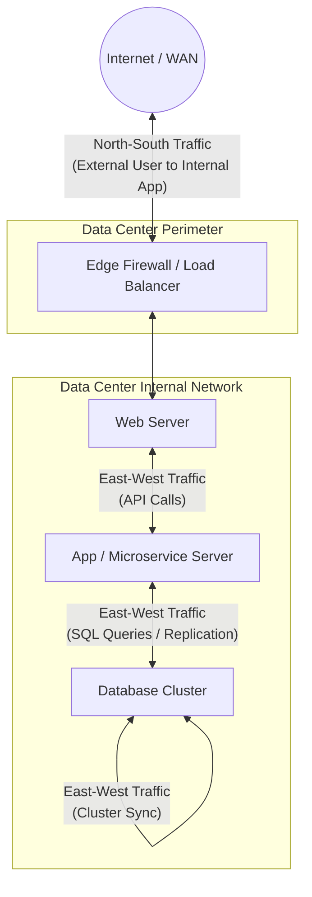
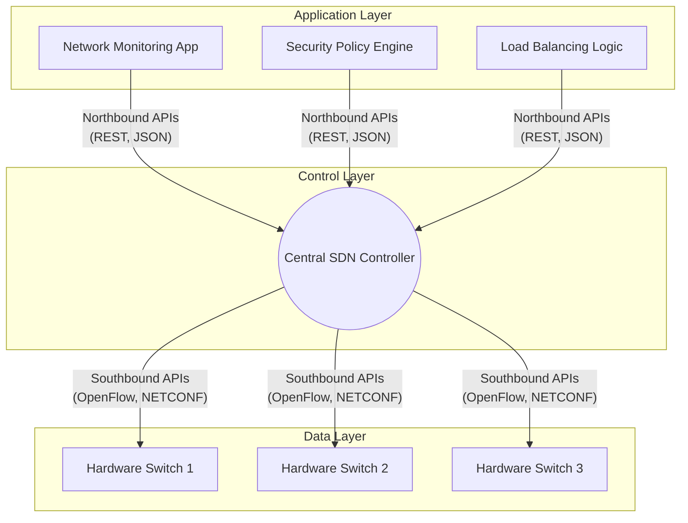

# Chapter 13: Modern Networking, Cloud, and Data Centers

## Introduction

As organizations transition from localized, on-premises infrastructure to globally distributed digital ecosystems, the underlying networking architecture must evolve to meet unprecedented demands for scalability, automation, and resilience. This chapter provides an exhaustive, multi-tiered exploration of the modern infrastructure landscape. We will systematically deconstruct the physical realities of Data Centers, the virtualization abstractions of Cloud Computing, the architectural paradigm shifts from legacy 3-Tier to modern Spine-Leaf topologies, and the advanced traffic engineering mechanics that govern Quality of Service (QoS) and Software-Defined Networking (SDN). 

This document is designed to guide practitioners from foundational concepts to advanced architectural design patterns, equipping you with the theoretical depth and practical engineering knowledge required for modern network administration, cloud architecture, and cybersecurity.

---

## BEGINNER SECTION: Foundations of Infrastructure

### 1. What is a Data Center?

A Data Center (DC) is a specialized, highly secure physical facility designed to house critical computing systems, storage repositories, and network infrastructure. It serves as the centralized brain of modern digital operations, processing, storing, and distributing massive volumes of data.

**Real-World Analogy:**
Imagine a data center as an ultra-secure, hyper-efficient digital warehouse. Just as a physical warehouse requires loading docks, forklift paths, climate control to preserve goods, and security guards, a data center requires network links (loading docks), routing topologies (forklift paths), HVAC systems (climate control), and firewalls/physical mantraps (security guards) to protect and move information.

#### Core Components of a Data Center:
1. **Compute Resources:** High-density server racks containing thousands of multi-core processors and massive RAM arrays (the "brains").
2. **Storage Systems:** Enterprise-grade Storage Area Networks (SANs) and Network Attached Storage (NAS) utilizing NVMe and SSD arrays for sub-millisecond data retrieval (the "filing cabinets").
3. **Network Infrastructure:** High-throughput routers, core switches, load balancers, and thousands of miles of fiber-optic cabling (the "highways").
4. **Power & Cooling (Facility Infrastructure):** 
   - **Power:** Uninterruptible Power Supplies (UPS) and massive diesel generators ensuring 99.999% (Five Nines) uptime during grid failures.
   - **Cooling:** Precision Computer Room Air Conditioning (CRAC) units, hot/cold aisle containment, and liquid cooling systems to dissipate the massive heat generated by thousands of densely packed CPUs.
5. **Physical Security:** Multi-layered defense including biometric scanners, mantraps, CCTV, and armed perimeter security.

**Security Implications & Attack Vectors:**
While logical network attacks are common, physical data center breaches can result in total system compromise. An attacker gaining physical access could simply plug a rogue device into an exposed Top-of-Rack switch, bypassing multimillion-dollar perimeter firewalls. Therefore, zero-trust security must extend to the physical layer.

### 2. Types of Data Centers

Organizations choose different data center models based on capital expenditure limits, compliance requirements, and operational capabilities.

1. **Enterprise (On-Premises) Data Center:**
   - **Definition:** Fully owned, operated, and maintained by the organization.
   - **Pros:** Absolute control over data sovereignty, hardware configurations, and security policies.
   - **Cons:** Massive Capital Expenditure (CapEx) for real estate, cooling, and hardware. Difficult to scale rapidly.
   - **Security:** Security is completely internal; compliance is the sole responsibility of the organization.

2. **Colocation (Colo) Data Center:**
   - **Definition:** A facility where an organization rents physical space (racks or cages), power, and cooling from a provider (e.g., Equinix), but brings and manages its own server and network hardware.
   - **Pros:** Reduces the CapEx of building a facility. Provides access to diverse telecom carriers.
   - **Cons:** Still requires purchasing and managing the hardware (servers/switches) and dispatching technicians for physical maintenance.
   - **Security:** Shared physical security. The provider secures the building perimeter, while the organization secures its locked cage and logical networks.

3. **Cloud Data Center:**
   - **Definition:** Massive, globally distributed facilities owned by hyperscalers (Amazon, Microsoft, Google) where infrastructure is completely abstracted and rented as virtual resources on-demand.
   - **Pros:** Shifts cost from CapEx to Operational Expenditure (OpEx). Infinite, instant scalability.
   - **Cons:** Loss of physical control. Potential data sovereignty and vendor lock-in concerns.
   - **Security:** Governed by the Shared Responsibility Model (discussed below).

### 3. What is Cloud Computing?

Cloud computing is the on-demand delivery of IT resources (compute, storage, databases, networking) over the Internet with pay-as-you-go pricing. It eliminates the need for organizations to buy, own, and maintain physical data centers.

#### Key Characteristics (NIST Definition):
1. **On-Demand Self-Service:** Users can provision computing capabilities automatically without human interaction with the service provider.
2. **Broad Network Access:** Capabilities are available over the network and accessed through standard mechanisms (web browsers, APIs).
3. **Resource Pooling:** The provider's computing resources are pooled to serve multiple consumers using a multi-tenant model.
4. **Rapid Elasticity:** Capabilities can be elastically provisioned and released to scale rapidly outward and inward commensurate with demand.
5. **Measured Service:** Resource usage can be monitored, controlled, and reported, providing transparency (billing per second/minute/byte).

#### Cloud Service Models

Cloud computing is typically categorized into three fundamental service models, each offering a different level of abstraction and control.

| Feature / Model | IaaS (Infrastructure as a Service) | PaaS (Platform as a Service) | SaaS (Software as a Service) |
|---|---|---|---|
| **What It Is** | Virtualized raw hardware (VMs, networks, storage). | A managed platform for deploying applications. | A fully functional, ready-to-use software application. |
| **You Manage** | OS, Runtime, Middleware, Data, Applications. | Data, Applications. | Nothing (only user access and data inputs). |
| **Provider Manages** | Physical hardware, Hypervisor, Network, Storage. | Hardware, Hypervisor, OS, Runtime, Middleware. | Everything (Infrastructure to Application UI). |
| **Real-World Examples**| AWS EC2, Azure Virtual Machines, Google Compute Engine. | AWS Elastic Beanstalk, Google App Engine, Heroku. | Gmail, Salesforce, Microsoft Office 365. |
| **Target Audience** | System Administrators, Network Engineers. | Software Developers. | End Users, Business Consumers. |

**The Shared Responsibility Model:**
In the cloud, security is shared. The cloud provider is responsible for "Security OF the Cloud" (physical data centers, host OS, hypervisors, physical networking). The customer is responsible for "Security IN the Cloud" (guest OS patching, firewall rules, IAM policies, encryption of data).

#### Cloud Deployment Models
1. **Public Cloud:** Infrastructure is owned by the provider and shared among multiple tenants over the public internet (e.g., AWS, Azure).
2. **Private Cloud:** Cloud infrastructure operated solely for a single organization, hosted either on-premises or by a third party.
3. **Hybrid Cloud:** A combination of Public and Private clouds bound together by proprietary or standard technology (e.g., extending an on-prem data center to AWS via a VPN or Direct Connect).

### 4. Cast and Transmission Modes

In networking, data must be addressed and transmitted from a source to a destination. The way a packet is duplicated and targeted defines its "cast" mode.

| Cast Mode | Definition | Scope & Routing | IP / Protocol Examples | Real-World Analogy |
|---|---|---|---|---|
| **Unicast** | One-to-One. A single sender transmitting a message to a single, specific receiver. | Globally routable across the internet. Most common traffic type. | TCP connections, HTTP web browsing, SSH sessions. | A private telephone call between two specific people. |
| **Broadcast** | One-to-All. A single sender transmitting a message to EVERY node on the local network segment. | Strictly limited to the local subnet. Routers actively block and drop broadcast packets to prevent internet storms. | ARP Requests (finding a MAC address), DHCP Discover messages. | A person shouting through a megaphone in a crowded room. Everyone hears it. |
| **Multicast** | One-to-Many. A single sender transmitting to a specific, subscribed group of receivers. | Routable, but requires specific protocols (PIM, IGMP). Uses Class D IP range (`224.0.0.0/4`). | Live video streaming (IPTV), stock price ticker feeds, OSPF/EIGRP routing protocol updates. | A radio broadcast. Only those tuned to the specific frequency (subscribed) receive the music. |
| **Anycast** | One-to-Nearest. A single IP address is announced by multiple distributed servers. The network routes the client to the closest physical server. | Globally routable using BGP metric manipulation. Used for high-availability and global scaling. | DNS Root Servers, Cloudflare's `1.1.1.1`, Google's `8.8.8.8` DNS. | Calling "911" (or "112"). The same number routes you to the closest local dispatch center, not a single global center. |

**Deep Dive: The Magic of Anycast**
Anycast is not a distinct IP class; it uses standard Unicast IP addresses. Its magic happens at the routing layer (BGP). 
- If Google assigns `8.8.8.8` to a server in New York, another in London, and another in Tokyo, all three servers advertise the route to `8.8.8.8` via BGP to the global internet.
- A user in Paris looks for `8.8.8.8`. The internet routers evaluate the BGP paths and determine that the London server is the "shortest path."
- **Benefits:** Automatic failover (if London goes offline, BGP recalculates and routes the Paris user to New York), massive geographic load distribution, and inherent DDoS mitigation (a global botnet attacking `8.8.8.8` will have its traffic safely absorbed and distributed across dozens of data centers locally, preventing a single point of failure).

---

## INTERMEDIATE SECTION: Data Center and Cloud Architectures

### 1. Data Center Network Architectures

The physical layout of switches and routers in a data center dictates its performance, scalability, and suitability for modern workloads. We will contrast the legacy approach with the modern standard.

#### A. Traditional 3-Tier Architecture

For over a decade, the 3-Tier (Hierarchical) design was the gold standard for enterprise networks and early data centers. It breaks the network into three distinct functional layers.



**1. Access Layer (Tier 1):**
- **Function:** Where end-devices (servers) physically connect to the network.
- **Hardware:** Top-of-Rack (ToR) or End-of-Row (EoR) switches. Typically provides 1G or 10G server-facing ports.
- **Features:** Performs Layer 2 MAC-based switching, applies VLAN tagging (802.1Q), and implements basic QoS trust boundaries.

**2. Aggregation / Distribution Layer (Tier 2):**
- **Function:** Aggregates multiple Access switches before uplinking to the Core. Serves as the boundary between Layer 2 (switching) and Layer 3 (routing).
- **Features:** Performs inter-VLAN routing, applies security Access Control Lists (ACLs), and handles stateful packet inspection.
- **Uplinks:** Typically 10G down to Access, 40G up to Core.

**3. Core Layer (Tier 3):**
- **Function:** The high-speed routing backbone. Connects different aggregation blocks and connects the data center to the WAN/Internet border routers.
- **Features:** Minimal features to maximize raw throughput. Purely focused on high-speed Layer 3 packet forwarding (40G/100G+).

**Design Problems & The Need for Change:**
The 3-tier model is highly optimized for **North-South traffic** (clients on the internet downloading a web page from a server). However, it suffers severe limitations in modern environments:
- **Hairpinning (Trombone Routing):** If Server A needs to talk to Server B (on a different VLAN), the traffic must travel all the way up from Access -> Aggregation (to be routed) -> and back down to Access. This adds latency and congests the uplinks.
- **Spanning Tree Protocol (STP) Inefficiencies:** To prevent Layer 2 loops between the Access and Aggregation layers, STP must block redundant links. If you pay for two 10G uplinks, STP blocks one, wasting 50% of your bandwidth capacity.
- **Difficult Scale-Out:** If you need more servers, you add Access switches, which overwhelm the Aggregation switches, which then overwhelm the Core. Upgrading means ripping and replacing massive modular chassis switches (scale-up), rather than just adding small switches (scale-out).

#### B. Spine-Leaf Architecture (Modern Data Center)

To solve the limitations of the 3-Tier model, modern data centers (and hyperscalers) adopted the **Spine-Leaf** (CLOS) architecture.



**Topology Rules (Strict):**
1. Every Leaf switch must connect to EVERY Spine switch.
2. Spine switches NEVER connect to other Spine switches.
3. Leaf switches NEVER connect to other Leaf switches.
4. Endpoints (servers, firewalls, load balancers) ONLY connect to Leaf switches.

**Key Properties & Advantages:**
- **Deterministic Latency:** Any server can communicate with any other server in exactly the same number of network hops (Server -> Leaf -> Spine -> Leaf -> Server). This guarantees consistent, predictable latency crucial for clustered databases and high-frequency trading.
- **Optimized for East-West Traffic:** Massive horizontal bandwidth between servers.
- **No Spanning Tree Protocol (STP):** Spine-Leaf heavily utilizes Layer 3 routing protocols (like OSPF or BGP) down to the Leaf layer. Because it is a routed network, it utilizes **ECMP (Equal-Cost Multi-Path)**.
- **ECMP Benefits:** Instead of blocking redundant links like STP, ECMP actively load-balances traffic across all available paths. If there are 4 Spines, a Leaf has 4 active, usable paths to reach any other Leaf, multiplying available bandwidth.
- **Horizontal Scaling:** If you run out of ports for servers, you add a Leaf switch and connect it to all Spines. If you run out of bandwidth, you add a Spine switch and connect it to all Leafs.

**Protocols Used in Spine-Leaf:**
- **Underlay Network (OSPF / eBGP):** The physical IP network used purely to establish reachability between the loopback addresses of the Spine and Leaf switches.
- **Overlay Network (VXLAN):** Virtual Extensible LAN. Because the underlay is all Layer 3 routing, traditional Layer 2 VLANs cannot span across the data center. VXLAN solves this by encapsulating the original Ethernet frame inside a UDP packet (Port 4789).
  - *Mathematical scale:* Traditional VLANs use a 12-bit ID ($2^{12} = 4,096$ max networks). VXLAN uses a 24-bit VNI (VXLAN Network Identifier), allowing $2^{24} = 16.7$ million isolated virtual networks.
- **Control Plane (BGP EVPN):** Ethernet VPN acts as the intelligent control plane for VXLAN, advertising MAC addresses and IP addresses via BGP rather than relying on inefficient legacy "flood-and-learn" ARP broadcasting.

#### Architecture Comparison Summary

| Feature | Traditional 3-Tier | Modern Spine-Leaf |
|---|---|---|
| **Primary Traffic Focus** | North-South (Client to Server) | East-West (Server to Server) |
| **Layers** | 3 (Core, Aggregation, Access) | 2 (Spine, Leaf) |
| **Redundancy Mechanism** | Spanning Tree Protocol (STP) | Equal-Cost Multi-Path (ECMP) Routing |
| **Link Utilization** | 50% (Active/Standby via STP blocks) | 100% (Active/Active via ECMP load balancing) |
| **Scaling Methodology** | Scale-Up (Buy bigger Core chassis) | Scale-Out (Add more Spine/Leaf nodes horizontally) |
| **Latency** | Variable (1 to 5+ hops depending on placement) | Consistent & Deterministic (Always 2 switch hops: Leaf-Spine-Leaf) |

### 2. Traffic Patterns: North-South vs. East-West

Understanding the direction of data flow is essential for determining where to place security firewalls and how much bandwidth to provision.



**North-South Traffic:**
- **Definition:** Traffic moving into or out of the data center perimeter. 
- **Example:** A customer on their home Wi-Fi connects to `amazon.com` (Southbound into the DC). The web server sends the HTML page back (Northbound out to the Internet).
- **Handling:** Handled by heavy edge perimeter devices (Edge Routers, Next-Gen Firewalls, WAFs, and public Load Balancers).
- **Historical Context:** In the early 2000s, this constituted 80% of data center traffic.

**East-West Traffic:**
- **Definition:** Traffic moving laterally within the data center, from server to server.
- **Example:**
  - **Microservices:** A single North-South user click might trigger 50 internal East-West API calls between decoupled microservices.
  - **Database Replication:** Active/Active database clusters constantly syncing gigabytes of state data.
  - **Virtualization (vMotion):** Moving a live Virtual Machine from one physical host to another, requiring massive memory transfers across the network.
- **Handling:** Handled by the Spine-Leaf fabric.
- **Modern Context:** Today, East-West traffic constitutes **80% to 90%** of all data center traffic, which was the primary catalyst for the death of the 3-Tier model and the rise of Spine-Leaf.

### 3. Cloud Virtual Networking (AWS / Azure / GCP)

When you deploy resources into a public cloud, you do not manage physical cables or hardware switches. Instead, you design a logically isolated software-defined network.

```mermaid
flowchart TD
    subgraph AWS Cloud Region
        IGW((Internet Gateway))
        
        subgraph VPC [Virtual Private Cloud - CIDR: 10.0.0.0/16]
            direction TB
            
            subgraph PubSub [Public Subnet - 10.0.1.0/24]
                RT_Pub[Route Table: 0.0.0.0/0 -> IGW]
                WebVM[Web Server VM (Public IP)]
                NAT[NAT Gateway (Elastic IP)]
            end
            
            subgraph PrivSub [Private Subnet - 10.0.2.0/24]
                RT_Priv[Route Table: 0.0.0.0/0 -> NAT Gateway]
                AppVM[Application VM (Private IP only)]
                DBVM[Database VM (Private IP only)]
            end
            
            IGW --- RT_Pub
            RT_Pub -.-> WebVM
            RT_Pub -.-> NAT
            
            NAT --- RT_Priv
            RT_Priv -.-> AppVM
            RT_Priv -.-> DBVM
        end
    end
```

#### Key Cloud Networking Components:

1. **VPC (Virtual Private Cloud) / VNet (Azure):**
   - **Concept:** A logically isolated, private slice of the cloud provider's network dedicated solely to your account.
   - **Addressing:** You define the IPv4 CIDR block. Example: Assigning `10.0.0.0/16` gives you 65,536 private IP addresses to architect your network.
   - **Default VPC:** A pre-configured VPC automatically created in every region with public subnets to allow beginners to launch instances immediately without networking knowledge.

2. **Subnets:**
   - **Concept:** Segmenting the large VPC CIDR into smaller, isolated networks across different Availability Zones (physical data centers).
   - **Public Subnet:** A subnet whose Route Table has a default route (`0.0.0.0/0`) pointing directly to an Internet Gateway. Instances here can be assigned Public IPs and accessed from the outside world. Used for Load Balancers, Bastion Hosts, and Web Servers.
   - **Private Subnet:** A subnet with NO direct route to the Internet Gateway. Instances here only have Private IPs. They are invisible and inaccessible from the public internet, providing extreme security. Used for Application servers, Microservices, and Databases.

3. **Internet Gateway (IGW):**
   - A horizontally scaled, redundant, highly available VPC component that allows communication between your VPC and the internet. It natively performs 1:1 Static NAT for any instance possessing a Public IP address.

4. **NAT Gateway:**
   - **The Problem:** Instances in the Private Subnet need to download OS updates or call external APIs, but they have no public IP and no route to the IGW.
   - **The Solution:** A NAT Gateway is placed inside the *Public Subnet*. The Private Subnet's route table points its internet traffic (`0.0.0.0/0`) to the NAT Gateway. 
   - **Mechanics:** The NAT Gateway masks the private instance's IP with its own Elastic Public IP, sends the request to the internet, receives the response, and forwards it back to the private instance. 
   - **Security:** It is *outbound-only*. An external attacker cannot ping or initiate a connection into the private subnet through a NAT Gateway.

5. **Route Tables:**
   - A set of rules (routes) used to determine where network traffic from your subnet or gateway is directed. 
   - **Local Route:** Every route table automatically includes a rule (e.g., `10.0.0.0/16 -> local`) that allows all subnets within the VPC to communicate with each other freely, bypassing firewalls.

#### Scaling and Interconnectivity:

6. **VPC Peering:**
   - **Concept:** A direct, encrypted, private point-to-point connection between two different VPCs. Traffic never traverses the public internet; it stays entirely on the AWS/Azure global fiber backbone.
   - **Limitation:** Peering is strictly *non-transitive*. If VPC A is peered to VPC B, and VPC B is peered to VPC C, **VPC A cannot talk to VPC C**. A direct peer between A and C must be explicitly created. 

7. **Transit Gateway (TGW):**
   - **Concept:** A cloud router that acts as a centralized hub to connect thousands of VPCs and on-premises networks together.
   - **Benefit:** Solves the non-transitive peering problem. Instead of managing a complex mathematical mesh of peering connections ($n(n-1)/2$), every VPC simply connects to the central Transit Gateway (Hub and Spoke model). You control traffic flow using Transit Gateway Route Tables.

8. **Direct Connect (ExpressRoute in Azure):**
   - **Concept:** A physical, dedicated fiber-optic network connection straight from your on-premises enterprise data center into the cloud provider's network, bypassing ISPs and the public internet entirely.
   - **Use Case:** Organizations requiring massive throughput (1 Gbps, 10 Gbps, 100 Gbps), ultra-consistent latency, and regulatory compliance that forbids data transmission over the public internet (e.g., financial trading data).

#### Cloud Security: Security Groups vs. NACLs

Network security in the cloud operates at two distinct boundaries.

| Feature | Security Group (SG) | Network Access Control List (NACL) |
|---|---|---|
| **Boundary Level** | Instance / Virtual NIC level (Host-based) | Subnet level (Network-based guardrail) |
| **Statefulness** | **Stateful:** If you allow inbound traffic on port 80, the return outbound traffic is automatically allowed, regardless of outbound rules. | **Stateless:** Return traffic is NOT automatically allowed. You must explicitly configure a rule for the return ephemeral ports. |
| **Rule Types** | Supports **Allow** rules only. (Implicit deny all at the end). | Supports both **Allow** and **Deny** rules. |
| **Evaluation Logic** | Evaluates **ALL** rules before making a decision. | Evaluates rules in strict **numerical order** (lowest number first). Stops evaluating as soon as a match is found. |
| **Default State** | Denies all inbound, allows all outbound. | Allows all inbound and outbound traffic. |
| **Primary Use Case** | Fine-grained, application-specific access control (e.g., "Allow IP X to access SSH"). | Broad network guardrails (e.g., "Block this known malicious IP range from entering the subnet at all"). |

---

## ADVANCED SECTION: Traffic Engineering & Automation

### 1. Quality of Service (QoS)

In a perfectly idle network, all packets traverse quickly. However, networks experience congestion. Without intervention, a router processing a massive file backup will queue and delay time-sensitive VoIP packets, causing the phone call to drop or stutter. **Quality of Service (QoS)** is the suite of mechanisms that classify, queue, and prioritize critical traffic over standard traffic.

#### Why QoS is Necessary:
Different applications have vastly different tolerances for network imperfections:
- **Voice over IP (VoIP):** Requires ultra-low latency (<150ms) and low jitter (variation in latency <30ms). However, it consumes very little bandwidth (8-64 kbps). Drops are devastating to the audio experience.
- **Streaming Video (Netflix, Zoom):** Requires sustained high bandwidth. Can tolerate moderate latency and jitter because the video player utilizes local buffering.
- **Bulk Data (File Transfers, Backups):** Highly tolerant to high latency and jitter. Just needs eventual delivery and guaranteed reliability (TCP).

#### Marking and Classification
To prioritize traffic, packets must be "colored" or marked so downstream routers know how to treat them.

1. **Layer 2 QoS (802.1p / CoS):**
   - Uses a 3-bit field inside the 802.1Q VLAN tag. 
   - Known as Class of Service (CoS) or Priority Code Point (PCP).
   - Provides 8 possible priority values (0-7). Value 7 is the highest priority (usually reserved for network control traffic).

2. **Layer 3 QoS (DSCP - Differentiated Services Code Point):**
   - Uses a 6-bit field inside the IP header's Type of Service (ToS) byte.
   - Provides $2^6 = 64$ possible priority values.
   - These markings persist across routed WAN links.

**Standard DSCP Values Reference Table:**
| DSCP Marking | Decimal Value | Meaning & Behavior | Typical Use Case |
|---|---|---|---|
| **EF (Expedited Forwarding)** | 46 (`101110`) | Strict Priority. Guaranteed minimum latency, jitter, and loss. | VoIP telephony, real-time interactive media. |
| **AF4x (Assured Forwarding 4)** | 34, 36, 38 | High priority, guaranteed bandwidth classes. Higher drop preference for higher numbers. | Interactive video, telepresence. |
| **AF3x (Assured Forwarding 3)** | 26, 28, 30 | Medium-high priority. | Broadcast video. |
| **AF2x (Assured Forwarding 2)** | 18, 20, 22 | Medium priority. | Transactional application data (e.g., SQL). |
| **AF1x (Assured Forwarding 1)** | 10, 12, 14 | Medium-low priority. | Bulk data (FTP, Email). |
| **CS0 / BE (Best Effort)** | 0 (`000000`) | Default treatment. No guarantees, drops permitted during congestion. | Standard web browsing, unknown traffic. |

#### QoS Architectures (IntServ vs. DiffServ)

| Feature | IntServ (Integrated Services) | DiffServ (Differentiated Services) |
|---|---|---|
| **Mechanism** | Uses RSVP (Resource Reservation Protocol) to dynamically request and lock in bandwidth across the entire path *before* sending data. | Packets are classified and marked at the network edge. Core routers apply Per-Hop Behaviors (PHB) based on the marking. |
| **Guarantee Type** | **Hard QoS:** Guaranteed, absolute bandwidth reservation. | **Soft QoS:** Statistical preference and prioritization; no absolute guarantee. |
| **Router Overhead** | Extremely high. Every single router in the path must track the state of every individual micro-flow. | Very low. Core routers only look at the DSCP mark and put the packet in the right bucket; they do not track individual flows. |
| **Scalability** | Cannot scale to the internet. Millions of flows would crash router CPUs. Only used in small, strictly controlled segments. | Highly scalable. The ubiquitous standard used in enterprise networks and ISP backbones today. |

#### Queuing Algorithms
When a router interface is congested, packets are held in memory buffers (queues). The scheduling algorithm dictates which packet leaves next.
- **FIFO (First In, First Out):** Default. No QoS. First packet to arrive is the first to leave. Voice packets get stuck behind bulk data packets.
- **Priority Queuing (PQ):** Creates multiple queues. The High Priority queue is *always* emptied before looking at lower queues. **Danger:** Can cause "starvation" where low-priority traffic never transmits if high-priority traffic is constant.
- **Weighted Fair Queuing (WFQ):** Divides bandwidth based on weights, preventing starvation, but lacks precise control for VoIP.
- **CBWFQ (Class-Based WFQ):** Combines classes (using DSCP) with weighted bandwidth sharing.
- **LLQ (Low Latency Queuing):** The gold standard for modern networks. It combines strict Priority Queuing (for VoIP) with CBWFQ (for everything else), ensuring voice never drops but data doesn't starve.

### 2. Network Programmability and Automation

Legacy networks required humans to SSH into individual routers and type CLI commands one by one—a slow, error-prone, and unscalable process. The modern era is defined by programmable infrastructure.

#### Software-Defined Networking (SDN)

SDN is a revolutionary paradigm that separates the brain of the network from the muscle.
- **Traditional Router:** Has its own Control Plane (OSPF calculations, routing table generation) and its own Data Plane (the physical ASICs moving the packet). It is a decentralized, distributed system.
- **SDN Concept:** The Control Plane is removed from the individual hardware switches and centralized into a single, highly intelligent server called the **SDN Controller**. The hardware switches become "dumb" packet-forwarding engines operating on rules dictated by the Controller.



- **Southbound APIs:** Protocols used by the Controller to program the data plane switches. Examples: **OpenFlow** (programs exact flow tables), **NETCONF**.
- **Northbound APIs:** RESTful APIs allowing software applications to tell the Controller what the network should do. (e.g., "Deploy a firewall rule to block IP X").

#### Network APIs & Protocols
Screen-scraping CLI outputs (parsing text) is dead. Modern devices return structured data via APIs.
1. **NETCONF (Network Configuration Protocol):** Uses SSH to securely transport XML-formatted data payloads. Operates on standardized data models called **YANG**. Operations include `<get-config>`, `<edit-config>`, and `<commit>`.
2. **RESTCONF:** The HTTP-based, RESTful equivalent of NETCONF. Uses standard HTTP methods (GET, POST, PATCH) and supports both JSON and XML payloads.
3. **gNMI (gRPC Network Management Interface):** Developed by Google. Uses ultra-fast gRPC and Protocol Buffers (protobufs). 
   - **Streaming Telemetry:** Instead of a server polling a router every 5 minutes (SNMP), gNMI allows the router to *push* a continuous stream of real-time state changes to the monitoring system.

#### Infrastructure as Code (IaC)
IaC is the practice of managing and provisioning network infrastructure through machine-readable definition files rather than physical hardware configuration or interactive configuration tools.

- **Terraform:** A declarative tool. You write code declaring the *desired end state* of the network (e.g., "I want a VPC with 2 public subnets and an IGW"). Terraform calculates the delta between the current state and desired state, and makes the API calls to the cloud provider to build it.
- **Ansible:** An agentless, imperative automation engine using YAML playbooks. Highly effective for automating configuration changes across hundreds of legacy on-prem Linux servers or Cisco routers over SSH.

#### Network Functions Virtualization (NFV)
NFV aims to decouple network functions (like firewalls, load balancers, and intrusion detection systems) from proprietary hardware appliances.
- Instead of buying a $50,000 Cisco hardware firewall box, you download a virtual firewall appliance (VM) and run it on standard, cheap commodity x86 servers.
- NFV provides immense flexibility and cost reduction, and is heavily utilized in massive telecommunication networks (4G/5G vEPC, vRAN).

### 3. Legacy Networking Protocols (Historical Context)
To appreciate modern MPLS, IPsec VPNs, and SD-WAN, one must understand the predecessors that built the early WAN:

- **Frame Relay:** Highly popular in the 1990s and 2000s. A packet-switched WAN technology utilizing Permanent Virtual Circuits (PVCs). Companies purchased a Committed Information Rate (CIR) for guaranteed bandwidth. It was a Layer 2 protocol that relied on DLCI (Data Link Connection Identifier) addressing.
- **ATM (Asynchronous Transfer Mode):** Designed to handle both data and real-time voice. Instead of variable-length packets, ATM chopped all data into fixed **53-byte cells** (48 bytes of payload + 5 bytes of header). The fixed size allowed predictable, ultra-fast hardware switching. Ultimately deemed too complex and resource-heavy compared to IP routing.
- **X.25:** The grandfather of packet-switched WANs (1970s). Designed for analog telephone lines that were highly noisy and prone to dropping bits. Because the lines were so bad, X.25 had heavy, built-in error checking and retransmission at every single router hop, making it extremely slow.
- **ISDN (Integrated Services Digital Network):** An early attempt to digitize the telephone network, allowing simultaneous transmission of voice and data over standard copper phone lines (typically offering 128 kbps speeds).

---

## APPENDICES

### Exam Tips & Common Traps
- **Trap:** Confusing a NAT Gateway with an Internet Gateway. **Tip:** IGW provides bi-directional internet access for public subnets. NAT Gateway provides outbound-only internet access for private subnets.
- **Trap:** Assuming Security Groups and NACLs process rules the same way. **Tip:** NACLs are strict numeric order (top-down, stopping at first match). Security Groups evaluate *all* rules. SG is stateful; NACL is stateless.
- **Trap:** Believing Anycast is a special IP format. **Tip:** Anycast uses standard Unicast IPs; the "one-to-nearest" behavior is purely a product of BGP routing metric manipulation.
- **Trap:** Thinking DiffServ provides hard bandwidth guarantees. **Tip:** IntServ provides hard guarantees (RSVP); DiffServ provides soft, statistical prioritization (DSCP).
- **Tip:** When calculating Spine-Leaf hops, remember: Server -> Leaf -> Spine -> Leaf -> Server. It is always *two* switch hops (Leaf-to-Spine, Spine-to-Leaf) regardless of scale.
- **Tip:** Default Administrative Distance (AD) values are frequent exam questions: Connected (0), Static (1), eBGP (20), EIGRP (90), OSPF (110), RIP (120).

### Key Terms Glossary
- **BGP EVPN:** Border Gateway Protocol Ethernet Virtual Private Network; the modern control plane protocol for routing MAC and IP addresses in a Spine-Leaf overlay.
- **CIDR (Classless Inter-Domain Routing):** The method of allocating IP addresses using a prefix notation (e.g., `/24`) rather than rigid A, B, C classes.
- **DSCP:** Differentiated Services Code Point; a 6-bit field in the IP header used to classify packets for QoS.
- **ECMP (Equal-Cost Multi-Path):** A routing strategy where next-hop packet forwarding occurs over multiple "best paths" simultaneously, multiplying available bandwidth.
- **Microsegmentation:** A security paradigm that applies granular firewall policies to individual workloads (VMs/Containers) to prevent lateral East-West malware movement.
- **Oversubscription:** The ratio of potential downlink traffic bandwidth compared to the available uplink bandwidth (e.g., 40 Gbps of server ports sharing a 10 Gbps uplink = 4:1 oversubscription).
- **VPC Peering:** A direct, non-transitive network connection routing traffic between two distinct Virtual Private Clouds.
- **VXLAN:** Virtual Extensible LAN; an overlay protocol that encapsulates Ethernet Layer 2 frames in Layer 3 UDP packets, enabling a massive 16 million logical networks.
- **YANG:** Yet Another Next Generation; a data modeling language used to define the structure of configuration data for protocols like NETCONF and RESTCONF.
