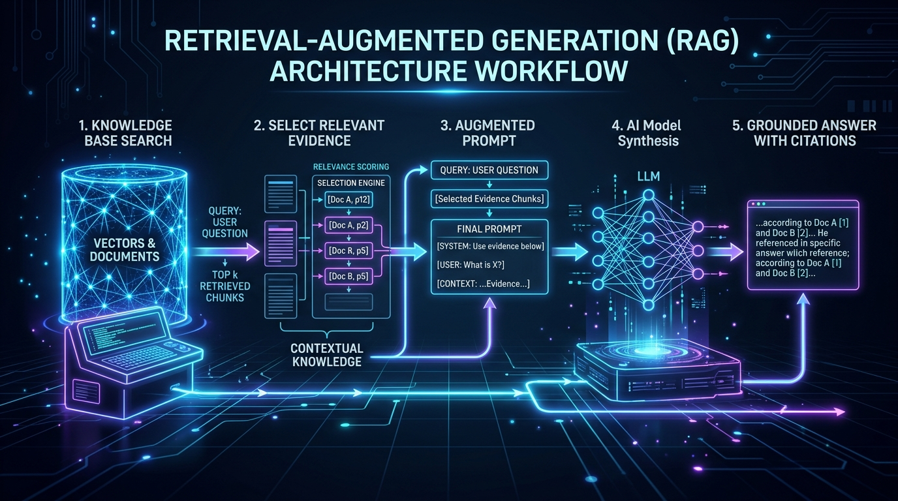
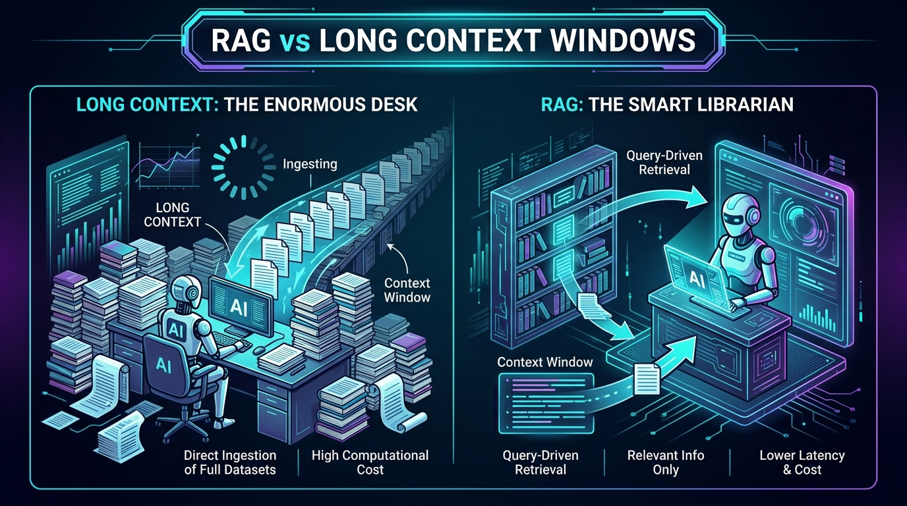
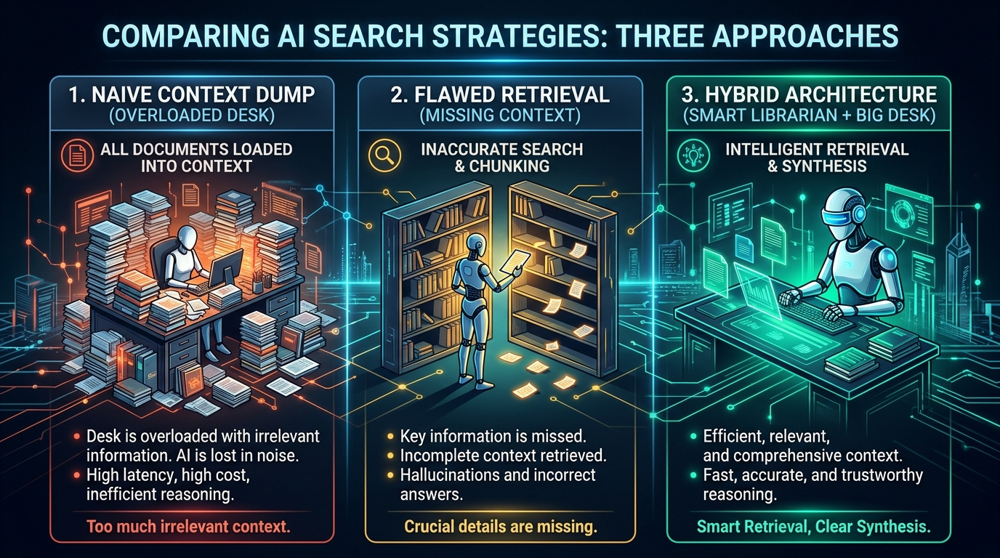

# Issue #2: RAG Isn’t Dead. Most People Just Don’t Understand It.

*Large context windows are useful. Retrieval is useful. The mistake is treating them as the same thing.*

A popular AI take goes like this:

> “Models can now read a million tokens. RAG is dead.”

It sounds plausible. If an AI can read an entire codebase, company handbook, or stack of reports at once, why build a system to search for information first?

Because reading more information and finding the right information are different jobs.

A large context window gives a model a bigger desk.

Retrieval-Augmented Generation—usually shortened to **RAG**—helps it find the right document before it starts working.

Those two capabilities overlap. Sometimes a large desk is enough. But in the real world, modern AI systems increasingly use both.

---

## The problem: “It fits” is not the same as “it is useful”

Imagine asking:

> “What exception did we make to the refund policy for enterprise customers in Germany last quarter?”

The answer may be buried in one paragraph of one email, attached to a contract amendment, surrounded by years of unrelated policy documents.

Giving an AI every document you own may be possible. It may even fit inside a modern model’s context window.

But that does not automatically make it the best approach.

The model still needs to:

- Notice the relevant information.
- Distinguish the current policy from an old one.
- Ignore similar but incorrect documents.
- Connect “Germany,” “enterprise,” “refund,” and “last quarter.”
- Show you where its answer came from.

That is an information-retrieval problem before it is a language-generation problem.

---

## What RAG actually is

**Retrieval-Augmented Generation** is a simple idea:

1. Store useful external information—documents, policies, product manuals, tickets, databases, or web pages.
2. When someone asks a question, search that information for the most relevant pieces.
3. Give those pieces to the AI model alongside the question.
4. Ask the model to answer using that evidence.



The important word is **retrieval**.

RAG is not primarily a trick for squeezing more text into a model. It is a way to turn a large, changing collection of information into a small, relevant evidence packet.

In a typical RAG system, documents are split into manageable passages, indexed for search, and retrieved using both meaning-based search and exact-word matching. The model then receives the best candidates rather than the whole library.

That is why RAG remains valuable even when a model can technically accept the whole library.

---

## Why people think RAG is dead

The argument is not completely wrong.

Modern models can work with dramatically larger context windows than earlier generations. Meta’s Llama 4 Scout, for example, advertises a 10-million-token context window. Google and Anthropic have pushed long-context capabilities for years, and OpenAI models can also work with large inputs and tools that search files. [Meta](https://ai.meta.com/blog/llama-4-multimodal-intelligence/), [OpenAI](https://platform.openai.com/docs/api-reference/vector-stores?lang=python)

That changes the design of some applications.

If you have:

- One 80-page report,
- A single legal contract,
- A known collection of meeting notes,
- Or a code file that needs holistic review,

then putting the whole thing into context can be wonderfully simple. The model can see relationships that a retrieval system might accidentally split apart.

Anthropic makes this point directly: for a knowledge base below roughly 200,000 tokens, including the full material in the prompt can be the simplest solution. [Anthropic](https://www.anthropic.com/engineering/contextual-retrieval)

So yes: long context genuinely reduces the need for RAG in some situations.

But “reduces the need” is not “makes obsolete.”

---

## The missing distinction

Here is the cleanest way to think about it:

| Capability | Main question it answers |
|---|---|
| Long context | “Can the model consider a lot of material at once?” |
| RAG | “Which material should the model consider?” |

Long context is about **capacity**.

RAG is about **selection**.

One is a bigger reading table. The other is a good librarian.



```text
Long context:
“Put more books on the table.”

RAG:
“Find the three books that answer this question.”

Hybrid:
“Find the right books, then give the model enough room
to read them alongside the surrounding context.”
```

This distinction matters because most useful knowledge bases are not static, small, or perfectly organized.

They contain old versions, drafts, duplicates, permission boundaries, spreadsheets, PDFs, support tickets, and exceptions.

A million-token context window does not resolve that mess. It only gives the model room to receive more of it.

---

## Where long context wins

Long context is especially useful when the task depends on seeing the whole picture.

### 1. Summarizing one large document

If you want a summary of a 150-page report, retrieval may accidentally omit an important section. Loading the complete report lets the model compare its parts and preserve the overall argument.

### 2. Finding patterns across a bounded set of materials

Suppose you upload a month of meeting transcripts and ask:

> “What decisions were repeatedly postponed, and why?”

That requires synthesis across the set—not merely locating one sentence.

### 3. Analyzing code or documents with tight internal dependencies

A function may only make sense when read with its callers, tests, configuration, and error handling. A contract clause may depend on definitions several pages earlier.

In these cases, retrieval can be too narrow.

A 2024 study comparing long context and RAG found that, when enough computing resources were available, long-context approaches often performed better on its benchmark tasks—while RAG retained a major cost advantage. [Li et al.](https://arxiv.org/abs/2407.16833)

That is a useful result. It is not a death certificate for RAG.

---

## Where RAG is still essential

RAG earns its place when information is too large, too dynamic, too messy, or too important to treat as one giant prompt.

### 1. Large and growing knowledge bases

A company may have millions of pages across help-center articles, product documentation, internal wikis, tickets, and contracts.

Even if a model has a very large context window, repeatedly sending the entire archive is wasteful and slow. More importantly, most questions need only a tiny fraction of it.

### 2. Information that changes

A model’s built-in training knowledge is frozen at some point in time. RAG can retrieve the latest policy, inventory count, release note, or support article at answer time.

This is why search-connected assistants are useful: they retrieve current sources rather than pretending the model already knows today’s news.

### 3. Answers that need evidence

For legal, financial, medical, compliance, customer-support, and internal-policy workflows, “trust me” is not enough.

A well-designed RAG system can return the relevant source passages, document names, dates, and links. The answer becomes easier to verify.

RAG does not guarantee truth. It gives the system a better opportunity to ground an answer in inspectable evidence.

### 4. Permissions and scope

A useful enterprise assistant should not search every document equally. It should only retrieve material the current user is allowed to see.

That is another reason retrieval is more than a context-size workaround: it is part of controlling what knowledge enters the model’s working context.

### 5. Cost and response time

Sending a giant context on every question can be expensive and slow. Retrieval usually sends a far smaller, targeted set of passages.

This trade-off is practical, not ideological.

---

## The library analogy

Imagine a law firm with a building-sized library.

A long-context model is like hiring a lawyer with an enormous desk. You can spread out hundreds of books at once. That is valuable when the case requires comparing everything.

RAG is like hiring a skilled librarian. Before the lawyer begins, the librarian finds the statutes, case law, contract versions, and internal memos most likely to matter.

The best legal team uses both.



The real problem is not choosing “desk” or “librarian.”

It is designing a system that knows when it needs each.

---

## Three practical examples

### A support chatbot

A customer asks:

> “Can I transfer my annual plan to a subsidiary after a merger?”

This needs the current policy, perhaps an exception process, and potentially region-specific terms.

RAG is a natural fit. Retrieve the current, authorized policy documents, then ask the model to answer with citations. Long context may still help the model interpret related clauses together.

### A student studying one textbook

A student uploads a 300-page biology textbook and asks:

> “Explain how the immune system connects innate and adaptive responses.”

Long context can be excellent here. The model benefits from seeing the book’s structure, diagrams, terminology, and repeated explanations. Retrieval may be helpful, but it is not automatically necessary.

### An engineer investigating a production incident

An engineer asks:

> “Why did checkout failures rise after the June deployment?”

The answer may require logs, the deployment diff, incident notes, dashboards, and a historical postmortem.

A hybrid system is strongest:

1. Retrieve the relevant deployment, logs, and incidents.
2. Use a long context to compare them.
3. Produce a timeline with links to evidence.

---

## Common misconceptions

### “If a model has a million-token context window, it can search perfectly.”

Not necessarily.

A context window is an input limit, not a promise of perfect attention, ranking, or reasoning. Models have improved substantially at using long inputs, but developers still need to evaluate whether important information is found and used reliably.

### “RAG eliminates hallucinations.”

No.

RAG can reduce unsupported answers by providing relevant evidence, but a model can still misread, overgeneralize, cite the wrong passage, or answer confidently when retrieval failed.

A robust system should be able to say: “I could not find enough evidence.”

### “RAG means vector database.”

Not quite.

A vector database is one common tool for meaning-based search. Good retrieval systems may also use keyword search, metadata filters, document structure, reranking, SQL queries, or specialized tools.

The goal is not “use vectors.” The goal is “retrieve the right evidence.”

### “Long context versus RAG is a winner-take-all contest.”

This is the biggest misconception.

Academic comparisons do not produce one universal winner. Results depend on the task, the quality of the retrieval system, the size and structure of the data, cost limits, and whether the question requires local lookup or broad synthesis. Recent work explicitly frames routing between long context and RAG as a problem with no single silver bullet. [LaRA, ICML 2025](https://proceedings.mlr.press/v267/li25dv.html)

---

## What the major AI companies are actually doing

The industry’s behavior is more revealing than its hot takes.

- **OpenAI** continues to offer hosted vector stores and a File Search tool for applications that need semantic retrieval over files. [OpenAI documentation](https://platform.openai.com/docs/api-reference/vector-stores?lang=python)
- **Anthropic** offers large context windows and also automatically enables RAG for Claude Projects as knowledge grows beyond context limits. Its published retrieval work focuses on improving what gets retrieved, not abandoning retrieval. [Anthropic](https://support.anthropic.com/en/articles/11473015-retrieval-augmented-generation-rag-for-projects), [Contextual Retrieval](https://www.anthropic.com/engineering/contextual-retrieval)
- **Google** continues to operate Vertex AI RAG Engine while also advancing long-context Gemini models and retrieval-oriented embedding models. [Google Cloud](https://cloud.google.com/blog/products/ai-machine-learning/introducing-vertex-ai-rag-engine/), [Google DeepMind](https://deepmind.google/research/publications/157741/)
- **Meta** helped introduce the original RAG research approach in 2020 and now also offers extremely long-context Llama models. That combination illustrates the point: progress in long context does not erase the retrieval problem. [Original RAG paper](https://arxiv.org/abs/2005.11401), [Llama 4](https://ai.meta.com/blog/llama-4-multimodal-intelligence/)

The trend is not replacement.

It is combination.

---

## Key takeaways

- RAG retrieves relevant information; long context holds more information.
- Long context is often best for bounded, coherent material that needs holistic analysis.
- RAG is often best for large, changing, searchable, permissioned, or evidence-sensitive knowledge bases.
- Neither approach guarantees correct answers.
- The strongest systems often retrieve first, then use long context to reason over the selected evidence.
- The question is not “Is RAG dead?” It is “What information does this task require, and how should the model receive it?”

## Closing thought

RAG was never fundamentally about compensating for small context windows.

It was about giving AI systems a practical relationship with external knowledge: current, relevant, permission-aware, and verifiable.

Bigger context windows are a real advance. They make some workflows simpler and some forms of reasoning richer.

But when your information is a living library rather than a single book, you still need a way to find the right page.

And that is why RAG is not dead.
