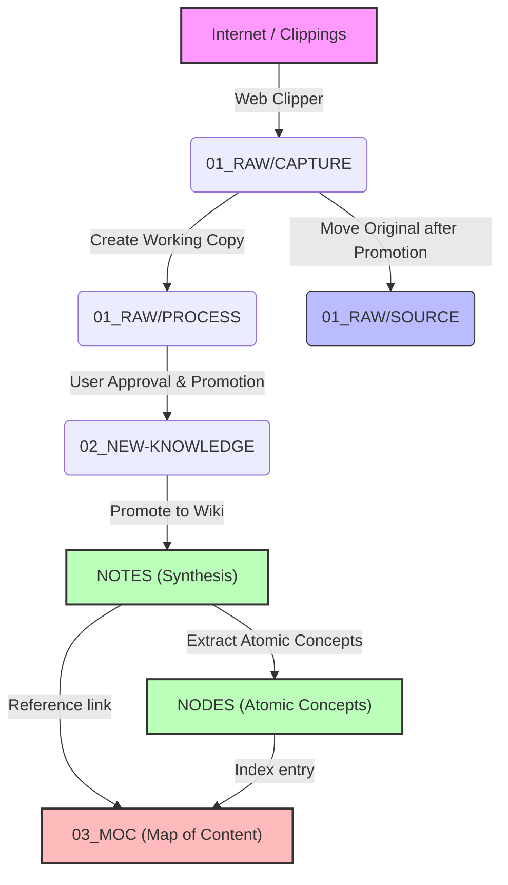

# Infinity Brain (nexusdb) — System Architecture & Knowledge Pipeline Guide

Welcome to the **Infinity Brain** (`nexusdb`), a long-term personal knowledge vault designed as a **flat atomic knowledge system**. The system is built to convert raw information into durable, traceable, and highly reusable knowledge, governed by strict rule-based and AI-driven governance policies.

This document serves as the developer and architect reference manual, explaining the vault's structure, ingestion workflow, and governance mechanisms.

---

## 1. Vault Directory Structure

The repository is structured to separate raw inputs, active learning spaces, evergreen synthesis, atomic concepts, and system infrastructure.

```text
nexusdb/
├── 01_RAW/                 # Preserved original files and early-stage processing
│   ├── CAPTURE/            # Raw incoming clipper files, transcripts, PDFs (read-only)
│   ├── PROCESS/            # Temporary derived cleanup copies (formatting, OCR correction)
│   └── SOURCE/             # Permanent archive of original sources after successful ingestion
├── 02_NEW-KNOWLEDGE/       # Active learning space to build exhaustive source-derived understanding
├── NOTES/                  # Durable, human-friendly, personalized synthesis notes
├── NODES/                  # Flat, permanent atomic notes (strictly no subfolders)
├── 03_MOC/                 # Navigation-only Maps of Content (strictly no explanations)
├── tests/                  # Vault unit and integration tests (fixtures & sample-vault)
└── .antigravity/           # System governance, rules, schemas, and automation
    ├── rules/              # Canonical rule markdown files (governance, naming, schemas)
    ├── schemas/            # JSON validation schemas for metadata frontmatter
    ├── logs/               # Append-only audit history (`audit-log.md`)
    ├── templates/          # Standard starting structures for different note types
    └── skills/             # Specialized AI subagent skills (e.g., ingestion, research)
```

---

## 2. The Knowledge Ingestion Pipeline

Information moves through a strict 6-stage ingestion pipeline designed to ensure high fidelity, complete provenance, and non-redundancy.



### Stage Explanations

1. **Capture (`01_RAW/CAPTURE/`):** Raw files are saved here exactly as captured. This folder is read-only; files are immutable and must never be edited, renamed, or moved directly to process.
2. **Process (`01_RAW/PROCESS/`):** Create a working copy here. Clean up advertisements, reformat headers, and isolate core topics. This is the only writable workspace during ingestion.
3. **New Knowledge (`02_NEW-KNOWLEDGE/`):** After user approval, the working copy is promoted here. This is an active learning playground for deep study of the material.
4. **Source Archive (`01_RAW/SOURCE/`):** Once promoted to `02_NEW-KNOWLEDGE/`, the original source is archived here by moving it from `01_RAW/CAPTURE/` to preserve provenance.
5. **Wiki Promotion (`NOTES/`):** Once the material in `02_NEW-KNOWLEDGE/` is understood and the user issues **Promote to Wiki**, the document is moved to `NOTES/`.
6. **Atomicity (`NODES/`):** Atomic notes are extracted and created here *only after* the document is in `NOTES/`.
7. **Curate (`03_MOC/`):** The notes are linked inside Map of Content (MOC) index files to allow easy browsing.

---

## 3. Non-Negotiable Graph Laws

To keep the vault from degenerating into a chaotic file dump, all actors (human or AI) must strictly obey the **Eight Graph Laws**:

*   **Law 1: No Orphan Nodes.** Every active note must be linked to at least one MOC and have at least one inbound or outbound link.
*   **Law 2: Unique Identity.** Every node must have exactly one canonical title and reside in exactly one canonical file.
*   **Law 3: Explicit Ownership.** Every active knowledge note belongs to exactly one owner MOC (`owner_moc`).
*   **Law 4: Recoverable Provenance.** Every factual claim must have a reference source path or URL, or be explicitly labeled as an "unsupported observation".
*   **Law 5: Ingestion Outcome.** Every ingested source must either produce reusable knowledge or be explicitly logged with a `no_reusable_knowledge` disposition.
*   **Law 6: Archival Consolidation.** Confirmed duplicate notes are merged through archival consolidation (preserving predecessor aliases and content in archives), never via simple deletion.
*   **Law 7: Navigation Only MOCs.** MOCs only map links and build indexes; they must never contain inline explanations or copy-pasted details.
*   **Law 8: No Raw Data Leaks.** No raw information can exist outside `01_RAW/` except as explicitly quoted and attributed excerpts.

---

## 4. The AI Decision Engine & Confidence Policy

The AI operates under a **Confidence Policy** that quantifies the confidence of proposed changes from `0` to `100` before acting.

| Confidence Range | Action Policy |
| :--- | :--- |
| **95 – 100% (Safe)** | Apply the reversible, rule-compliant action immediately and log it in the audit log. |
| **80 – 94% (Suggest)** | Propose the change to the user. Do not make any auto-edits. |
| **60 – 79% (Ask)** | Request explicit confirmation before editing metadata or files. |
| **< 60% (Do Nothing)** | Abandon the operation and do not execute. Log an optional observation. |

### Confidence Calibration Formulas

To prevent arbitrary subjective scoring, confidence is mathematically calculated based on context and similarity thresholds:

1. **Merge Decisions:**
   $$Confidence_{\text{merge}} = \begin{cases} (0.4 \cdot S_{\text{title}} + 0.6 \cdot S_{\text{semantic}}) \times 100 & \text{if } S_{\text{title}} \ge 0.90 \text{ and } S_{\text{semantic}} \ge 0.90 \\ 0 & \text{otherwise} \end{cases}$$
   Where $S_{\text{title}}$ is title similarity and $S_{\text{semantic}}$ is semantic text similarity.

2. **Note-Creation Decisions:**
   $$Confidence_{\text{creation}} = (0.4 \cdot U + 0.4 \cdot G + 0.2 \cdot C) \times 100$$
   - $U = 1.0 - \text{maximum semantic similarity to any existing node}$ (conceptual uniqueness).
   - $G = \text{fraction of claims supported by explicit citations in the raw source}$ (source grounding).
   - $C = \text{fraction of required frontmatter schema fields populated}$ (schema completeness).

3. **Relationship Link Decisions:**
   $$Confidence_{\text{link}} = (0.5 \cdot P + 0.5 \cdot R) \times 100$$
   - $P = \text{semantic closeness of the target note topic to the source note topic}$.
   - $R = \text{strength of explicit causal connection or direct citation in source text}$.

---

## 5. Frontmatter Metadata Schema

Every note in the vault must strictly implement the standard YAML metadata block at the top of the file:

```yaml
---
id: 123e4567-e89b-42d3-a456-426614174000 # UUID v4; immutable
title: Canonical Title
type: atomic-note # atomic-note, evergreen-note, knowledge-document, raw-source, moc, governance-rule, log
status: linked # captured, processed, verified, evergreen, atomic, linked, curated, maintained, archived
domain: ai # canonical domain from tag-schema.md
source_type: paper # book, article, paper, youtube, podcast, web-clip, transcript, course, original-observation, null
created: YYYY-MM-DD
updated: YYYY-MM-DD
review: YYYY-MM-DD # next review date
confidence: 95 # integer 0-100
version: 1
aliases: []
tags: [] # discovery facets only (no status, type, or domain tags)
owner_moc: AI MOC # exactly one canonical MOC title string
sources: [] # source paths, URLs, or source IDs
related: [] # related note titles or IDs
schema_version: 3 # note frontmatter structure version
---
```

---

## 6. Verification and Audit Standard

Every meaningful action (promotions, merges, creation) is recorded in the append-only audit file located at [.antigravity/logs/audit-log.md](file:///c:/Users/offic/OneDrive/Desktop/obsidean/nexusdb/.antigravity/logs/audit-log.md).

The table follows this format:
```markdown
| timestamp | actor | action | target | reason | rule | sources | confidence | result | rollback | exception_id |
| --- | --- | --- | --- | --- | --- | --- | ---: | --- | --- | --- |
```

### Irreversible-Action Protection
Any action categorized as protected (deleting files, overwriting prose, changing canonical titles, merging uncertain nodes) requires:
1. Explicit user authorization.
2. A backup snapshot.
3. An audit log entry.
4. A concrete, documented rollback path.
