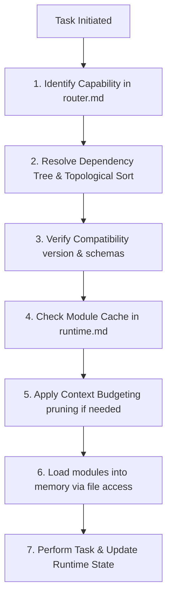

# Folder: .antigravity/bootstrap

## File: bootstrap\loader.md

```markdown
---
version: 2.0.0
last_reviewed: 2026-07-18
approved_by: vault-owner
change_reason: "v2.0.0 — Reimplemented loader to support dependency trees, compatibility checking, context budgeting, caching, and lazy loading."
deprecation_date: null
---

# Agent OS Loader

This loader sequence manages context initialization and ensures that only relevant governance rules, schemas, and shared constants are active in the agent's working memory at any time.

## 1. Loader sequence (Dynamic Initialization)

When starting a task, the agent must execute the following sequence:



1. **Scan**: Analyze task intent and identify the required capability (e.g., `INGEST`, `LINK`) from [router.md](file:///.antigravity/bootstrap/router.md).
2. **Resolve Dependencies**: Find the entry-point modules for the capability. Build the dependency tree by reading each module's `depends_on` manifest field, and construct a topologically sorted list.
3. **Verify Compatibility**: For each module in the sort:
   - Check that `compatible_schema_versions` matches the vault's `CURRENT_SCHEMA_VERSION` in [constants.md](file:///.antigravity/shared/constants.md).
   - Check that dependencies are declared and present in [registry.md](file:///.antigravity/bootstrap/registry.md).
   - If any check fails, abort and trigger Failure Behavior.
4. **Check Cache**: Compare the sorted list against the `loaded_modules` array in [runtime.md](file:///.antigravity/bootstrap/runtime.md). Skip loading any module that is already marked as loaded.
5. **Budget Context**:
   - Sum the `estimated_token_cost` of all modules scheduled to load.
   - If the sum exceeds the **Context Budget Limit** (8,000 tokens for rules), prune non-leaf dependencies or split large modules into micro-modules.
6. **Load**: Execute the available file access mechanism on the resolved paths in [registry.md](file:///.antigravity/bootstrap/registry.md).
7. **Execute**: Perform the task, updating [runtime.md](file:///.antigravity/bootstrap/runtime.md) with active state, decisions, and outcomes.

## 2. Dependency Resolution Algorithm
The topological sort is defined as:
1. Initialize an empty list `ordered_list` and a set `visited`.
2. For each entry-point module, call `visit(module_id)`:
   - If `module_id` is in `visiting` (current path), abort with a cyclic dependency error.
   - If `module_id` is not in `visited`:
     - Add `module_id` to `visiting`.
     - For each dependency in the module's `depends_on`:
       - Recursively call `visit(dependency)`.
     - Remove `module_id` from `visiting`.
     - Add `module_id` to `visited` and append to `ordered_list`.
3. The resulting `ordered_list` is the exact load sequence (dependencies loaded first).

## 3. Context Budgeting Policy
- **Max Context Budget**: 8,000 tokens for rule/governance context.
- **Pruning Priority**:
  1. Keep `shared/` core files (always loaded first, high priority).
  2. Load only the leaf nodes in the resolved sequence that directly implement policies.
  3. Load high-cost modules as summaries or request human partitioning.

## 4. Module Caching Policy
- Keep track of all loaded modules in `runtime.loaded_modules`.
- Never reload a module that already exists in the cache.
- Clear the cache only when starting a new, unrelated task.
```

---

## File: bootstrap\registry.md

```markdown
---
version: 2.0.0
last_reviewed: 2026-07-18
approved_by: vault-owner
change_reason: "v2.0.0 — Reorganized registry to point exclusively to the refactored modules/ and shared/ directory structures, eliminating rules/."
deprecation_date: null
---

# Module Registry

This registry is the single source of truth for resolving physical workspace paths of all Agent OS modules, shared files, and schemas.

## 1. Shared Core Registry (`shared/`)
- **shared_constants**: `.antigravity/shared/constants.md`
- **shared_glossary**: `.antigravity/shared/glossary.md`
- **shared_taxonomy**: `.antigravity/shared/taxonomy.md`
- **shared_aliases**: `.antigravity/shared/aliases.md`
- **shared_relationship_types**: `.antigravity/shared/relationship-types.md`
- **shared_naming_conventions**: `.antigravity/shared/naming-conventions.md`

## 2. Core Governance Modules (`modules/core/`)
- **core_governance**: `.antigravity/modules/core/governance.md`
- **core_ownership**: `.antigravity/modules/core/ownership.md`
- **core_exception**: `.antigravity/modules/core/exception_policy.md`
- **core_audit_log**: `.antigravity/modules/core/audit_log.md`
- **core_rule_versioning**: `.antigravity/modules/core/rule_versioning.md`
- **core_decision_engine**: `.antigravity/modules/core/decision_engine.md`

## 3. Metadata Modules (`modules/metadata/`)
- **metadata_schema**: `.antigravity/modules/metadata/frontmatter-schema.md`
- **metadata_tags**: `.antigravity/modules/metadata/tag-schema.md`
- **metadata_naming**: `.antigravity/modules/metadata/naming-rules.md`
- **metadata_concept**: `.antigravity/modules/metadata/concept-identity.md`
- **metadata_source**: `.antigravity/modules/metadata/source-schema.md`
- **metadata_node**: `.antigravity/modules/metadata/node-schema.md`
- **metadata_moc**: `.antigravity/modules/metadata/moc-schema.md`
- **metadata_decision_context**: `.antigravity/modules/metadata/decision-context.md`

## 4. Graph Operation Modules (`modules/graph/`)
- **graph_linking**: `.antigravity/modules/graph/linking-rules.md`
- **graph_merge**: `.antigravity/modules/graph/merge-rules.md`
- **graph_retrieval**: `.antigravity/modules/graph/retrieval-rules.md`
- **graph_scalability**: `.antigravity/modules/graph/scalability.md`
- **graph_navigation**: `.antigravity/modules/graph/navigation-hierarchy.md`

## 5. Automation and Workflow Modules (`modules/automation/`, `modules/workflow/`)
- **automation_ingestion**: `.antigravity/modules/automation/ingestion-rules.md`
- **automation_hooks**: `.antigravity/modules/automation/automation-hooks.md`
- **workflow_incubation**: `.antigravity/modules/workflow/incubation-rules.md`

## 6. Quality Metrics Modules (`modules/quality/`)
- **quality_metrics**: `.antigravity/modules/quality/health-metrics.md`
- **quality_maturity**: `.antigravity/modules/quality/maturity-model.md`
- **quality_promotion**: `.antigravity/modules/quality/promotion-rules.md`
- **quality_decay**: `.antigravity/modules/quality/knowledge-decay.md`
- **quality_graph_health**: `.antigravity/modules/quality/graph-health.md`
- **quality_checklist**: `.antigravity/modules/quality/quality-checklist.md`
```

---

## File: bootstrap\router.md

```markdown
---
version: 2.0.0
last_reviewed: 2026-07-18
approved_by: vault-owner
change_reason: "v2.0.0 — Replaced keyword routing with a capability-based router mapping to module entry points."
deprecation_date: null
---

# Capability Router

This router maps requested Agent OS capabilities to their target entry point modules. The loader resolves the full dependency trees dynamically.

## 1. Capability Mapping Table

| Capability | Entry Point Modules | Purpose |
|---|---|---|
| **INGEST** | `automation_ingestion`, `workflow_incubation` | Ingestion pipelines, capture evaluation, and raw source lifecycles. |
| **LINK** | `graph_linking` | Semantic linking, relationship priorities, and connection policies. |
| **REVIEW** | `quality_decay`, `core_exception` | Freshness verification, decay scheduling, and exceptions logging. |
| **PROMOTE** | `quality_promotion`, `quality_maturity` | Curation evaluation, node maturity state transitions. |
| **GRAPH** | `graph_navigation`, `graph_scalability` | Map of Content (MOC) structure, network density, limits checks. |
| **SEARCH** | `graph_retrieval` | Structured query search and rank-ordered node retrieval. |
| **MERGE** | `graph_merge` | Archival duplicate merging and node consolidation. |
| **MIGRATION** | `core_rule_versioning`, `metadata_schema` | System upgrades, rule updates, schema version shifts. |
| **MAINTENANCE** | `core_audit_log`, `quality_metrics` | Logging changes, tracking system KPIs, health reporting. |

## 2. Capability Resolution Flow
1. Identify the high-level capability needed for the active task.
2. Retrieve the mapped entry-point modules from the table.
3. Pass the entry points to [loader.md](file:///.antigravity/bootstrap/loader.md) to build the load sequence.
```

---

## File: bootstrap\runtime.md

```markdown
---
version: 1.0.0
last_reviewed: 2026-07-18
approved_by: vault-owner
change_reason: "Initial release of the runtime state tracking structure."
deprecation_date: null
---

# Runtime State Tracker

This file tracks the active runtime state of the Agent OS during execution. It is updated dynamically at the start of each task.

## 1. Runtime State Schema

```yaml
runtime:
  current_task: "Description of the active user request or background task"
  capabilities: []              # Active capabilities parsed for this task (e.g. INGEST)
  loaded_modules: []            # Modules currently in memory (caching array)
  execution_history: []         # List of actions completed in this session
  confidence: null              # Calculated confidence score (0-100) for active decision
  decision: null                # Safe | Suggest | Ask | Do Nothing
  pending_user_approval: null   # Boolean indicating if execution is paused waiting for user approval
  rollback_point: null          # Commit hash or directory snapshot index for safety
```

## 2. Active Session State (Mock Run)

```yaml
session:
  current_task: "Evolve NexusDB rule architecture to modular Agent OS structure"
  capabilities: ["MIGRATION", "MAINTENANCE"]
  loaded_modules:
    - shared_constants
    - shared_glossary
    - shared_naming_conventions
    - core_governance
    - core_rule_versioning
    - metadata_schema
  execution_history:
    - "Create modules and shared directories"
    - "Migrate core and metadata modules"
  confidence: 100
  decision: "Safe"
  pending_user_approval: false
  rollback_point: "git-revision-prev-commit"
```
```

---

