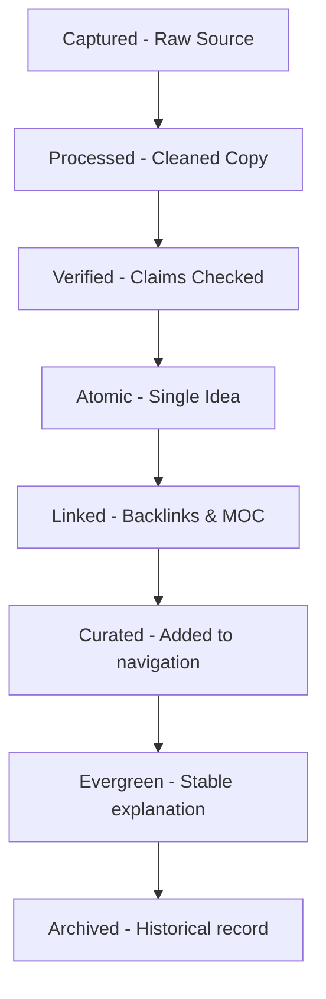

# Folder: .antigravity/docs

## File: docs\architecture.md

```markdown
# NexusDB Vault Architecture

This document describes the directory organization, system components, python automation structures, and capability roadmap of the vault.

## Directory Structure

```
01_RAW/
├── CAPTURE/          # Original incoming captures (Web clips, transcripts, books)
├── PROCESS/          # Cleaned working files (cleanup only)
└── SOURCE/           # Preserved source files after successful ingestion
02_NEW-KNOWLEDGE/     # Inbound study folder for active learning
NOTES/                # Synthesis layer for evergreen topics
NODES/                # Flat atomic concept notes (no subfolders)
03_MOC/               # Map of Content navigation indexes (no explanations)
.antigravity/
├── rules/            # Human-readable governed rules & schemas
├── schemas/          # JSON schemas for note metadata validation
├── automations/      # Python scripts executing checks & pipeline
├── hooks/            # Modular lifecycle execution hooks
├── prompts/          # AI domain prompts (ingestion, generation, maintenance, etc.)
├── shared/           # Prompts instructions referenced by LLM agents
├── examples/         # Reference note templates and fixtures
├── logs/             # Append-only audit logs and Candidates json
└── reports/          # Graph density, duplicate candidates, and MOC reports
```

## Capability Roadmap (Capability-Based Layout)

When the vault scales beyond 100 prompts/skills/agents, we recommend transition to a capability-grouped layout:

```
capabilities/
├── ingestion/
│   ├── skill.md
│   ├── prompt.md
│   ├── agent.md
│   └── automation.py
├── graph/
├── maintenance/
├── research/
└── promotion/
```

## Expanded Skills Registry

As the system expands, the following modular skills will be added under `skills/`:
- `article-ingestion`: Parse web articles and populate source metadata.
- `paper-ingestion`: Ingest research papers and extract methodologies.
- `lecture-ingestion`: Convert lecture notes/slides into atomic cards.
- `note-atomicizer`: Subagent to break composite notes into single concepts.
- `backlink-linker`: Suggest relevant links on note edits.
- `note-enricher`: Add metadata, aliases, and tags to existing drafts.
- `glossary-builder`: Create definitions index across domains.
- `vault-health-checker`: Automated validation of tags and wikilinks.
- `daily-notes-curator`: Consolidate daily tasks and observations.
- `note-qa-reviewer`: Quantitative evaluation using the promotion rubric.
- `note-deduplicator`: Deduplication via semantic matching.
```

---

## File: docs\graph-model.md

```markdown
# Graph Model and Link Priority

NexusDB is a flat atomic knowledge graph that rejects structural hierarchies (no subfolders in `NODES/`). Connection and browsability are achieved via wikilinks and Maps of Content.

## Graph Laws

1. **No Orphan Nodes**: Every active note in `NODES/` must have at least one incoming or outgoing wikilink.
2. **One Canonical Title**: Note filenames and frontmatter `title` fields must match exactly.
3. **Authorized Membership**: Every note must have exactly one parent `owner_moc`. Multiple references in other MOCs are allowed, but owner MOC is unique.
4. **Link Priority**:
   - **HIGH Priority** (Parent, Prerequisite, Cause, Part-of): Added automatically if confidence `>= 95%`.
   - **MEDIUM Priority** (Related concept, Comparison, Alternative): Output as suggestions if confidence `>= 80%`.
   - **LOW Priority** (Loose associations): Never added automatically.

## Density Calculations

Graph health is measured in part by Link Density:
\[Density = \frac{Edges}{Nodes}\]
Target link density is between \(2.0\) and \(4.5\). Too low indicates isolated orphans; too high indicates weak links.
```

---

## File: docs\lifecycle.md

```markdown
# Knowledge Lifecycle states

Every note in the NexusDB vault transitions through states governed by clear validation rules.

## Lifecycle States Flow



## State Explanations

1. **captured**: Raw incoming content stored in `01_RAW/CAPTURE/`. Unparsed and unverified.
2. **processed**: Text cleaned and formatted; metadata schema valid; stored in `01_RAW/PROCESS/`.
3. **verified**: Facts and claims cross-checked against source material.
4. **atomic**: Extracted into a single-concept note in `NODES/`.
5. **linked**: Linked to an owner MOC and has at least one justified connection to another node.
6. **curated**: Promoted to the active navigation layer (listed in core MOC paths).
7. **evergreen**: Matured explanation that is verified, atomic, linked, and stable.
8. **archived**: Historic content preserved for audit or references.
```

---

## File: docs\maintenance.md

```markdown
# Review and Maintenance Cadences

To prevent structural rot and maintain consistency, we run automated and manual maintenance checks at defined frequencies.

## Cadences Summary

| Frequency | Target Checks | Actions |
| --- | --- | --- |
| **Daily** | Metadata hygiene, broken wikilinks, audit logs | Run `check_vault.py` during nightly hook. Resolve broken targets. |
| **Weekly** | Duplicate notes, MOC coverage, orphan status | Run `duplicate_detector.py` and review candidates. Update MOC files. |
| **Monthly** | Controlled tags schema, exception expiry, stale note audit | Add/deprecate tags in `tag-schema.md`. Clean expired exceptions. |
| **Quarterly** | Rule adjustments, directory structure, boundaries | Review governance rules and schema structures. |

## Daily Validation Checklist
- Run `check_vault.py`.
- Check `.antigravity/logs/audit-log.md` for failed actions.
- Resolve any wikilinks that point to non-existent nodes.
```

---

## File: docs\pipeline.md

```markdown
# Sequential Automation Pipeline

The Master Ingestion and Validation Pipeline is defined in `run_pipeline.py`. It runs in sequential stages to avoid write contentions:

## Pipeline Stages

```
┌─────────────────────────────────────────────────────────────┐
│ 1. Capture & Lifecycle Validation (raw_lifecycle.py)       │
└──────────────┬──────────────────────────────────────────────┘
               ▼
┌─────────────────────────────────────────────────────────────┐
│ 2. Tag & Structural Validation (validate_tags.py)           │
└──────────────┬──────────────────────────────────────────────┘
               ▼
┌─────────────────────────────────────────────────────────────┐
│ 3. Vault Structural Integrity (check_vault.py)              │
└──────────────┬──────────────────────────────────────────────┘
               ▼
┌─────────────────────────────────────────────────────────────┐
│ 4. Duplicate Detection (duplicate_detector.py)              │
└──────────────┬──────────────────────────────────────────────┘
               ▼
┌─────────────────────────────────────────────────────────────┐
│ 5. Metadata Migration (migrate_metadata.py)                │
└──────────────┬──────────────────────────────────────────────┘
               ▼
┌─────────────────────────────────────────────────────────────┐
│ 6. Semantic Linking (semantic_linker.py)                    │
└──────────────┬──────────────────────────────────────────────┘
               ▼
┌─────────────────────────────────────────────────────────────┐
│ 7. Promotion Rubric Check (promotion_enforcer.py)          │
└──────────────┬──────────────────────────────────────────────┘
               ▼
┌─────────────────────────────────────────────────────────────┐
│ 8. Map of Content Curation (moc_curator.py)                 │
└──────────────┬──────────────────────────────────────────────┘
               ▼
┌─────────────────────────────────────────────────────────────┐
│ 9. MOC & Health Report Generation (generate_mocs.py)        │
└─────────────────────────────────────────────────────────────┘
```

## Running the Pipeline

Run the pipeline from the vault root:
```bash
.\.venv\Scripts\python.exe .antigravity/automations/run_pipeline.py
```
Options:
- `--vault <path>`: Path to vault root.
- `--dry-run-migration`: Run migration step in dry-run mode.
```

---

## File: docs\troubleshooting.md

```markdown
# Troubleshooting Guide

Common issues encountered when managing NexusDB and how to resolve them.

## Common Issues

### 1. Frontmatter Schema Violations
- **Symptom**: `check_vault.py` reports `Frontmatter schema violation in atomic-note.schema.json: 'id' is a required property`.
- **Solution**: Open the note and verify that `id` contains a valid UUID v4 (generate one if missing). Ensure `schema_version: 3` is present.

### 2. Invalid Tag Errors
- **Symptom**: `check_vault.py` reports `Invalid tag: 'Yt'`.
- **Solution**: Tags must only be discovery tags from `tag-schema.md`. Properties like source type must be designated in frontmatter (e.g. `source_type: youtube`). Convert the tag to the correct frontmatter property.

### 3. Broken Wiki Links
- **Symptom**: `check_vault.py` reports `Broken link: [[Drew Baglino]] (target does not exist)`.
- **Solution**: Check if the note `Drew Baglino` exists. If the name is misspelled, correct it. If the target node has not been created yet, create a stub node in `NODES/` or remove the link.

### 4. Duplicate Candidate Matches
- **Symptom**: `duplicate-candidates.md` lists two notes with 80% word similarity.
- **Solution**: Evaluate if the notes cover the exact same concept. If yes, merge them using archival consolidation (moving unique text to the primary node and marking the secondary node as `status: archived` with a pointer to the primary).
```

---

