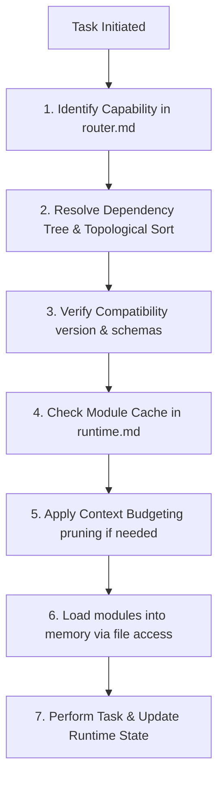
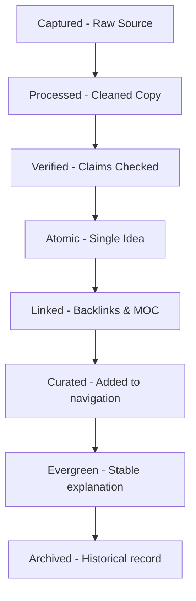

# Folder: .antigravity/bootstrap

## File: bootstrap\loader.md

```markdown
---
version: 2.0.0
last_reviewed: 2026-07-18
approved_by: vault-owner
change_reason: "v2.0.0 — Reimplemented loader to support dependency trees, compatibility checking, context budgeting, caching, and lazy loading."
deprecation_date: null
---

# Agent OS Loader

This loader sequence manages context initialization and ensures that only relevant governance rules, schemas, and shared constants are active in the agent's working memory at any time.

## 1. Loader sequence (Dynamic Initialization)

When starting a task, the agent must execute the following sequence:



1. **Scan**: Analyze task intent and identify the required capability (e.g., `INGEST`, `LINK`) from [router.md](file:///.antigravity/bootstrap/router.md).
2. **Resolve Dependencies**: Find the entry-point modules for the capability. Build the dependency tree by reading each module's `depends_on` manifest field, and construct a topologically sorted list.
3. **Verify Compatibility**: For each module in the sort:
   - Check that `compatible_schema_versions` matches the vault's `CURRENT_SCHEMA_VERSION` in [constants.md](file:///.antigravity/shared/constants.md).
   - Check that dependencies are declared and present in [registry.md](file:///.antigravity/bootstrap/registry.md).
   - If any check fails, abort and trigger Failure Behavior.
4. **Check Cache**: Compare the sorted list against the `loaded_modules` array in [runtime.md](file:///.antigravity/bootstrap/runtime.md). Skip loading any module that is already marked as loaded.
5. **Budget Context**:
   - Sum the `estimated_token_cost` of all modules scheduled to load.
   - If the sum exceeds the **Context Budget Limit** (8,000 tokens for rules), prune non-leaf dependencies or split large modules into micro-modules.
6. **Load**: Execute the available file access mechanism on the resolved paths in [registry.md](file:///.antigravity/bootstrap/registry.md).
7. **Execute**: Perform the task, updating [runtime.md](file:///.antigravity/bootstrap/runtime.md) with active state, decisions, and outcomes.

## 2. Dependency Resolution Algorithm
The topological sort is defined as:
1. Initialize an empty list `ordered_list` and a set `visited`.
2. For each entry-point module, call `visit(module_id)`:
   - If `module_id` is in `visiting` (current path), abort with a cyclic dependency error.
   - If `module_id` is not in `visited`:
     - Add `module_id` to `visiting`.
     - For each dependency in the module's `depends_on`:
       - Recursively call `visit(dependency)`.
     - Remove `module_id` from `visiting`.
     - Add `module_id` to `visited` and append to `ordered_list`.
3. The resulting `ordered_list` is the exact load sequence (dependencies loaded first).

## 3. Context Budgeting Policy
- **Max Context Budget**: 8,000 tokens for rule/governance context.
- **Pruning Priority**:
  1. Keep `shared/` core files (always loaded first, high priority).
  2. Load only the leaf nodes in the resolved sequence that directly implement policies.
  3. Load high-cost modules as summaries or request human partitioning.

## 4. Module Caching Policy
- Keep track of all loaded modules in `runtime.loaded_modules`.
- Never reload a module that already exists in the cache.
- Clear the cache only when starting a new, unrelated task.
```

---

## File: bootstrap\registry.md

```markdown
---
version: 2.0.0
last_reviewed: 2026-07-18
approved_by: vault-owner
change_reason: "v2.0.0 — Reorganized registry to point exclusively to the refactored modules/ and shared/ directory structures, eliminating rules/."
deprecation_date: null
---

# Module Registry

This registry is the single source of truth for resolving physical workspace paths of all Agent OS modules, shared files, and schemas.

## 1. Shared Core Registry (`shared/`)
- **shared_constants**: `.antigravity/shared/constants.md`
- **shared_glossary**: `.antigravity/shared/glossary.md`
- **shared_taxonomy**: `.antigravity/shared/taxonomy.md`
- **shared_aliases**: `.antigravity/shared/aliases.md`
- **shared_relationship_types**: `.antigravity/shared/relationship-types.md`
- **shared_naming_conventions**: `.antigravity/shared/naming-conventions.md`

## 2. Core Governance Modules (`modules/core/`)
- **core_governance**: `.antigravity/modules/core/governance.md`
- **core_ownership**: `.antigravity/modules/core/ownership.md`
- **core_exception**: `.antigravity/modules/core/exception_policy.md`
- **core_audit_log**: `.antigravity/modules/core/audit_log.md`
- **core_rule_versioning**: `.antigravity/modules/core/rule_versioning.md`
- **core_decision_engine**: `.antigravity/modules/core/decision_engine.md`

## 3. Metadata Modules (`modules/metadata/`)
- **metadata_schema**: `.antigravity/modules/metadata/frontmatter-schema.md`
- **metadata_tags**: `.antigravity/modules/metadata/tag-schema.md`
- **metadata_naming**: `.antigravity/modules/metadata/naming-rules.md`
- **metadata_concept**: `.antigravity/modules/metadata/concept-identity.md`
- **metadata_source**: `.antigravity/modules/metadata/source-schema.md`
- **metadata_node**: `.antigravity/modules/metadata/node-schema.md`
- **metadata_moc**: `.antigravity/modules/metadata/moc-schema.md`
- **metadata_decision_context**: `.antigravity/modules/metadata/decision-context.md`

## 4. Graph Operation Modules (`modules/graph/`)
- **graph_linking**: `.antigravity/modules/graph/linking-rules.md`
- **graph_merge**: `.antigravity/modules/graph/merge-rules.md`
- **graph_retrieval**: `.antigravity/modules/graph/retrieval-rules.md`
- **graph_scalability**: `.antigravity/modules/graph/scalability.md`
- **graph_navigation**: `.antigravity/modules/graph/navigation-hierarchy.md`

## 5. Automation and Workflow Modules (`modules/automation/`, `modules/workflow/`)
- **automation_ingestion**: `.antigravity/modules/automation/ingestion-rules.md`
- **automation_hooks**: `.antigravity/modules/automation/automation-hooks.md`
- **workflow_incubation**: `.antigravity/modules/workflow/incubation-rules.md`

## 6. Quality Metrics Modules (`modules/quality/`)
- **quality_metrics**: `.antigravity/modules/quality/health-metrics.md`
- **quality_maturity**: `.antigravity/modules/quality/maturity-model.md`
- **quality_promotion**: `.antigravity/modules/quality/promotion-rules.md`
- **quality_decay**: `.antigravity/modules/quality/knowledge-decay.md`
- **quality_graph_health**: `.antigravity/modules/quality/graph-health.md`
- **quality_checklist**: `.antigravity/modules/quality/quality-checklist.md`
```

---

## File: bootstrap\router.md

```markdown
---
version: 2.0.0
last_reviewed: 2026-07-18
approved_by: vault-owner
change_reason: "v2.0.0 — Replaced keyword routing with a capability-based router mapping to module entry points."
deprecation_date: null
---

# Capability Router

This router maps requested Agent OS capabilities to their target entry point modules. The loader resolves the full dependency trees dynamically.

## 1. Capability Mapping Table

| Capability | Entry Point Modules | Purpose |
|---|---|---|
| **INGEST** | `automation_ingestion`, `workflow_incubation` | Ingestion pipelines, capture evaluation, and raw source lifecycles. |
| **LINK** | `graph_linking` | Semantic linking, relationship priorities, and connection policies. |
| **REVIEW** | `quality_decay`, `core_exception` | Freshness verification, decay scheduling, and exceptions logging. |
| **PROMOTE** | `quality_promotion`, `quality_maturity` | Curation evaluation, node maturity state transitions. |
| **GRAPH** | `graph_navigation`, `graph_scalability` | Map of Content (MOC) structure, network density, limits checks. |
| **SEARCH** | `graph_retrieval` | Structured query search and rank-ordered node retrieval. |
| **MERGE** | `graph_merge` | Archival duplicate merging and node consolidation. |
| **MIGRATION** | `core_rule_versioning`, `metadata_schema` | System upgrades, rule updates, schema version shifts. |
| **MAINTENANCE** | `core_audit_log`, `quality_metrics` | Logging changes, tracking system KPIs, health reporting. |

## 2. Capability Resolution Flow
1. Identify the high-level capability needed for the active task.
2. Retrieve the mapped entry-point modules from the table.
3. Pass the entry points to [loader.md](file:///.antigravity/bootstrap/loader.md) to build the load sequence.
```

---

## File: bootstrap\runtime.md

```markdown
---
version: 1.0.0
last_reviewed: 2026-07-18
approved_by: vault-owner
change_reason: "Initial release of the runtime state tracking structure."
deprecation_date: null
---

# Runtime State Tracker

This file tracks the active runtime state of the Agent OS during execution. It is updated dynamically at the start of each task.

## 1. Runtime State Schema

```yaml
runtime:
  current_task: "Description of the active user request or background task"
  capabilities: []              # Active capabilities parsed for this task (e.g. INGEST)
  loaded_modules: []            # Modules currently in memory (caching array)
  execution_history: []         # List of actions completed in this session
  confidence: null              # Calculated confidence score (0-100) for active decision
  decision: null                # Safe | Suggest | Ask | Do Nothing
  pending_user_approval: null   # Boolean indicating if execution is paused waiting for user approval
  rollback_point: null          # Commit hash or directory snapshot index for safety
```

## 2. Active Session State (Mock Run)

```yaml
session:
  current_task: "Evolve NexusDB rule architecture to modular Agent OS structure"
  capabilities: ["MIGRATION", "MAINTENANCE"]
  loaded_modules:
    - shared_constants
    - shared_glossary
    - shared_naming_conventions
    - core_governance
    - core_rule_versioning
    - metadata_schema
  execution_history:
    - "Create modules and shared directories"
    - "Migrate core and metadata modules"
  confidence: 100
  decision: "Safe"
  pending_user_approval: false
  rollback_point: "git-revision-prev-commit"
```
```

---

# Folder: .antigravity/docs

## File: docs\architecture.md

```markdown
# NexusDB Vault Architecture

This document describes the directory organization, system components, python automation structures, and capability roadmap of the vault.

## Directory Structure

```
01_RAW/
├── CAPTURE/          # Original incoming captures (Web clips, transcripts, books)
├── PROCESS/          # Cleaned working files (cleanup only)
└── SOURCE/           # Preserved source files after successful ingestion
02_NEW-KNOWLEDGE/     # Inbound study folder for active learning
NOTES/                # Synthesis layer for evergreen topics
NODES/                # Flat atomic concept notes (no subfolders)
03_MOC/               # Map of Content navigation indexes (no explanations)
.antigravity/
├── rules/            # Human-readable governed rules & schemas
├── schemas/          # JSON schemas for note metadata validation
├── automations/      # Python scripts executing checks & pipeline
├── hooks/            # Modular lifecycle execution hooks
├── prompts/          # AI domain prompts (ingestion, generation, maintenance, etc.)
├── shared/           # Prompts instructions referenced by LLM agents
├── examples/         # Reference note templates and fixtures
├── logs/             # Append-only audit logs and Candidates json
└── reports/          # Graph density, duplicate candidates, and MOC reports
```

## Capability Roadmap (Capability-Based Layout)

When the vault scales beyond 100 prompts/skills/agents, we recommend transition to a capability-grouped layout:

```
capabilities/
├── ingestion/
│   ├── skill.md
│   ├── prompt.md
│   ├── agent.md
│   └── automation.py
├── graph/
├── maintenance/
├── research/
└── promotion/
```

## Expanded Skills Registry

As the system expands, the following modular skills will be added under `skills/`:
- `article-ingestion`: Parse web articles and populate source metadata.
- `paper-ingestion`: Ingest research papers and extract methodologies.
- `lecture-ingestion`: Convert lecture notes/slides into atomic cards.
- `note-atomicizer`: Subagent to break composite notes into single concepts.
- `backlink-linker`: Suggest relevant links on note edits.
- `note-enricher`: Add metadata, aliases, and tags to existing drafts.
- `glossary-builder`: Create definitions index across domains.
- `vault-health-checker`: Automated validation of tags and wikilinks.
- `daily-notes-curator`: Consolidate daily tasks and observations.
- `note-qa-reviewer`: Quantitative evaluation using the promotion rubric.
- `note-deduplicator`: Deduplication via semantic matching.
```

---

## File: docs\graph-model.md

```markdown
# Graph Model and Link Priority

NexusDB is a flat atomic knowledge graph that rejects structural hierarchies (no subfolders in `NODES/`). Connection and browsability are achieved via wikilinks and Maps of Content.

## Graph Laws

1. **No Orphan Nodes**: Every active note in `NODES/` must have at least one incoming or outgoing wikilink.
2. **One Canonical Title**: Note filenames and frontmatter `title` fields must match exactly.
3. **Authorized Membership**: Every note must have exactly one parent `owner_moc`. Multiple references in other MOCs are allowed, but owner MOC is unique.
4. **Link Priority**:
   - **HIGH Priority** (Parent, Prerequisite, Cause, Part-of): Added automatically if confidence `>= 95%`.
   - **MEDIUM Priority** (Related concept, Comparison, Alternative): Output as suggestions if confidence `>= 80%`.
   - **LOW Priority** (Loose associations): Never added automatically.

## Density Calculations

Graph health is measured in part by Link Density:
\[Density = \frac{Edges}{Nodes}\]
Target link density is between \(2.0\) and \(4.5\). Too low indicates isolated orphans; too high indicates weak links.
```

---

## File: docs\lifecycle.md

```markdown
# Knowledge Lifecycle states

Every note in the NexusDB vault transitions through states governed by clear validation rules.

## Lifecycle States Flow



## State Explanations

1. **captured**: Raw incoming content stored in `01_RAW/CAPTURE/`. Unparsed and unverified.
2. **processed**: Text cleaned and formatted; metadata schema valid; stored in `01_RAW/PROCESS/`.
3. **verified**: Facts and claims cross-checked against source material.
4. **atomic**: Extracted into a single-concept note in `NODES/`.
5. **linked**: Linked to an owner MOC and has at least one justified connection to another node.
6. **curated**: Promoted to the active navigation layer (listed in core MOC paths).
7. **evergreen**: Matured explanation that is verified, atomic, linked, and stable.
8. **archived**: Historic content preserved for audit or references.
```

---

## File: docs\maintenance.md

```markdown
# Review and Maintenance Cadences

To prevent structural rot and maintain consistency, we run automated and manual maintenance checks at defined frequencies.

## Cadences Summary

| Frequency | Target Checks | Actions |
| --- | --- | --- |
| **Daily** | Metadata hygiene, broken wikilinks, audit logs | Run `check_vault.py` during nightly hook. Resolve broken targets. |
| **Weekly** | Duplicate notes, MOC coverage, orphan status | Run `duplicate_detector.py` and review candidates. Update MOC files. |
| **Monthly** | Controlled tags schema, exception expiry, stale note audit | Add/deprecate tags in `tag-schema.md`. Clean expired exceptions. |
| **Quarterly** | Rule adjustments, directory structure, boundaries | Review governance rules and schema structures. |

## Daily Validation Checklist
- Run `check_vault.py`.
- Check `.antigravity/logs/audit-log.md` for failed actions.
- Resolve any wikilinks that point to non-existent nodes.
```

---

## File: docs\pipeline.md

```markdown
# Sequential Automation Pipeline

The Master Ingestion and Validation Pipeline is defined in `run_pipeline.py`. It runs in sequential stages to avoid write contentions:

## Pipeline Stages

```
┌─────────────────────────────────────────────────────────────┐
│ 1. Capture & Lifecycle Validation (raw_lifecycle.py)       │
└──────────────┬──────────────────────────────────────────────┘
               ▼
┌─────────────────────────────────────────────────────────────┐
│ 2. Tag & Structural Validation (validate_tags.py)           │
└──────────────┬──────────────────────────────────────────────┘
               ▼
┌─────────────────────────────────────────────────────────────┐
│ 3. Vault Structural Integrity (check_vault.py)              │
└──────────────┬──────────────────────────────────────────────┘
               ▼
┌─────────────────────────────────────────────────────────────┐
│ 4. Duplicate Detection (duplicate_detector.py)              │
└──────────────┬──────────────────────────────────────────────┘
               ▼
┌─────────────────────────────────────────────────────────────┐
│ 5. Metadata Migration (migrate_metadata.py)                │
└──────────────┬──────────────────────────────────────────────┘
               ▼
┌─────────────────────────────────────────────────────────────┐
│ 6. Semantic Linking (semantic_linker.py)                    │
└──────────────┬──────────────────────────────────────────────┘
               ▼
┌─────────────────────────────────────────────────────────────┐
│ 7. Promotion Rubric Check (promotion_enforcer.py)          │
└──────────────┬──────────────────────────────────────────────┘
               ▼
┌─────────────────────────────────────────────────────────────┐
│ 8. Map of Content Curation (moc_curator.py)                 │
└──────────────┬──────────────────────────────────────────────┘
               ▼
┌─────────────────────────────────────────────────────────────┐
│ 9. MOC & Health Report Generation (generate_mocs.py)        │
└─────────────────────────────────────────────────────────────┘
```

## Running the Pipeline

Run the pipeline from the vault root:
```bash
.\.venv\Scripts\python.exe .antigravity/automations/run_pipeline.py
```
Options:
- `--vault <path>`: Path to vault root.
- `--dry-run-migration`: Run migration step in dry-run mode.
```

---

## File: docs\troubleshooting.md

```markdown
# Troubleshooting Guide

Common issues encountered when managing NexusDB and how to resolve them.

## Common Issues

### 1. Frontmatter Schema Violations
- **Symptom**: `check_vault.py` reports `Frontmatter schema violation in atomic-note.schema.json: 'id' is a required property`.
- **Solution**: Open the note and verify that `id` contains a valid UUID v4 (generate one if missing). Ensure `schema_version: 3` is present.

### 2. Invalid Tag Errors
- **Symptom**: `check_vault.py` reports `Invalid tag: 'Yt'`.
- **Solution**: Tags must only be discovery tags from `tag-schema.md`. Properties like source type must be designated in frontmatter (e.g. `source_type: youtube`). Convert the tag to the correct frontmatter property.

### 3. Broken Wiki Links
- **Symptom**: `check_vault.py` reports `Broken link: [[Drew Baglino]] (target does not exist)`.
- **Solution**: Check if the note `Drew Baglino` exists. If the name is misspelled, correct it. If the target node has not been created yet, create a stub node in `NODES/` or remove the link.

### 4. Duplicate Candidate Matches
- **Symptom**: `duplicate-candidates.md` lists two notes with 80% word similarity.
- **Solution**: Evaluate if the notes cover the exact same concept. If yes, merge them using archival consolidation (moving unique text to the primary node and marking the secondary node as `status: archived` with a pointer to the primary).
```

---

# Folder: .antigravity/plugins

## File: plugins\claude\README.md

```markdown
# Claude Code Plugin Integration

This directory hosts prompt libraries, configurations, or custom skills designed for integration with the Claude Code CLI tool.

- **Purpose**: Exposes specialized NexusDB operations (such as note ingest, promotion rubric scoring, and duplicate check) as executable tools directly in Claude's environment.
```

---

## File: plugins\codex\README.md

```markdown
# Codex Plugin Integration

This directory hosts extensions or integrations related to coding intelligence engines and automated software engineering plugins.

- **Purpose**: Automates the sync between code repositories and note references in the vault.
```

---

## File: plugins\custom\README.md

```markdown
# Custom Plugin Extensions

This directory holds user-defined, custom extensions and hook scripts.

- **Purpose**: Exposes a clean API for you to add your own scripts, hooks, or custom integrations without modifying the core vault infrastructure.
```

---

## File: plugins\gemini\README.md

```markdown
# Gemini Agent Plugin Integration

This directory hosts agent configurations, API wrappers, and tool definitions for the Gemini developer platform.

- **Purpose**: Integrates Gemini's structured output generation API (JSON Schema validation on generation) with the note creation and editing lifecycle.
```

---

## File: plugins\obsidian\README.md

```markdown
# Obsidian Plugin Integration

This directory hosts extensions, custom configurations, templates, or scripts used to integrate the NexusDB automation pipeline with Obsidian.

- **Purpose**: Enables seamless synchronization of frontmatter schemas, validation checks, and automatic backlink visualization in Obsidian.
- **Future Work**: Add hotkey bindings, metadata update events, and graph view customizations.
```

---

# Folder: .antigravity/agents

## File: agents\duplicate-detector.md

```markdown
# Agent: Duplicate Detector

Purpose: identify duplicate titles, aliases, and near-identical concepts.

Output: merge candidates and collision warnings.
```

---

## File: agents\graph-optimizer.md

```markdown
# Agent: Graph Optimizer

Purpose: improve graph density by suggesting links and cleanup actions.

Output: missing-link suggestions and sparse-cluster warnings.
```

---

## File: agents\link-suggester.md

```markdown
# Agent: Link Suggester

Purpose: suggest backlink opportunities for new notes based on overlap and similarity.

Output: prioritized link suggestions.
```

---

## File: agents\orphan-sweeper.md

```markdown
# Agent: Orphan Sweeper

Purpose: find low-backlink notes and surface the best fix.

Output: orphan report with suggested MOC links, related notes, or merge candidates.
```

---

## File: agents\promotion-enforcer.md

```markdown
# Agent: Promotion Enforcer

Purpose: evaluate notes against promotion thresholds after a rebuild.

Output: promotion candidates and stable evergreen candidates.
```

---

## File: agents\raw-lifecycle-mover.md

```markdown
# Agent: Raw Lifecycle Mover

Purpose: move a processed source from `01_RAW/capture/` to `01_RAW/source/`.

Trigger: after atomic notes are created and linked.
```

---

## File: agents\tag-schema-guardian.md

```markdown
# Agent: Tag Schema Guardian

Purpose: validate proposed tags before a note is written.

Input: candidate note metadata.
Output: approve, warn, or block.

Policy: only tags from `.antigravity/rules/metadata/tag-schema.md` are allowed.
```

---

## File: agents\vault-health-report.md

```markdown
# Agent: Vault Health Report

Purpose: summarize node counts, tag health, orphan trends, and MOC rebuild history.

Output: monthly digest.
```

---

