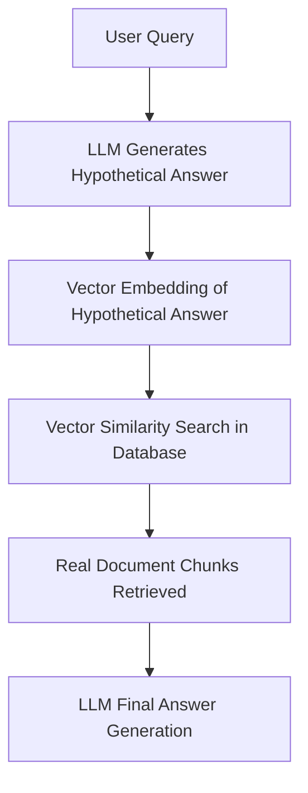

# Definition
**Hypothetical Document Embedding (HyDE)** is a RAG retrieval technique where an LLM first generates a speculative hypothetical answer to a user's question, and that hypothetical answer's vector embedding is used to search the vector database instead of the raw user query vector.

---

# HyDE Workflow



---

# Python Implementation (LangChain HyDE)

```python
from langchain_community.embeddings import OpenAIEmbeddings
from langchain.chains import HypotheticalDocumentEmbedder
from langchain_openai import OpenAI

# Initialize Base Embedding Model & LLM
base_embeddings = OpenAIEmbeddings(model="text-embedding-3-small")
llm = OpenAI(temperature=0.0)

# Build HyDE Embedder Chain
hyde_embeddings = HypotheticalDocumentEmbedder.from_llm(
    llm=llm,
    base_embeddings=base_embeddings,
    prompt_key="web_search"  # Built-in prompt template for hypothetical passages
)

# Generate Vector Embedding for Query via HyDE
query = "What are the rules regarding refunds for digital goods?"
query_vector = hyde_embeddings.embed_query(query)
# The vector is now in the semantic space of a *response* rather than a *question*
```

---

# Related Notes
- [[Retrieval Augmented Generation]] — Retrieval enhancement strategy.
- [[RAG Pipeline Architecture]] — Replaces step 6 query vector embedding.
- [[RAG Failure Modes]] — Risk of hallucinated query expansion.

---

# Source
- MLTut (Hadel Zafar), *"What is RAG? Retrieval Augmented Generation Explained in Under 30 Minutes"*, [YouTube](https://www.youtube.com/watch?v=MBDiJAWx8xk).
