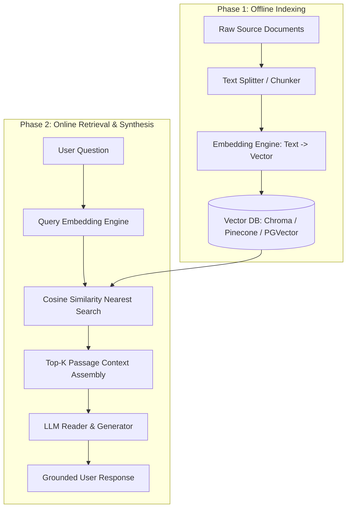

# Definition
The **RAG Pipeline Architecture** is a two-phase workflow (Offline Indexing Phase and Real-Time Retrieval & Generation Phase) comprising 9 sequential steps required to store, search, and synthesize external knowledge into LLM outputs.

---

# Pipeline Diagram



---

# Python Implementation (ChromaDB + OpenAI)

```python
import chromadb
from chromadb.utils import embedding_functions
import openai

# 1. Initialize Vector Database & Embedding Function
chroma_client = chromadb.Client()
openai_ef = embedding_functions.OpenAIEmbeddingFunction(
    api_key="YOUR_OPENAI_API_KEY",
    model_name="text-embedding-3-small"
)

# 2. Create Collection (Phase 1: Indexing)
collection = chroma_client.create_collection(
    name="rag_knowledge_base",
    embedding_function=openai_ef
)

# Indexing Documents into Chunks
documents = [
    "Digital products can be refunded within 14 days if unredeemed.",
    "Hardware returns require original packaging and RMA approval.",
    "Subscriptions auto-renew monthly unless canceled 48 hours prior."
]
collection.add(
    documents=documents,
    ids=["doc1", "doc2", "doc3"]
)

# 3. Real-time Query Retrieval (Phase 2)
def run_rag_pipeline(user_query: str) -> str:
    # Perform Similarity Search
    results = collection.query(
        query_texts=[user_query],
        n_results=2
    )
    retrieved_chunks = results['documents'][0]
    
    # Prompt Construction
    context_str = "\n".join(retrieved_chunks)
    prompt = f"Context:\n{context_str}\n\nQuestion: {user_query}\nAnswer:"
    
    # LLM Completion
    res = openai.chat.completions.create(
        model="gpt-4o-mini",
        messages=[{"role": "system", "content": "Answer grounded in context only."},
                  {"role": "user", "content": prompt}]
    )
    return res.choices[0].message.content
```

---

# Related Notes
- [[Retrieval Augmented Generation]] — Overall concept definition.
- [[RAG Chunking Strategies]] — Passages splitting methods.
- [[RAG Failure Modes]] — Pipeline bottleneck points.

---

# Source
- MLTut (Hadel Zafar), *"What is RAG? Retrieval Augmented Generation Explained in Under 30 Minutes"*, [YouTube](https://www.youtube.com/watch?v=MBDiJAWx8xk).
