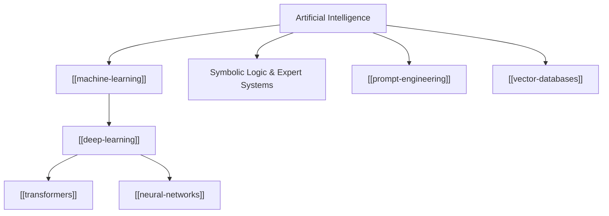

# Artificial Intelligence

**Artificial Intelligence (AI)** is the multi-disciplinary domain of computer science concerned with constructing computational systems capable of performing tasks that historically required human cognitive abilities—such as visual perception, natural language understanding, automated reasoning, and decision-making under uncertainty.



> [!NOTE]
> AI systems have evolved from rule-based symbolic engines to statistical paradigms driven by large-scale [[deep-learning]] models trained on massive datasets.

---

## Key Paradigms of AI

### 1. Symbolic Reasoning & Heuristic Search
Early AI research focused on formal logic, state-space exploration, and rule-based expert systems. Knowledge was explicitly coded by domain experts using production rules ($P \implies Q$).

### 2. Statistical Machine Learning
Rather than hardcoding explicit rules, [[machine-learning]] enables algorithms to infer patterns from data. Given input vector $X \in \mathbb{R}^d$ and target $Y$, the goal is to learn a mapping function:

$$ f_{\theta}(X) \approx Y $$

where $\theta$ represents trainable model parameters.

### 3. Deep Learning & Foundation Models
Deep learning utilizes multi-layer [[neural-networks]] to construct hierarchical feature representations directly from raw inputs.

The modern paradigm centers on foundation models like [[transformers]], which form the backbone of state-of-the-art Large Language Models (LLMs).

---

## Core Pillars & Subfields

| Subfield | Core Focus | Key Technologies |
| :--- | :--- | :--- |
| **Natural Language Processing** | Text understanding & generation | [[transformers]], [[prompt-engineering]] |
| **Computer Vision** | Image recognition & synthesis | CNNs, Vision Transformers (ViT) |
| **Information Retrieval** | Semantic search & embedding lookup | [[vector-databases]], HNSW indices |
| **Software Implementation** | Production deployment & scripting | [[python]], [[java]] |

---

## Mathematical Formulation of Intelligence

Modern statistical AI frames intelligence as optimal decision-making under uncertainty, often modeled via Markov Decision Processes (MDP):

$$ M = \langle \mathcal{S}, \mathcal{A}, \mathcal{P}, \mathcal{R}, \gamma \rangle $$

where the objective is finding a policy $\pi(a|s)$ that maximizes expected cumulative discounted reward:

$$ J(\pi) = \mathbb{E}_{\pi} \left[ \sum_{t=0}^{\infty} \gamma^t \mathcal{R}(s_t, a_t) \right] $$

---

## Code Example: Simple Inference Pipeline in Python

```python
import numpy as np

def softmax(logits: np.ndarray) -> np.ndarray:
    """Computes stable softmax probabilities for AI model output."""
    exp_logits = np.exp(logits - np.max(logits, axis=-1, keepdims=True))
    return exp_logits / np.sum(exp_logits, axis=-1, keepdims=True)

# Example output logits from an LLM classifier
raw_logits = np.array([2.5, 1.0, 0.1, 4.2])
probabilities = softmax(raw_logits)
print(f"Prediction Probabilities: {np.round(probabilities, 4)}")
```

---

## Connected Concepts

- [[machine-learning]] — The dominant empirical approach within AI.
- [[deep-learning]] — Multi-layered neural network architectures.
- [[transformers]] — The foundational self-attention architecture powering modern NLP.
- [[prompt-engineering]] — Methods for steering LLM reasoning and behavior.
- [[vector-databases]] — Storage infrastructure for AI embeddings.

---

## References

1. Russell, S., & Norvig, P. (2020). *Artificial Intelligence: A Modern Approach* (4th ed.). Pearson.
2. Vaswani et al. (2017). *Attention Is All You Need*. NeurIPS.
