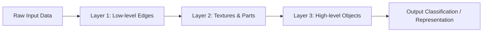

# Deep Learning

**Deep Learning (DL)** is a specialized subfield of [[machine-learning]] and [[artificial-intelligence]] based on artificial [[neural-networks]] with multi-layered representations.

By stacking nonlinear transformations, deep networks learn complex abstractions directly from raw data without manual feature engineering.



> [!TIP]
> The expressive power of deep networks stems from the **Universal Approximation Theorem**, which states that feedforward networks with non-linear activations can approximate any continuous function on compact subsets of $\mathbb{R}^n$.

---

## Architectural Taxonomy

### 1. Convolutional Neural Networks (CNNs)
Exploit spatial invariance using local receptive fields and weight sharing. Essential for image recognition and 2D spatial features.

### 2. Recurrent Neural Networks (RNNs & LSTMs)
Maintain hidden state vectors to process sequential dependencies in temporal data:

$$ h_t = \tanh(W_{hh} h_{t-1} + W_{xh} x_t + b) $$

### 3. Transformer Architectures
Replaced sequential recurrence with global self-attention mechanisms. Modern [[transformers]] power nearly all state-of-the-art LLMs and multi-modal models.

---

## Backpropagation & Gradient Descent

Training deep models relies on backpropagation, an application of the multivariate chain rule to calculate loss gradients:

$$ \frac{\partial \mathcal{L}}{\partial W^{(l)}} = \frac{\partial \mathcal{L}}{\partial a^{(l)}} \cdot \frac{\partial a^{(l)}}{\partial z^{(l)}} \cdot \frac{\partial z^{(l)}}{\partial W^{(l)}} $$

Optimizers such as **AdamW** adjust parameters using adaptive moment estimates:

$$ m_t = \beta_1 m_{t-1} + (1-\beta_1) g_t, \quad v_t = \beta_2 v_{t-1} + (1-\beta_2) g_t^2 $$

$$ \theta_{t+1} = \theta_t - \frac{\eta}{\sqrt{\hat{v}_t} + \epsilon} \hat{m}_t $$

---

## PyTorch Code Snippet: Custom MLP Classifier

```python
import torch
import torch.nn as nn

class DeepClassifier(nn.Module):
    def __init__(self, input_dim: int, hidden_dim: int, num_classes: int):
        super().__init__()
        self.network = nn.Sequential(
            nn.Linear(input_dim, hidden_dim),
            nn.BatchNorm1d(hidden_dim),
            nn.ReLU(),
            nn.Dropout(0.2),
            nn.Linear(hidden_dim, hidden_dim),
            nn.ReLU(),
            nn.Linear(hidden_dim, num_classes)
        )
        
    def forward(self, x: torch.Tensor) -> torch.Tensor:
        return self.network(x)

# Instantiate network for 784 features (e.g., 28x28 images)
model = DeepClassifier(input_dim=784, hidden_dim=256, num_classes=10)
sample_batch = torch.randn(32, 784)
logits = model(sample_batch)
print(f"Output Batch Tensor Shape: {logits.shape}")
```

---

## Related Notes

- Extends foundational [[machine-learning]] concepts.
- Built upon structural unit calculations in [[neural-networks]].
- Powers self-attention mechanisms in [[transformers]].
- Implemented extensively in [[python]] using PyTorch and TensorFlow.
- Generates high-dimensional vector representations stored in [[vector-databases]].

---

## References

1. LeCun, Y., Bengio, Y., & Hinton, G. (2015). Deep learning. *Nature*, 521(7553), 436-444.
2. Goodfellow et al. (2016). *Deep Learning*. MIT Press.
