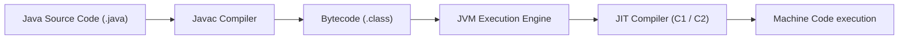

# Java

**Java** is a strongly typed, object-oriented programming language designed for platform independence ("Write Once, Run Anywhere") via bytecode execution on the **Java Virtual Machine (JVM)**.



> [!NOTE]
> Modern JVMs utilize Just-In-Time (JIT) compilers with adaptive profiling to optimize hot execution paths to native assembly speeds.

---

## Key Enterprise Architectural Features

1. **Robust Memory Management**: Automatic Garbage Collection (ZGC, Shenandoah) with sub-millisecond pause guarantees.
2. **Virtual Threads (Project Loom)**: Lightweight concurrency model enabling millions of concurrent requests.
3. **Strong Static Typing**: Compile-time safety guarantees preventing common runtime memory access errors.

---

## Java 21 Code Snippet: Modern Record & Concurrent Vector Service

```java
package com.piyush.wiki;

import java.util.List;

public class VectorSearchService {

    // Java 16+ Record for immutable data transfer object
    public record EmbeddingResult(String docId, double score, List<Double> vector) {}

    public static double computeCosineSimilarity(double[] a, double[] b) {
        if (a.length != b.length) {
            throw new IllegalArgumentException("Vector dimension mismatch");
        }
        double dot = 0.0, normA = 0.0, normB = 0.0;
        for (int i = 0; i < a.length; i++) {
            dot += a[i] * b[i];
            normA += a[i] * a[i];
            normB += b[i] * b[i];
        }
        return dot / (Math.sqrt(normA) * Math.sqrt(normB) + 1e-9);
    }

    public static void main(String[] args) {
        double[] v1 = {0.1, 0.9, 0.4};
        double[] v2 = {0.2, 0.8, 0.5};
        double sim = computeCosineSimilarity(v1, v2);
        System.out.printf("Computed Cosine Similarity: %.4f%n", sim);
    }
}
```

---

## Ecosystem Interconnections

- Used to build large-scale search infrastructure and enterprise engines for [[vector-databases]] (Elasticsearch, Lucene).
- Complements scientific modeling in [[python]] with production scale execution.
- Underpins high-throughput backend infrastructure for [[artificial-intelligence]] deployments.

---

## References

1. Bloch, J. (2018). *Effective Java* (3rd ed.). Addison-Wesley Professional.
2. Goetz, B., et al. (2006). *Java Concurrency in Practice*. Addison-Wesley.
