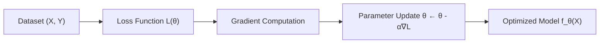

# Machine Learning

**Machine Learning (ML)** is a core branch of [[artificial-intelligence]] that studies algorithms capable of improving their performance on a specific task through empirical experience $E$ with respect to task $T$ and performance measure $P$.



> [!IMPORTANT]
> The defining challenge of machine learning is **generalization**—achieving low error on unseen test samples drawn from the underlying distribution $\mathcal{D}$, not merely memorizing training data.

---

## Taxonomies of Machine Learning

### 1. Supervised Learning
Given pairs $(x_i, y_i)_{i=1}^N \sim \mathcal{D}$, the model minimizes Empirical Risk:

$$ \mathcal{R}_{\text{emp}}(\theta) = \frac{1}{N} \sum_{i=1}^N \mathcal{L}(f_\theta(x_i), y_i) $$

- **Classification**: Discrete output targets (e.g., Logistic Regression, Support Vector Machines).
- **Regression**: Continuous real-valued targets (e.g., Mean Squared Error minimization).

### 2. Unsupervised Learning
Discovers latent structural properties in unlabeled data $\{x_i\}_{i=1}^N$:
- **Clustering**: K-Means, DBSCAN.
- **Dimensionality Reduction**: Principal Component Analysis (PCA), t-SNE.
- **Density Estimation**: Gaussian Mixture Models, Variational Autoencoders.

### 3. Reinforcement Learning
An agent interacts with an environment to learn a policy maximizing cumulative reward via feedback loops.

---

## Regularization & The Bias-Variance Tradeoff

The expected generalization error decomposes into three fundamental components:

$$ \mathbb{E}\left[(y - \hat{f}(x))^2\right] = \text{Bias}[\hat{f}(x)]^2 + \text{Var}[\hat{f}(x)] + \sigma^2_{\text{irreducible}} $$

```python
import numpy as np

def ridge_regression(X: np.ndarray, y: np.ndarray, alpha: float = 1.0) -> np.ndarray:
    """Computes closed-form Ridge Regression weights with L2 regularization.
    
    Formula: theta = (X^T X + alpha * I)^(-1) X^T y
    """
    n_features = X.shape[1]
    identity = np.eye(n_features)
    # Exclude bias term from regularization
    identity[0, 0] = 0.0
    
    weights = np.linalg.inv(X.T @ X + alpha * identity) @ X.T @ y
    return weights

# Generate dummy feature matrix with intercept column
X_sample = np.array([[1.0, 0.5, 1.2], [1.0, 1.1, 0.8], [1.0, 2.1, 2.9]])
y_sample = np.array([2.1, 3.4, 6.1])
theta = ridge_regression(X_sample, y_sample, alpha=0.1)
print(f"Learned Parameters: {np.round(theta, 3)}")
```

---

## Interconnected Ecosystem

- Part of the broader [[artificial-intelligence]] framework.
- Forms the mathematical basis for [[deep-learning]] and [[neural-networks]].
- Heavily implemented using [[python]] scientific libraries (NumPy, PyTorch, Scikit-Learn) and high-performance [[java]] inference engines.
- Utilizes [[vector-databases]] for similarity retrieval over high-dimensional feature embeddings.

---

## References

1. Hastie, T., Tibshirani, R., & Friedman, J. (2009). *The Elements of Statistical Learning*. Springer.
2. Goodfellow, I., Bengio, Y., & Courville, A. (2016). *Deep Learning*. MIT Press.
