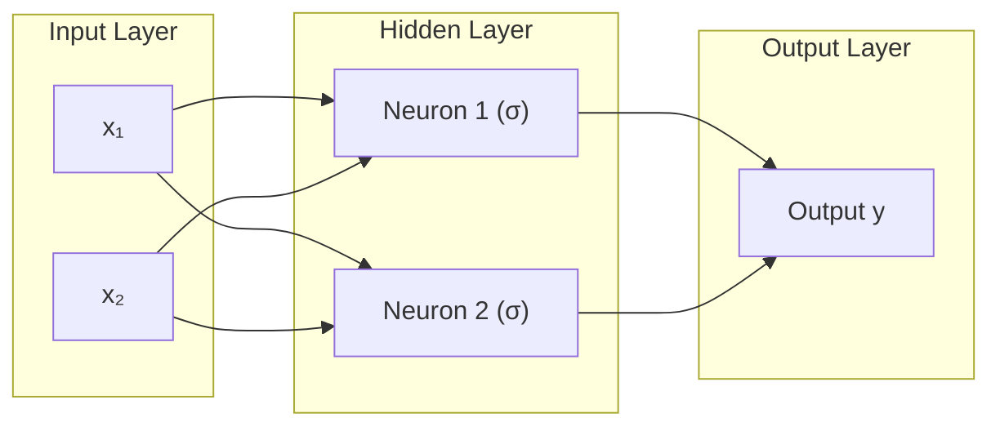

# Neural Networks

An **Artificial Neural Network (ANN)** is a parallel computational framework composed of interconnected nodes ("neurons") that transmit signals to perform complex non-linear mathematical transformations.



---

## Anatomy of an Artificial Neuron (Perceptron)

A single neuron computes a weighted sum of inputs plus a scalar bias, followed by a non-linear activation function $\sigma(\cdot)$:

$$ z = \sum_{i=1}^n w_i x_i + b = \mathbf{w}^T \mathbf{x} + b $$

$$ a = \sigma(z) $$

### Popular Activation Functions

1. **ReLU (Rectified Linear Unit)**:

$$ \sigma(z) = \max(0, z) $$

2. **Sigmoid**:

$$ \sigma(z) = \frac{1}{1 + e^{-z}} $$

3. **GELU (Gaussian Error Linear Unit)** — Standard in [[transformers]]:

$$ \text{GELU}(x) = x \Phi(x) \approx 0.5x \left( 1 + \tanh\left(\sqrt{\frac{2}{\pi}} \left(x + 0.044715 x^3\right)\right)\right) $$

---

## Forward Pass Computation in Python

```python
import numpy as np

class Perceptron:
    def __init__(self, input_dim: int):
        self.weights = np.random.randn(input_dim) * 0.01
        self.bias = 0.0

    def relu(self, z: np.ndarray) -> np.ndarray:
        return np.maximum(0, z)

    def forward(self, x: np.ndarray) -> float:
        z = np.dot(self.weights, x) + self.bias
        return self.relu(z)

neuron = Perceptron(input_dim=4)
x_in = np.array([1.5, -0.8, 2.3, 0.4])
out = neuron.forward(x_in)
print(f"Perceptron Activation: {out:.4f}")
```

---

## Integration within the Vault Graph

- Building block for [[deep-learning]] models.
- Expanded by attention mechanisms in [[transformers]].
- Fundamental algorithm class in [[machine-learning]].
- Designed and benchmarked using [[python]] scientific frameworks.

---

## References

1. Rosenblatt, F. (1958). The perceptron: a probabilistic model for information storage and organization in the brain. *Psychological Review*, 65(6), 386.
2. Haykin, S. (2009). *Neural Networks and Learning Machines* (3rd ed.). Pearson.
