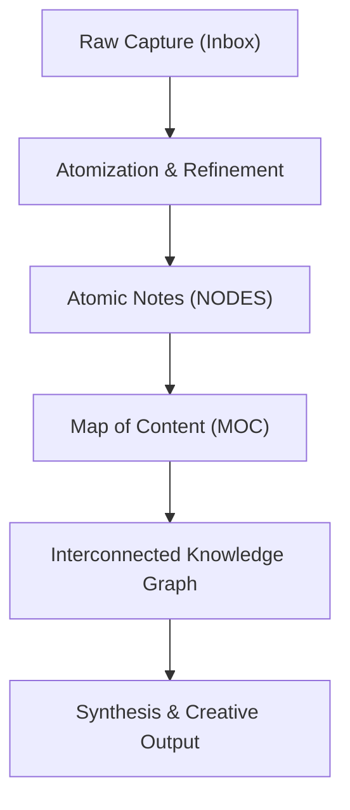

# Personal Knowledge Management

**Personal Knowledge Management (PKM)** is the practice of systematically capturing, organizing, synthesizing, and retrieving personal information, insights, and mental models using atomic notes and graph connections.



> [!NOTE]
> PKM transforms a passive archive of disconnected documents into an active, living knowledge graph where insights emerge organically from bidirectional links.

---

## Core Methodologies

### 1. The Zettelkasten Method
Popularized by sociologist Niklas Luhmann:
- **Atomicity**: One note contains exactly one distinct concept or claim.
- **Autonomous Identity**: Every note is self-contained with persistent metadata.
- **Dense Interlinking**: Links create associative pathways across domain boundaries.

### 2. Maps of Content (MOCs)
Curated entry points that group, structure, and organize related atomic notes without enforcing rigid hierarchical subfolders.

### 3. The PARA Method (Building a Second Brain)
Organizing digital knowledge into four distinct actionability tiers:
- **Projects**: Time-bound initiatives with defined outcomes.
- **Areas**: Ongoing responsibilities to maintain over time.
- **Resources**: Topics of interest and reference materials.
- **Archives**: Inactive items preserved for historical reference.

---

## Frontmatter Schema Standards for Atomic Notes

A resilient PKM vault maintains structured metadata for every atomic entry:

```yaml
---
id: "uuid-v4-string"
title: "Canonical Note Title"
type: "atomic-note | moc | literature-note"
status: "verified | draft | processing"
created: "2026-08-06"
modified: "2026-08-06"
confidence: 95
owner_moc: "Primary Map of Content Title"
category: "Domain Classification"
tags:
  - controlled-tag-1
  - controlled-tag-2
aliases:
  - "Alternative Title"
---
```

---

## Interconnected Ecosystem

- Applied directly to document research on [[artificial-intelligence]], [[machine-learning]], and [[deep-learning]].
- Structured using semantic concepts from [[prompt-engineering]] for automated note synthesis.
- Can be automated via [[python]] processing scripts and backed by local search technologies like [[vector-databases]].

---

## References

1. Ahrens, S. (2017). *How to Take Smart Notes: One Simple Technique to Boost Your Writing, Learning and Thinking*.
2. Forte, T. (2022). *Building a Second Brain: A Proven Method to Organize Your Digital Life and Unlock Your Creative Potential*. Atria Books.
