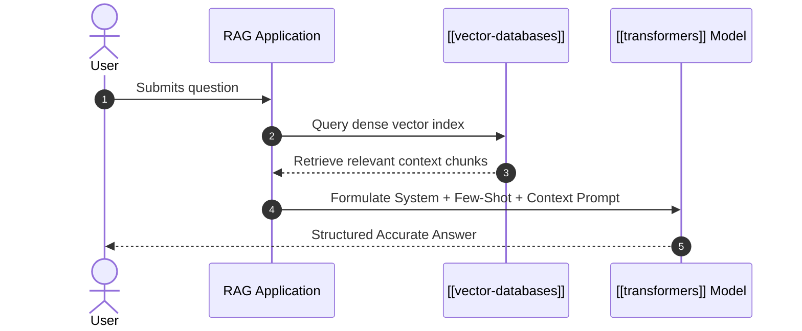

# Prompt Engineering

**Prompt Engineering** is the discipline of designing, refining, and structuring textual inputs ("prompts") to steer Large Language Models based on [[transformers]] toward accurate, deterministic, and context-aligned responses.



> [!WARNING]
> Language models are sensitive to prompt phrasing, ordering, and token boundaries. Systematic benchmarking is critical to prevent hallucinations.

---

## Key Prompting Paradigms

### 1. Zero-Shot Prompting
Directly asking the model to perform a task without providing explicit prior input-output examples.

### 2. Few-Shot In-Context Learning
Providing $k$ exemplar input-output pairs inside the context window to establish task format and reasoning style:

```text
Input: "The movie was thrilling and visually stunning." -> Sentiment: Positive
Input: "The plot was slow and characters were unconvincing." -> Sentiment: Negative
Input: "The score was decent, but pacing dragged in the middle." -> Sentiment:
```

### 3. Chain-of-Thought (CoT) Prompting
Instructing the model to output intermediate step-by-step reasoning tokens before generating the final answer:

$$ \text{Prompt} \implies \text{Reasoning Steps } (r_1, r_2, \dots, r_k) \implies \text{Final Answer } Y $$

---

## Python Example: Programmatic Prompt Construction

```python
from typing import List, Dict

def build_rag_prompt(system_role: str, context_chunks: List[str], user_query: str) -> List[Dict[str, str]]:
    """Constructs a production-grade RAG prompt for chat completions."""
    formatted_context = "\n---\n".join(context_chunks)
    
    user_content = f"""Use ONLY the context below to answer the user question.
If the context does not contain the answer, say "Information not found in knowledge base."

=== CONTEXT START ===
{formatted_context}
=== CONTEXT END ===

Question: {user_query}
Let's think step by step:"""

    return [
        {"role": "system", "content": system_role},
        {"role": "user", "content": user_content}
    ]

# Demo output
chunks = [
    "Vector databases store embeddings for Approximate Nearest Neighbor search.",
    "HNSW is a graph-based indexing algorithm with logarithmic lookup scaling."
]
messages = build_rag_prompt("You are a technical AI assistant.", chunks, "What index does a vector DB use?")
print(f"Constructed System Role: {messages[0]['content']}")
print(f"Prompt Length: {len(messages[1]['content'])} chars")
```

---

## Integration with Vault Ecosystem

- Primary interaction interface for [[artificial-intelligence]] applications.
- Utilizes attention mechanisms of underlying [[transformers]].
- Integrates with [[vector-databases]] for Retrieval-Augmented Generation (RAG).
- Implemented using [[python]] automation frameworks (LangChain, LlamaIndex, DSPy).
- Essential methodology for personal knowledge processing in [[personal-knowledge-management]].

---

## References

1. Wei, J., et al. (2022). Chain-of-thought prompting elicits reasoning in large language models. *NeurIPS*.
2. Kojima, T., et al. (2022). Large language models are zero-shot reasoners. *NeurIPS*.
