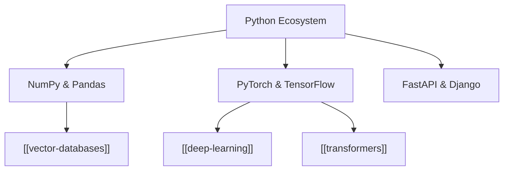

# Python

**Python** is a dynamically typed, garbage-collected, high-level programming language designed for readability and developer productivity.

It serves as the lingua franca of scientific computing, [[machine-learning]], and modern [[artificial-intelligence]] engineering.



> [!TIP]
> Python's C extension API allows performance-critical linear algebra kernels (BLAS/LAPACK, CUDA) to run at raw native speeds while providing high-level ergonomic syntax.

---

## Core Language Features

1. **First-Class Functions & Closures**: Functions are first-class objects capable of being passed, returned, and decorated.
2. **Asynchronous I/O (`asyncio`)**: Event loop concurrency model ideal for fast API servers (FastAPI).
3. **Type Hinting (`typing`)**: Static type checking support (Mypy, Pyright) for enterprise software quality.

---

## Code Example: Async Vector Processing Pipeline

```python
import asyncio
from typing import List

async def fetch_vector_embedding(text: str) -> List[float]:
    """Simulates async API call to transformer embedding server."""
    await asyncio.sleep(0.05) # Non-blocking I/O sleep
    # Return dummy 4-dimensional normalized vector
    return [0.25, -0.42, 0.88, 0.12]

async def process_batch(documents: List[str]):
    """Runs concurrent embedding fetches for a list of document strings."""
    tasks = [fetch_vector_embedding(doc) for doc in documents]
    embeddings = await asyncio.gather(*tasks)
    return embeddings

# Run event loop
docs = ["Introduction to AI", "Vector Indexing", "Transformer Attention"]
results = asyncio.run(process_batch(docs))
print(f"Processed Batch Count: {len(results)} embeddings")
```

---

## Related Notes in Knowledge Graph

- Primary development language for [[machine-learning]] and [[deep-learning]].
- Core tooling used to construct [[transformers]] models and [[prompt-engineering]] utilities.
- Interfaces with high-performance native engines like [[java]] and C++.
- Primary API scripting environment for [[vector-databases]].

---

## References

1. Van Rossum, G., & Drake, F. L. (2009). *Python 3 Reference Manual*. CreateSpace.
2. Beazley, D., & Jones, B. K. (2013). *Python Cookbook* (3rd ed.). O'Reilly Media.
