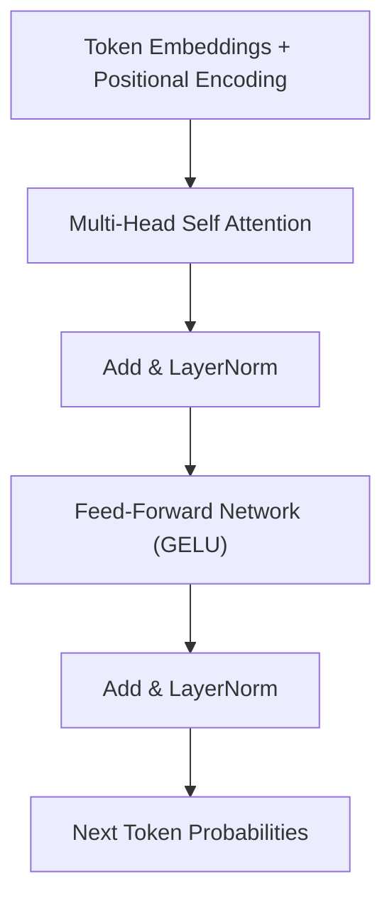

# Transformers

The **Transformer** is a deep learning architecture introduced by Vaswani et al. (2017) that relies entirely on self-attention mechanisms to model global dependencies between input tokens without recurrent or convolutional operations.



> [!NOTE]
> The Transformer replaced Recurrent Neural Networks because self-attention allows parallelization over the entire sequence length during training.

---

## The Scaled Dot-Product Attention Mechanism

Given input sequence matrices projected into Query ($Q$), Key ($K$), and Value ($V$) representations of dimension $d_k$:

$$ \text{Attention}(Q, K, V) = \text{softmax}\left( \frac{Q K^T}{\sqrt{d_k}} \right) V $$

Scaling by $\frac{1}{\sqrt{d_k}}$ prevents vanishing gradients in the softmax function for large vector dimensions.

### Multi-Head Attention

Multi-head attention allows the model to jointly attend to information from different representation subspaces at different positions:

$$ \text{MultiHead}(Q, K, V) = \text{Concat}(\text{head}_1, \dots, \text{head}_h) W^O $$

$$ \text{head}_i = \text{Attention}(Q W_i^Q, K W_i^K, V W_i^V) $$

---

## PyTorch Implementation of Scaled Dot-Product Attention

```python
import torch
import torch.nn as nn
import math

def scaled_dot_product_attention(
    query: torch.Tensor, key: torch.Tensor, value: torch.Tensor, mask: torch.Tensor = None
) -> tuple[torch.Tensor, torch.Tensor]:
    """Computes scaled dot-product self-attention."""
    d_k = query.size(-1)
    scores = torch.matmul(query, key.transpose(-2, -1)) / math.sqrt(d_k)
    
    if mask is not None:
        scores = scores.masked_fill(mask == 0, -1e9)
        
    attn_weights = torch.softmax(scores, dim=-1)
    output = torch.matmul(attn_weights, value)
    return output, attn_weights

# Demo execution with 2 batch sequences of length 4, vector dimension 64
q = k = v = torch.randn(2, 4, 64)
attn_out, weights = scaled_dot_product_attention(q, k, v)
print(f"Attention Output Shape: {attn_out.shape}")
```

---

## Ecosystem Connections

- Replaced classic recurrent designs in [[neural-networks]].
- Key breakthrough driving state-of-the-art [[deep-learning]].
- Core foundation for Large Language Models steered via [[prompt-engineering]].
- Outputs dense sequence embeddings stored in [[vector-databases]].
- Primary model library built in [[python]] (Hugging Face Transformers, PyTorch).

---

## References

1. Vaswani, A., Shazeer, N., Parmar, N., Uszkoreit, J., Jones, L., Gomez, A. N., Kaiser, Ł., & Polosukhin, I. (2017). *Attention Is All You Need*. NeurIPS.
2. Radford, A., et al. (2019). *Language Models are Unsupervised Multitask Learners*. OpenAI.
