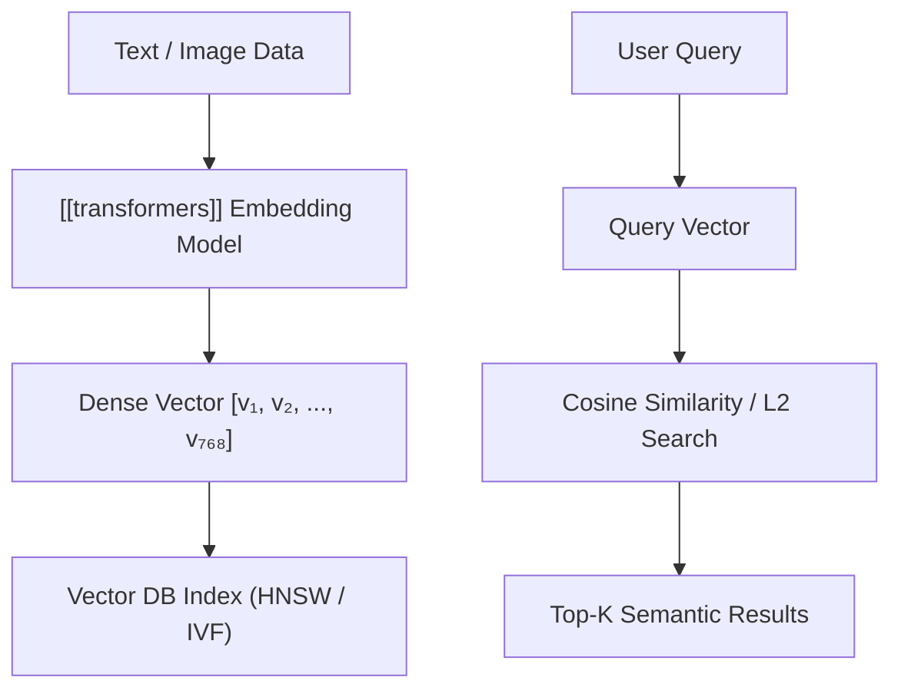

# Vector Databases

A **Vector Database** is a specialized database system designed to index, store, and query high-dimensional vector embeddings generated by [[deep-learning]] and [[transformers]] models.

Unlike relational databases optimized for exact value matching ($A = B$), vector databases perform sub-linear **Approximate Nearest Neighbor (ANN)** similarity searches over high-dimensional vector spaces $\mathbb{R}^d$.



---

## Vector Similarity Metrics

### 1. Cosine Distance
Measures the cosine of the angle between two non-zero vectors $\mathbf{u}$ and $\mathbf{v}$, invariant to magnitude:

$$ \text{Cosine Similarity} = \frac{\mathbf{u} \cdot \mathbf{v}}{\|\mathbf{u}\| \|\mathbf{v}\|} = \frac{\sum_{i=1}^d u_i v_i}{\sqrt{\sum u_i^2} \sqrt{\sum v_i^2}} $$

### 2. Euclidean Distance ($L_2$)
Measures straight-line geometric distance between two points:

$$ d(\mathbf{u}, \mathbf{v}) = \sqrt{\sum_{i=1}^d (u_i - v_i)^2} $$

### 3. Dot Product ($\text{IP}$)
Computes vector inner product, useful when embeddings are normalized ($\|\mathbf{u}\| = 1$):

$$ \langle \mathbf{u}, \mathbf{v} \rangle = \sum_{i=1}^d u_i v_i $$

---

## Indexing Algorithms

1. **HNSW (Hierarchical Navigable Small World)**: Multi-layer graph index balancing recall and logarithmic search time.
2. **IVF (Inverted File Index)**: Clusters vectors using Voronoi cells to narrow search space.
3. **PQ (Product Quantization)**: Compresses vectors into compact byte codes to save memory.

---

## Python Example: Cosine Similarity with NumPy

```python
import numpy as np

def cosine_similarity_matrix(query_vec: np.ndarray, doc_vectors: np.ndarray) -> np.ndarray:
    """Computes cosine similarity between 1D query vector and 2D matrix of embeddings."""
    norm_q = np.linalg.norm(query_vec)
    norm_docs = np.linalg.norm(doc_vectors, axis=1)
    
    dot_products = doc_vectors @ query_vec
    return dot_products / (norm_q * norm_docs + 1e-9)

# Simulating 768-dimensional embeddings (e.g., BERT outputs)
np.random.seed(42)
query = np.random.randn(768)
database = np.random.randn(1000, 768) # 1,000 document vectors

similarities = cosine_similarity_matrix(query, database)
top_idx = np.argmax(similarities)
print(f"Top Similarity Score: {similarities[top_idx]:.4f} at index {top_idx}")
```

---

## Integrations & Context

- Stores dense representations produced by [[transformers]] and [[deep-learning]].
- Serves as long-term memory for Retrieval-Augmented Generation (RAG) in [[prompt-engineering]].
- Implemented natively in [[python]] (Pinecone, Qdrant, Chroma, Milvus) and high-throughput [[java]] wrappers.
- Key infrastructure pattern in modern [[artificial-intelligence]] applications.

---

## References

1. Malkov, Y. A., & Yashunin, D. A. (2018). Efficient and robust approximate nearest neighbor search using Hierarchical Navigable Small World graphs. *IEEE TPAMI*, 42(4), 824-836.
