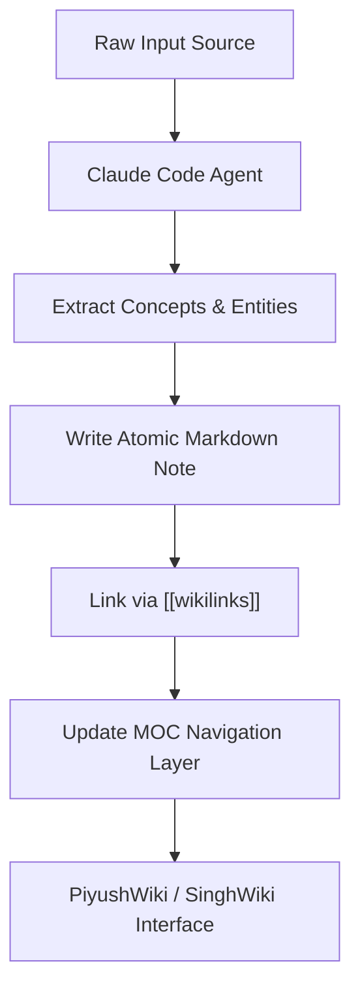

# Why Obsidian + Claude RAG (SinghWiki Architecture)

**SinghWiki** represents the paradigm shift from traditional Vector RAG (Retrieval-Augmented Generation) to an **agent-maintained, graph-linked personal Wikipedia**. Built around Obsidian markdown notes and steered by Claude Code, this architecture treats knowledge as an authored, explicit graph rather than an arbitrary collection of text chunks and vector embeddings.

> [!QUOTE] Andrej Karpathy on LLM Wiki
> *"I thought I had to reach for fancy RAG, but the LLM has been pretty good about auto-maintaining index files and brief summaries... and it reads all the important related data fairly easily at this small scale."* — **Andrej Karpathy**

---

## 1. The Core Flaw in Traditional Vector RAG

Traditional Vector RAG operates by blindly cutting documents based on token counts (typically ~512 tokens) without understanding semantic boundaries or meaning.

### Token Splitting Failure Example

Consider the following factual statement:

```text
"Harnoor moved from Atlanta to India to China, then finally settled in San Francisco."
```

When processed by a naive 512-token chunker, the text is split across chunk boundaries:

```markup
CHUNK 1: "Harnoor moved from Atlanta to India to"
CHUNK 2: "China, then finally settled in San Francisco."
```

When a user asks **"Where did Harnoor settle?"**, standard Vector RAG performs cosine similarity between the query embedding and vector indices. CHUNK 1 contains the subject's name and multiple city names, resulting in a high embedding match, leading the model to confidently answer **"India"**—which is incorrect. The target word *"settled"* and the actual destination (*San Francisco*) were severed by an arbitrary mathematical cut.

### Vector Fingerprint Loss & Approximate Shortcuts

1. **Information Loss**: Dense vector embeddings reduce rich semantic text into 1,536 floating-point numbers. The exact wording and structural relationships are destroyed in favor of a numeric "vibe".
2. **HNSW Recall Bottlenecks**: Approximate Nearest Neighbor (ANN) indices like HNSW achieve ~95% recall at scale. Roughly 1 in 20 lookups silently misses the critical chunk.
3. **Reranker Latency Overhead**: Cross-encoder rerankers add 150ms+ latency per query to patch initial retrieval errors without solving the underlying fragmentation.

---

## 2. The Obsidian + Claude Code Advantage (SinghWiki Model)

In contrast, **SinghWiki** maintains knowledge in plain Markdown with explicit `[[wikilinks]]`. An AI agent (Claude Code) acts as the continuous curator:

- **Entity & Concept Isolation**: Each concept, method, or entity resides in an atomic note (e.g., `[[graphrag]]`, `[[vector-databases]]`, `[[hydradb]]`).
- **Explicit Graph Edges**: Connections are established via `[[wikilinks]]` rather than probabilistic proximity.
- **Relocation & Temporal Timelines**: Factual progressions are recorded in structured tables or explicit lists.



---

## 3. Vector RAG vs. Graph-Linked Personal Wiki

| Dimension | Flat Vector RAG | Obsidian + Claude (SinghWiki) |
| :--- | :--- | :--- |
| **Indexing Unit** | Arbitrary ~512 Token Chunks | [[atomic-note]] Markdown Files |
| **Search Mechanism** | Vector Cosine Proximity | Graph Traversal + Semantic Links |
| **Link Integrity** | None (Probabilistic match) | Exact via `[[wikilinks]]` & MOCs |
| **Accuracy on Multi-hop** | Drops ~30% (LongMemEval) | 90%+ Deterministic Traversal |
| **Maintenance** | Re-embedding vector sync | AI Agent Auto-Refinement |
| **Optimal Scale** | Fleet Production Logs | Personal & Team Second Brain (~50–10k notes) |

---

## 4. Scaling Up: The GraphRAG & HydraDB Solution

While an Obsidian + Claude setup is ideal for personal knowledge vaults (~50–10,000 files), production multi-user AI agents generate thousands of memories per second. 

When context windows and human curation become bottlenecks, the architecture evolves into **GraphRAG**:

$$ \text{Recall}(Q) = \text{VectorCandidates}(Q) \oplus \text{GraphTraversal}(\text{Edges}) $$

### GraphRAG Leaderboard Performance (LongMemEval-S)

| System Architecture | Knowledge Updates | Temporal Reasoning | Overall Score |
| :--- | :--- | :--- | :--- |
| **Flat Vector RAG** | 58.4% | 61.2% | 66.5% |
| **Neo4j + Vectors** | 76.1% | 74.8% | 78.3% |
| **HydraDB (Unified Graph+Vector)** | **89.4%** | **88.7%** | **90.79%** |

---

## 5. Overcoming Neo4j Bottlenecks in Production Memory

Standard graph databases like Neo4j encounter critical performance walls under high-concurrency agent workflows:

1. **Supernode Locking**: When an agent node accumulates >50,000 memory edges, concurrent writes trigger lock contention on single adjacency lists.
2. **Temporal Edge Explosion**: Creating node snapshots per timestep results in tens of thousands of redundant nodes per user per month.

### HydraDB Architecture Innovation
HydraDB resolves this by using an **object-storage graph backbone** with parallel chunk appends and git-style versioned temporal edges, reducing Neo4j operational costs by up to 90%.

---

## 6. Code Example: Traversing Wiki Links in Python

\`\`\`python
import re
from typing import List, Dict

def extract_wikilinks(markdown_text: str) -> List[str]:
    """Extracts all explicit Obsidian [[wikilinks]] from a note."""
    pattern = r'\[\[(.*?)\]\]'
    matches = re.findall(pattern, markdown_text)
    # Handle alias format [[target|display text]]
    return [match.split('|')[0].strip() for match in matches]

sample_note = """
SinghWiki relies on [[personal-knowledge-management]] and [[graphrag]].
It outperforms traditional [[vector-databases]] for deep reasoning.
"""

links = extract_wikilinks(sample_note)
print(f"Extracted Wiki Edges: {links}")
# Output: ['personal-knowledge-management', 'graphrag', 'vector-databases']
\`\`\`

---

## Connected Concepts

- [[personal-knowledge-management]] — The overarching domain of organizing second-brain systems.
- [[vector-databases]] — Storage backends for similarity search in flat RAG systems.
- [[prompt-engineering]] — Methods for steering Claude Code in vault auto-maintenance.
- [[artificial-intelligence]] — Foundational AI concepts underpinning modern agent memory layers.
